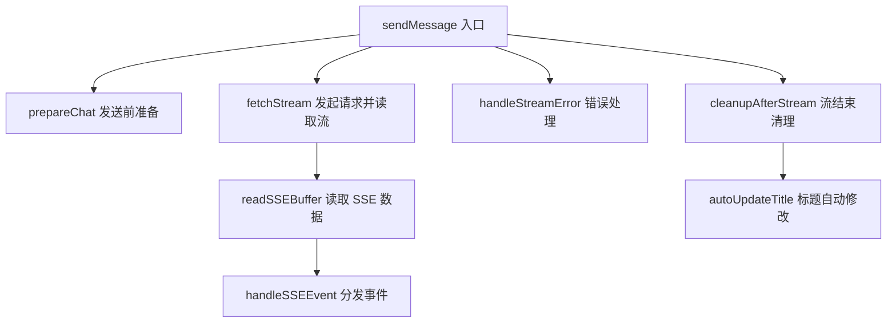

# sendMessage 函数重构方案

## 现状分析

[`sendMessage()`](frontend/static/chat-sse.js:163) 是 [`chat-sse.js`](frontend/static/chat-sse.js) 中唯一的导出函数，负责：

1. 发送用户消息
2. 建立 SSE 流式连接
3. 读取并分发 SSE 事件
4. 处理错误（中断/异常）
5. 流结束后清理状态

**当前问题**：函数长达 **209 行**（L163-371），承担了过多职责，违反了单一职责原则。具体来说，它混合了以下逻辑：

- UI 操作（清空输入框、删除欢迎消息、控制按钮状态）
- 状态管理（更新 messages、titleState、isStreaming 等）
- 网络请求（fetch + SSE 流读取）
- 错误处理（AbortError 特殊处理 + 通用错误）
- 资源清理（定时器、状态重置、标题自动修改）

## 重构目标

1. **职责分离** — 将不同关注点拆分为独立函数
2. **可读性提升** — 主流程函数保持清晰的高层逻辑
3. **可维护性** — 每个函数只做一件事，便于单独修改和测试
4. **最小化改动** — 不改变外部行为，不修改其他文件

## 重构方案

### 方案概览

将 `sendMessage` 拆分为 **1 个主入口函数 + 5 个辅助函数**：



### 详细拆分

#### 1. `prepareChat()` — 发送前准备（L164-225）

```js
async function prepareChat() {
    const messageInput = document.getElementById('messageInput');
    const chatContainer = document.getElementById('chatContainer');
    const content = messageInput.value.trim();
    if (!content || state.isStreaming) return null;

    // 清空输入框
    messageInput.value = '';
    messageInput.style.height = 'auto';

    // 删除欢迎消息
    removeWelcomeMessage(chatContainer);

    // 生成 UTC 时间
    const createdAt = new Date().toISOString().replace(/\.\d{3}Z$/, 'Z');

    // 添加用户消息
    addUserMessage(content, createdAt);

    // 更新刻度导航
    updateTickNav();

    // 禁用输入
    setInputEnabled(false);

    // 创建 assistant 占位
    const assistantBubble = addMessage('assistant', '', true);
    state.isStreaming = true;
    updateDeleteButtons();

    // 启用中断按钮
    enableStopButton();

    // 创建 AbortController
    state.abortController = new AbortController();

    return { content, createdAt, assistantBubble };
}
```

**返回值**：`{ content, createdAt, assistantBubble } | null`（null 表示无需发送）

#### 2. `removeWelcomeMessage(chatContainer)` — 删除欢迎消息（L174-190）

```js
function removeWelcomeMessage(chatContainer) {
    const welcomeEl = chatContainer.querySelector('.welcome-message');
    if (!welcomeEl) return;
    const inputArea = welcomeEl.querySelector('.input-area');
    if (inputArea) {
        const mainContent = document.querySelector('.main-content');
        if (mainContent) mainContent.appendChild(inputArea);
    }
    welcomeEl.remove();
    const scrollContainer = document.getElementById('scrollContainer');
    if (scrollContainer) scrollContainer.classList.remove('welcome-state');
}
```

#### 3. `addUserMessage(content, createdAt)` — 添加用户消息并更新状态（L196-207）

```js
function addUserMessage(content, createdAt) {
    addMessage('user', content);
    state.messages.push({ role: 'user', content, id: 0, created_at: createdAt });
    // 首次消息自动设置标题
    if (!state.dialogTitle) {
        const title = truncateTitle(content);
        if (title) {
            updateHeaderTitle(title);
            state.titleState = TITLE_STATE.ORIGINAL;
        }
    }
}
```

#### 4. `fetchStream(assistantBubble, content, createdAt)` — 发起请求并读取流（L230-290）

```js
async function fetchStream(assistantBubble, content, createdAt) {
    state.sessionDeepThinkingEnabled = state.deepThinkActive;

    const response = await fetch('/api/chat', {
        method: 'POST',
        headers: { 'Content-Type': 'application/json' },
        body: JSON.stringify({
            message: { id: 0, role: 'user', content, created_at: createdAt },
            stream: true,
            deep_think: state.deepThinkActive,
            web_search_enabled: state.webSearchActive
        }),
        signal: state.abortController.signal
    });

    if (!response.ok) {
        const errText = await response.text();
        throw new Error(`服务器错误 [${response.status}]: ${errText}`);
    }

    await readSSEBuffer(response, assistantBubble);
}
```

#### 5. `readSSEBuffer(response, assistantBubble)` — 读取 SSE 流数据（L252-290）

```js
async function readSSEBuffer(response, assistantBubble) {
    const reader = response.body.getReader();
    const decoder = new TextDecoder();
    let buffer = '';

    while (true) {
        const { done, value } = await reader.read();
        if (done) break;
        buffer += decoder.decode(value, { stream: true });
        const lines = buffer.split('\n');
        buffer = lines.pop() || '';
        for (const line of lines) {
            const trimmed = line.trim();
            if (!trimmed || !trimmed.startsWith('data: ')) continue;
            const jsonStr = trimmed.slice(6);
            try {
                const event = JSON.parse(jsonStr);
                handleSSEEvent(event, assistantBubble);
            } catch (e) {
                console.warn('解析 SSE 事件失败:', jsonStr);
            }
        }
    }

    // 处理 buffer 中剩余的数据
    if (buffer.trim().startsWith('data: ')) {
        const jsonStr = buffer.trim().slice(6);
        try {
            const event = JSON.parse(jsonStr);
            handleSSEEvent(event, assistantBubble);
        } catch (e) {
            console.warn('解析剩余 SSE 事件失败:', jsonStr);
        }
    }
}
```

#### 6. `handleStreamError(err, assistantBubble)` — 错误处理（L292-323）

```js
function handleStreamError(err, assistantBubble) {
    if (err.name === 'AbortError') {
        state._wasAborted = true;
        handleAbortError(assistantBubble);
    } else {
        console.error('请求失败:', err);
        showError(assistantBubble, err.message);
    }
}

function handleAbortError(assistantBubble) {
    // 处理 reasoning 区域
    const area = assistantBubble.querySelector('.reasoning-area.active');
    if (area) {
        const titleEl = area.querySelector('.reasoning-title');
        if (titleEl) titleEl.textContent = 'AI 思路已被掐断';
        area.classList.remove('active');
        area.classList.add('done');
        const reasoningContentEl = area.querySelector('.reasoning-content');
        if (reasoningContentEl && reasoningContentEl.renderTimer) {
            clearTimeout(reasoningContentEl.renderTimer);
            reasoningContentEl.renderTimer = null;
        }
    }
    // 空气泡显示中断提示
    const contentDiv = assistantBubble.querySelector('.bubble');
    if (contentDiv && !contentDiv.textContent.trim()) {
        contentDiv.innerHTML = '⏹ 已中断';
        contentDiv.classList.remove('streaming');
        assistantBubble.classList.add('interrupted');
    }
}
```

#### 7. `cleanupAfterStream(assistantBubble, wasAborted)` — 流结束清理（L324-370）

```js
function cleanupAfterStream(assistantBubble, wasAborted) {
    state._wasAborted = false;
    state.isStreaming = false;
    state.abortController = null;
    setInputEnabled(true);
    updateDeleteButtons();
    document.getElementById('messageInput').focus();

    // 禁用中断按钮
    const stopStreamingBtn = document.getElementById('stopStreamingBtn');
    if (stopStreamingBtn) stopStreamingBtn.disabled = true;

    // 移除 streaming 类
    const contentDiv = assistantBubble.querySelector('.bubble');
    if (contentDiv) contentDiv.classList.remove('streaming');

    // 清理渲染定时器
    resetStreamingState();
    const reasoningContentEl = assistantBubble.querySelector('.reasoning-content');
    if (reasoningContentEl && reasoningContentEl.renderTimer) {
        clearTimeout(reasoningContentEl.renderTimer);
        reasoningContentEl.renderTimer = null;
    }

    // 标题自动修改
    autoUpdateTitle(wasAborted);
}

function autoUpdateTitle(wasAborted) {
    if (!wasAborted && state.titleState !== TITLE_STATE.USER && state.messages.length <= 6) {
        const originalTitle = state.dialogTitle || '';
        fetchSessionTitle(originalTitle);
    }
}
```

### 重构后的 sendMessage

```js
export async function sendMessage() {
    const chatData = prepareChat();
    if (!chatData) return;

    const { content, createdAt, assistantBubble } = chatData;

    try {
        await fetchStream(assistantBubble, content, createdAt);
    } catch (err) {
        handleStreamError(err, assistantBubble);
    } finally {
        cleanupAfterStream(assistantBubble, !!state._wasAborted);
    }
}
```

主函数从 **209 行** 缩减为 **~15 行**，清晰表达了"准备 → 发送 → 错误处理 → 清理"的完整流程。

## 影响范围

| 文件 | 改动 |
|------|------|
| [`frontend/static/chat-sse.js`](frontend/static/chat-sse.js) | 仅此文件内部重构，不修改导出接口 |
| 其他文件 | 无影响，`sendMessage` 导出签名不变 |

## 风险与注意事项

1. **`prepareChat` 返回 null 时**，`sendMessage` 直接 return，不会执行后续的 try/catch/finally，这与原逻辑一致（原逻辑 L167 直接 return）
2. **`state._wasAborted` 的读取时机**：在 finally 中通过 `!!state._wasAborted` 读取，然后由 `cleanupAfterStream` 负责重置为 false，与原逻辑一致
3. **所有辅助函数保持 `function` 声明而非箭头函数**，与文件中其他函数（如 `handleTextEvent`、`handleDoneEvent` 等）风格一致
4. **不改变任何外部行为**，纯内部重构
