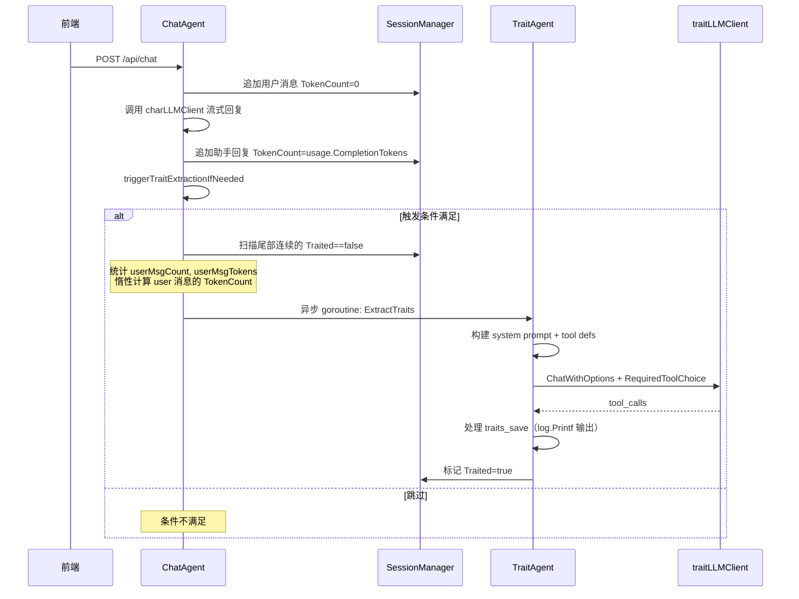

# TraitAgent 特征提取系统 — 设计计划

## 1. 概述

在现有 [`ChatAgent`](internal/agent/chat.go:27) 中增加专职的 `traitLLMClient`，用于在对话完成后异步分析对话历史，提取用户的个人特征（Personal-Traits）。

核心设计原则：
- **关注点分离**：`TraitAgent` 独立于 [`ChatAgent`](internal/agent/chat.go:27)，逻辑完全解耦
- **纯工具调用**：`traitLLMClient` 只进行 Tool Calls，不返回实际文本回复
- **非流式通信**：特征提取是后台任务，不需要 SSE 流式推送

---

## 2. 关于「是否使用流式回复」的分析

**结论：不需要流式回复。** 理由如下：

| 维度 | 分析 |
|------|------|
| 受众 | 特征提取结果不直接展现给最终用户，无需实时推送 |
| 通信模式 | LLM 被设置为 `tool_choice: "required"`，只会返回 `tool_calls`，不会返回 `content` 文本 |
| 资源效率 | 非流式（`Chat` / `ChatWithOptions`）比流式少一个持续打开的 HTTP 连接，后台任务更轻量 |
| 实现复杂度 | 非流式 + Tool Calls 的逻辑远比流式 + Tool Calls 简单（无需处理 Delta 聚合） |
| 现有模式参考 | [`OnGetSessionTitle`](internal/agent/chat.go:171) 已使用非流式调用 `h.charLLMClient.Chat()`，可作为参考模式 |

因此，`traitLLMClient` 应使用 [`ChatWithOptions`](infra/llm/client.go:49) 非流式接口，配合调用 [`ChatCompletionRequest.RequiredToolChoice()`](infra/llm/client.go:175) 方法（设置 `tool_choice: "required"`）强制 LLM 调用工具。

---

## 3. 修改点清单（用户提出的 8 项）

| # | 修改点 | 说明 |
|---|--------|------|
| 1 | `Message` 新增 `TokenCount int` | 记录消息的 token 估算值。user 消息收到时不立即计算；assistant 消息从已有的 `Usage.CompletionTokens` 赋值；system/tool 消息固定 0 |
| 2 | 轮次检查简化 | 只需从历史尾部倒查连续的 `Traited==false` 的消息块，统计其中 **user 角色消息** 的轮数和 tokens 总和 |
| 3 | 第一轮总是触发 | `history[0].Traited == false` 时固定触发 |
| 4 | 暂不入库，输出到控制台 | `traits_save` 工具的 `Execute()` 仅 `log.Printf` 输出到控制台 |
| 5 | 历史结论摘要附在 system prompt 尾部 | 已提取的特征摘要作为 system prompt 的一部分传给 trait-LLM |
| 6 | 系统提示词放 i18n 语言资源文件 | 使用 `lang/` 目录下的 `trait-system_prompt` 键，调用 `i18n.TL(lang, "trait-system_prompt")` |
| 7 | `topic_change` 工具定义保留但不使用 | 工具定义（ToolDefinition）写好，但 `ExtractTraits` 中暂不触发该工具调用 |
| 8 | 参考 `toolimp` 下的现有 `ToolIMP` 实现 | 参考 [`time_query.go`](internal/agent/toolimp/time_query.go) 和 [`web_search.go`](internal/agent/toolimp/web_search.go) 的模式 |

---

## 4. 触发策略

### 4.1 触发条件

```
从历史尾部向前扫描连续的 Traited==false 的消息：

IF session.history[0].Traited == false（从未提取过）
  → 第一轮固定触发
ELSE
  统计其中 Role=="user" 的消息轮数 userMsgCount
  累加其中 user 消息的 TokenCount 总和 userMsgTokens（若 TokenCount==0 则惰性计算）
  
  IF userMsgCount >= 5
    → 触发
  ELSE IF userMsgTokens > 200
    → 触发
  ELSE
    → 跳过本次
```

### 4.2 Message 新增字段

在 [`Message`](internal/agent/types.go:19) 结构体中新增两个字段：

```go
type Message struct {
    ID        int64  `json:"id"`
    Role      string `json:"role"`
    Content   string `json:"content"`
    Usage     *Usage `json:"usage,omitempty"`
    Reasoning string `json:"reasoning,omitempty"`
    Sources   []toolimp.WebSource `json:"sources,omitempty"`
    CreatedAt string `json:"created_at"`
    
    Traited    bool `json:"-"` // 是否已被特征提取处理
    TokenCount int  `json:"-"` // 消息的 token 估算值
}
```

**TokenCount 赋值规则：**
- **assistant 消息**：在 [`callLLMWithPipeline`](internal/agent/callm.go:172) 中创建 `assistantMsg` 时，从 `usage.CompletionTokens` 赋值
- **user 消息**：收到时 `TokenCount=0`；在 `triggerTraitExtractionIfNeeded` 扫描时若为 0 则用 [`toolset.TokenEstimate`](toolset/tokens_estimated.go:52) 惰性计算并回填
- **system / tool 消息**：固定为 0

---

## 5. 数据流图



---

## 6. 详细文件修改计划

### 6.1 [`types.go`](internal/agent/types.go:19) — Message 新增字段

```go
type Message struct {
    // ... 现有字段不变 ...
    
    Traited    bool `json:"-"` // 是否已被特征提取处理
    TokenCount int  `json:"-"` // 该消息的 token 估算值
}
```

### 6.2 [`config.go`](internal/config/config.go:15) — 添加 TraitLLM 配置

```go
// TraitLLMConfig 配置用于特征提取的 LLM 客户端。
type TraitLLMConfig struct {
    APIKey                string
    EnvKey                string // default: "DEEPSEEK_API_KEY"
    BaseURL               string // default: "https://api.deepseek.com/beta"
    Model                 string // default: "deepseek-chat"
    MaxToolCallIterations int    // default: 3
}

type Config struct {
    // ... 现有字段 ...
    TraitLLM TraitLLMConfig  // <-- 新增
}
```

### 6.3 [`lang/zh-CN.toml`](lang/zh-CN.toml) & [`lang/en.toml`](lang/en.toml) — 添加系统提示词

在 `zh-CN.toml` 中新增：
```toml
[trait-system_prompt]
other = """你是个人特征分析助手。下面是用户与AI助手的对话历史，请你分析对话内容，从中提取用户的个人特征。

你需要调用 traits_save 工具来记录提取到的特征。每条特征需要包含两个字段：
- domain: 特征所属领域，如"计算机编程"、"饮食习惯"、"休闲娱乐"
- conclusion: 简短的一句话描述用户的一个特征，如"喜欢用 tab 缩进代码"

请仔细阅读对话内容，提取有意义的、可支撑的特征。"""
```

在 `en.toml` 中新增对应的英文版本。

### 6.4 [`trait.go`](internal/agent/trait.go) — 定义 TraitAgent

#### 6.4.1 TraitAgent 结构体

```go
package agent

import (
    "BrainForever/infra/i18n"
    "BrainForever/infra/llm"
    "encoding/json"
    "log"
)

// TraitAgent 负责从对话历史中提取用户个人特征。
type TraitAgent struct {
    llmClient llm.Client
}

func NewTraitAgent(llmClient llm.Client) *TraitAgent {
    return &TraitAgent{llmClient: llmClient}
}
```

#### 6.4.2 工具参数类型

```go
// TraitsSaveParams traits_save 工具入参。
type TraitsSaveParams struct {
    Traits []TraitItem `json:"traits"`
}

// TraitItem 一条个人特征。
type TraitItem struct {
    Domain     string `json:"domain"`
    Conclusion string `json:"conclusion"`
}

// TopicChangeParams topic_change 工具入参（当前暂不使用）。
type TopicChangeParams struct {
    Topics      []string `json:"topics,omitempty"`
    Recommended string   `json:"recommended,omitempty"`
    Candidates  []string `json:"candidates,omitempty"`
}
```

#### 6.4.3 工具定义生成函数（参考 toolimp 模式）

```go
// traitsSaveToolDefinition 返回 traits_save 工具的 ToolDefinition。
func traitsSaveToolDefinition() llm.ToolDefinition {
    schema := map[string]any{
        "type": "object",
        "properties": map[string]any{
            "traits": map[string]any{
                "type": "array",
                "items": map[string]any{
                    "type": "object",
                    "properties": map[string]any{
                        "domain":     map[string]any{"type": "string", "description": "特征所属领域"},
                        "conclusion": map[string]any{"type": "string", "description": "简短的一句话描述用户的一个特征"},
                    },
                    "required":             []string{"domain", "conclusion"},
                    "additionalProperties": false,
                },
            },
        },
        "required":             []string{"traits"},
        "additionalProperties": false,
    }

    schemaBytes, _ := json.Marshal(schema)
    var paramsMap map[string]any
    json.Unmarshal(schemaBytes, &paramsMap)
    strict := true

    return llm.ToolDefinition{
        Type: "function",
        Function: llm.ToolFunctionDef{
            Name:        "traits_save",
            Description: "记录从对话中提取到的用户个人特征。每次调用可记录多条特征。",
            Parameters:  paramsMap,
            Strict:      &strict,
        },
    }
}

// topicChangeToolDefinition 返回 topic_change 工具的 ToolDefinition（定义保留，暂不使用）。
func topicChangeToolDefinition() llm.ToolDefinition {
    // ... 类似结构，定义 Topics/Recommended/Candidates 参数 ...
}
```

#### 6.4.4 核心提取方法

```go
// ExtractTraits 分析未处理的对话历史，提取用户特征。
// 阻塞调用，应在单独的 goroutine 中执行。
// previousSummary: 之前已提取的特征摘要（追加到 system prompt 尾部）。
func (ta *TraitAgent) ExtractTraits(
    ctx context.Context,
    lang string,
    untraitedMsgs []Message,
    previousSummary string,
) error {
    // 1. system prompt
    systemContent := i18n.TL(lang, "trait-system_prompt")
    if previousSummary != "" {
        systemContent += "\n\n之前已提取的特征摘要：\n" + previousSummary
    }
    
    // 2. 构建 messages
    msgs := make([]llm.Message, 0, 1+len(untraitedMsgs))
    msgs = append(msgs, llm.Message{Role: "system", Content: systemContent})
    for _, m := range untraitedMsgs {
        msgs = append(msgs, llm.Message{Role: m.Role, Content: m.Content})
    }
    
    // 3. 构建 tools（仅包含 traits_save；topic_change 定义了但暂不传入）
    tools := []llm.ToolDefinition{traitsSaveToolDefinition()}
    
    // 4. 构建请求
    req := llm.ChatCompletionRequest{
        Messages:    msgs,
        Tools:       tools,
        Stream:      false,
    }
    req.ForceToolChoice()  // 强制 LLM 调用工具
    
    // 5. 调用
    resp, err := ta.llmClient.ChatWithOptions(ctx, req)
    if err != nil {
        return fmt.Errorf("trait llm call failed: %w", err)
    }
    
    // 6. 处理 tool_calls
    if len(resp.Choices) > 0 {
        for _, tc := range resp.Choices[0].Message.ToolCalls {
            switch tc.Function.Name {
            case "traits_save":
                var params TraitsSaveParams
                if err := json.Unmarshal([]byte(tc.Function.Arguments), &params); err != nil {
                    log.Printf("[TraitExtract] failed to parse traits_save args: %v", err)
                    continue
                }
                for _, t := range params.Traits {
                    log.Printf("[TraitExtract] 发现特征: domain=%s, conclusion=%s", t.Domain, t.Conclusion)
                }
            default:
                log.Printf("[TraitExtract] unknown tool call: %s", tc.Function.Name)
            }
        }
    }
    
    return nil
}
```

### 6.5 [`chat.go`](internal/agent/chat.go:27) — 修改 ChatAgent

#### 6.5.1 添加字段

```go
type ChatAgent struct {
    traitSearcher  toolimp.TraitSearcher
    webSearcher    toolimp.WebSearcher
    charLLMClient  llm.Client
    traitLLMClient llm.Client
    traitAgent     *TraitAgent
    
    sessionManager *SessionManager
    cookieName     string
    defaultLang    string
}
```

#### 6.5.2 修改构造函数

```go
func NewChatHandler(
    traitSearcher toolimp.TraitSearcher,
    webSearcher toolimp.WebSearcher,
    chatLLMClient llm.Client,
    traitLLMClient llm.Client,    // <-- 新增
    cookieName string,
    defaultLang string,
) *ChatAgent {
    if defaultLang == "" { defaultLang = "en" }
    return &ChatAgent{
        traitSearcher:  traitSearcher,
        webSearcher:    webSearcher,
        charLLMClient:  chatLLMClient,
        traitLLMClient: traitLLMClient,
        traitAgent:     NewTraitAgent(traitLLMClient),
        sessionManager: NewSessionManager(),
        cookieName:     cookieName,
        defaultLang:    defaultLang,
    }
}
```

#### 6.5.3 添加触发逻辑

```go
const (
    traitExtractInterval       = 5
    traitExtractTokenThreshold = 200
)

// triggerTraitExtractionIfNeeded 判断是否需要触发特征提取。
func (h *ChatAgent) triggerTraitExtractionIfNeeded(ctx context.Context, session *session) {
    session.mu.Lock()
    
    // 从尾部扫描连续的 Traited==false 的消息
    var untraitedMsgs []Message
    userMsgCount := 0
    userMsgTokens := 0
    
    for i := len(session.history) - 1; i >= 0; i-- {
        msg := session.history[i]
        if msg.Traited {
            break
        }
        untraitedMsgs = append(untraitedMsgs, msg)
        if msg.Role == "user" {
            userMsgCount++
            tc := msg.TokenCount
            if tc == 0 {
                tc = toolset.TokenEstimate(msg.Content)
                session.history[i].TokenCount = tc // 回填
            }
            userMsgTokens += tc
        }
    }
    
    // 反转恢复正向顺序
    for i, j := 0, len(untraitedMsgs)-1; i < j; i, j = i+1, j-1 {
        untraitedMsgs[i], untraitedMsgs[j] = untraitedMsgs[j], untraitedMsgs[i]
    }
    
    // 判断触发条件
    shouldExtract := false
    isFirstExtraction := len(session.history) > 0 && !session.history[0].Traited
    
    if isFirstExtraction {
        shouldExtract = true
    } else if userMsgCount >= traitExtractInterval {
        shouldExtract = true
    } else if userMsgTokens > traitExtractTokenThreshold {
        shouldExtract = true
    }
    
    if !shouldExtract || len(untraitedMsgs) == 0 {
        session.mu.Unlock()
        return
    }
    
    // 深拷贝
    msgsCopy := make([]Message, len(untraitedMsgs))
    copy(msgsCopy, untraitedMsgs)
    
    // 收集已提取过的消息摘要
    previousSummary := collectTraitedSummary(session.history, len(session.history)-len(untraitedMsgs))
    lang := h.defaultLang
    session.mu.Unlock()
    
    // 异步执行
    go func() {
        traitCtx := context.WithoutCancel(ctx)
        if err := h.traitAgent.ExtractTraits(traitCtx, lang, msgsCopy, previousSummary); err != nil {
            log.Printf("Trait extraction failed: %v", err)
            return
        }
        
        // 标记已处理
        session.mu.Lock()
        for i := range session.history {
            for j := range msgsCopy {
                if session.history[i].ID == msgsCopy[j].ID {
                    session.history[i].Traited = true
                    break
                }
            }
        }
        session.mu.Unlock()
    }()
}

// collectTraitedSummary 收集已提取特征的消息中 assistant 消息的摘要。
func collectTraitedSummary(history []Message, maxLen int) string {
    if maxLen <= 0 {
        return ""
    }
    // 取已处理的最后几条 assistant 消息内容
    // 当前实现简化为空，后续可完善为实际摘要
    return ""
}
```

### 6.6 [`callm.go`](internal/agent/callm.go:172) — 记录 TokenCount + 触发提取

在创建 `assistantMsg` 时增加 `TokenCount`：
```go
assistantMsg := Message{
    // ... 现有字段 ...
    TokenCount: usage.CompletionTokens,  // <-- 新增
}
```

在函数末尾 `done` 事件之后添加：
```go
sseWriter.WriteEvent(SSEEvent{...})  // done 事件

// 异步触发特征提取
h.triggerTraitExtractionIfNeeded(ctx, session)
```

### 6.7 [`init.go`](internal/agent/init.go:160) — 添加初始化函数

```go
func InitTraitLLMClient(cfg config.TraitLLMConfig) llm.Client {
    envKey := cfg.EnvKey
    if envKey == "" { envKey = "DEEPSEEK_API_KEY" }
    baseURL := cfg.BaseURL
    if baseURL == "" { baseURL = "https://api.deepseek.com/beta" }
    model := cfg.Model
    if model == "" { model = "deepseek-chat" }
    maxIter := cfg.MaxToolCallIterations
    if maxIter <= 0 { maxIter = 3 }
    
    return llm.NewDeepSeekClientFromConfig(llm.DeepseekClientConfig{
        ClientConfig: llm.ClientConfig{
            EnvKey:                envKey,
            BaseURL:               baseURL,
            Model:                 model,
            MaxToolCallIterations: maxIter,
        },
    })
}
```

修改 `InitAgent`：
```go
func InitAgent(ctx context.Context, cfg config.Config, cookieName string, defaultLang string) (*ChatAgent, error) {
    // ... 现有初始化 ...
    traitLLMClient := InitTraitLLMClient(cfg.TraitLLM)  // <-- 新增
    chatHandler := NewChatHandler(..., traitLLMClient, ...)
    // ...
}
```

### 6.8 [`main.go`](main.go:32) — 传入 TraitLLM 配置

```go
cfg := config.Config{
    // ... 现有配置 ...
    TraitLLM: config.TraitLLMConfig{
        EnvKey:                "DEEPSEEK_API_KEY",
        BaseURL:               "https://api.deepseek.com/beta",
        Model:                 "deepseek-chat",
        MaxToolCallIterations: 3,
    },
}
```

---

## 7. 涉及文件清单

| 文件 | 变更类型 | 说明 |
|------|----------|------|
| [`internal/agent/types.go`](internal/agent/types.go:19) | 修改 | `Message` 添加 `Traited bool` + `TokenCount int` |
| [`internal/config/config.go`](internal/config/config.go:15) | 修改 | 添加 `TraitLLMConfig` + `Config.TraitLLM` |
| [`lang/zh-CN.toml`](lang/zh-CN.toml) | 修改 | 添加 `trait-system_prompt` |
| [`lang/en.toml`](lang/en.toml) | 修改 | 添加 `trait-system_prompt` |
| [`internal/agent/trait.go`](internal/agent/trait.go) | 完全重写 | `TraitAgent` + 工具参数类型 + 工具定义 + `ExtractTraits` |
| [`internal/agent/chat.go`](internal/agent/chat.go:27) | 修改 | 新增字段、构造函数、`triggerTraitExtractionIfNeeded` |
| [`internal/agent/callm.go`](internal/agent/callm.go:172) | 修改 | assistant 消息记录 TokenCount + 末尾触发提取 |
| [`internal/agent/init.go`](internal/agent/init.go:160) | 修改 | 添加 `InitTraitLLMClient`，修改 `InitAgent` |
| [`main.go`](main.go:32) | 修改 | 添加 `TraitLLM` 配置项 |

---

## 8. 安全与并发注意事项

1. **锁安全**：先持 `session.mu` 扫描 + 深拷贝，释放锁后再启动 goroutine
2. **标记更新**：goroutine 完成提取后，重新获取 `session.mu` 更新 `Traited`
3. **Context 隔离**：使用 `context.WithoutCancel` 派生独立 context
4. **错误隔离**：特征提取失败不 panic、不影响主流程，仅记录日志
5. **Token 惰性计算**：user 消息的 TokenCount 在首次扫描时惰性计算并回填
