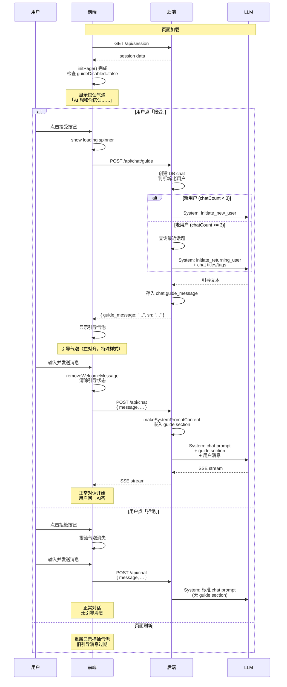

# 100-引导消息（AI-Initiated Guide Message）计划

## 1. 术语定义

| 术语 | 说明 |
|------|------|
| **引导消息** | AI 主动发起的话题内容，存储在 chat.`guide_message` 字段，不进入 messages 表 |
| **搭讪气泡** | 欢迎页展示的"AI 想和你搭讪……「接受」/「拒绝」"UI 组件 |
| **引导气泡** | 用户接受后，在欢迎区展示的 AI 引导消息气泡（独立于 message-group） |

## 2. 交互流程

```
页面加载 → 欢迎页
  ↓
显示搭讪气泡：「AI 想和你搭讪……」「接受」「拒绝」
  ↓
  ├─ 用户点「接受」
  │    ↓
  │   前端 POST /api/chat/guide → 后端生成引导消息 → 返回完整文本
  │    ↓
  │   前端在欢迎区以「引导气泡」展示 AI 话题（左对齐，与对话 AI 消息 X 坐标一致）
  │    ↓
  │   用户输入并发送消息
  │    ↓
  │   欢迎区消失 → guide_message 嵌入 system prompt → 正常对话开始
  │
  └─ 用户点「拒绝」
       ↓
      搭讪气泡消失 → 不生成引导消息 → 用户仍可正常发送消息
```

### 2.1 关于系统 prompt 的整合

用户发送第一条消息时：
- `POST /api/chat` 后端正常走 [`OnNewMessage`](internal/agent/on_msg_new.go:74) 流程
- 在 [`makeSystemPromptContent`](internal/agent/on_msg_new.go:190) 中，如果 currentChat 的 `guide_message` 非空，追加一段引导消息内容到 system prompt

```
system prompt = 原 chat prompt + [guide section，若存在] + trait section + web section
```

引导消息进入 system prompt 后，LLM 知道 AI 之前主动说过什么，从而保持对话的连贯性。但 guide_message **不进入 messages 表**，不会作为 conversation history 出现。

## 3. 涉及的文件与改动

### 3.1 后端改动

#### 3.1.1 DB 迁移：chat 表新增字段

**文件**：[`internal/store/chats.go`](internal/store/chats.go:21)

```go
type Chat struct {
    // ... 现有字段
    
    GuideMessage string `db:"guide_message" json:"guide_message,omitempty"` // 引导消息内容
}
```

**SQL 迁移**：
```sql
ALTER TABLE chats ADD COLUMN guide_message TEXT NOT NULL DEFAULT '';
```

#### 3.1.2 新增 API 路由

**文件**：[`cmd/server/routers.go`](cmd/server/routers.go:23)

```go
// /api/chat/guide -- POST (generate guide message for new chat)
srv.POST("/api/chat/guide", chatHandler.RequireAuth(chatHandler.OnGenerateGuideMessage))
```

#### 3.1.3 新增 Handler：`OnGenerateGuideMessage`

**文件**：`internal/agent/on_guide.go`（新文件）

```go
func (h *ChatAgent) OnGenerateGuideMessage(w http.ResponseWriter, r *http.Request) {
    // 1. 解析 session
    // 2. 创建/获取当前 chat（如果还没 DB chat，先创建）
    // 3. 判断用户类型：
    //    - 新用户（聊天记录 < 3 条）：使用 initiate_new_user prompt
    //    - 老用户（聊天记录 >= 3 条）：基于话题标签推荐话题
    // 4. 调用 LLM（低 token 消耗，简短回复）
    // 5. 将结果保存到当前 chat 的 GuideMessage 字段
    // 6. 返回 JSON { "guide_message": "...", "sn": "..." }
}
```

**响应格式**（非 SSE，完整文本）：
```json
{
    "guide_message": "嘿，我注意到你最近对 AI 编程很感兴趣，要不要聊聊 GitHub Copilot 的最新功能？",
    "sn": "chat-xxx-xxx"
}
```

#### 3.1.4 系统 prompt 修改：引导消息嵌入

**文件**：[`internal/agent/on_msg_new.go`](internal/agent/on_msg_new.go:190) 修改 `makeSystemPromptContent`

```go
func makeSystemPromptContent(lang string, traitSearchEnabled bool, webSearchEnabled bool, guideMessage string) string {
    var sb strings.Builder
    sb.WriteString(i18n.SystemPrompt.TL(lang, "chat"))
    
    // ★ 新增：如果存在引导消息，嵌入到 system prompt
    if guideMessage != "" {
        sb.WriteString("\n\n【对话背景】AI 刚刚主动对用户说了这样一段话作为话题引导：\n")
        sb.WriteString(guideMessage)
        sb.WriteString("\n用户现在回复你了，请基于上述背景连贯地继续对话。")
    }
    
    if traitSearchEnabled {
        sb.WriteString(i18n.SystemPrompt.TL(lang, "chat_trait_section"))
    }
    if webSearchEnabled {
        sb.WriteString(i18n.SystemPrompt.TL(lang, "chat_web_section"))
    }
    return sb.String()
}
```

#### 3.1.5 i18n 新增 prompt 段

**文件**：[`lang/zh-CN/system_prompt.toml`](lang/zh-CN/system_prompt.toml)

```toml
[initiate_new_user]
other = """你是一个AI助手，正在和一个刚注册的新用户初次对话。请用简短、友好、热情的语气说一句话来开启对话，吸引用户开口与你交流。控制在50字以内。注意：
- 不要问"有什么可以帮你的"这种客服式开场
- 可以用"嘿/嗨"等轻松的语气
- 可以提及你能做什么（聊天、搜索、记住用户特征等）
- 让用户感觉这是和一个朋友在聊天，而非面对一个工具
- 不要自我介绍，不要用"我是XX"句式
"""

[initiate_returning_user]
other = """你是一个AI助手，正在和一个老用户对话。以下是该用户之前讨论过的话题：
{{.RecentChatTitles}}

请基于用户的历史兴趣，推荐一个用户可能感兴趣的话题来开启今天的对话。控制在50字以内。语气要自然，像朋友之间打招呼一样。
"""

[initiate_guide_section]
other = """
【对话背景】AI 刚刚主动对用户说了这样一段话作为话题引导：
{{.GuideMessage}}
用户现在回复你了，请基于上述背景连贯地继续对话。注意：用户可能接受了你的话题，也可能转向其他话题，请灵活应对。
"""
```

#### 3.1.6 用户设置新增开关

**文件**：[`internal/store/user_settings.go`](internal/store/user_settings.go:109)

```go
type UserSettings struct {
    V      int                `json:"v"`
    APIKey UserSettingsAPIKey `json:"api_key"`
    Theme  UserSettingsTheme  `json:"theme"`
    // ★ 新增
    GuideDisabled bool `json:"guide_disabled"` // true=禁用引导消息功能
}
```

#### 3.1.7 Chat 结构体获取 GuideMessage

**文件**：[`internal/agent/llmtypes/types.go`](internal/agent/llmtypes/types.go:35)

```go
type Chat struct {
    DBCHat        *store.Chat
    Title         string
    TitleState    TitleState
    // ★ 新增：从 store.Chat.GuideMessage 读取，便于 makeSystemPromptContent 访问
    GuideMessage  string
}
```

### 3.2 前端改动

#### 3.2.1 Alpine Store 新增状态

**文件**：[`frontend/static/alpine-store.js`](frontend/static/alpine-store.js:39)

```js
// 在 chats store 中新增
guideMessage: '',          // 引导消息原始文本
guideMessageHTML: '',      // 引导消息 HTML 渲染
guideAccepted: false,      // 用户是否接受了引导（true=已显示引导气泡）
guideRejected: false,      // 用户是否拒绝了引导（true=搭讪气泡已消失）
guideLoading: false,       // 是否正在请求后端生成引导消息
```

#### 3.2.2 新增 API 函数

**文件**：[`frontend/static/chat-api.js`](frontend/static/chat-api.js:765)

```js
/**
 * fetchGuideMessage 请求后端生成引导消息
 * @param {string} [sn] - 可选的 chat SN
 * @returns {Promise<{guide_message: string, sn: string}|null>}
 */
export async function fetchGuideMessage(sn) {
    try {
        let url = '/api/chat/guide';
        if (sn) url += '?sn=' + encodeURIComponent(sn);
        const response = await fetch(url, { method: 'POST' });
        if (!response.ok) return null;
        return await response.json();
    } catch (e) {
        console.warn('获取引导消息失败:', e);
        return null;
    }
}
```

#### 3.2.3 欢迎页模板修改

**文件**：[`frontend/index.html`](frontend/index.html:549)

```html
<div class="welcome-message" x-show="$store.chats.activeIndex === -1">
    <!-- ★ 搭讪气泡：未接受也未拒绝时显示 -->
    <div class="guide-teaser" 
         x-show="!$store.chats.guideAccepted && !$store.chats.guideRejected && !$store.chats.guideLoading">
        <div class="guide-teaser-icon">🤖</div>
        <div class="guide-teaser-text">AI 想和你搭讪……</div>
        <div class="guide-teaser-actions">
            <button class="guide-btn guide-btn-accept" 
                    @click="$store.chats.acceptGuide()">接受</button>
            <button class="guide-btn guide-btn-reject" 
                    @click="$store.chats.guideRejected = true">拒绝</button>
        </div>
    </div>
    
    <!-- ★ 加载中 -->
    <div class="guide-loading" x-show="$store.chats.guideLoading">
        <div class="guide-loading-spinner"></div>
        <span>AI 正在想话题……</span>
    </div>
    
    <!-- ★ 引导气泡：接受后显示 AI 的引导消息 -->
    <div class="guide-bubble" x-show="$store.chats.guideAccepted && $store.chats.guideMessage">
        <div class="guide-bubble-avatar">🤖</div>
        <div class="guide-bubble-content">
            <div class="guide-bubble-label">AI 想和你聊聊</div>
            <div class="guide-bubble-text" x-html="$store.chats.guideMessageHTML"></div>
        </div>
    </div>
    
    <!-- 原有的欢迎文字 -->
    <p class="welcome-text" x-text="$store.chats.welcomeMessage || '你好！……'">
    </p>
</div>
```

#### 3.2.4 Alpine Store 新增方法：`acceptGuide`

**文件**：[`frontend/static/alpine-store.js`](frontend/static/alpine-store.js)

```js
/**
 * acceptGuide — 用户点击「接受」后调用
 * 请求后端生成引导消息，成功后展示引导气泡
 */
acceptGuide: async function() {
    if (this.guideLoading) return;
    this.guideLoading = true;
    
    const result = await fetchGuideMessage(this.active?.sn);
    
    if (result && result.guide_message) {
        this.guideMessage = result.guide_message;
        var render = window._alpineRenderMarkdown || function(s) { return s || ''; };
        this.guideMessageHTML = render(result.guide_message);
        this.guideAccepted = true;
    } else {
        // 失败后回退：让搭讪气泡仍然可见，用户可以再试
        console.warn('引导消息生成失败');
    }
    
    this.guideLoading = false;
},
```

#### 3.2.5 CSS 样式

**文件**：`frontend/static/welcome.css`（新文件）

```css
/* ============================================================
   Guide Message — 引导消息相关样式
   ============================================================ */

/* ---- 搭讪气泡 ---- */
.guide-teaser {
    display: flex;
    align-items: center;
    gap: 10px;
    padding: 12px 18px;
    margin: 0 auto 16px 0;  /* 左对齐 */
    max-width: 420px;
    background: var(--bubble-assistant-bg, #f0f0f0);
    border-radius: 12px;
    border: 1px solid var(--border-color, #e0e0e0);
    animation: guide-fade-in 0.4s ease-out;
}

.guide-teaser-icon {
    font-size: 24px;
    flex-shrink: 0;
}

.guide-teaser-text {
    flex: 1;
    font-size: 0.95rem;
    color: var(--text-color);
}

.guide-teaser-actions {
    display: flex;
    gap: 8px;
    flex-shrink: 0;
}

.guide-btn {
    padding: 4px 14px;
    border-radius: 6px;
    font-size: 0.85rem;
    cursor: pointer;
    border: 1px solid var(--border-color);
    background: var(--btn-bg, #fff);
    color: var(--text-color);
    transition: all 0.15s;
}

.guide-btn-accept {
    background: var(--accent-color, #4f8ef7);
    color: #fff;
    border-color: var(--accent-color, #4f8ef7);
}

.guide-btn-accept:hover {
    opacity: 0.85;
}

.guide-btn-reject:hover {
    background: var(--btn-hover-bg, #f5f5f5);
}

/* ---- 加载中 ---- */
.guide-loading {
    display: flex;
    align-items: center;
    gap: 8px;
    padding: 8px 0;
    margin: 0 auto 8px 0;
    font-size: 0.9rem;
    color: var(--text-muted);
}

.guide-loading-spinner {
    width: 16px;
    height: 16px;
    border: 2px solid var(--border-color);
    border-top-color: var(--accent-color);
    border-radius: 50%;
    animation: guide-spin 0.8s linear infinite;
}

@keyframes guide-spin {
    to { transform: rotate(360deg); }
}

/* ---- 引导气泡 ---- */
.guide-bubble {
    display: flex;
    align-items: flex-start;
    gap: 12px;
    margin: 0 auto 12px 0;  /* 左对齐，与 AI 消息 X 坐标一致 */
    padding: 14px 18px;
    max-width: 520px;
    background: linear-gradient(135deg, 
        var(--bubble-assistant-bg, #f0f0f0), 
        var(--bubble-assistant-bg-hover, #f8f8f8));
    border: 2px solid var(--accent-color, #4f8ef7);
    border-radius: 14px;
    box-shadow: 0 3px 12px rgba(0,0,0,0.08);
    animation: guide-bounce-in 0.5s cubic-bezier(0.34, 1.56, 0.64, 1);
}

.guide-bubble-avatar {
    font-size: 26px;
    line-height: 1;
    flex-shrink: 0;
    margin-top: 2px;
}

.guide-bubble-content {
    flex: 1;
    min-width: 0;
}

.guide-bubble-label {
    font-size: 0.7rem;
    color: var(--text-muted);
    margin-bottom: 4px;
    font-weight: 600;
    letter-spacing: 0.3px;
}

.guide-bubble-text {
    font-size: 1rem;
    line-height: 1.6;
    color: var(--text-color);
}

/* ---- 动画 ---- */
@keyframes guide-fade-in {
    from { opacity: 0; transform: translateY(-6px); }
    to   { opacity: 1; transform: translateY(0); }
}

@keyframes guide-bounce-in {
    0%   { opacity: 0; transform: translateY(-16px) scale(0.95); }
    100% { opacity: 1; transform: translateY(0) scale(1); }
}
```

#### 3.2.6 清除引导状态（用户发送消息时）

**文件**：[`frontend/static/chat-sse.js`](frontend/static/chat-sse.js:30) 修改 `removeWelcomeMessage`

```js
function removeWelcomeMessage(chatContainer) {
    // ★ 新增：清除引导消息状态
    var chats = window.Alpine.store('chats');
    if (chats) {
        chats.guideMessage = '';
        chats.guideMessageHTML = '';
        chats.guideAccepted = false;
        chats.guideRejected = false;
        chats.guideLoading = false;
    }
    
    // ... 原有逻辑
}
```

## 4. 引导消息在系统 prompt 中的完整流程

### 4.1 生成阶段（用户点「接受」）

```
POST /api/chat/guide
  → 创建 DB chat（如果尚未创建）
  → 判断新/老用户
  → 调用 LLM 生成引导文本
  → 存入 chat.guide_message
  → 返回 { guide_message: "...", sn: "..." }
```

### 4.2 消费阶段（用户发送第一条消息）

```
POST /api/chat (OnNewMessage)
  → makeSystemPromptContent(lang, traitSearch, webSearch, guideMessage)
    → chat prompt + [guide section] + [trait section] + [web section]
  → 将完整的 system prompt 发送给 LLM
  → LLM 回复时知道 AI 之前主动说过什么
```

### 4.3 关于 guide_message 的后续处理

- 一旦用户发送了第一条消息，`guide_message` 字段保留在 DB 中但不重复使用
- 后续轮次的对话不再嵌入 guide section
- 页面刷新后，`guide_message` 仍存在 DB 中，但前端重新发起「接受/拒绝」流程（旧引导消息过期）

## 5. 分步实施计划

### Step 1: 数据库迁移
- 修改 [`internal/store/chats.go`](internal/store/chats.go:21) 中 `Chat` 结构体，新增 `GuideMessage` 字段
- 执行 SQL 迁移：`ALTER TABLE chats ADD COLUMN guide_message TEXT`

### Step 2: 后端 API — 引导消息生成
- 新建 `internal/agent/on_guide.go`
- 实现 `OnGenerateGuideMessage` handler
- 注册路由到 [`cmd/server/routers.go`](cmd/server/routers.go:23)
- 新增 i18n prompt 段到 [`lang/zh-CN/system_prompt.toml`](lang/zh-CN/system_prompt.toml)

### Step 3: 后端 — 系统 prompt 整合
- 修改 [`internal/agent/on_msg_new.go`](internal/agent/on_msg_new.go:190) 的 `makeSystemPromptContent`，新增 `guideMessage` 参数
- 修改 [`internal/agent/llmtypes/types.go`](internal/agent/llmtypes/types.go:35) 中 `Chat` 结构体，新增 `GuideMessage` 字段
- 修改调用方传递 guideMessage

### Step 4: 前端 Alpine Store
- 在 [`frontend/static/alpine-store.js`](frontend/static/alpine-store.js:39) 中新增 `guideMessage` / `guideMessageHTML` / `guideAccepted` / `guideRejected` / `guideLoading` 字段
- 新增 `acceptGuide()` 方法

### Step 5: 前端 API
- 在 [`frontend/static/chat-api.js`](frontend/static/chat-api.js:765) 中新增 `fetchGuideMessage()` 函数

### Step 6: 前端模板 + CSS
- 修改 [`frontend/index.html`](frontend/index.html:549) 欢迎区块：搭讪气泡 + 引导气泡模板
- 新建 `frontend/static/welcome.css`：引导消息专属样式
- 修改 [`frontend/static/chat-sse.js`](frontend/static/chat-sse.js:30) 的 `removeWelcomeMessage()` 清除引导状态

### Step 7: 用户设置
- 修改 [`internal/store/user_settings.go`](internal/store/user_settings.go:109) 新增 `GuideDisabled` 字段
- 前端 settings store 新增对应字段
- 前端在 `initPage()` 时检查设置，如禁用则不显示搭讪气泡

### Step 8: 测试与联调
- 新用户场景：注册后首次打开，搭讪气泡 → 接受 → 引导气泡 → 发送消息 → system prompt 包含引导
- 老用户场景：已有聊天记录，搭讪气泡 → 接受 → 基于历史话题推荐
- 拒绝场景：搭讪气泡消失，正常发送消息
- 页面刷新：重新显示搭讪气泡
- 功能禁用：完全不显示搭讪气泡

## 6. Mermaid 流程图



## 7. 注意事项

1. **非流式**：引导消息是一次性返回完整文本，不需要 SSE 流式，简化前端处理
2. **左对齐**：搭讪气泡和引导气泡都左对齐（与对话中 AI 消息 X 坐标一致），区别于欢迎文字（居中）
3. **引导消息的消费时机**：仅在用户点「接受」后的**第一条用户消息时**嵌入 system prompt，后续轮次不再重复
4. **错误处理**：生成引导消息失败时（网络、LLM 超时等），搭讪气泡保留，用户可再次点击「接受」重试
5. **成本控制**：引导消息控制在 50 字以内，LLM 调用使用低 token 消耗的模型配置
6. **用户隐私**：老用户的话题推荐只使用对话标题和标签摘要，不暴露具体聊天内容或个人特征
