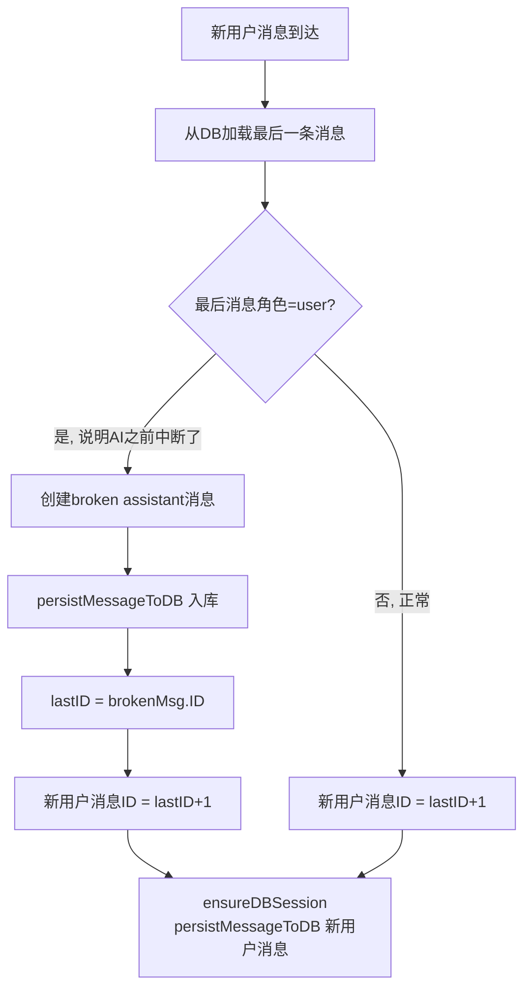
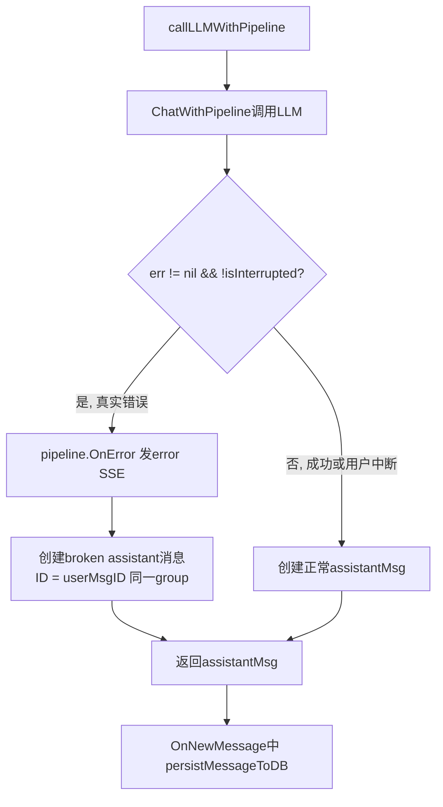

# AI 思考中断时消息不持久化问题 —— 分析与设计方案

## 背景

当 AI 因后台原因（如 `chatLLMClient` 连接中断、第三方 API 如联网搜索出错）停止思考时，助手消息未被保存到数据库。

## 现有逻辑分析

### 1. `appendNewRequestMessage` —— 前次对话的"修补"逻辑

**位置**: [`internal/agent/on_chat.go:110-145`](internal/agent/on_chat.go:110)

**触发时机**: 每次新用户消息到来时（在 LLM 调用之前）

**流程**:



**关键细节**:
- Broken 消息的 `GroupIndex = lastMsg.GroupIndex + 1`（单独的 group）
- **确实入库**了（通过 `persistMessageToDB`）
- 但这是**被动修复**——只在下一次用户发消息时才修补前一次的缺口

### 2. 我们刚修复的 `callLLMWithPipeline` —— 当前错误的"主动"逻辑

**位置**: [`internal/agent/chatllm.go:199-212`](internal/agent/chatllm.go:199)

**触发时机**: LLM 调用返回错误（非用户中断）时

**流程**:



**关键细节**:
- Broken 消息的 `GroupIndex = userMsgID`（与用户消息**同 group**）
- `Interrupted = true`
- 这是**主动修复**——错误发生时立即创建并持久化

### 3. 两个逻辑的交互关系

**无修复时**（旧代码）:

```
请求1: 用户发消息A
  → appendNewRequestMessage: 无前次间隙, msgA(GI=1)入库
  → callLLMWithPipeline: 报错, 返回nil
  → OnNewMessage: assistantMsg=nil, 跳过入库
  → DB: [A(user, GI=1)]  ← 缺少助手回复!

请求2: 用户发消息B
  → appendNewRequestMessage: 最后消息是A(user, GI=1)
  → 创建 broken(GI=2), 入库
  → msgB(GI=3)入库
  → DB: [A(GI=1), broken(GI=2), B(GI=3)]
  
  → callLLMWithPipeline: 成功
  → replyB(GI=3)入库
  → DB: [A(GI=1), broken(GI=2), B(GI=3), replyB(GI=3)]
  
  → 前端显示:
    [A]
    [broken: AI中断...]  ← 单独的消息气泡, 与A分离
    [B]
    [回复B]
```

问题: A 的 broken 消息作为**独立气泡**显示，因为 GI 不同。

**有修复后**（新代码）:

```
请求1: 用户发消息A
  → appendNewRequestMessage: 无前次间隙, msgA(GI=1)入库
  → callLLMWithPipeline: 报错, 创建 broken(GI=1, 同A)
  → OnNewMessage: broken(GI=1)入库
  → DB: [A(user, GI=1), broken(assistant, GI=1)]  ← 同group!

请求2: 用户发消息B
  → appendNewRequestMessage: 最后消息是 broken(assistant, GI=1)
  → 角色是 assistant → 不注入broken
  → msgB(GI=2)入库
  → DB: [A(GI=1), broken(GI=1), B(GI=2)]
  
  → callLLMWithPipeline: 成功
  → replyB(GI=2)入库
  → DB: [A(GI=1), broken(GI=1), B(GI=2), replyB(GI=2)]
  
  → 前端显示:
    [A]
    [broken]  ← 与A同组显示
    [B]
    [回复B]
```

Broken 消息与对应的用户消息同 group，前端能正确关联。

## 设计建议

### 两个逻辑的关系

| 维度 | `appendNewRequestMessage` | `callLLMWithPipeline` (我们的修复) |
|------|--------------------------|-----------------------------------|
| 时机 | LLM 调用之前 | LLM 调用返回错误时 |
| 性质 | **被动修复** — 修补前一次对话的缺口 | **主动处理** — 处理当次错误 |
| 作用域 | 历史遗留问题 | 当前请求 |
| GI 分配 | `lastID+1` (独立 group) | `userMsgID` (同 group) |
| 必要性 | 旧代码的安全网，修复遗留数据 | 新代码的核心修复 |

### 建议的优化

`appendNewRequestMessage` 的 broken 消息应该使用**与 orphane 用户消息相同的 GI**，而不是 `lastID+1`，这样在修复历史 gap 时，broken 消息能正确关联到它所属的用户消息。

**当前代码**（`on_chat.go:130-134`）:
```go
if lastMsg.Role == 0 { // 0 = user
    assistantMsg := makeAssistantBrokenMessage(lang, lastID+1)
    persistMessageToDB(session, &assistantMsg)
    lastID = assistantMsg.ID  // lastID 变为 lastID+1
}
```

**建议改为**:
```go
if lastMsg.Role == 0 { // 0 = user
    // 使用与用户消息相同的 group_index，保持一致性
    assistantMsg := makeAssistantBrokenMessage(lang, lastID)
    assistantMsg.Interrupted = true
    persistMessageToDB(session, &assistantMsg)
    // 不推进 lastID，新用户消息仍使用 lastID+1
}
```

这样历史遗留的 orphaned 用户消息修复后，broken 消息能与正确关联到用户消息的 group。

### 不修改 `appendNewRequestMessage` 会怎样？

不修改的话，在以下场景会有**不一致**:
- 旧数据（我们的 fix 部署前产生的 orphaned 用户消息）
- `callLLMWithPipeline` 中 `persistMessageToDB` 失败（罕见但可能）
- 服务重启/崩溃等极端场景

在这些场景下，`appendNewRequestMessage` 仍会用 `lastID+1`（独立 GI）插入 broken 消息，前端显示上会多一个"孤立"的 broken 气泡。

### 最终设计方案

1. **保留并更新 `appendNewRequestMessage` 的修补逻辑**：使用同 GI 方式插入 broken 消息
2. **保留我们的 `callLLMWithPipeline` 修复**：当前错误时主动创建 broken 消息
3. **两个机制互补**：主动处理 + 安全网，覆盖所有场景
