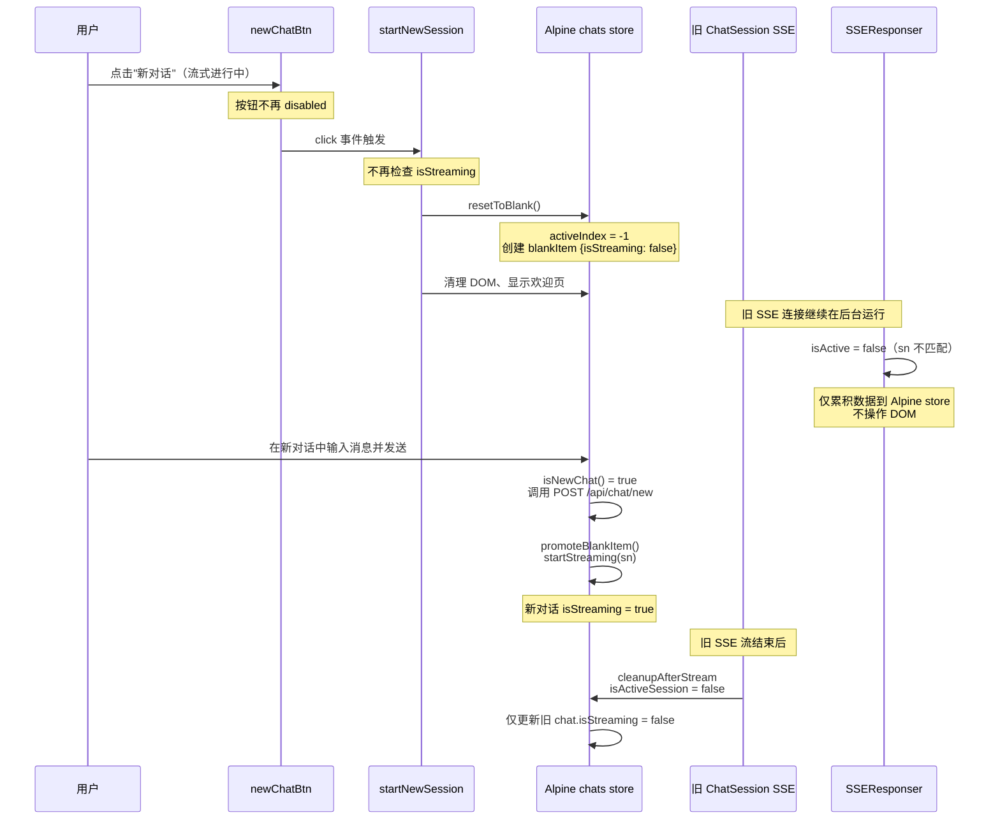

# 允许流式输出时开启新对话 — 改造方案

## 背景

当前 [`startNewSession()`](frontend/static/chat.js:103) 的第 0 步会检查 `sessionManager.isStreaming`，如果正在流式输出则直接返回。用户希望在 AI 回复过程中也能点击"新对话"按钮切换到空白对话。

## 当前架构分析

### 多会话并发流式架构

系统已支持**多会话并发流式输出**：

- 每个对话有独立的 [`ChatSession`](frontend/static/chat-session.js:30) 实例，持有自己的 `abortController`、DOM 引用
- SSE 连接在后台继续接收数据，通过 [`SSEResponser`](frontend/static/chat-sse-responser.js:38) 的 `isActive` 判断是否更新当前 DOM
- 流式数据存储在 [`Alpine.store('chats')`](frontend/static/alpine-store.js:181) 的 `ChatData.streamingMsg` 中，与 DOM 解耦
- 切换回旧对话时，[`flushToDOM()`](frontend/static/chat-sse-responser.js:339) 将累积数据渲染到 DOM

### 当前"新对话"按钮的约束

| 约束点 | 位置 | 说明 |
|--------|------|------|
| 按钮 `disabled` 绑定 | [`frontend/index.html:268`](frontend/index.html:268) | `x-data="textBtn({ disabled: () => $store.chats.active?.isStreaming })"` |
| `startNewSession` 防御检查 | [`frontend/static/chat.js:105`](frontend/static/chat.js:105) | `if (sessionManager.isStreaming) return;` |

### 流式输出时调用 `startNewSession` 的风险

1. **`resetToBlank()`** 会设置 `activeIndex = -1`，创建新的 `blankItem`。但旧对话的 SSE 连接仍在后台运行，`SSEResponser` 的 `isActive` 判断（`chats.active.sn === session.sn`）会变为 `false`，因此不会操作当前 DOM — **这是安全的**。

2. **`cleanupAfterStream()`** 在流结束后调用，其中 `isActiveSession` 判断会失败（因为 `activeSessionSN` 已指向新对话），所以会走"后台流完成"分支，仅更新 Alpine store 中对应 chat 的 `isStreaming = false` — **这也是安全的**。

3. **`prepareChat()`** 中的 `sessionManager.isStreaming` 检查（[`chat-sse.js:87`](frontend/static/chat-sse.js:87)）— 如果用户在新对话中发送消息，这个检查会阻止发送，因为旧对话的 `isStreaming` 仍为 `true`。**这是需要解决的问题。**

## 改造方案

### 核心思路

**不中断旧对话的 SSE 连接**，让它在后台继续完成。新对话的 `isStreaming` 状态独立管理。需要修改的关键点：

### 修改清单

#### 1. [`frontend/static/chat.js`](frontend/static/chat.js) — `startNewSession` 函数

**移除第 0 步的流式检查**，让函数在流式输出时也能执行。

```js
async function startNewSession() {
    // 移除：if (sessionManager.isStreaming) { return; }
    
    var chatsStore = window.Alpine.store('chats');
    // ... 后续代码不变
}
```

#### 2. [`frontend/index.html:268`](frontend/index.html:268) — 按钮 disabled 绑定

**移除或修改按钮的 `disabled` 绑定**，使其在流式输出时也可点击。

```html
<!-- 修改前 -->
x-data="textBtn({ disabled: () => $store.chats.active?.isStreaming })"

<!-- 修改后：始终可用 -->
x-data="textBtn({ disabled: () => false })"
```

或者更精确：仅当当前对话是空白对话且正在流式时才禁用（但空白对话不会流式，所以直接设为 `false` 即可）。

#### 3. [`frontend/static/chat-sse.js:87`](frontend/static/chat-sse.js:87) — `prepareChat` 中的流式检查

**修改 `sessionManager.isStreaming` 检查**，改为仅检查**当前活跃对话**的 `isStreaming` 状态，而非全局。

```js
// 修改前
if (!content || sessionManager.isStreaming) return null;

// 修改后：仅检查当前活跃对话是否正在流式
var chats = window.Alpine.store('chats');
var activeChat = chats ? chats.active : null;
if (!content || (activeChat && activeChat.isStreaming)) return null;
```

#### 4. [`frontend/static/chat-session-manager.js:145`](frontend/static/chat-session-manager.js:145) — `isStreaming` getter

**不需要修改**。`sessionManager.isStreaming` 读取的是 `chats.active.isStreaming`，当切换到新对话后，`chats.active` 变为 `blankItem`（`isStreaming: false`），所以会返回 `false`。但为了清晰，建议保留此行为。

#### 5. 其他 `sessionManager.isStreaming` 使用点 — 评估是否需要修改

| 位置 | 用途 | 是否需要修改 |
|------|------|-------------|
| [`chat.js:78`](frontend/static/chat.js:78) — AI 标题按钮 | 流式时禁用 AI 生成标题 | **不需要**，当前活跃对话如果是新对话（`isStreaming: false`），可以正常使用 |
| [`chat.js:672`](frontend/static/chat.js:672) — 发送按钮 | 流式时点击变为"停止" | **需要修改**，应检查当前活跃对话的 `isStreaming` |
| [`chat.js:725`](frontend/static/chat.js:725) — 标题编辑 | 流式时不允许修改标题 | **不需要**，新对话标题为空，不会触发编辑 |
| [`chat.js:771`](frontend/static/chat.js:771) — 登录按钮 | 流式时短路返回 | **不需要**，登录操作与对话无关 |
| [`chat.js:826`](frontend/static/chat.js:826) — scrollend | 流式时折叠输入面板 | **需要修改**，应检查当前活跃对话的 `isStreaming` |
| [`chat.js:854`](frontend/static/chat.js:854) — scroll 检测 | 流式时只检测滚动状态 | **需要修改**，应检查当前活跃对话的 `isStreaming` |
| [`chat-markdown.js:275`](frontend/static/chat-markdown.js:275) — 复制按钮 | 流式时禁用复制 | **不需要**，复制按钮针对具体消息，与全局流式状态无关 |

### 关键设计决策

**不中断旧 SSE 连接**：当用户点击"新对话"时，旧对话的 SSE 连接继续在后台运行。这是安全的，因为：

1. `SSEResponser.isActive` 会返回 `false`（`chats.active.sn !== session.sn`），不会操作 DOM
2. `cleanupAfterStream` 的后台分支仅更新 Alpine store 数据
3. 用户切换回旧对话时，`flushToDOM()` 会渲染累积的数据

### 流程图



### 需要修改的文件汇总

| 文件 | 修改内容 | 风险等级 |
|------|---------|---------|
| [`frontend/static/chat.js:105`](frontend/static/chat.js:105) | 移除 `if (sessionManager.isStreaming) return;` | 低 |
| [`frontend/index.html:268`](frontend/index.html:268) | 修改按钮 `disabled` 绑定为 `false` | 低 |
| [`frontend/static/chat-sse.js:87`](frontend/static/chat-sse.js:87) | 改为检查当前活跃对话的 `isStreaming` | 中 |
| [`frontend/static/chat.js:672`](frontend/static/chat.js:672) | 发送按钮点击：检查当前活跃对话的 `isStreaming` | 中 |
| [`frontend/static/chat.js:826`](frontend/static/chat.js:826) | scrollend：检查当前活跃对话的 `isStreaming` | 低 |
| [`frontend/static/chat.js:854`](frontend/static/chat.js:854) | scroll 检测：检查当前活跃对话的 `isStreaming` | 低 |

### 测试要点

1. 流式输出中点击"新对话" → 应立即切换到空白欢迎页
2. 旧对话 SSE 在后台完成后 → 不应影响新对话的 UI
3. 在新对话中发送消息 → 应正常发送，不被旧对话的流式状态阻塞
4. 切换回旧对话 → 应看到完整的 AI 回复（后台累积的数据已渲染）
5. 发送按钮在旧对话流式时显示"停止"，在新对话中显示"发送"
