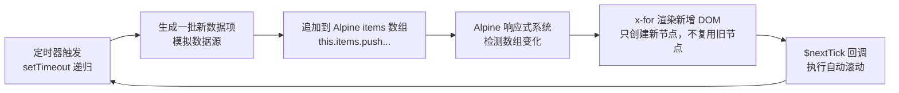

# Alpine.js 节流追加数据 + 自动滚动预研项目计划

## 一、项目背景

在 [`plans/sse-streaming-alpine-code-comparison.md`](plans/sse-streaming-alpine-code-comparison.md) 中已详细分析了 Alpine.js 在 SSE 流式渲染场景下的适用性。本预研项目的目的是**单独验证 Alpine.js 的核心能力**——即 Alpine 的响应式数据绑定 + `x-for` 列表渲染在"节流追加数据"场景下的表现，不涉及 SSE、Markdown 渲染等复杂逻辑。

## 二、项目目标

在 [`html_demo/alpine-demo/`](html_demo/alpine-demo/) 下创建一个独立 HTML 演示文件，实现：

1. **Alpine 数据绑定**：使用 `x-data` 将 JS 数组绑定到 DOM 列表
2. **节流追加数据**：以受控的间隔（例如每 200-500ms）向数组中追加一批数据项
3. **DOM 自动增长**：Alpine `x-for` 响应式渲染新增的 DOM 节点
4. **自动向下滚动**：当 DOM 容器出现滚动条时，自动滚动到最底部

## 三、核心概念区分

> 用户特别强调："纯 js 数据，非 dom 上数据"

| 概念 | 说明 |
|------|------|
| **纯 JS 数据** | 数据存储在 Alpine `x-data` 的 `items` 数组中，每次追加的是 JS 对象/字符串 |
| **DOM 数据** | 不从 DOM 中读取数据（如 `innerText`），也不用 DOM 存储状态 |
| **节流** | 控制数据追加的速率，每间隔固定时间向数组 push 一批新数据 |

## 四、技术方案

### 4.1 技术选型

| 项 | 选择 |
|---|------|
| Alpine.js | CDN 加载 `https://cdn.jsdelivr.net/npm/alpinejs@3.14.8/dist/cdn.min.js` |
| 无构建步骤 | 纯 HTML + CDN |
| 无其他依赖 | 所有逻辑内嵌在单个 HTML 文件中 |

### 4.2 核心实现架构



### 4.3 Alpine 组件设计

```javascript
function throttledList() {
    return {
        // ---- 响应式数据 ----
        items: [],        // ← 纯 JS 数据数组，Alpine 响应式监听
        isRunning: false, // ← 控制启停

        // ---- 非响应式内部状态 ----
        _timer: null,     // ← 节流定时器
        _count: 0,        // ← 数据生成计数器
        _batchSize: 3,    // ← 每次追加的条数
        _interval: 300,   // ← 节流间隔 (ms)

        // ---- 启动节流追加 ----
        start() { ... },

        // ---- 停止追加 ----
        stop() { ... },

        // ---- 清空数据 ----
        clear() { ... },

        // ---- 核心：追加一批数据 ----
        _appendBatch() {
            // 1. 生成 batchSize 条新数据
            // 2. items.push(...newItems)  ← Alpine 自动触发 x-for 渲染
            // 3. $nextTick → 自动滚动到底部
            // 4. 递归 setTimeout
        },

        // ---- 自动滚动 ----
        _scrollToBottom() {
            this.$nextTick(() => {
                const container = this.$refs.scrollContainer;
                container.scrollTop = container.scrollHeight;
            });
        },
    };
}
```

### 4.4 数据生成模拟

每条数据项为一个包含时间戳、序号和随机内容的对象：

```javascript
{
    id: Date.now() + index,          // 唯一标识
    time: new Date().toLocaleTimeString(), // 时间戳
    text: faker.lorem.sentence(),    // 模拟句子内容
    index: this._count++
}
```

使用一个预设的句子池循环取用，模拟真实数据源。

### 4.5 节流机制

采用 **递归 setTimeout** 模式（而非 setInterval），以确保上次追加完成后再调度下一次：

```
第 0ms:   _appendBatch() → push 3 条 → setTimeout(300ms)
第 300ms: _appendBatch() → push 3 条 → setTimeout(300ms)
第 600ms: _appendBatch() → push 3 条 → setTimeout(300ms)
...
```

## 五、用户交互控制

提供三个控制按钮，方便观察不同行为：

| 按钮 | 行为 |
|------|------|
| **▶ 开始** | 启动节流追加，按钮 disabled |
| **■ 停止** | 停止追加，保留现有数据 |
| **✕ 清空** | 停止追加 + 清空数据 |

## 六、自动滚动策略

采用简单的 `scrollTop = scrollHeight` 策略：

```javascript
_scrollToBottom() {
    this.$nextTick(() => {
        const el = this.$refs.scrollContainer;
        // 仅在用户未手动向上滚动时执行自动滚动
        if (el.scrollHeight - el.scrollTop - el.clientHeight < 100) {
            el.scrollTop = el.scrollHeight;
        }
    });
}
```

**增强行为**：当用户手动向上滚动查看历史数据时，暂停自动滚动；当用户回到底部附近时，恢复自动滚动。

## 七、UI 布局设计

```
┌─────────────────────────────────────┐
│  Alpine.js 节流追加 & 自动滚动 Demo  │
│  technique: 节流追加 / x-for 渲染    │
├─────────────────────────────────────┤
│                                     │
│  ┌─────────────────────────────┐    │
│  │  [虚拟数据列表 - 可滚动区域]   │    │
│  │                             │    │
│  │  #1 10:00:01 xxx            │    │
│  │  #2 10:00:01 xxx            │    │
│  │  #3 10:00:01 xxx            │    │
│  │  ...                        │    │
│  │  #N 10:00:05 xxx            │    │
│  └─────────────────────────────┘    │
│                                     │
│  [▶ 开始]  [■ 停止]  [✕ 清空]      │
│  状态: 运行中 | 已追加 42 条        │
│  节流间隔: [300ms]  每批: [3] 条    │
├─────────────────────────────────────┤
│  底部: 对比原生 JS 实现面板         │
│  (可选，用于对比代码量和行为差异)    │
└─────────────────────────────────────┘
```

## 八、文件结构

```
html_demo/alpine-demo/
  └── alpine-throttled-demo.html     ← 唯一文件，所有代码内嵌
```

## 九、预期行为验证要点

| # | 验证点 | 预期结果 |
|---|--------|---------|
| 1 | Alpine `x-data` 绑定 | 组件初始化后 `items` 数组为空，DOM 显示空列表 |
| 2 | 点击"开始" | 数据以节流间隔追加，DOM 节点逐步增多 |
| 3 | 节流控制 | 数据按设定间隔追加，不会连续爆发 |
| 4 | `x-for` DOM 复用 | 每次追加只新增节点，已有节点不重建 |
| 5 | 自动滚动 | 列表超出容器高度后，滚动条自动保持在底部 |
| 6 | 手动向上滚动 | 自动滚动暂停，回到底部后恢复 |
| 7 | 点击"停止" | 数据停止追加，`_timer` 被清理 |
| 8 | 点击"清空" | `items` 置空，DOM 清空，`_timer` 清理 |
| 9 | 调整节流参数 | 界面可调间隔和批次大小，行为实时生效 |

## 十、技术细节与注意事项

### 10.1 Alpine `x-for` 的 DOM 行为

Alpine 的 `x-for` 按 `:key` 匹配已有 DOM 节点。因为每次追加的是**新数据项**（新 id），不会与已有节点匹配，所以：
- 已有 DOM 节点**完全不动**
- 仅新节点从 `<template>` 克隆并插入
- 这是最高效的路径——**没有 DOM 重建**

### 10.2 为什么用 `$nextTick`

Alpine 的 DOM 更新是异步的。`items.push(...)` 后 Alpine 需要经过微任务队列才能完成 DOM 更新。如果在同一 tick 中立即读取 `scrollHeight`，得到的是更新前的值。`$nextTick` 确保在 Alpine 完成 DOM 更新后执行滚动。

### 10.3 与现有 SSE 流式渲染的区别

| 维度 | 现有 SSE 流式 | 本 Demo |
|------|-------------|---------|
| 数据源 | SSE chunk（网络事件驱动） | 本地定时器（模拟驱动） |
| 渲染方式 | `innerHTML` 全量替换（节流后） | `x-for` 增量追加新节点 |
| 数据模型 | 单字符串累积 | 数组批量追加 |
| Markdown | 需要 remarkable.js 渲染 | 纯文本，无需渲染 |
| 框架价值 | 低（节流+渲染需手动） | **高**（`x-for` 天然适合列表追加） |
