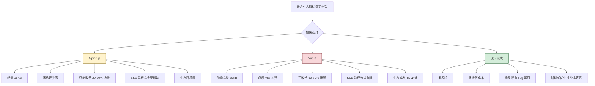

# Alpine.js vs Vue 3 数据绑定方案评估报告

> **评估背景**：项目"第2大脑"前端为纯原生 JS（ES Modules）+ 无构建工具的 SPA，后端 Go 直接 serve 静态文件。用户希望评估引入数据绑定框架的可行性，重点对比 Alpine.js 与 Vue 3 的优劣。

---

## 一、项目前端架构现状（关键约束）

| 维度 | 现状 |
|------|------|
| **构建工具** | ❌ 无（直接 HTML `<script type="module">` 引用） |
| **模块系统** | ES Modules（原生 import/export） |
| **总 JS 代码量** | ~20 模块，约 5000-6000 行 |
| **核心复杂度** | SSE 流式处理、多会话并发、触摸翻页、刻度导航 |
| **后端服务方式** | Go `net/http` 直接 serve `/static/` 目录 |
| **CSS** | 原生 CSS 文件，无预处理 |
| **已有重构方向** | 已有分析报告认为"不建议引入 Alpine.js" |

**关键约束**：当前"**修改代码 → 刷新浏览器即生效**"的开发体验是项目的核心优势，引入任何需要构建步骤的框架都会破坏这一优势。

---

## 二、Alpine.js 详细评估

### 2.1 简介

[Alpine.js](https://alpinejs.dev/)（~15KB minified）是一个轻量级、HTML 内联的响应式框架。语法和心智模型**高度模仿 Vue**（`x-data`/`x-bind`/`x-on`/`x-model`/`x-for`/`x-show`），但**操作真实 DOM**，无虚拟 DOM。

### 2.2 优势

| 优势 | 说明 |
|------|------|
| **零构建步骤** | 直接在 HTML 中通过 `<script src="alpine.min.js">` 引入，完全兼容现有部署方式 |
| **增量采用** | 可以只用在部分组件上（如按钮状态、Toast），原有代码不需要一次性重写 |
| **轻量** | ~15KB gzip，对页面加载影响极小 |
| **语法熟悉** | 如果未来想迁移到 Vue，Alpine 的 `x-` 指令语法与 Vue 的 `v-` 指令几乎一一对应 |
| **与现有模块兼容** | Alpine 的 `Alpine.store()` 可以包装现有的 `state` 对象，逐步替换 |

### 2.3 劣势

| 劣势 | 说明 |
|------|------|
| **生态匮乏** | 组件库、路由、状态管理方案远不如 Vue/React 丰富 |
| **TypeScript 支持差** | 无原生 TS 支持，类型推断能力弱 |
| **复杂场景力不从心** | `x-for` 按 `:key` 匹配复用已有 DOM，只创建新增节点，但无虚拟 DOM diff，复杂列表操作性能不如 Vue |
| **调试工具弱** | 无官方 DevTools，调试需靠 `console.log` 或浏览器原生工具 |
| **学习曲线不低** | 虽然比 Vue 简单，但团队仍需学习一套新的指令体系 |
| **社区规模小** | GitHub Stars ~28k，npm 周下载量 ~500k（Vue 3 是其 ~20 倍） |

### 2.4 与此项目的匹配度分析

| 场景 | Alpine.js 能改善吗？ | 说明 |
|------|---------------------|------|
| 按钮状态（deepThink / webSearch） | ✅ 能 | 当前 `toggleButton()` + `UserSettings.save()` 可简化为 `x-model` + Alpine store |
| 条件显隐（stopBtn disabled、输入区折叠） | ✅ 能 | 当前 `applyStreamingState()` 手动切换多个 DOM 属性，可改为 Alpine 响应式 |
| Toast 消息 | ✅ 能 | 当前手动 create/append/remove，可改为 `x-show` + `x-transition` |
| 对话框显隐 | ✅ 能 | 当前手动管理 overlay 显隐，可改为 `x-show` |
| SSE 流式渲染 | ❌ 不能 | 核心是事件驱动 + 节流 innerHTML，Alpine 响应式无帮助 |
| 触摸滑动翻页（SwipePager） | ❌ 不能 | 精细的触摸事件 + CSS transform 动画，Alpine 不适合 |
| 刻度导航 | ❌ 不能 | 复杂的滚动位置计算 + DOM 重建，与响应式无关 |
| 多会话管理（ChatSessionManager） | ❌ 不能 | 纯逻辑层，无 UI 绑定 |
| Markdown 渲染 + 代码高亮 | ❌ 不能 | 纯数据处理，与 UI 框架无关 |
| 消息列表渲染（addMessage） | ⚠️ 部分能 | `x-for` 可以简化静态消息列表，但 SSE 流式路径仍需要手动控制 |

**结论：Alpine.js 只能覆盖约 20%-30% 的代码场景。**

---

## 三、Vue 3 详细评估

### 3.1 简介

[Vue 3](https://vuejs.org/)（~30KB gzipped）是一个完整的渐进式前端框架，提供 Composition API、Proxy 响应式系统、虚拟 DOM、SFC（单文件组件）等。

### 3.2 优势

| 优势 | 说明 |
|------|------|
| **完整的响应式系统** | Proxy 驱动的深度响应式，自动追踪依赖，自动更新视图 |
| **虚拟 DOM** | 高效的 diff 算法，列表细粒度更新场景性能优于 Alpine（Alpine 也是 key 匹配复用，非全量替换） |
| **Composition API** | 逻辑复用能力强，`composables` 可封装 SSE 状态、会话管理等复杂逻辑 |
| **TypeScript 支持一流** | 完整的 TS 类型推断，适合长期维护 |
| **生态成熟** | Vue Router、Pinia（状态管理）、Vite（构建工具）、Vue DevTools |
| **SFC 单文件组件** | 模板 + 脚本 + 样式集中在一个 `.vue` 文件中，组件化程度高 |
| **社区庞大** | 国内社区活跃，文档完善，问题容易搜索到答案 |
| **过渡动画系统** | `<Transition>` / `<TransitionGroup>` 比手动 CSS 动画方便 |

### 3.3 劣势

| 劣势 | 说明 |
|------|------|
| **必须引入构建步骤** | 使用 Vue 3 的最佳实践是 Vite 构建，无法直接 serve .vue 文件。这会**彻底破坏"刷新即生效"的开发体验** |
| **架构变更大** | 不是"引入一个库"的问题，而是"引入一个完整的工程体系"——需要 Vite、node_modules、package.json、构建脚本 |
| **部署复杂度增加** | 需要 CI/CD 中增加构建步骤，或者改 Go 后端为 SPA fallback 路由 |
| **学习成本较高** | 团队需要学习 Vue 3 的完整生态（Composition API、Vite、Pinia、Vue Router 等） |
| **对现有代码侵入性极强** | 几乎所有 JS 文件都需要重写为 Vue 组件，工作量巨大 |
| **过渡期阵痛** | 从原生到 Vue 的迁移不能一步到位，混用 Vue 和原生 JS 会引入额外复杂度 |

### 3.4 与此项目的匹配度分析

| 场景 | Vue 3 能改善吗？ | 说明 |
|------|-----------------|------|
| SSE 流式渲染 | ⚠️ 部分能 | Vue 的 `ref` + `watch` 可以简化状态管理，但 `throttleRender` + 直接 innerHTML 的模式仍然是最优方案。虚拟 DOM 在流式高频更新下反而不如直接 innerHTML 高效 |
| 消息列表渲染 | ✅ 能 | `v-for` + `:key` 可以优雅地渲染消息列表，group 分组自动管理 |
| 多会话管理 | ✅ 能 | Pinia store 可以替代 ChatSessionManager，享元模式天然支持 |
| 刻度导航 | ⚠️ 部分能 | Vue 响应式可以管理 tick 数据，但滚动位置计算仍需直接操作 DOM |
| 按钮状态 / 条件显隐 | ✅ 能 | 这是 Vue 最擅长的领域 |
| 对话框 / Toast | ✅ 能 | Vue 的 Teleport + Transition 让模态框管理非常优雅 |
| 对话列表 | ✅ 能 | `v-for` + computed 分组 + 点击事件处理，比当前手动 DOM 构建简洁得多 |
| 触摸翻页 | ⚠️ 部分能 | 封装为 Vue 组件可以做得更干净，但核心触摸逻辑不变 |
| 主题切换 | ✅ 能 | `v-bind` CSS 变量 + reactive store |

**结论：Vue 3 能覆盖约 60%-70% 的代码场景，但代价是必须引入完整的工程体系。**

---

## 四、核心对比矩阵

| 维度 | Alpine.js | Vue 3 | 对当前项目的关键度 |
|------|-----------|-------|-----------------|
| **引入代价** | 低（一个 script 标签） | 极高（Vite + node_modules + 构建流程） | ⭐⭐⭐⭐⭐ |
| **构建步骤** | 不需要 | 需要（Vite） | ⭐⭐⭐⭐⭐ |
| **"刷新即生效"** | ✅ 保持 | ❌ 必须构建 | ⭐⭐⭐⭐⭐ |
| **学习成本** | 低（几天） | 中-高（几周） | ⭐⭐⭐ |
| **代码侵入度** | 低（可增量） | 高（需大规模重写） | ⭐⭐⭐⭐ |
| **SSE 流式支持** | ❌ 无帮助 | ⚠️ 部分帮助 | ⭐⭐⭐⭐⭐ |
| **列表渲染性能** | 中等（key 匹配复用，非全量替换） | 强（虚拟 DOM diff） | ⭐⭐⭐ |
| **TypeScript** | ❌ 差 | ✅ 一流 | ⭐⭐ |
| **生态** | 小 | 大 | ⭐⭐⭐ |
| **调试工具** | 无 | Vue DevTools | ⭐⭐ |
| **未来扩展性** | 有限 | 强（可扩展到大型 SPA） | ⭐⭐⭐ |
| **gzip 体积** | ~15KB | ~30KB（不含生态库） | ⭐⭐ |
| **与后端 Go 的集成** | 完全兼容 | 需要 SPA fallback 配置 | ⭐⭐⭐⭐ |

---

## 五、适用场景分析

### 5.1 什么情况下选 Alpine.js 更合适

1. **只想改善小范围 UI 绑定**（按钮状态、Toast、对话框显隐）
2. **不愿意引入构建步骤**
3. **希望保持"修改 → 刷新"的开发体验**
4. **团队没有时间/预算做大规模重写**
5. **项目未来不会扩展到大型 SPA**

### 5.2 什么情况下选 Vue 3 更合适

1. **愿意承受一次性的重写成本**，换来长期的架构优势
2. **团队有学习 Vue 3 的意愿和时间**
3. **项目未来会持续迭代**，增加更多前端功能
4. **需要 TypeScript 支持**以提升代码质量和可维护性
5. **愿意引入 Vite 构建工具链**，并调整后端静态文件服务方式

### 5.3 什么情况下两者都不选（保持现状）

1. **当前代码架构已经过多次重构**，整体清晰合理
2. **核心复杂度不在 UI 绑定**，而在于 SSE 流式处理、多会话管理等逻辑层
3. **项目前端规模较小**（~20 模块），原生 JS 完全可控
4. **重量化前端带来的复杂度 > 收益**

---

## 六、渐进式迁移路径（如果选 Vue 3）

如果决定走 Vue 3 路线，推荐的分阶段方案：

```
第 1 阶段：搭建 Vite + Vue 3 骨架
   ├── 创建 package.json + vite.config.js
   ├── 改造 index.html 为 Vite 入口
   ├── 配置 Go 后端：/static/* 仍 serve 原生文件
   ├── 新增 Vue 组件从独立入口加载（非破坏性）
   └── 验证：原生 JS 和 Vue 组件可以共存

第 2 阶段：逐步迁移 UI 组件
   ├── Toast → Vue Teleport + Transition
   ├── msgbox → Vue 函数式组件
   ├── sticky-note → Vue 组件
   ├── tooltip → Vue 指令
   └── 验证：每个组件迁移后功能正常

第 3 阶段：迁移核心视图
   ├── 对话列表（chat-list.js）→ Vue + Pinia store
   ├── 消息渲染（addMessage）→ Vue v-for
   ├── 刻度导航 → Vue computed + watch
   ├── SSE 流式处理 → Vue composable（useChatSession）
   └── 验证：切换会话、流式接收正常

第 4 阶段：清理原生 JS 遗留代码
   ├── 逐步移除 chat-ui.js、chat-list.js 等旧文件
   ├── 统一状态管理到 Pinia
   └── 完整 E2E 测试
```

**注意**：第 3 阶段中 SSE 流式处理是最难迁移的部分。原生代码中 `throttleRender()` 直接操作 DOM innerHTML 的模式，在 Vue 中需要改为 `ref` + `computed` 的形式，但 SSE 高频推送时（每 180ms 更新一次），Vue 的虚拟 DOM diff 反而比直接 innerHTML 开销更大。**建议 SSE 流式路径保持原生 innerHTML 写法，仅用 Vue 的 `onMounted` 管理生命周期**，不要将流式内容放入 Vue 响应式系统。

> 这不是 Vue 的缺陷——Vue 不是为"每 180ms 全量替换一大段 HTML"这种场景设计的。虚拟 DOM 的优势在于精细的、有区分的更新，而不是大块 innerHTML 替换。

---

## 七、推荐结论

### 对于本项目：**两者都不推荐引入**

理由按优先级排列：

#### 1️⃣ SSE 流式渲染是核心瓶颈，两个框架都解决不了

项目最复杂的代码是 [`chat-sse.js`](frontend/static/chat-sse.js)、[`chat-session.js`](frontend/static/chat-session.js)、[`chat-sse-responser.js`](frontend/static/chat-sse-responser.js) 这一整条 SSE 流式路径。这条路径的核心模式是：

```
SSE chunk → 累积到 buffer → throttleRender(180ms) → 直接 innerHTML
```

Alpine.js 的响应式系统对此无帮助；Vue 3 的虚拟 DOM 反而可能引入不必要的开销。**这条路径的正确做法就是"手动 innerHTML"，框架帮不了忙。**

#### 2️⃣ "无构建步骤"是项目的重要优势，不应轻易放弃

当前工作流：
```
修改 JS → 刷新浏览器 → 生效
```

引入 Alpine.js 还可以保持；引入 Vue 3（Vite）后：
```
修改 .vue → Vite 热更新（开发环境）→ 构建 → 部署 → 刷新浏览器
```

本地开发体验虽然 Vite HMR 也很快，但**部署流程增加了构建步骤**，后端 Go 需要修改静态文件服务以支持 SPA（所有路由 fallback 到 index.html）。

#### 3️⃣ 项目规模不值得引入重量框架

~5000-6000 行 JS，~20 模块，这完全在原生 JS 的可控范围内。对比：[`frontend/static/components/swipe-pager.js`](frontend/static/components/swipe-pager.js)（~452 行）的触摸翻页组件、[`frontend/static/chat-list.js`](frontend/static/chat-list.js)（~882 行）的对话列表，它们虽然是手动 DOM 操作，但逻辑清晰、模块化良好。

#### 4️⃣ 成本收益比不划算

| 方案 | 重写代码量 | 学习成本 | 长期收益 |
|------|-----------|---------|---------|
| Alpine.js | 30%-40% 代码重写 | 低 | 有限（只能改善简单 UI 绑定） |
| Vue 3 | 60%-70% 代码重写 | 中-高 | 高（但核心 SSE 路径收益为零） |
| **保持现状** | **0%** | **无** | **当前已足够** |

---

## 八、更有性价比的改进方向

与其引入框架，不如继续优化现有架构。以下改进方向成本更低、风险更小、收益更确定：

### P0（立即做，高收益）

**让 `showSources()` 幂等** — [已在 alpinejs-analysis-report.md](plans/alpinejs-analysis-report.md:122-128) 中详细分析，直接修复当前切换对话时 webSource 重复显示的 bug。

### P1（短期做，中等收益）

| 改进 | 具体做法 | 参考文件 |
|------|---------|---------|
| **消除 `state.currentGroup` DOM 引用** | 改为存储 `currentGroupMsgId`，通过 `querySelector` 查找 DOM | [`chat-state.js`](frontend/static/chat-state.js) |
| **reasoning 文本从 DOM 移到 state** | 在 `state.messages` 的 assistant 条目中增加 `reasoning` 字段 | [`chat-reasoning.js`](frontend/static/chat-reasoning.js) |
| **刻度导航改用 `state.messages`** | 不再依赖 DOM 查询，改为基于数据源计算 | [`chat-ticknav.js`](frontend/static/chat-ticknav.js) |

### P2（中长期，如果有意愿）

**抽象轻量响应式工具**（不引入框架，用原生 Proxy 实现）：

```js
// 轻量响应式包装器
function reactive(obj, onChange) {
    return new Proxy(obj, {
        set(target, key, value) {
            const old = target[key];
            target[key] = value;
            if (old !== value) onChange(key, value, old);
            return true;
        }
    });
}
```

这可以在不引入外部依赖的前提下，实现"状态变更 → 自动更新 DOM"的响应式效果，适合按钮状态、条件显隐等简单场景。但**不建议用于 SSE 流式渲染路径**。

---

## 九、总结



| 结论 | 说明 |
|------|------|
| **❌ Alpine.js 不推荐** | 虽然零构建、可以增量引入，但能改善的场景有限（~20-30%），核心复杂路径（SSE 流式、触摸翻页、刻度导航）完全无法简化。收益不足以抵消引入新框架的认知成本和架构不一致性。 |
| **❌ Vue 3 不推荐** | 功能强大、生态成熟，但**必须引入 Vite 构建步骤**，这会彻底破坏项目现有的"修改 → 刷新"开发体验。且 SSE 流式渲染路径（项目的核心复杂度所在）Vue 的虚拟 DOM 反而可能引入不必要的性能开销。60%-70% 的场景改善不值得用整个工程体系的重构来换。 |
| **✅ 保持现状 + 针对性优化** | 优先修复 `showSources()` 幂等性问题（P0），然后逐步消除数据层中的 DOM 引用（P1），最后考虑引入轻量 Proxy 响应式工具（P2）。这些改进不需要引入任何外部框架，风险最低，收益确定。 |
