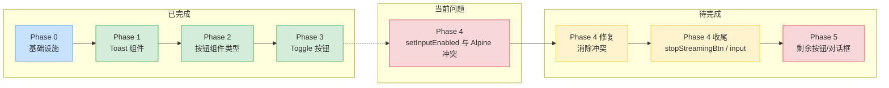
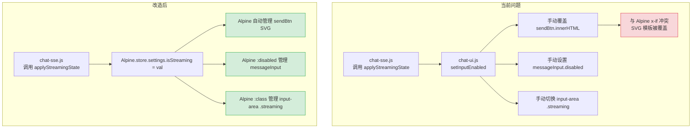
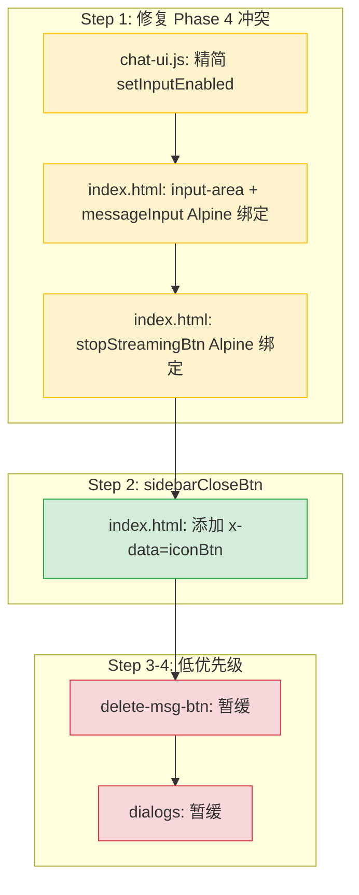

# Alpine.js 渐进式迁移 — 下一步执行计划

> 基于 `plans/alpinejs-progressive-migration-plan.md` 的分析和当前实现状态的评估

---

## 当前状态总览



### ✅ 已完成（Phase 0-3）

| Phase | 内容 | 状态 |
|-------|------|------|
| Phase 0 | Alpine.js CDN 加载、Store 注册（`settings`/`ui`）、组件函数全局注册 | ✅ |
| Phase 1 | Toast 系统：`Alpine.store('ui').showToast()` + x-for 模板 | ✅ |
| Phase 2 | 按钮组件类型层：`toggleBtn`、`sendBtn`、`textBtn`、`iconBtn`、`attachBtn` | ✅ **但非计划中原 `app-btn` 方案，改为 per-type 方案** |
| Phase 3 | Toggle 按钮：`deepThinkBtn` + `webSearchBtn` 使用 Alpine `toggleBtn` | ✅ |

### 🔶 需要修复（Phase 4 冲突）

**核心问题：`setInputEnabled()` 与 Alpine `x-if` 模板冲突**

[`chat-ui.js:92-109`](frontend/static/chat-ui.js:92-109) 中的 `setInputEnabled()` 函数直接覆写 `dom.sendBtn.innerHTML`，这覆盖了 Alpine 在 [`index.html:337-351`](frontend/index.html:337-351) 中通过 `x-if` 管理的 SVG 模板。Alpine 的响应式绑定与手动 DOM 操作产生冲突。

### ❌ 尚未完成

| 条目 | 文件位置 | 说明 |
|------|---------|------|
| `stopStreamingBtn` | [`index.html:299`](frontend/index.html:299) | 无 Alpine 绑定，纯手动 |
| `messageInput` | [`index.html:290`](frontend/index.html:290) | 无 `:disabled` Alpine 绑定 |
| `input-area` `.streaming` class | [`chat-ui.js:93-96`](frontend/static/chat-ui.js:93-96) | 仍手动 `classList.toggle()` |
| `sidebarCloseBtn` | [`index.html:203`](frontend/index.html:203) | 无 `x-data` Alpine 组件绑定 |
| `menu-toggle-btn` | [`chat.js:265-279`](frontend/static/chat.js:265-279) | JS 动态创建，无 Alpine |
| 删除按钮 `.delete-msg-btn` | [`chat-ui.js:265-270`](frontend/static/chat-ui.js:265-270) | 动态 DOM 创建，`disabled` 手动设置 |
| `msg-delete-dialog` | [`frontend/static/dialogs/msg-delete-dialog.js`](frontend/static/dialogs/msg-delete-dialog.js) | 手动 overlay 显隐 |
| `title-edit-dialog` | [`frontend/static/dialogs/title-edit-dialog.js`](frontend/static/dialogs/title-edit-dialog.js) | 手动 overlay 显隐 |
| `sticky-note` | [`frontend/static/components/sticky-note.js`](frontend/static/components/sticky-note.js) | 手动 DOM 创建/移除 |

---

## 下一步计划：按优先级排序

### 第 1 步：修复 Phase 4 冲突（最高优先级）

**目标**：消除 `setInputEnabled()` 中的手动 innerHTML 操作，让 Alpine 完全接管 sendBtn 的 SVG 渲染。



#### 1.1 修改 [`chat-ui.js`](frontend/static/chat-ui.js) — 精简 `setInputEnabled()`

将 `setInputEnabled()` 中所有涉及 `innerHTML` 的操作移除（这些已由 Alpine `x-if` 管理）。

**改动**：
- 删除 `dom.sendBtn.innerHTML = ...` 两行（line 99, 105）
- 删除 `dom.sendBtn.classList.remove/add('stop-btn')`（已由 Alpine `:class` 管理）
- 删除 `dom.sendBtn.dataset.tooltip = ...`（已由 Alpine `:data-tooltip` 管理）
- 保留 `dom.messageInput.disabled = !enabled`（暂时，后续步骤改为 Alpine 绑定）
- 保留 `dom.inputArea.classList.toggle('streaming')`（暂时，后续步骤改为 Alpine 绑定）

**精简后的 `setInputEnabled()`**：
```javascript
function setInputEnabled(enabled) {
    dom.messageInput.disabled = !enabled;
    if (dom.inputArea) {
        dom.inputArea.classList.toggle('streaming', !enabled);
    }
    // sendBtn 的 SVG/class/tooltip 已由 Alpine 通过 $store.settings.isStreaming 管理
}
```

#### 1.2 修改 [`index.html`](frontend/index.html) — 为 `messageInput` 和 `input-area` 添加 Alpine 绑定

```html
<!-- input-area 改造 -->
<footer class="input-area"
         x-data
         :class="{ streaming: $store.settings.isStreaming }">
    
    <!-- messageInput 改造 -->
    <textarea id="messageInput" class="message-input"
              :disabled="$store.settings.isStreaming"
              placeholder="想说点什么？"
              rows="1" autofocus></textarea>
    
    <!-- sendBtn 已正确绑定，无需修改 -->
</footer>
```

#### 1.3 修改 [`index.html`](frontend/index.html) — 为 `stopStreamingBtn` 添加 Alpine 绑定

```html
<!-- 折叠状态下的中断按钮 -->
<button id="stopStreamingBtn" class="stop-streaming-btn" 
        x-data
        :disabled="!$store.settings.isStreaming"
        data-tooltip="停止生成">
    <svg viewBox="0 0 24 24" width="16" height="16" fill="currentColor">
        <rect x="6" y="6" width="12" height="12" rx="2"/>
    </svg>
</button>
```

**改动范围**：

| 文件 | 改动 | 风险 |
|------|------|------|
| [`frontend/static/chat-ui.js`](frontend/static/chat-ui.js:92-109) | 删除 6 行 innerHTML/classList 操作 | ⭐ 低 |
| [`frontend/index.html`](frontend/index.html:281-303) | 为 input-area + messageInput + stopStreamingBtn 加 Alpine 绑定 | ⭐ 低 |

**验证方式**：
1. 发送消息 → 观察 sendBtn 图标从纸飞机变为停止方块 ✅
2. 流式结束时 → 观察 sendBtn 图标从停止方块变回纸飞机 ✅
3. 流式中 `messageInput` 为 `disabled` 灰色状态 ✅
4. 流式中 `stopStreamingBtn` 可点击（红色）✅
5. 非流式中 `stopStreamingBtn` 为 `disabled` 灰色 ✅
6. 折叠状态下 `stopStreamingBtn` 始终可见 ✅

---

### 第 2 步：`sidebarCloseBtn` Alpine 化

**当前状态**：[`index.html:203-208`](frontend/index.html:203-208) — `sidebarCloseBtn` 使用 `icon-btn` CSS 类但无 Alpine `x-data` 绑定。

**改造**：添加 `x-data="iconBtn()"`，保持现有样式不变。

```html
<button class="icon-btn icon-btn--normal sidebar-close-btn" id="sidebarCloseBtn"
        x-data="iconBtn()"
        aria-label="关闭侧栏"
        data-tooltip="关闭侧栏">
    <svg viewBox="0 0 16 16" width="16" height="16" ...>
        <line x1="3" y1="3" x2="13" y2="13"/>
        <line x1="13" y1="3" x2="3" y2="13"/>
    </svg>
</button>
```

**注意**：`sidebarCloseBtn` 的点击事件在 [`chat.js:536-544`](frontend/static/chat.js:536-544) 通过 `addEventListener` 绑定，**Alpine 仅处理组件数据层，不接管点击逻辑**。这是符合[原计划](plans/alpinejs-progressive-migration-plan.md)中"不破坏现有 API"原则的。

| 文件 | 改动 | 风险 |
|------|------|------|
| [`frontend/index.html`](frontend/index.html:203) | 添加 `x-data="iconBtn()"` | ⭐ 极低 |

---

### 第 3 步：`delete-msg-btn` Alpine 化（中等优先级）

**当前状态**：删除按钮在 [`chat-ui.js:264-270`](frontend/static/chat-ui.js:264-270) 的 `addMessage()` 中动态创建，`disabled` 状态通过 [`updateDeleteButtons()`](frontend/static/chat-ui.js:114-119) 在 `applyStreamingState()` 中手动设置。

**改造方案**：利用 Alpine store 的响应式特性，在动态创建时直接绑定 `$store.settings.isStreaming`。

由于删除按钮是 JS 动态创建的 DOM 元素，无法在 HTML 模板中使用 `x-data`。方案：
- 在创建按钮时使用 `Alpine.bind()` API（如果 Alpine 版本支持），或
- 在动态创建后，通过 Alpine 的数据绑定手动管理 `disabled` 状态

**备选方案（更简单）**：保留 `updateDeleteButtons()` 的手动更新，因为：
- 删除按钮数量少（通常 1-5 个）
- `updateDeleteButtons()` 只做 `querySelectorAll + forEach` 遍历，性能开销极小
- 改动收益低

**决定**：此步暂缓，作为 Phase 5 低优先级项。

---

### 第 4 步：对话框 Alpine 化（低优先级）

**候选**：
- [`msg-delete-dialog.js`](frontend/static/dialogs/msg-delete-dialog.js)
- [`title-edit-dialog.js`](frontend/static/dialogs/title-edit-dialog.js)

**Alpine 价值**：`x-show` 简化 overlay 显隐逻辑，`x-model` 简化标题编辑输入。

**复杂度**：中。对话框涉及 Promise、事件委托、动画过渡，迁移需谨慎。

**决定**：此步暂缓，作为低优先级项。

---

## 执行路线图



| 步骤 | 优先级 | 内容 | 风险 | 预估改动文件数 |
|------|--------|------|------|-------------|
| **Step 1** | 🔴 **最高** | 修复 `setInputEnabled()` 与 Alpine 的冲突 + Alpine 化 `stopStreamingBtn`/`messageInput`/`input-area` | ⭐⭐ | 2 |
| **Step 2** | 🟡 中 | `sidebarCloseBtn` 添加 Alpine 绑定 | ⭐ | 1 |
| **Step 3** | 🟢 低 | `delete-msg-btn` Alpine 化（暂缓） | ⭐ | 1 |
| **Step 4** | 🟢 低 | 对话框 Alpine 化（暂缓） | ⭐⭐⭐ | 2-3 |

---

## 验证清单

### Step 1 验证项

| # | 验证场景 | 预期结果 |
|---|---------|---------|
| 1 | 正常发送消息 | sendBtn 显示纸飞机 SVG，点击发送 |
| 2 | 流式输出开始 | sendBtn 自动变为红色停止方块，messageInput disabled |
| 3 | 流式输出停止 | sendBtn 恢复纸飞机，messageInput 可编辑 |
| 4 | 流式中点击停止 | 生成中断，按钮恢复发送态 |
| 5 | 折叠状态下流式 | stopStreamingBtn 红色可点击 |
| 6 | 折叠状态下非流式 | stopStreamingBtn 灰色 disabled |
| 7 | Alpine 降级（禁用 JS 中 Alpine） | 所有按钮回到原生 JS 行为，功能正常 |

### Step 2 验证项

| # | 验证场景 | 预期结果 |
|---|---------|---------|
| 1 | 宽屏点击 sidebarCloseBtn | 左栏关闭 |
| 2 | 小屏点击 sidebarCloseBtn | 抽屉关闭 |
| 3 | iconBtn 组件初始化正常 | 无控制台错误 |

---

## 风险与注意事项

1. **`setInputEnabled()` 精简后必须确保 `sendBtn.disabled` 不被错误修改** — 当前 `setInputEnabled()` 中 `dom.sendBtn.disabled = false` 应保留，因为 sendBtn 始终可点击（流式时变为停止按钮）

2. **`messageInput` 的 Alpine `:disabled` 绑定** — 当 Alpine 加载时由 Alpine 管理；Alpine 未加载时，`applyStreamingState()` 中的 `setInputEnabled()` 仍然会处理，这是兼容层

3. **`input-area` 的 `.streaming` class** — 同时被 Alpine `:class` 和 `collapseInputArea()` / `restoreInputArea()` 管理。需确认两者不会冲突：
   - Alpine 管理 `isStreaming` → `.streaming` class
   - `collapseInputArea()` / `restoreInputArea()` 管理 `.collapsed` class
   - 两者互不干扰 ✅
