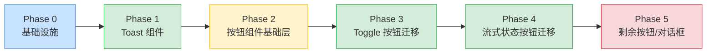
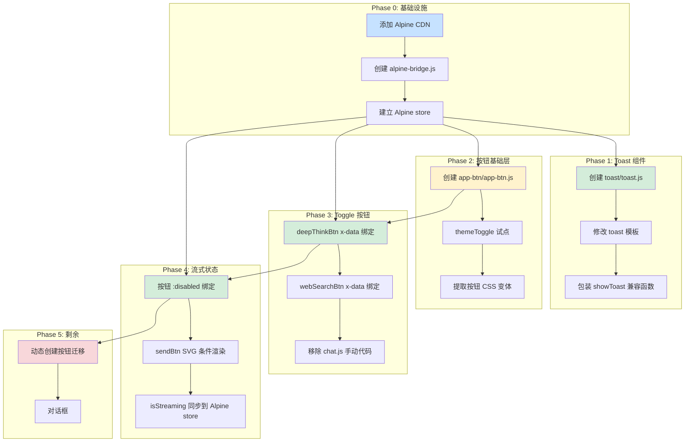

# Alpine.js 渐进式引入计划

> **核心理念**：渐进式（Progressive）、从最简单的修改做起、每步独立可验证、可随时中止

---

## 组件目录结构约定

每个 Alpine.js 组件独立成子目录，挂载到 [`frontend/static/components/`](frontend/static/components/) 下：

```
frontend/static/components/
├── toast/              ← Phase 1: Toast 组件
│   ├── toast.js        ← Alpine 组件定义 + showToast 导出
│   ├── toast.css       ← Toast 样式（从 components/toast.css 迁移过来）
│   └── README.md       ← 组件说明
├── toggle-btn/         ← Phase 2: Toggle 按钮组件
│   ├── toggle-btn.js   ← Alpine 组件定义（deepThink/webSearch）
│   └── toggle-btn.css  ← 按钮样式（从 input.css 提取相关部分）
├── streaming-state/    ← Phase 3: 流式状态绑定组件
│   ├── streaming-state.js
│   └── README.md
├── tooltip/            ← 保留现有 tooltip（非 Alpine）
│   ├── tooltip.js
│   └── tooltip.css
└── ...（其他现有组件保持不动）
```

### 组件目录规范

| 约定 | 说明 |
|------|------|
| 目录名 | 使用 `kebab-case`，如 `toggle-btn` |
| 主 JS | 与目录同名，如 `toast/toast.js` |
| CSS | 同名 CSS 文件，如 `toast/toast.css`（可选，如组件需要独立样式） |
| README.md | 可选，复杂组件可加说明 |
| HTML 引用 | 在 `index.html` 中通过 `<script type="module">` 或 Alpine `x-data` 引入 |

---

## 项目按钮类型全景

在计划之前，先全面盘点项目中所有按钮及其状态维度，避免遗漏：

| # | 按钮 | 所在位置 | 形态 | 状态维度 | 创建方式 |
|---|------|---------|------|---------|---------|
| 1 | `themeToggle` | header | 图标（🌙/☀️ 互换） | 主题切换 | HTML 静态 |
| 2 | `newChatBtn` | header | 图标+文字 | `disabled`（流式中） | HTML 静态 |
| 3 | `aiTitleBtn` | header | 图标 | `disabled` + 5s debounce | HTML 静态 |
| 4 | `loginBtn` | header | 文字 | `disabled`（流式中） | HTML 静态 |
| 5 | `sendBtn` | input-footer | 图标（发送↔停止方块） | 流式中切换图标/样式 | HTML 静态 |
| 6 | `stopStreamingBtn` | input-wrapper | 图标 | `disabled`（非流式中） | HTML 静态 |
| 7 | `deepThinkBtn` | input-footer | 图标+文字 | `data-active` toggle + 持久化 | HTML 静态 |
| 8 | `webSearchBtn` | input-footer | 图标+文字 | `data-active` toggle + 持久化 | HTML 静态 |
| 9 | `attachBtn` | input-footer | 图标 | 无状态（纯触发） | HTML 静态 |
| 10 | `sidebarCloseBtn` | sidebar-header | 图标 | 无状态 | HTML 静态 |
| 11 | `menu-toggle-btn` | header | 图标 | 宽屏/小屏两套行为 | JS 动态创建 |
| 12 | `newChatBtn`（侧栏） | sidebar-header | 图标+文字 | `disabled`（流式中） | JS 动态创建 |

**关键结论**：按钮不是一个简单的"toggle vs 常规"二分，而是一组共享共性（disabled、尺寸、图标/文字布局）但有各自特殊行为（SVG 互换、debounce、responsive）的 UI 元素。

---

## 阶段性路线图总览



---

## Phase 0 — 基础设施（Foundation）

**目标**：引入 Alpine.js 并建立与现有架构的兼容层，**不改变任何现有行为**。

### 改动清单

#### 0.1 在 [`index.html`](frontend/index.html) 中添加 Alpine.js

在 `<head>` 中添加 Alpine.js CDN 加载，**使用 `defer` 属性确保不阻塞渲染**：

```html
<!-- Alpine.js — 渐进式响应式框架 -->
<script defer src="https://cdn.jsdelivr.net/npm/alpinejs@3.14.8/dist/cdn.min.js"
        onerror="console.warn('Alpine.js CDN 加载失败，降级为原生 JS 模式')"></script>
```

**为什么不下载到本地？**
- CDN 版本自动获得 bug 修复，本地维护需要手动更新
- 项目已有 CDN 依赖（KaTeX），CDN 是既有模式
- `onerror` 回调提供降级保护，CDN 不可用时项目仍可正常运行

#### 0.2 创建 [`alpine-bridge.js`](frontend/static/alpine-bridge.js) — 兼容桥接层

这是整个渐进式改造的**关键文件**，职责：

1. **初始化 Alpine store**，将现有的 [`UserSettings`](frontend/static/chat-state.js:31) 状态映射到 Alpine 响应式 store
2. **提供降级方案**：如果 Alpine 未加载，所有 `Alpine.store()` 调用静默失败
3. **导出辅助函数**，供现有原生 JS 模块逐步迁移

```javascript
// alpine-bridge.js — Alpine.js 兼容桥接层
// 提供 Alpine store 初始化 + 降级保护

export const AlpineReady = typeof window.Alpine !== 'undefined';

// ----- Alpine Store 定义（仅 Alpine 加载时生效） -----
if (AlpineReady) {
    document.addEventListener('alpine:init', () => {
        Alpine.store('settings', {
            // 与 UserSettings 同步的属性
            deepThink: UserSettings.deepThink,
            webSearch: UserSettings.webSearch,
            sendMode: UserSettings.sendMode,
            theme: UserSettings.theme,

            // 流式状态（由 chat-session-manager 驱动）
            isStreaming: false,

            // 同步到 UserSettings（持久化到 localStorage）
            toggleDeepThink() {
                this.deepThink = !this.deepThink;
                UserSettings.deepThink = this.deepThink;
                UserSettings.save();
            },
            toggleWebSearch() {
                this.webSearch = !this.webSearch;
                UserSettings.webSearch = this.webSearch;
                UserSettings.save();
            },
            setTheme(val) {
                this.theme = val;
                UserSettings.theme = val;
                UserSettings.save();
            },
        });

        Alpine.store('ui', {
            toasts: [],      // Toast 消息列表
            showToast(msg, type, duration) { /* ... */ },
        });
    });
}
```

#### 0.3 在 [`chat.js`](frontend/static/chat.js) 中引入桥接层

```javascript
// 在文件顶部添加
import './alpine-bridge.js';
```

### 风险控制

| 风险 | 缓解措施 |
|------|---------|
| Alpine CDN 加载失败 | `onerror` 降级 + JS 中 `AlpineReady` 守卫 |
| Alpine 版本升级破坏性变更 | 锁定版本号 `@3.14.8` |
| 与现有代码冲突 | 桥接层是"只读"的，不修改现有代码 |

---

## Phase 1 — Toast 系统改造（Simplest Win）

**目标**：将 [`showToast()`](frontend/static/chat-ui.js:170) 从手动 DOM 操作改为 Alpine 响应式管理。

### 现状

```javascript
// chat-ui.js:170-195 — 当前 Toast 实现
export function showToast(message, type, duration) {
    const toast = document.createElement('div');
    toast.className = 'toast toast-' + type;
    toast.textContent = message;
    dom.toastContainer.appendChild(toast);
    requestAnimationFrame(() => toast.classList.add('show'));
    setTimeout(() => {
        toast.classList.remove('show');
        setTimeout(() => { if (toast.parentNode) toast.parentNode.removeChild(toast); }, 300);
    }, duration);
}
```

问题：手动创建 DOM、手动管理动画类、手动移除。代码分散在多个文件中调用。

### 改造方案

#### 1.1 在 [`index.html`](frontend/index.html) 中添加 Alpine Toast 组件

将现有的 `<div class="toast-container" id="toastContainer">` 替换为：

```html
<div class="toast-container" id="toastContainer"
     x-data="toastManager()"
     @toast-show.window="addToast($event.detail)">
    <template x-for="toast in toasts" :key="toast.id">
        <div class="toast"
             :class="'toast-' + toast.type"
             x-text="toast.message"
             x-show="toast.visible"
             x-transition:enter-start="opacity-0 translate-x-5"
             x-transition:leave-end="opacity-0 translate-x-5">
        </div>
    </template>
</div>
```

#### 1.2 创建组件文件 [`toast/toast.js`](frontend/static/components/toast/toast.js) + [`toast/toast.css`](frontend/static/components/toast/toast.css)

组件目录结构：
```
frontend/static/components/toast/
├── toast.js     ← Alpine 组件定义 + 导出示函数
└── toast.css    ← Toast 样式（从 components/toast.css 迁移过来）
```

```javascript
// frontend/static/components/toast/toast.js — Alpine Toast 组件
// 替代 chat-ui.js 中的 showToast()

export function toastManager() {
    return {
        toasts: [],
        _nextId: 0,

        addToast({ message, type = 'error', duration = 4000 }) {
            const id = ++this._nextId;
            const toast = { id, message, type, visible: false };

            this.toasts.push(toast);
            // 下一帧触发进入动画
            this.$nextTick(() => { toast.visible = true; });

            // 自动移除
            setTimeout(() => {
                toast.visible = false;
                setTimeout(() => {
                    this.toasts = this.toasts.filter(t => t.id !== id);
                }, 300);
            }, duration);
        },
    };
}
```

#### 1.3 封装兼容函数

保持 `showToast()` 函数签名不变，内部通过 CustomEvent 触发 Alpine 组件：

```javascript
// chat-ui.js — 修改 showToast
export function showToast(message, type = 'error', duration = 4000) {
    if (window.Alpine) {
        window.dispatchEvent(new CustomEvent('toast-show', {
            detail: { message, type, duration }
        }));
    } else {
        // 降级：使用原有的原生 JS 实现
        legacyShowToast(message, type, duration);
    }
}
```

### 改动范围

| 文件 | 改动类型 | 风险 |
|------|---------|------|
| [`frontend/index.html`](frontend/index.html) | 修改 toast-container 模板 | 低 |
| [`frontend/static/components/toast/toast.js`](frontend/static/components/toast/toast.js) | **新建** | - |
| [`frontend/static/components/toast/toast.css`](frontend/static/components/toast/toast.css) | **新建**（从原 toast.css 迁移） | 低 |
| [`frontend/static/chat-ui.js`](frontend/static/chat-ui.js:170) | 修改 showToast 函数 | 低 |
| 原 [`frontend/static/components/toast.css`](frontend/static/components/toast.css) | 删除（已迁移到子目录） | 低 |

**风险等级**：⭐⭐（低）
**独立可验证**：✅ 运行应用，触发任意 toast（错误/成功/信息），观察动画效果

---

## Phase 2 — 按钮组件基础层（Button Component Foundation）

**目标**：创建统一的 Alpine 按钮组件抽象层，覆盖所有按钮的共性行为（disabled、尺寸变体、图标/文字布局、responsive），为后续各按钮迁移提供基础。

### 为什么先做基础层？

回顾[项目按钮全景](#项目按钮类型全景)，12 个按钮共享以下共性：

| 共性维度 | 当前做法 | 问题 |
|---------|---------|------|
| `disabled` 状态 | 每个按钮在 chat-ui.js 中通过 `document.getElementById` 逐个设置 | 散落在 `applyStreamingState()` 等函数中 |
| 图标/文字布局 | 每个按钮硬编码 SVG + span | 无统一模板 |
| 尺寸变体 | CSS 类名不统一（`.small-icon-btn`、`.toggle-btn`、`.send-btn` 等） | 无系统化的尺寸体系 |
| `data-tooltip` | 每个按钮单独写死 | 可与 disabled 联动（禁用时显示不同提示） |

### 方案

#### 2.1 创建 [`app-btn/app-btn.js`](frontend/static/components/app-btn/app-btn.js)

```
frontend/static/components/app-btn/
├── app-btn.js       ← Alpine 组件：统一的按钮行为抽象
└── app-btn.css      ← 按钮基础样式（从 input.css、layout.css 提取重组）
```

**核心设计** — Alpine `x-data` 组件函数，为按钮提供标准化行为：

```javascript
// frontend/static/components/app-btn/app-btn.js
// 统一按钮组件 — 处理 disabled、tooltip、状态同步等共性逻辑

export function appBtn() {
    return {
        // 从 Alpine store 自动同步 disabled 状态
        get isDisabled() {
            return this.$store.settings.isStreaming && this.disableWhenStreaming;
        },
        // tooltip 可随状态变化
        get computedTooltip() {
            return this.isDisabled ? (this.disabledTooltip || this.tooltip) : this.tooltip;
        },
    };
}
```

**不定义 HTML 模板** — 按钮形态差异太大（有的图标+文字、有的纯图标、有的纯文字），Alpine `x-teleport` 不适合。改为：

- 每个按钮在 HTML 中保留自己的内容（SVG + 文字）
- 通过 `x-data="appBtn()"` 注入共性的行为逻辑
- 通过参数属性（`disable-when-streaming`、`tooltip`、`disabled-tooltip` 等）配置差异化行为

```html
<!-- 使用示例 -->
<button id="newChatBtn" class="small-icon-btn"
        x-data="appBtn()"
        :disabled="isDisabled"
        :data-tooltip="computedTooltip"
        disable-when-streaming>
    <svg>...</svg>
    <span>新对话</span>
</button>
```

#### 2.2 创建 [`app-btn/app-btn.css`](frontend/static/components/app-btn/app-btn.css)

从现有 [`input.css`](frontend/static/input.css)、[`layout.css`](frontend/static/layout.css) 中提取按钮相关样式，重新组织为**变体驱动的 CSS**：

```css
/* 按钮尺寸变体 */
.app-btn-icon-only { /* 正方形图标按钮，如 sidebarCloseBtn、attachBtn */ }
.app-btn-with-text { /* 图标+文字按钮，如 deepThinkBtn、newChatBtn */ }
.app-btn-text-only { /* 纯文字按钮，如 loginBtn */ }

/* 按钮状态 */
.app-btn:disabled { /* 统一禁用样式 */ }
.app-btn[data-active="true"] { /* toggle 选中态 */ }

/* 响应式：窄屏下隐藏文字，仅显示图标 */
@media (max-width: 480px) {
    .app-btn-with-text .btn-label { display: none; }
}
```

#### 2.3 选择 1 个按钮作为试点 — [`themeToggle`](frontend/index.html:112)

选择理由：
- **最简单的按钮**：只有图标互换（🌙/☀️），无 disabled 逻辑
- **验证核心机制**：Alpine `x-on:click` + SVG 条件渲染 + store 同步
- **风险极低**：即使 Alpine 出问题，主题切换不影响核心聊天功能

```html
<!-- themeToggle 改造后 — 作为试点 -->
<button id="themeToggle" class="small-icon-btn app-btn-icon-only"
        x-data="appBtn()"
        @click="$store.settings.toggleTheme()"
        :data-tooltip="$store.settings.theme === 1 ? '切换到亮色主题' : '切换到暗色主题'">
    <template x-if="$store.settings.theme === 1">
        <svg class="theme-icon" viewBox="0 0 24 24" ...>${ICON_MOON}</svg>
    </template>
    <template x-if="$store.settings.theme !== 1">
        <svg class="theme-icon" viewBox="0 0 24 24" ...>${ICON_SUN}</svg>
    </template>
</button>
```

### 改动范围

| 文件 | 改动类型 | 风险 |
|------|---------|------|
| [`frontend/static/components/app-btn/app-btn.js`](frontend/static/components/app-btn/app-btn.js) | **新建** | - |
| [`frontend/static/components/app-btn/app-btn.css`](frontend/static/components/app-btn/app-btn.css) | **新建** | - |
| [`frontend/index.html`](frontend/index.html) | themeToggle 加 Alpine 绑定 | 低 |
| [`frontend/static/alpine-bridge.js`](frontend/static/alpine-bridge.js) | 新增 `toggleTheme()` | 低 |
| [`frontend/static/chat.js`](frontend/static/chat.js:108) | 移除 themeToggle 手动绑定 | 低 |

**风险等级**：⭐⭐（低）— 试点按钮独立，不影响其他逻辑

**独立可验证**：✅ 点击主题切换按钮，主题切换正常，SVG 图标正确互换

---

## Phase 3 — Toggle 按钮迁移（Toggle Btns）

**目标**：将 [`deepThinkBtn`](frontend/index.html:159)、[`webSearchBtn`](frontend/index.html:165) 从手动 JS 改为使用 `app-btn` 组件 + Alpine store。

### 现状

```javascript
// chat.js:64-89 — 当前的按钮处理代码
function toggleButton(btn, active) {
    btn.dataset.active = active ? 'true' : 'false';
}
deepThinkBtn.addEventListener('click', () => {
    state.deepThinkActive = !state.deepThinkActive;
    toggleButton(deepThinkBtn, state.deepThinkActive);
    UserSettings.deepThink = state.deepThinkActive;
    UserSettings.save();
});
```

### 改造方案

#### 3.1 在 [`index.html`](frontend/index.html) 中添加 Alpine 绑定

```html
<!-- 深度思考按钮 — 使用 app-btn 组件 -->
<button id="deepThinkBtn" class="toggle-btn app-btn-with-text"
        x-data="appBtn()"
        :data-active="$store.settings.deepThink ? 'true' : 'false'"
        @click="$store.settings.toggleDeepThink()"
        :data-tooltip="$store.settings.deepThink ? '已开启思考过程' : '已关闭思考过程'">
    <svg class="toggle-icon" viewBox="0 0 86 89" ...>
        <use href="/static/img/deep-think.svg#brain-path"/>
    </svg>
    <span>深度思考</span>
</button>

<!-- 智能搜索按钮 — 使用 app-btn 组件 -->
<button id="webSearchBtn" class="toggle-btn app-btn-with-text"
        x-data="appBtn()"
        :data-active="$store.settings.webSearch ? 'true' : 'false'"
        @click="$store.settings.toggleWebSearch()"
        :data-tooltip="$store.settings.webSearch ? 'AI 将自动搜索互联网' : '已关闭联网搜索'">
    <svg class="toggle-icon" viewBox="0 0 24 24" ...>
        ...
    </svg>
    <span>智能搜索</span>
</button>
```

#### 3.2 移除旧代码 + 初始化同步

在 [`chat.js`](frontend/static/chat.js:56) 中移除手动绑定和 `toggleButton` 函数，保持初始化同步：

```javascript
// 在 UserSettings.load() 之后
if (window.Alpine) {
    Alpine.store('settings').deepThink = UserSettings.deepThink;
    Alpine.store('settings').webSearch = UserSettings.webSearch;
}
```

### 改动范围

| 文件 | 改动类型 | 风险 |
|------|---------|------|
| [`frontend/index.html`](frontend/index.html) | 为 2 个 toggle 按钮加 Alpine 绑定 | 低 |
| [`frontend/static/chat.js`](frontend/static/chat.js:56) | 移除手动绑定代码 | 低 |
| [`frontend/static/alpine-bridge.js`](frontend/static/alpine-bridge.js) | store 已有 `toggleDeepThink`/`toggleWebSearch` | - |

**风险等级**：⭐（极低）— 点击行为不变

---

## Phase 4 — 流式状态按钮迁移（Streaming State Btns）

**目标**：将流式输出中需要禁用/恢复的按钮（`sendBtn`/`stopStreamingBtn`/`aiTitleBtn`/`loginBtn`/`newChatBtn`/删除按钮）从手动 DOM 操作改为 Alpine `:disabled` 绑定。

### 现状

```javascript
// chat-ui.js:138-162 — 每次流式状态变化需要手动更新 DOM
export function applyStreamingState(isStreaming) {
    setInputEnabled(!isStreaming);
    document.getElementById('stopStreamingBtn').disabled = !isStreaming;
    document.getElementById('aiTitleBtn').disabled = isStreaming;
    document.getElementById('loginBtn').disabled = isStreaming;
    document.getElementById('newChatBtn').disabled = isStreaming;
    updateDeleteButtons();  // 遍历 DOM 更新每个删除按钮
}
```

### 改造方案

#### 4.1 在 [`index.html`](frontend/index.html) 中为按钮添加 Alpine 绑定

这些按钮使用 Phase 2 创建的 `app-btn` 组件，只需加 `x-data` + `:disabled`：

```html
<!-- 新对话按钮 -->
<button id="newChatBtn" class="new-chat-btn app-btn-with-text"
        x-data="appBtn()"
        :disabled="$store.settings.isStreaming"
        :data-tooltip="$store.settings.isStreaming ? '流式输出中，请等待' : '开启新对话'"
        disable-when-streaming>
    <svg>...</svg>
    <span>新对话</span>
</button>

<!-- AI 标题按钮 -->
<button class="small-icon-btn ai-title-btn app-btn-icon-only" id="aiTitleBtn"
        x-data="appBtn()"
        :disabled="$store.settings.isStreaming"
        disable-when-streaming>
</button>

<!-- 登录按钮 -->
<button id="loginBtn" class="header-login-btn app-btn-text-only"
        x-data="appBtn()"
        :disabled="$store.settings.isStreaming"
        disable-when-streaming>登录</button>
```

#### 4.2 同步 isStreaming 到 Alpine store

在 [`chat-session-manager.js`](frontend/static/chat-session-manager.js) 的 `isStreaming` setter 中同步：

```javascript
set isStreaming(val) {
    this._isStreaming = val;
    if (window.Alpine) {
        Alpine.store('settings').isStreaming = val;
    }
    // 保留 applyStreamingState 作为兼容层，逐步过渡
    applyStreamingState(val);
}
```

#### 4.3 发送按钮的 SVG 互换

`sendBtn` 需要根据 `isStreaming` 切换 发送/停止 两种 SVG 图标，同时切换 `.stop-btn` class：

```html
<button id="sendBtn" class="send-btn app-btn-icon-only"
        x-data="appBtn()"
        :class="{ 'stop-btn': $store.settings.isStreaming }"
        :data-tooltip="$store.settings.isStreaming ? '停止生成' : '发送'"
        @click="$store.settings.isStreaming ? stopStreaming() : sendMessage()">
    <template x-if="!$store.settings.isStreaming">
        <svg viewBox="0 0 24 24" width="20" height="20">
            <path d="M2.01 21L23 12 2.01 3 2 10l15 2-15 2z" fill="currentColor"/>
        </svg>
    </template>
    <template x-if="$store.settings.isStreaming">
        <svg viewBox="0 0 24 24" width="18" height="18" fill="currentColor">
            <rect x="6" y="6" width="12" height="12" rx="2"/>
        </svg>
    </template>
</button>
```

> **注意**：`stopStreaming()` 和 `sendMessage()` 是现有的全局函数，保持签名不变。

### 改动范围

| 文件 | 改动类型 | 风险 |
|------|---------|------|
| [`frontend/index.html`](frontend/index.html) | 为 5 个按钮 + input-area 加 Alpine 绑定 | 中 |
| [`frontend/static/components/streaming-state/streaming-state.js`](frontend/static/components/streaming-state/streaming-state.js) | **新建**（可选，复杂逻辑可封装） | - |
| [`frontend/static/chat-session-manager.js`](frontend/static/chat-session-manager.js) | isStreaming setter 同步到 Alpine store | 低 |
| [`frontend/static/chat-ui.js`](frontend/static/chat-ui.js:138) | 简化 `applyStreamingState()` | 低 |

**风险等级**：⭐⭐⭐（中）
**关键注意**：`sendBtn` 的 SVG 互换和点击事件路由是本阶段最复杂的部分

---

## Phase 5 — 剩余按钮 + 对话框（Lower Priority）

**目标**：迁移剩余按钮（动态创建的、侧栏按钮）和对话框组件。

### 候选清单

| 按钮 | 特殊之处 | 优先级 |
|------|---------|--------|
| `menu-toggle-btn` | JS 动态创建（`getToggleButton()`），需改为 Alpine 渲染 | P5 |
| `sidebarCloseBtn` | 简单图标按钮，可直接用 `app-btn` | P5 |
| 删除按钮（`.delete-msg-btn`） | DOM 中动态创建，每个消息组一个 | P5 |
| [`msg-delete-dialog.js`](frontend/static/dialogs/msg-delete-dialog.js) | 对话框显隐管理 | P5 |
| [`title-edit-dialog.js`](frontend/static/dialogs/title-edit-dialog.js) | 对话框 + `x-model` 编辑输入 | P5 |

### 说明

此阶段优先级最低，建议在 Phase 1-4 稳定运行一段时间后再考虑。动态创建的按钮（`menu-toggle-btn`、删除按钮）需要 Alpine 的 `x-teleport` 或 Alpine 组件工厂模式来处理，涉及现有 JS 创建逻辑的重构，复杂度较高。

**目标**：将 [`applyStreamingState()`](frontend/static/chat-ui.js:138) 中通过 `document.getElementById()` 手动设置 6+ 个 DOM 元素的 `disabled` 状态，改为 Alpine 响应式绑定。

### 现状

```javascript
// chat-ui.js:138-162 — 每次流式状态变化需要手动更新 DOM
export function applyStreamingState(isStreaming) {
    setInputEnabled(!isStreaming);
    document.getElementById('stopStreamingBtn').disabled = !isStreaming;
    document.getElementById('aiTitleBtn').disabled = isStreaming;
    document.getElementById('loginBtn').disabled = isStreaming;
    document.getElementById('newChatBtn').disabled = isStreaming;
    updateDeleteButtons();  // 遍历 DOM 更新每个删除按钮
}
```

每次 `isStreaming` 变化时，需要手动查询 DOM 并逐个更新属性。

### 改造方案

#### 3.1 创建组件文件 [`streaming-state/streaming-state.js`](frontend/static/components/streaming-state/streaming-state.js)

```
frontend/static/components/streaming-state/
├── streaming-state.js    ← Alpine 组件：管理流式状态的 UI 绑定
└── README.md             ← 组件说明
```

这个组件主要提供 `x-data` 数据对象，在 HTML 中通过 `$store.settings.isStreaming` 绑定禁用状态。组件本身不需要额外的 CSS。

#### 3.2 在 [`index.html`](frontend/index.html) 中为每个元素添加 `:disabled` 绑定

```html
<!-- 停止按钮（折叠模式） -->
<button id="stopStreamingBtn" class="stop-streaming-btn"
        :disabled="!$store.settings.isStreaming"
        data-tooltip="停止生成">
</button>

<!-- AI 标题按钮 -->
<button class="small-icon-btn ai-title-btn" id="aiTitleBtn"
        :disabled="$store.settings.isStreaming"
        data-tooltip="让 AI 重新生成标题">
</button>

<!-- 登录按钮 -->
<button id="loginBtn" class="header-login-btn"
        :disabled="$store.settings.isStreaming"
        data-tooltip="登录">登录</button>

<!-- 新对话按钮 -->
<button id="newChatBtn" class="new-chat-btn"
        :disabled="$store.settings.isStreaming"
        data-tooltip="开启新对话">
</button>
```

#### 3.3 在 [`chat-session-manager.js`](frontend/static/chat-session-manager.js) 中同步 isStreaming 到 Alpine store

在 `isStreaming` setter 中同步到 Alpine store：

```javascript
// chat-session-manager.js — 在 isStreaming 变化时同步
set isStreaming(val) {
    this._isStreaming = val;
    if (window.Alpine) {
        Alpine.store('settings').isStreaming = val;
    }
    applyStreamingState(val);  // 保留现有函数作为兼容层，逐步过渡
}
```

#### 3.4 输入框和发送按钮的改造（稍复杂）

输入框 `disabled`、发送按钮图标切换（发送 ↔ 停止）、`input-area` 的 `.streaming` class 切换，这些可以放在一个 Alpine 容器中统一管理：

```html
<footer class="input-area" id="inputArea"
        x-data
        :class="{ streaming: $store.settings.isStreaming }">
    <textarea id="messageInput" class="message-input"
              :disabled="$store.settings.isStreaming"
              ...></textarea>
    <button id="sendBtn" class="send-btn"
            :disabled="false"
            :class="{ 'stop-btn': $store.settings.isStreaming }"
            :data-tooltip="$store.settings.isStreaming ? '停止生成' : '发送'">
        <template x-if="!$store.settings.isStreaming">
            <svg viewBox="0 0 24 24" width="20" height="20">
                <path d="M2.01 21L23 12 2.01 3 2 10l15 2-15 2z" fill="currentColor"/>
            </svg>
        </template>
        <template x-if="$store.settings.isStreaming">
            <svg viewBox="0 0 24 24" width="18" height="18" fill="currentColor">
                <rect x="6" y="6" width="12" height="12" rx="2"/>
            </svg>
        </template>
    </button>
</footer>
```

### 改动范围

| 文件 | 改动类型 | 风险 |
|------|---------|------|
| [`frontend/index.html`](frontend/index.html) | 为 5+ 个元素添加 Alpine 绑定 | 中 |
| [`frontend/static/components/streaming-state/streaming-state.js`](frontend/static/components/streaming-state/streaming-state.js) | **新建** | - |
| [`frontend/static/chat-session-manager.js`](frontend/static/chat-session-manager.js) | 在 isStreaming 变化时同步到 Alpine store | 低 |
| [`frontend/static/chat-ui.js`](frontend/static/chat-ui.js:138) | 简化 `applyStreamingState()`，逐步废弃 | 低 |
| [`frontend/static/chat.js`](frontend/static/chat.js) | 可能需要调整初始化顺序 | 低 |

**风险等级**：⭐⭐⭐（中）
**关键注意**：`sendBtn` 的图标切换逻辑（SVG 互换）需要 Alpine 的 `x-if` 或 `x-html` 处理，这是本阶段最复杂的部分。

---

## Phase 4 — 对话框/更多组件（Optional, Future）

**目标**：在 Phase 1-3 稳定运行后，考虑将更多 UI 组件迁移到 Alpine。

### 候选组件

| 组件 | 当前实现 | Alpine 价值 | 优先级 |
|------|---------|------------|--------|
| [`msg-delete-dialog.js`](frontend/static/dialogs/msg-delete-dialog.js) | 手动管理 overlay 显隐 | `x-show` 简化显隐逻辑 | P4 |
| [`title-edit-dialog.js`](frontend/static/dialogs/title-edit-dialog.js) | 同上 | `x-show` + `x-model` | P4 |
| [`sticky-note.js`](frontend/static/components/sticky-note.js) | 手动创建/移除 DOM | `x-for` 渲染列表 | P5 |
| [`tooltip.js`](frontend/static/components/tooltip.js) | 自定义 tooltip | Alpine 无原生 tooltip，保留 | - |

---

## 执行原则

### 1. 每次只改一件事

每个 Phase 对应一次独立的代码提交 / PR，改造完成后充分测试，再进入下一阶段。

### 2. 降级优先

每个改造点都保留原生 JS 回退方案。Alpine 未加载时，应用仍可正常运行（功能不变，只是没有响应式绑定）。

### 3. 不破坏现有 API

- `showToast()` 函数签名保持不变
- `state.deepThinkActive` / `state.webSearchActive` 继续可用
- `applyStreamingState()` 继续可用（内部逻辑简化但不删除）
- 所有现有的事件绑定和 DOM 操作保持兼容

### 4. 测试清单

每个 Phase 完成后验证：

| 验证项 | Ph1 Toast | Ph2 app-btn | Ph3 Toggle | Ph4 流式状态 | Ph5 剩余 |
|--------|:---------:|:-----------:|:----------:|:------------:|:--------:|
| Toast 正常显示/消失 | ✅ | - | - | - | - |
| themeToggle 主题切换 | - | ✅ | - | - | - |
| 深度思考按钮点击切换 | - | - | ✅ | - | - |
| 智能搜索按钮点击切换 | - | - | ✅ | - | - |
| 刷新后按钮状态恢复 | - | ✅ | ✅ | - | - |
| 流式输出时按钮禁用 | - | - | - | ✅ | - |
| 流式结束时按钮恢复 | - | - | - | ✅ | - |
| 发送/停止按钮图标切换 | - | - | - | ✅ | - |
| 侧栏切换按钮响应式 | - | - | - | - | ✅ |
| 关闭 Alpine 降级运行 | ✅ | ✅ | ✅ | ✅ | ✅ |

---

## 总结



**核心收益**：
- ✅ 消除手动 DOM 操作（Toast: ~30行 → ~5行，Toggle: ~30行 → ~0行）
- ✅ 状态与视图自动同步（`isStreaming` 变化 → 所有相关 UI 自动更新）
- ✅ 降级安全（Alpine 不可用时，原生 JS 路径继续工作）
- ✅ 零构建工具变更（继续 CDN + 原生 ES Modules）
- ✅ 每阶段独立可验证，可随时中止

