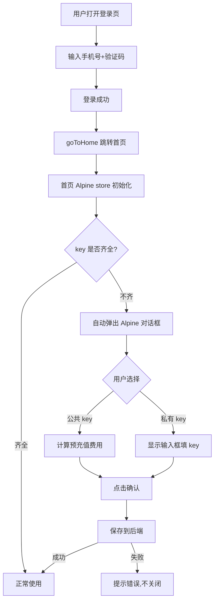

# API-Key 设置对话框统一方案

## 目标

消除登录页（纯 JS）和首页（Alpine）两套 API-Key 对话框的重复实现，只维护一套 Alpine 版本。

## 当前现状

### 登录页版本（较新、功能完整）
- **控件**：`<input type="checkbox">` — 选中 = 使用公共 key，未选中 = 显示输入框填私有 key
- **保存链路**：`confirmApikeyDialog()` → `collectApiKeySettings()` → `saveApiKeySettings()`（POST 到 `/api/user/settings/apikey`）
- **初始化**：`applyApiKeySettingsToUI()` 正确填充 checkbox 状态和输入框值
- **字段名**：使用 `api_key`（snake_case，与后端一致）
- **费用计算**：`getTotalFee()` / `updatePrepaidAmount()`

### 首页 Alpine 版本（功能不全）
- **控件**：`<input type="radio">`（公共/私有 二选一）
- **保存链路**：缺失 — `confirm()` 发现 `_onConfirm` 为 null 就直接关闭
- **初始化**：`open()` 虽接收 `settings` 但之前因 `apiKey` vs `api_key` 字段名不匹配导致初始化失败（已修复）
- **费用计算**：通过 Alpine `get totalFee()` 计算

### 后端接口

`POST /api/user/settings/apikey` 接收并保存：
```json
{
  "llm":      { "provider": "deepseek", "api_key": "sk-xxx", "private": true },
  "search":   { "provider": "zhipu",    "api_key": "-",      "private": false },
  "embedder": { "provider": "zhipu",    "api_key": "",       "private": false }
}
```

`afterLogin()` 返回的 `apikey_setting` 字段：
- 新用户 → `nil`
- 老用户 key 不全 → 脱敏后的 settings（`api_key` 为 `-` 或 `****`）
- 老用户 key 全齐 → `nil`

---

## 实施步骤

### Step 1：升级 Alpine 对话框 JS — 补全保存逻辑

**文件**：[`frontend/static/dialogs/apikey-dialog.js`](frontend/static/dialogs/apikey-dialog.js)

改动内容：

1. **新增 `_saveToServer()` 内部方法**
   - 收集当前 `this.settings` 数据
   - POST 到 `/api/user/settings/apikey`
   - 返回 Promise<boolean>

2. **改造 `confirm()` 方法**
   - 不再依赖外部传入的 `_onConfirm` 回调
   - 直接调用 `_saveToServer()` 保存
   - 保存成功 → 关闭对话框
   - 保存失败 → 提示错误（不关闭）

3. **保留 `open({ settings, onConfirm })` 的兼容性**
   - 如果有 `onConfirm` 则使用回调方式（兼容已有调用方）
   - 如果没有 `onConfirm` 则使用内部 `_saveToServer()`

### Step 2：统一 UI 控件为 checkbox

**文件**：[`frontend/index.html`](frontend/index.html)

将三组 radio 按钮改为 checkbox，对齐登录页的交互方式：

```html
<!-- 改前：两个 radio -->
<label class="apikey-check-item">
    <input type="radio" name="llm-apikey" value="public"
        :checked="!settings.llm.private" @click="llmPrivate = false">
    <span class="check-label">使用公共 api-key</span>
</label>
<label class="apikey-check-item">
    <input type="radio" name="llm-apikey" value="private"
        :checked="settings.llm.private" @click="llmPrivate = true">
    <span class="check-label">我自己有DeepSeek的api-key</span>
</label>

<!-- 改后：一个 checkbox -->
<label class="apikey-check-item">
    <input type="checkbox" :checked="!settings.llm.private"
        @click="llmPrivate = !llmPrivate">
    <span class="check-label">使用第2大脑的key</span>
</label>
```

checkbox 语义：**选中 = 使用公共 key（`private=false`）**，**未选中 = 使用自己的 key（`private=true`，显示输入框）**

**对应 JS 中的 setter 也要调整**：当前 `@click="llmPrivate = false"` 改为 `@click="llmPrivate = !llmPrivate"`，或者直接用 Alpine 的 `x-model` 绑定。

3. **说明弹层内容替换为登录页的丰富版本**

   **文件**：[`frontend/index.html`](frontend/index.html) 第 1086-1100 行

   登录页的「更多说明」内容更详细，包含：
   - 带 `<h4>` 标题和 `<ol>` 编号列表的 5 项用途说明
   - 费用动态计算的提示
   - DeepSeek 和智谱的官网链接

   替换首页现有的简短段落，同时将 Alpine 的 `x-show` 绑定和关闭逻辑保留。

### Step 3：首页自动检测 key 状态

**文件**：[`frontend/static/chat-api.js`](frontend/static/chat-api.js) 或首页初始化入口

页面加载完成后检查：
```javascript
// 伪代码逻辑
var userData = Alpine.store('chats').userData;
if (userData && (!userData.apikey_setting === undefined)) {
    // 没有 apikey_setting 字段 = key 已齐，不需要弹
    return;
}
// 有 apikey_setting 或 is_new = 需要弹
onOpenApiKeyDialog();
```

具体判断逻辑：
- `userData.is_new === true` → 用默认设置弹对话框
- `userData.apikey_setting` 存在 → 用该设置弹对话框
- 以上都不满足 → key 已全，不弹

**触发时机**：首页 Alpine store 初始化完成之后（`$store.chats` 可用时），但在用户交互之前。

### Step 4：简化登录页

**文件**：[`frontend/signin/index.html`](frontend/signin/index.html)

1. **移除 HTML**（第 80-187 行）
   - 整个 `<div class="apikey-overlay" id="apikeyOverlay">` 及其子元素
   - 包括帮助弹层、三个 section、底部操作区

2. **移除 JS 函数**（第 651-826 行）
   - `_apikeyDialogResolve`
   - `APIKEY_FEES`、`getTotalFee()`、`updatePrepaidAmount()`
   - `toggleApiKeySection()`
   - `applyApiKeySettingsToUI()`
   - `openApikeyDialog()`
   - `toggleApikeyHelp()`、`closeApikeyHelp()`
   - `closeApikeyDialog()`、`cancelApikeyDialog()`
   - `collectApiKeySettings()`
   - `saveApiKeySettings()`
   - `confirmApikeyDialog()`
   - `makeDefaultApiKeySettings()`

3. **简化 `onLogin()`**（第 605-621 行）
   - 移除 `is_new` 和 `apikey_setting` 的分支判断
   - 登录成功后始终 `goToHome()`
   - 移除 `_loginData` 变量

4. **移除 CSS 引用**（如果不再需要）
   - 确认 `signin.css` 中 apikey 相关样式（第 488-593 行）是否可以移除
   - 注意部分样式（如 `.apikey-overlay`、`.apikey-box`）仅登录页使用
   - 共享样式在 `apikey-dialog.css` 中保留

### Step 5：清理

**文件**：[`frontend/static/signin.css`](frontend/static/signin.css)

移除第 488-593 行的 API-Key 对话框专属样式，这些在登录页不再需要：
- `.apikey-overlay` ~ `.apikey-confirm-btn:hover`

但需要确认这些样式是否仅登录页使用。`apikey-dialog.css` 中已有同名样式（部分有差异），需核对差异并合并必要部分。

---

## 流程图



## 涉及的文件清单

| 文件 | 改动类型 | 说明 |
|------|---------|------|
| `frontend/static/dialogs/apikey-dialog.js` | 修改 | 补全保存逻辑，重写 setter |
| `frontend/index.html` | 修改 | radio → checkbox，调整 Alpine 绑定 |
| `frontend/static/chat-api.js` | 修改 | 新增自动检测+弹出逻辑 |
| `frontend/signin/index.html` | 修改 | 移除对话框 HTML+JS |
| `frontend/static/signin.css` | 修改 | 移除 apikey 样式 |

## 注意事项

1. **登录页的说明弹层内容更丰富**（第 94-112 行），移植到 Alpine 版本时应保留这些内容，替换 Alpine 版本中较简略的说明
2. **signin.css 中的 `.apikey-overlay` 等样式**与 `apikey-dialog.css` 中同名样式有重复，需要先确认 `apikey-dialog.css` 是否已完整覆盖，移除前需核对差异
3. **后端无需改动** — 接口和数据格式保持不变，只是前端调用时机从登录页移到首页
4. **`afterLogin()` 返回的 `apikey_setting` 字段**现在对登录页已无意义，但首页 `onOpenApiKeyDialog` 仍通过 `Alpine.store('chats').userData.apikey_setting` 读取，所以后端无需改动
