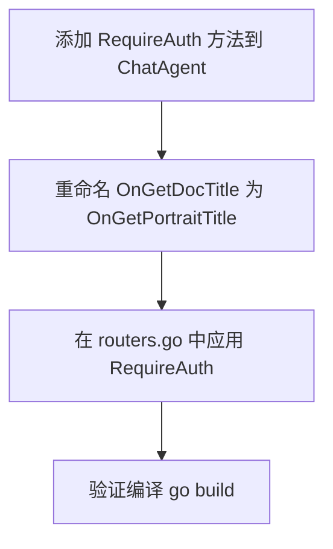

# API 认证中间件计划

## 背景

目前代码中存在 [`IsAnonymous()`](internal/agent/session.go:130) 方法，但未被使用。需要为所有 API 端点添加登录认证检查，未登录时返回 HTTP 401 Unauthorized。

## 需求

- 除以下端点外，**所有 API 端点都需要登录认证**：
  - `POST /api/user/login` — 登录
  - `GET /api/session` — 会话初始化
  - `GET /api/health` — 健康检查
- `OnGetDocTitle` 重命名为 `OnGetPortraitTitle`
- 未登录时返回 HTTP 401 状态码（空 body），前端自行判断后 Toast "请先登录"
- 减少重复代码，避免在每个 handler 中重复写 auth 检查逻辑

## 设计方案

采用 **路由注册层包装器**（wrapper/decorator）模式，在 [`routers.go`](cmd/server/routers.go) 中集中处理认证逻辑。

### 核心改动

#### 1. 新增 `requireAuth` 包装方法

在 [`ChatAgent`](internal/agent/on_chat.go:297) 上新增方法，放在 [`on_chat.go`](internal/agent/on_chat.go) 或单独文件：

```go
// RequireAuth wraps an http.HandlerFunc with anonymous session checking.
// If the session is anonymous (not logged in), returns 401 Unauthorized with empty body.
// The frontend detects the 401 status and handles the prompt itself.
func (h *ChatAgent) RequireAuth(fn http.HandlerFunc) http.HandlerFunc {
    return func(w http.ResponseWriter, r *http.Request) {
        sessionID := h.resolveSessionID(w, r)
        session := h.sessionManager.GetOrCreate(sessionID)
        if session.IsAnonymous() {
            w.WriteHeader(http.StatusUnauthorized)
            return
        }
        fn(w, r)
    }
}
```

**优势**：
- 认证逻辑集中在一处，零重复
- 不需要修改任何 handler 实现
- 在路由注册时声明式指定哪些需要认证

#### 2. 在 [`routers.go`](cmd/server/routers.go) 中应用

```go
// ============================================================
// 需要认证的路由
// ============================================================

srv.POST("/api/chat", chatHandler.requireAuth(chatHandler.OnNewMessage))
srv.DELETE("/api/chat", chatHandler.requireAuth(chatHandler.OnChatDelete))
srv.GET("/api/chat/deleted", chatHandler.requireAuth(chatHandler.OnListDeletedChats))
srv.GET("/api/chat/favorites", chatHandler.requireAuth(chatHandler.ListFavoriteChats))
srv.PUT("/api/chat/favorites", chatHandler.requireAuth(chatHandler.AddFavoriteChat))
srv.DELETE("/api/chat/favorites", chatHandler.requireAuth(chatHandler.RemoveFavoriteChat))
srv.GET("/api/chat/groups", chatHandler.requireAuth(chatHandler.OnChatGroups))
srv.GET("/api/chat/list", chatHandler.requireAuth(chatHandler.OnGetChats))
srv.DELETE("/api/chat/messages", chatHandler.requireAuth(chatHandler.OnDeleteMessage))
srv.PUT("/api/chat/new", chatHandler.requireAuth(chatHandler.OnNewChat))
srv.DELETE("/api/chat/permanent", chatHandler.requireAuth(chatHandler.OnPermanentDelete))
srv.PUT("/api/chat/pin", chatHandler.requireAuth(chatHandler.OnChatPin))
srv.PUT("/api/chat/restore", chatHandler.requireAuth(chatHandler.OnRestoreChat))
srv.GET("/api/chat/switch", chatHandler.requireAuth(chatHandler.OnSwitchChat))
srv.POST("/api/chat/tags", chatHandler.requireAuth(chatHandler.OnGenerateChatTags))
srv.GET("/api/chat/title", chatHandler.requireAuth(chatHandler.OnGetSuggestedChatTitle))
srv.PUT("/api/chat/title", chatHandler.requireAuth(chatHandler.OnPutChatTitle))
srv.POST("/api/chat/traits", chatHandler.requireAuth(chatHandler.OnExtractTraits))
srv.DELETE("/api/chat/trash", chatHandler.requireAuth(chatHandler.OnEmptyTrash))
srv.GET("/api/info/llm/chat", chatHandler.requireAuth(chatHandler.OnGetLLMInfo))
srv.POST("/api/user/logout", chatHandler.requireAuth(chatHandler.OnLogout))
srv.GET("/api/user/portrait", chatHandler.requireAuth(chatHandler.OnGetUserPortrait))
srv.POST("/api/user/portrait/title", chatHandler.requireAuth(chatHandler.OnGetPortraitTitle))
srv.GET("/api/themes", chatHandler.requireAuth(themeHandler.GetThemes))
srv.POST("/api/themes", chatHandler.requireAuth(themeHandler.SetThemes))

// ============================================================
// 不需要认证的路由
// ============================================================

srv.POST("/api/user/login", chatHandler.OnLogin)
srv.GET("/api/session", chatHandler.OnSession)

srv.GET("/api/health", func(w http.ResponseWriter, r *http.Request) {
    w.Header().Set("Content-Type", "application/json")
    json.NewEncoder(w).Encode(map[string]string{
        "status":  "ok",
        "server":  "local-server",
        "version": "1.0.0",
    })
})
```

#### 3. 重命名 `OnGetDocTitle` → `OnGetPortraitTitle`

涉及文件：[`internal/agent/on_doc_title.go`](internal/agent/on_doc_title.go)

- 结构体 `docTitleRequest` → `portraitTitleRequest`
- 函数 `OnGetDocTitle` → `OnGetPortraitTitle`
- 文件名 `on_doc_title.go` → `on_portrait_title.go`（可选，建议重命名保持一致性）

路由对应更新：
```
- srv.POST("/api/user/portrait/title", chatHandler.OnGetDocTitle)
+ srv.POST("/api/user/portrait/title", chatHandler.requireAuth(chatHandler.OnGetPortraitTitle))
```

> 注：只返回 HTTP 401 状态码（空 body），无需添加 i18n 消息。前端自行处理 Toast。

## 不需要认证的端点

| 端点 | Handler | 原因 |
|------|---------|------|
| `POST /api/user/login` | `OnLogin` | 登录本身，必须先允许未登录调用 |
| `GET /api/session` | `OnSession` | 会话初始化，前端需先获取 session cookie |
| `GET /api/health` | 匿名函数 | 健康检查，负载均衡器/监控需要 |

## 工作步骤



### 详细步骤

1. **`internal/agent/on_chat.go`** — 新增 `requireAuth` 方法
2. **`internal/agent/on_doc_title.go`** — 重命名 `OnGetDocTitle` → `OnGetPortraitTitle`，`docTitleRequest` → `portraitTitleRequest`
3. **`cmd/server/routers.go`** — 对所有需要认证的路由应用 `.requireAuth()`，更新 `OnGetPortraitTitle` 引用
4. **编译验证** — `go build ./...`

## 变更清单

| 文件 | 改动类型 | 说明 |
|------|---------|------|
| `internal/agent/on_chat.go` | 新增方法 | 添加 `requireAuth()` |
| `internal/agent/on_doc_title.go` | 重命名 | `OnGetDocTitle` → `OnGetPortraitTitle` |
| `internal/agent/on_doc_title.go` | 重命名 | `docTitleRequest` → `portraitTitleRequest` |
| `cmd/server/routers.go` | 修改 | 所有路由应用 requireAuth，更新方法名 |
