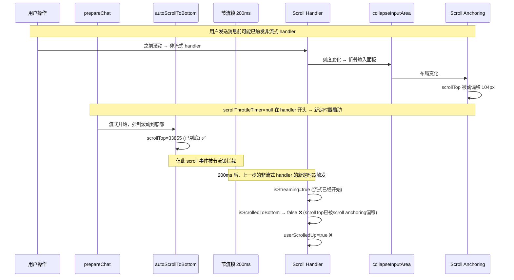

# Scroll Anchoring 假阳性 — 最终修复方案

## 根因

当前 scroll handler 有 200ms 节流。时序如下：



**真实原因**：streaming 分支没有主动同步 scrollTop，而是被动检查 `isScrolledToBottom()`。而 scrollTop 可能已被之前的 scroll anchoring 偏移。

## 修复

**streaming 分支中，如果 `userScrolledUp=false`（用户未要求停止自动滚动），直接 `scrollTop = scrollHeight`，覆盖所有 scroll anchoring 偏移。**

```javascript
// 改动后
if (state.isStreaming) {
    collapseInputArea();

    if (!state.userScrolledUp) {
        // ✅ 强制滚动到底部，覆盖 scroll anchoring 造成的任何偏移
        dom.scrollContainer.scrollTop = dom.scrollContainer.scrollHeight;
    } else if (isScrolledToBottom()) {
        // 用户滚回底部，恢复自动滚动
        state.userScrolledUp = false;
    }

    scrollThrottleTimer = null;
    return;
}
```

这样改动后：
1. `collapseInputArea()` 仍然在 streaming 分支中调用 ✅
2. layout 变化后的 scroll anchoring 偏移被 `scrollTop=scrollHeight` 直接覆盖 ✅
3. `userScrolledUp=true` 时停止强制滚动，用户可自由阅读 ✅
4. `userScrolledUp` 不在此分支中设置（不再有假阳性） ✅

## 改动文件

只改 [`chat.js`](frontend/static/chat.js) streaming 分支。

## 验证

| 场景 | 预期 |
|------|------|
| 流式开始，scroll anchoring 偏移了 scrollTop | ✅ `scrollTop=scrollHeight` 覆盖，保持在底部 |
| 用户滚轮上滚（throttleRender 的 autoScrollToBottom 仍会尝试滚动） | ⚠️ 需在别处设 userScrolledUp=true |
| 用户滚回底部 | ✅ `isScrolledToBottom()` → `userScrolledUp=false` |
