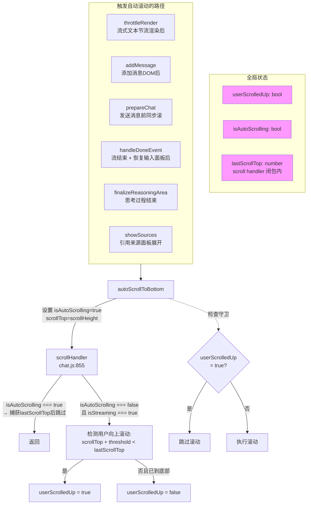
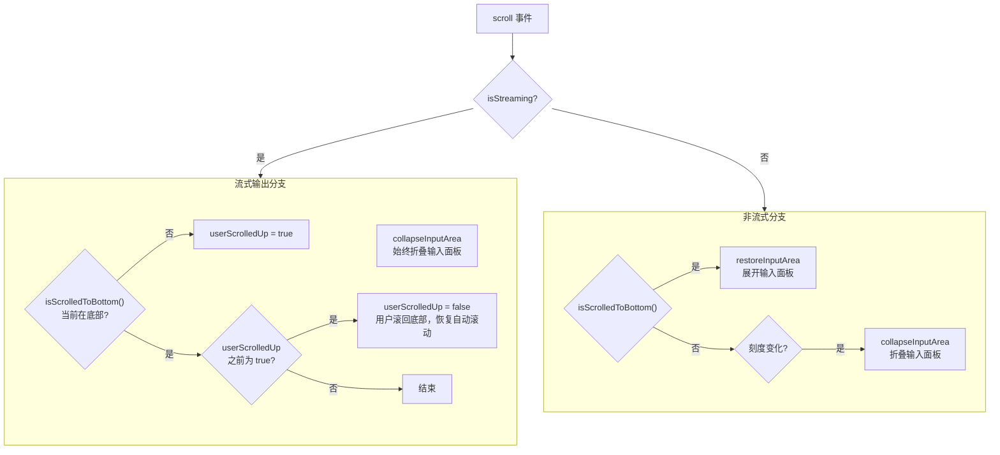

# 自动滚动逻辑重构方案

## 一、现状分析

### 1.1 涉及文件与职责

| 文件 | 职责 |
|------|------|
| [`chat-state.js`](frontend/static/chat-state.js) | 维护 `userScrolledUp`、`isAutoScrolling` 状态 |
| [`chat-ui.js`](frontend/static/chat-ui.js) | `autoScrollToBottom()`、`throttleRender()`、`isScrolledToBottom()`、`autoScrollToBottomAfter()` |
| [`chat.js`](frontend/static/chat.js:855) | scroll 事件监听器，包含核心的用户滚动检测逻辑 |
| [`chat-sse.js`](frontend/static/chat-sse.js) | `prepareChat()`、`handleDoneEvent()` 中调用滚动函数 |
| [`chat-reasoning.js`](frontend/static/chat-reasoning.js:152) | `finalizeReasoningArea()` 中调用 `autoScrollToBottom()` |

### 1.2 核心数据流



### 1.3 当前架构的复杂度点

| # | 复杂度点 | 涉及代码 | 说明 |
|---|---------|---------|------|
| C1 | `isAutoScrolling` 状态变量 | `chat-state.js:137`, `chat-ui.js:49`, `chat.js:859-863` | 用于区分"程序自动滚动"与"scroll anchoring 副作用"，但 rAF 非同步路径存在微小时间窗口 |
| C2 | `lastScrollTop` 闭包变量 + 阈值比较 | `chat.js:854,880-892` | 需要维护跨流式会话的 `lastScrollTop`，且阈值 `SCROLL_BOTTOM_THRESHOLD=4px` 过滤 scroll anchoring 噪声 |
| C3 | `autoScrollToBottom` 的 sync/async 双路径 | `chat-ui.js:44-58` | `sync=true` 和 `sync=false`(rAF) 两条路径，调用方需决策用哪种 |
| C4 | `autoScrollToBottomAfter` 延迟滚动函数 | `chat-ui.js:597-601` | 仅在一处使用，冗余导出 |
| C5 | 滚动处理器的 streaming 分支职责混杂 | `chat.js:872-893` | 同时处理：折叠输入面板、检测用户上滚、检测用户滚回底部 — 三个逻辑交织在一起 |
| C6 | 重复的 `isAtBottom` 检测逻辑 | `chat.js:888,897` | streaming 分支和非 streaming 分支各写了一遍 |

## 二、优化方案

### 2.1 核心思路

**用 `scrollend` 事件 + 简化的守卫逻辑替代 `isAutoScrolling` 状态标志。**

> **`scrollend`** 是较新的标准 API（Chrome 114+, Firefox 109+, Safari 16.5+），在滚动**完全结束**后触发，不会在滚动过程中持续触发。这使得它天然适合区分"程序触发的滚动已完成"和"用户正在主动滚动"。

但由于浏览器兼容性考虑，我们可以采用一种更简单的方案：**将 `autoScrollToBottom` 统一为同步路径**，利用 `element.scrollTop = value` 触发同步 `scroll` 事件的特性，彻底消除 rAF 时间窗口问题。

### 2.2 具体改动

#### 改动 1：统一 `autoScrollToBottom` 为同步路径，消除 rAF 时间窗口

**现状问题**：`autoScrollToBottom` 非同步路径（rAF）导致 `isAutoScrolling = true` 的赋值时机和实际滚动时机之间存在时间差，scroll anchoring 或快速连续触发的 scroll 事件可能在这个间隙中被误判。

**改后设计**：
- 移除 `sync` 参数，始终同步设置 `scrollTop`
- 调用方如果需要在 DOM 变更后确保布局已计算，自行使用 `requestAnimationFrame` 包裹调用
- 移除 `state.isAutoScrolling` 状态变量

```javascript
// 简化后
export function autoScrollToBottom() {
    if (state.userScrolledUp) return;
    dom.scrollContainer.scrollTop = dom.scrollContainer.scrollHeight;
}
```

> 因为 `scrollTop = value` 是同步操作，scroll 事件在当前任务中同步触发，不存在时间窗口。

#### 改动 2：移除 `isAutoScrolling` 状态和 scroll handler 中的相关守卫

**现状**：`chat.js:859-863` 在 scroll handler 中通过 `isAutoScrolling` 判断并提前返回，目的是避免 auto-scroll 被误判为用户上滚。

**改后**：不再需要守卫。scroll handler 只需关注 `userScrolledUp` 的检测逻辑。`autoScrollToBottom` 已经是同步操作，scroll 事件触发时，scroll handler 只需基于当前 scrollTop 做判断。

```javascript
// scroll handler 简化后（streaming 分支）
if (state.isStreaming) {
    collapseInputArea();
    
    if (!isScrolledToBottom()) {
        state.userScrolledUp = true;
    } else if (state.userScrolledUp) {
        // 用户滚回底部
        state.userScrolledUp = false;
    }
    return;
}
```

改为：**不再依赖 `lastScrollTop` 比较，直接通过 `isScrolledToBottom()` 判断用户是否在底部。**

这消除了 `lastScrollTop` 闭包变量，也消除了阈值比较，更不容易受 scroll anchoring 影响。

> 原理：如果用户主动向上滚动，`isScrolledToBottom()` 会返回 `false`，此时设 `userScrolledUp=true`；如果 scroll anchoring 导致轻微上移（通常在 1-2px），`isScrolledToBottom()` 有 4px 容差，不会误触发。

#### 改动 3：移除 `lastScrollTop` 闭包变量

**改动 4：移除 `this.lastScrollTop = chatContainer.scrollTop;` 行（chat.js:911）**

不再需要维护该变量，相关代码直接删除。

#### 改动 5：移除 `autoScrollToBottomAfter` 导出的函数，内联 `setTimeout`

仅在 [`chat-sse.js:103`](frontend/static/chat-sse.js:103) 使用，直接写 `setTimeout(() => autoScrollToBottom(), 500)` 即可。

#### 改动 6：消除 `isAtBottom` 代码重复

将 streaming 分支和非 streaming 分支中重复的 `isAtBottom` 判断，统一使用 `isScrolledToBottom()` 函数。

### 2.3 改动清单

| # | 文件 | 改动内容 | 影响范围 |
|---|------|---------|---------|
| 1 | [`chat-state.js`](frontend/static/chat-state.js:137) | 移除 `isAutoScrolling` 状态属性 | 仅移除定义 |
| 2 | [`chat-ui.js:44-58`](frontend/static/chat-ui.js:44) | 简化 `autoScrollToBottom()`：移除 `sync` 参数，移除 rAF，移除 `isAutoScrolling` 设置 | 所有调用方 |
| 3 | [`chat-ui.js:597-601`](frontend/static/chat-ui.js:597) | 移除 `autoScrollToBottomAfter()` 导出 | 仅一处调用 |
| 4 | [`chat-ui.js:83`](frontend/static/chat-ui.js:83) | `throttleRender` 中调用 `autoScrollToBottom()` 不再需要参数调整 | 无影响 |
| 5 | [`chat-sse.js:270`](frontend/static/chat-sse.js:270) | `prepareChat` 中 `autoScrollToBottom(true)` → `autoScrollToBottom()` | 行为不变 |
| 6 | [`chat-sse.js:98,103`](frontend/static/chat-sse.js:98) | `handleDoneEvent` 中 `autoScrollToBottomAfter()` 替换为 `setTimeout(() => autoScrollToBottom(), 500)` | 行为不变 |
| 7 | [`chat.js:854-924`](frontend/static/chat.js:854) | **核心改动**：重写 scroll handler，移除 `isAutoScrolling` 守卫、移除 `lastScrollTop`、简化为直接使用 `isScrolledToBottom()` 检测 | 核心逻辑简化 |
| 8 | [`chat-reasoning.js:152`](frontend/static/chat-reasoning.js:152) | 无改动（调用 `autoScrollToBottom()` 无需参数） | 无影响 |

### 2.4 改动后 scroll handler 新设计



### 2.5 改动对照表：before / after

#### chat-ui.js 中的 `autoScrollToBottom`

```javascript
// BEFORE
export function autoScrollToBottom(sync = false) {
    if (state.userScrolledUp) return;
    const doScroll = () => {
        const sc = dom.scrollContainer;
        state.isAutoScrolling = true;
        sc.scrollTop = sc.scrollHeight;
    };
    if (sync) doScroll();
    else requestAnimationFrame(doScroll);
}

// AFTER
export function autoScrollToBottom() {
    if (state.userScrolledUp) return;
    dom.scrollContainer.scrollTop = dom.scrollContainer.scrollHeight;
}
```

#### chat.js 中的 scroll handler

```javascript
// BEFORE
chatContainer.addEventListener('scroll', () => {
    if (state.isStreaming && state.isAutoScrolling) {
        state.isAutoScrolling = false;
        lastScrollTop = chatContainer.scrollTop;
        return;
    }
    if (scrollThrottleTimer) return;
    scrollThrottleTimer = setTimeout(() => {
        scrollThrottleTimer = null;
        if (state.isStreaming) {
            collapseInputArea();
            const currentScrollTop = chatContainer.scrollTop;
            if (currentScrollTop + SCROLL_BOTTOM_THRESHOLD < lastScrollTop) {
                state.userScrolledUp = true;
            }
            lastScrollTop = currentScrollTop;
            if (state.userScrolledUp) {
                const isAtBottom = chatContainer.scrollHeight - chatContainer.scrollTop - chatContainer.clientHeight < SCROLL_BOTTOM_THRESHOLD;
                if (isAtBottom) state.userScrolledUp = false;
            }
            return;
        }
        // ... non-streaming branch
    }, 200);
});

// AFTER
chatContainer.addEventListener('scroll', () => {
    if (scrollThrottleTimer) return;
    scrollThrottleTimer = setTimeout(() => {
        scrollThrottleTimer = null;
        if (state.isStreaming) {
            collapseInputArea();
            if (!isScrolledToBottom()) {
                state.userScrolledUp = true;
            } else if (state.userScrolledUp) {
                state.userScrolledUp = false;
            }
            return;
        }
        // ... non-streaming branch (unchanged except remove lastScrollTop update)
    }, 200);
});
```

### 2.6 风险与注意事项

| 风险 | 说明 | 缓解措施 |
|------|------|---------|
| **scroll anchoring 引起误判** | 浏览器在内容上方变化时自动调整 scrollTop 保持视口稳定，可能导致 `isScrolledToBottom()` 短暂返回 `false` | `isScrolledToBottom()` 已有 4px 容差（`SCROLL_BOTTOM_THRESHOLD`），过滤微小调整 |
| **autoScrollToBottom 同步执行时 DOM 未布局** | 在 `addMessage` 后立即同步滚动，新 DOM 元素可能尚未计算布局 | 保留调用方感知：`addMessage` 和 `throttleRender` 在 DOM 变更后调用，浏览器已同步计算布局 |
| **prepareChat 中同步滚动** | `addMessage` 添加 DOM 后，`autoScrollToBottom()` 以同步方式执行，SSE 事件可能在浏览器布局完成前到达 | `addMessage` 内部 DOM 操作（`appendChild`）会触发同步布局计算，浏览器会立即计算新元素尺寸 |

## 三、总结

本次重构核心是 **3 个消除、1 个简化**：

1. **消除 `isAutoScrolling`** — 状态变量 + 守卫逻辑共约 10 行
2. **消除 `lastScrollTop`** — 闭包变量 + 阈值比较约 15 行
3. **消除 `autoScrollToBottomAfter`** — 多余导出函数
4. **简化 scroll handler** — streaming 分支从约 20 行缩减为约 8 行

总净减少代码量约 **35-40 行**，同时提高了可读性和可维护性。
