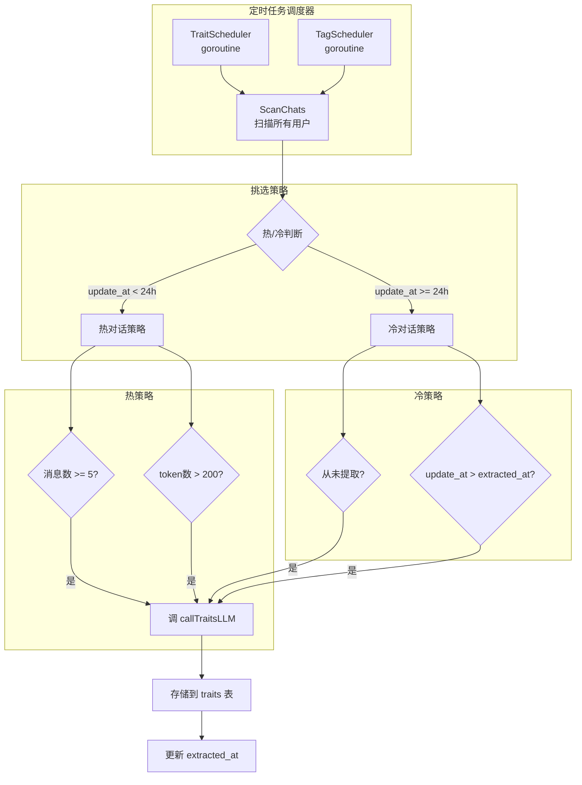
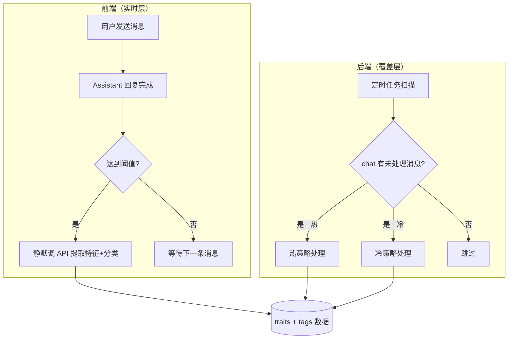
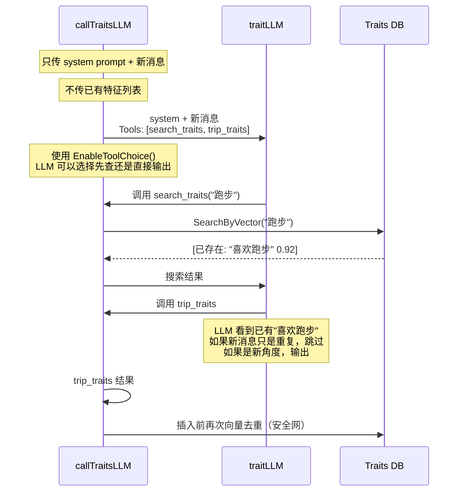

# 个人特征与对话分类自动生成方案分析

## 1. 背景

当前程序中，个人特征提取（Traits）和对话标签分类（Tags）均通过前端 UI 入口由用户手工触发：

| 功能 | 入口 | 后端 API | 处理文件 |
|------|------|----------|----------|
| 特征提取 | 侧边栏对话右键菜单 → "提取个人特征" | `POST /api/chat/traits` | [`internal/agent/on_traits.go`](../../internal/agent/on_traits.go:103) |
| 标签分类 | 侧边栏对话右键菜单 → "归类" | `GET /api/chat/tags?sn=XXX` | [`internal/agent/on_tag.go`](../../internal/agent/on_tag.go:43) |

两者都由用户手工从上下文菜单发起，存在以下问题：

- **依赖用户主动性**：用户需要知道要手动触发，且主动操作
- **覆盖不全**：大量历史对话从未被特征提取或分类
- **用户体验割裂**：用户需要跳出对话流去操作菜单

---

## 2. 数据库现状

[`chat_sessions`](../../deploy/settings_template/init.template.sql:47) 表已有相关字段：

```sql
extract_mode    SMALLINT     NOT NULL DEFAULT 0,   -- 0=manual, 1=auto
extracted_at    TIMESTAMPTZ,                        -- 上次提取时间
extracted_count INTEGER     NOT NULL DEFAULT 0,     -- 已提取特征数
taged           BOOLEAN      NOT NULL DEFAULT FALSE, -- 是否已分类
```

[`chat_messages`](../../deploy/settings_template/init.template.sql:72) 表也有 `extracted BOOLEAN` 字段标记消息是否已被提取过特征。

这说明数据库层面已经为自动提取做了预留设计（`extract_mode` 字段），但目前从未使用。

---

## 3. 方案对比分析

### 方案一：前端自动静默发起

#### 原理

前端在对话过程中累积条件（时间、消息数量、字数），达到阈值后自动调用后端 API（`POST /api/chat/traits` 和 `GET /api/chat/tags?sn=XXX`），整个流程对用户无感。

#### 触发条件设计

```
特征提取触发条件（任一满足即可）：
  - 用户消息累积达到 5 条（当前对话未提取的新消息）
  - 用户消息累积 token 超过 200
  - 首次对话（从未提取过）

标签分类触发条件：
  - 对话达到 3 轮（3 条 assistant 回复）且未分类
  - 对话结束后静默触发
```

#### 实现要点

1. **前端计数器维护**：在 [`chat-sse-responser.js`](../../frontend/static/chat-sse-responser.js) 或消息发送接收流程中维护 `pendingUserMsgCount` 和 `pendingTokenEstimate`

2. **去重控制**：
   - 通过 [`chat.extracted_at`](../../internal/store/chats.go:40) 判断是否已有提取记录
   - 通过 [`chat.taged`](../../internal/store/chats.go:45) 判断是否已分类
   - 前端本地维护 `isExtracting` / `isTagging` 锁，防止重复请求

3. **调用时机**：
   - 特征提取：每次 assistant 回复完成后检查
   - 标签分类：对话自然结束（用户停止发送消息超过 30 秒）或切换对话时

4. **静默模式**：使用 `fetch` 但不显示 Toast/loading，错误仅 `console.warn`

#### 优点

| 维度 | 评价 |
|------|------|
| **实现简单度** | ★★★★★ 前端已有完整 API 调用函数，只需添加触发逻辑 |
| **实时性** | ★★★★★ 对话进行中即可触发，几乎无延迟 |
| **资源效率** | ★★★★☆ 仅处理活跃对话，不浪费算力在冷数据上 |
| **用户体验** | ★★★★★ 完全无感，不打断对话流 |
| **改造成本** | ★★★★★ 仅需修改前端文件，不涉及后端架构变动 |

#### 缺点

| 维度 | 评价 |
|------|------|
| **覆盖范围** | ★★☆☆☆ 仅覆盖用户活跃期间展开的对话，冷数据无法处理 |
| **依赖前端** | ★★☆☆☆ 关闭浏览器后无法触发 |
| **重复触发风险** | ★★★☆☆ 需要细致的状态管理避免重复请求 |
| **跨设备** | ★☆☆☆☆ 不同设备各自触发，无中央协调 |

#### 涉及文件

| 文件 | 改动 |
|------|------|
| [`frontend/static/chat-sse-responser.js`](../../frontend/static/chat-sse-responser.js) | 在流完成事件中增加触发检测 |
| [`frontend/static/chat-api.js`](../../frontend/static/chat-api.js) | 新增 `autoExtractTraits()` 和 `autoClassifyChat()` 静默调用函数 |
| [`frontend/static/chat-list.js`](../../frontend/static/chat-list.js) | 可选：在切换对话时检测并触发分类 |
| [`frontend/static/chat-ui.js`](../../frontend/static/chat-ui.js) | 可选：添加空闲检测定时器 |

---

### 方案二：后端定时任务

#### 原理

后端启动一个独立的 goroutine（或使用 `time.Ticker`），按固定间隔扫描所有用户的 chats，根据挑选策略决定哪些需要处理，然后调用现有的 `callTraitsLLM` / `generateTagsViaLLM` 逻辑。

#### 架构设计



#### 热/冷对话定义

| 类型 | 定义 | 策略 |
|------|------|------|
| **热对话** | `update_at` 在 24 小时内 | 累积消息数 ≥ 5 或 token 数 > 200 时触发 |
| **冷对话** | `update_at` 超过 24 小时前 | 从未提取过，或 `update_at > extracted_at`（有新消息但未被提取）时触发 |

#### 定时任务参数

```go
type SchedulerConfig struct {
    TraitExtractionInterval time.Duration // 特征提取扫描间隔，建议 5 分钟
    TagGenerationInterval   time.Duration // 标签生成扫描间隔，建议 10 分钟
    HotThresholdHours       int           // 热对话判定阈值，建议 24 小时
    HotMessageThreshold     int           // 热对话消息数阈值，建议 5
    HotTokenThreshold       int           // 热对话 token 阈值，建议 200
    BatchSize               int           // 每批处理数量，建议 20
    MaxConcurrent           int           // 最大并发调用数，建议 3
}
```

#### 实现要点

1. **独立 Scheduler 组件**：在 [`internal/agent/`](../../internal/agent/) 下新建 `scheduler.go`，包含 `TraitScheduler` 和 `TagScheduler`

2. **并发控制**：使用 `semaphore.Weighted` 限制 LLM 并发调用数，避免 API 限流

3. **进度追踪**：
   - 利用 `chat_sessions.extracted_at` 和 `chat_messages.extracted` 追踪进度
   - 利用 `chat_sessions.taged` 追踪分类状态

4. **错误容忍**：单个 chat 处理失败不影响其他 chat，仅记录日志

5. **优雅关闭**：监听 `ctx.Done()`，在服务关闭时完成当前批次

#### 优点

| 维度 | 评价 |
|------|------|
| **覆盖范围** | ★★★★★ 所有 chats 都会被处理，无论用户是否在线 |
| **策略灵活** | ★★★★★ 可区分热/冷策略，资源分配合理 |
| **集中控制** | ★★★★★ 频率、并发数、阈值均可统一配置 |
| **跨设备一致性** | ★★★★★ 服务端统一处理，无设备差异 |
| **与前端解耦** | ★★★★★ 前端无需额外逻辑 |

#### 缺点

| 维度 | 评价 |
|------|------|
| **实现复杂度** | ★★☆☆☆ 需要额外的定时任务框架、并发控制 |
| **实时性** | ★★★☆☆ 有扫描间隔（5-10分钟），非即时触发 |
| **冷对话延迟** | ★★☆☆☆ 需要等待 24 小时后才会被冷策略覆盖 |
| **资源消耗** | ★★★☆☆ 需要扫描大量 chats，可能产生不必要的 DB 查询 |
| **多实例问题** | ★★★☆☆ 多副本部署时需要分布式锁避免重复处理 |

#### 涉及文件

| 文件 | 改动 |
|------|------|
| [`internal/agent/scheduler.go`](../../internal/agent/scheduler.go) | **新建** — `TraitScheduler` + `TagScheduler` |
| [`internal/agent/on_traits.go`](../../internal/agent/on_traits.go) | 重构 `callTraitsLLM` 为可复用函数（移除 HTTP 依赖） |
| [`internal/agent/on_tag.go`](../../internal/agent/on_tag.go) | 重构 `generateTagsViaLLM` 为可复用函数 |
| [`cmd/server/main.go`](../../cmd/server/main.go) | 启动 Scheduler goroutine |
| [`internal/config/config.go`](../../internal/config/config.go) | 添加 Scheduler 配置项 |
| [`bin/settings/server.toml`](../../bin/settings/server.toml) | 添加 Scheduler 配置 |

---

## 4. 综合推荐

### 推荐策略：**后端为主 + 前端为辅（混合方案）**

两种方案不是互斥的，而是可以互补的：



### 分工

| 层次 | 负责范围 | 策略 | 实时性 |
|------|----------|------|--------|
| **前端（实时层）** | 当前用户正在进行的活跃对话 | 消息数 + token 阈值 | 秒级 |
| **后端（覆盖层）** | 所有用户的全部对话 | 热/冷双策略 | 分钟级 |

### 理由

1. **前端处理活跃对话**：用户正在对话时，前端可以即时检测并触发，延迟最低。用户能立刻在下次对话中感受到特征被利用的效果。

2. **后端覆盖冷数据**：对于用户关闭浏览器后遗留的未处理对话，以及大量历史对话，后端定时任务做兜底处理。

3. **互不冲突**：前端处理过的 chat（`extracted_at` 已更新），后端扫描时会自动跳过，不会重复处理。

4. **渐进式实施**：可以先实现前端方案（成本低、见效快），再逐步推进后端方案。

### 实施优先级建议

**第一阶段**：实现前端自动静默发起（方案一）
- 成本低，改动集中在 3-4 个前端文件
- 立即解决"用户需要手工触发"的核心痛点
- 覆盖日常使用场景中 80% 以上的对话

**第二阶段**：实现后端定时任务（方案二）
- 需要更多开发工作（新建 scheduler、配置项、并发控制）
- 完成最后 20% 的覆盖（冷数据、离线场景）
- 需要处理多实例部署时的分布式锁

---

## 5. 第二阶段详细设计

### 5.1 Scheduler 架构

```go
// internal/agent/scheduler.go

// Scheduler 管理定时任务
type Scheduler struct {
    traitScheduler *TraitScheduler
    tagScheduler   *TagScheduler
    logger         zylog.Logger
}

// TraitScheduler 负责定时扫描并触发特征提取
type TraitScheduler struct {
    store      *store.ChatStore
    brainStore *store.BrainStore
    llmClient  llm.Client  // 或使用 sessionLLMClient 模式
    config     SchedulerConfig
    logger     zylog.Logger
    sem        semaphore.Weighted  // 并发控制
}

// TagScheduler 负责定时扫描并触发标签分类
type TagScheduler struct {
    store  *store.ChatStore
    config SchedulerConfig
    logger zylog.Logger
    sem    semaphore.Weighted
}
```

### 5.2 扫描查询

```sql
-- 热对话：提取特征
SELECT cs.* FROM chat_sessions cs
WHERE cs.deleted = FALSE
  AND cs.update_at > NOW() - INTERVAL '24 hours'
  AND (
    cs.extracted_at IS NULL
    OR cs.update_at > cs.extracted_at
  )
  AND (
    SELECT COUNT(*) FROM chat_messages cm
    WHERE cm.chat_id = cs.id AND cm.extracted = FALSE
  ) >= 5
ORDER BY cs.update_at ASC
LIMIT $1;

-- 冷对话：提取特征
SELECT cs.* FROM chat_sessions cs
WHERE cs.deleted = FALSE
  AND cs.update_at <= NOW() - INTERVAL '24 hours'
  AND (
    cs.extracted_at IS NULL
    OR cs.update_at > cs.extracted_at
  )
ORDER BY cs.update_at ASC
LIMIT $1;
```

### 5.3 多实例协调（可选）

如果部署多个 local-server 实例，可使用 Redis 分布式锁或 PostgreSQL `SELECT ... FOR UPDATE SKIP LOCKED` 避免重复处理。

方案一（简单）：使用 `pg_advisory_lock`：
```sql
SELECT pg_try_advisory_lock(CAST(:chat_id AS BIGINT));
-- 获取到锁则处理，否则跳过
SELECT pg_advisory_unlock(CAST(:chat_id AS BIGINT));
```

方案二（推荐）：单实例部署 scheduler，或使用配置开关控制哪个实例运行 scheduler。

---

## 6. 风险与注意事项

### 通用风险

| 风险 | 影响 | 缓解措施 |
|------|------|----------|
| LLM API 调用失败 | 特征/标签缺失 | 失败重试机制，下次扫描时重试 |
| LLM API 限流 | 批量处理时被限流 | semaphore 控制并发，指数退避重试 |
| 用户删除对话后仍有请求 | 浪费 API 调用 | 每次调用前重新验证 chat 存在性 |
| token 消耗增加 | 运营成本上升 | 限制每 chat 提取次数，设置日预算告警 |

### 前端方案特有风险

| 风险 | 影响 | 缓解措施 |
|------|------|----------|
| 页面关闭时请求未完成 | 数据可能丢失 | 使用 `navigator.sendBeacon()` 或 `fetch keepalive` |
| 快速连续发送消息 | 多次触发 | 去抖（debounce）和锁机制 |
| 用户离线 | 请求失败 | 静默失败，下次在线时重试 |

### 后端方案特有风险

| 风险 | 影响 | 缓解措施 |
|------|------|----------|
| 扫描间隔内大量新数据 | 积压 | 动态调整扫描间隔，支持手动触发 |
| 后端重启 | 进度丢失 | `extracted_at` 持久化，重启后继续 |
| 内存泄漏 | 服务不稳定 | 完善的 goroutine 生命周期管理 |

---

## 7. 关键问题：增量提取的上下文缺失 + 重复提取

### 7.1 问题描述

当前 [`OnExtractTraits`](../../internal/agent/on_traits.go:135) 只查询 `extracted = FALSE` 的新消息：

```go
dbMessages, err := theChatStore.ListUnExtractMessages(foundChat.ID)
```

LLM 每次只看到**上次提取后新产生的消息**，完全没有之前对话的上下文。后果：

| 场景 | 增量提取的表现 | 问题 |
|------|---------------|------|
| 用户说"我最近压力大" | 提取 `state: fatigue` | ✅ 正确 |
| 用户接着说"因为项目deadline" | 再次看到"压力大"相关消息 | ✅ 能提取因果关系 |
| 但前5轮说过"我是项目经理" | LLM 看不到这条信息 | ❌ 无法关联「工作压力来源」 |
| 前10轮说过"我习惯每天跑步减压" | LLM 也看不到 | ❌ 无法建立「压力→跑步」的应对模式 |

**根因**：特征提取的本质是**模式识别**，很多特征需要跨越多轮对话才能显现。增量视角下，LLM 如同盲人摸象。

### 7.2 重复问题：给 LLM 看已有特征

实测发现：**给 LLM 看已有特征列表，反倒几乎必然导致重复输出**。原因：

| LLM 行为 | 解释 |
|----------|------|
| **顺从倾向** | DeepSeek 看到列表中有什么，倾向于"再说一遍"以确保覆盖 |
| **安全策略** | 模型认为重复已有特征比遗漏更"安全" |
| **上下文污染** | 已有特征出现在输入中，被模型当作"应输出的示例" |

这意味着"提示词去重"这条路走不通。

### 7.3 修正方案：两种去重机制的对比

用户提出了一个新思路：**给 LLM 附加一个 `search_traits` Tool**，让 LLM 主动查询已有特征，自己决定是否跳过重复。这与被动的"提示词注入"有本质区别。

| 对比维度 | 方案A：提示词注入已有特征 | 方案B：LLM Tool 主动查询 | 方案C：后端向量去重 |
|----------|------------------------|------------------------|-------------------|
| **交互方式** | 被动塞给 LLM | 主动按需查询 | 强制代码逻辑 |
| **LLM 顺从倾向** | ❌ 导致重复 | ✅ 可控，LLM 自己决定 | ✅ 不涉及 LLM |
| **实现模式** | 简单拼接字符串 | 需多轮 Tool Call 循环 | 插入前加向量搜索 |
| **可靠性** | ❌ 几乎必定重复 | ⚠️ 80-90%（LLM 可能不用或用错） | ✅ 100% 确定 |
| **额外延迟** | 无 | +1~3 秒/轮 | ~50ms |
| **额外 Token** | 200-500 | + 查询的输入/输出 | 仅 embedding |
| **代码中已有参照** | — | [`generateTagsViaLLM`](../../internal/agent/on_tag.go:178) | 已有 `SearchByVector` |

### 7.4 推荐：LLM 主动查询 + 后端去重双重保障

#### 核心思路

**不给 LLM 看已有特征列表，但给 LLM 一个 `search_traits` 工具让它按需查询。后端仍然保留向量去重作为安全网。**

这样做的好处：

1. **LLM 可以主动了解已有特征** — 解决"只见树木不见森林"
2. **LLM 不会被动收到列表** — 避免诱导重复
3. **后端兜底** — 即使 LLM 忘了查或查了仍重复，后端也能去重

#### 修改后的 `callTraitsLLM` 流程



#### 涉及修改

**修改 `callTraitsLLM`**：

1. 从 `ForceToolChoice("trip_traits")` → `EnableToolChoice()`（让 LLM 自主选择调用哪个工具）
2. 增加 `search_traits` Tool Definition（可复用 [`trait_search_by_text`](internal/agent/toolimp/trait_search.go:233) 的实现）
3. 改为多轮循环模式（参照 [`generateTagsViaLLM`](internal/agent/on_tag.go:178)）

```go
func (h *ChatAgent) callTraitsLLM(ctx context.Context, ...) (*traitsResponse, error) {
    // ... 构建 messages ...

    tripTool := toolimp.NewTripTraitsTool(lang)
    searchTool := toolimp.MakeTraitSearchByTextTool(ctx, traitSearcher, lang)
    toolDefs := []llm.ToolDefinition{
        searchTool.GetDefinition(),
        tripTool.GetDefinition(),
    }

    reqBody := llm.ChatCompletionRequest{
        Messages: llmMsgs,
        Tools:    toolDefs,
    }
    reqBody.EnableToolChoice()  // 改为 auto，让 LLM 自主选择

    // 多轮循环（类似 generateTagsViaLLM）
    maxIter := 10
    for iter := 0; iter < maxIter; iter++ {
        resp, err := client.ChatWithOptions(ctx, reqBody, apiSetting.ApiKey)
        // 解析 tool_calls
        switch toolCall.Function.Name {
        case "trait_search_by_text":
            // 执行搜索，返回结果
            result := searchTool.Execute()
            // 追加 assistant_msg + tool_result_msg 到 llmMsgs
        case "trip_traits":
            // 解析特征，done
            return parseTraits(tripTool)
        }
    }
}
```

**修改 `storeTraitsInSession`**：

保持后端向量去重不变，作为安全网：

```go
func (h *ChatAgent) storeTraitsInSession(...) (int, error) {
    for _, f := range features {
        vector, _ := emb.Embed(ctx, f.FeatureText, apiSetting.ApiKey)

        // 后端去重安全网
        existing, _ := theBrainStore.SearchByVector(
            sess.User.ID, vector, f.CategoryID, 1)
        if len(existing) > 0 && existing[0].Score > 0.85 {
            // 合并，不插入
            theBrainStore.MergeTrait(existing[0].ID, f.Confidence, chatSN)
            continue
        }
        // 插入新特征
    }
}
```

---

## 8. 总结

| 维度 | 方案一（前端） | 方案二（后端） | 混合方案（推荐） |
|------|---------------|---------------|-----------------|
| 实现成本 | 低 | 中高 | 中（可分阶段） |
| 覆盖范围 | 活跃对话 | 全部对话 | 全部对话 |
| 实时性 | 高 | 中 | 高 |
| 资源效率 | 高 | 中 | 中 |
| 用户体验 | 好 | 无感 | 好 |
| 可维护性 | 中 | 高 | 高 |

### 去重策略

| 层次 | 机制 | 可靠性 |
|------|------|--------|
| LLM 层 | `search_traits` Tool 让 LLM 主动查询 | 80-90% |
| 存储层 | 向量相似度比较 + 合并 | 100% |
