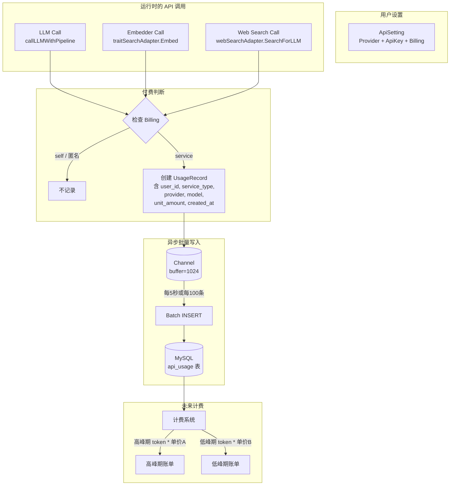

# BillingMode 与用量追踪设计计划（v2）

## 1. 背景与目标

API Key 现在由用户自行配置（per-user），产生了两种付费模式：

| 模式 | 谁提供 Key | 谁向第三方付费 | 我方是否需要计费 |
|---|---|---|---|
| **自备 Key**(`self`) | 用户 | 用户直接付给 DeepSeek/阿里等 | 否 |
| **用我方 Key**(`service`) | 我方 | 我方付给第三方 | 是（需按量向用户收费） |

**核心目标**：每次 API 调用后，根据用户的 `BillingMode` 决策：
- `self` → 不记录用量
- `service` → 将**原始用量（含时间戳）**写入独立计量表，供后续灵活计费

**关键设计原则**：只记录原始事实（谁、什么时候、用了什么服务、多少量），不做任何预聚合或预计价。计价逻辑完全由未来的计费系统根据时间、模型、时段阶梯等因素动态计算。

---

## 2. 数据结构设计

### 2.1 `ApiSetting` 增加 `billing` 字段

文件：[`internal/store/user_settings.go`](internal/store/user_settings.go)

```go
// BillingMode 表示该 API 的付费责任归属。
type BillingMode string

const (
    BillingSelf    BillingMode = "self"    // 用户自备 Key，自行向第三方付费
    BillingService BillingMode = "service" // 使用服务方 Key，服务方向用户计费
)

type ApiSetting struct {
    Provider string      `json:"provider"`
    ApiKey   string      `json:"api_key"`
    Billing  BillingMode `json:"billing"` // 空字符串视为 "service"（向后兼容）
}
```

**向后兼容**：现有 JSON 数据中 `billing` 字段缺失，Go 反序列化为零值空字符串。在使用处将空字符串等同于 `BillingService`。

### 2.2 独立计量表（核心变更）

这是本次最大的变更点——用独立 MySQL 表替代 JSON 内嵌。

```sql
-- ============================================================
-- api_usage - API 用量原始记录表
--
-- 每行记录一次 API 调用的原始用量，保留完整的时间维度信息。
-- 计费系统可据此按服务类型、提供商、模型、时间段等维度
-- 灵活计算费用（如区分高峰/低峰时段、不同模型单价等）。
-- ============================================================
CREATE TABLE api_usage (
    id              BIGINT AUTO_INCREMENT PRIMARY KEY,
    user_id         BIGINT NOT NULL,           -- 用户 ID（关联 users.id）
    service_type    VARCHAR(32) NOT NULL,       -- 服务类型: "llm" / "embedder" / "web_search"
    provider        VARCHAR(32) NOT NULL,       -- 服务提供商: "deepseek" / "ali" / "zhipu" / "bocha"
    model           VARCHAR(64) NOT NULL DEFAULT '', -- 模型名: "deepseek-v4-flash" / "text-embedding-v4"
    unit_type       VARCHAR(32) NOT NULL,       -- 计量单位: "token" / "request"
    unit_amount     INT NOT NULL,               -- 原始用量数值（如 token 数）
    billing_mode    VARCHAR(16) NOT NULL DEFAULT 'service', -- 付费模式: "self" / "service"
    created_at      DATETIME(3) NOT NULL,       -- API 调用时间（毫秒精度）

    INDEX idx_user_time (user_id, created_at),
    INDEX idx_billing_time (billing_mode, created_at)
) ENGINE=InnoDB DEFAULT CHARSET=utf8mb4;
```

**示例数据**：

| id | user_id | service_type | provider | model | unit_type | unit_amount | billing_mode | created_at |
|---|---|---|---|---|---|---|---|---|
| 1 | 42 | llm | deepseek | deepseek-v4-flash | token | 1250 | service | 2026-07-11 09:15:23.456 |
| 2 | 42 | llm | deepseek | deepseek-v4-flash | token | 892 | service | 2026-07-11 09:15:28.123 |
| 3 | 42 | web_search | bocha | - | request | 1 | self | 2026-07-11 09:15:30.000 |
| 4 | 7 | embedder | ali | text-embedding-v4 | token | 156 | service | 2026-07-11 10:00:00.000 |

**为什么能应对 DeepSeek 的高峰期翻倍计价？**

因为记录了 `created_at`（精确到毫秒），未来的计费系统可以：
```sql
-- 查询某用户在高峰期的 LLM token 总量
SELECT SUM(unit_amount) 
FROM api_usage 
WHERE user_id = 42 
  AND service_type = 'llm'
  AND billing_mode = 'service'
  AND HOUR(created_at) BETWEEN 9 AND 18  -- 高峰期 9:00-18:00
  AND created_at BETWEEN '2026-07-01' AND '2026-07-31';
```

高峰期 * 单价A + 低峰期 * 单价B，完全灵活。

---

## 3. 写入策略

### 需求分析

每次 LLM 对话可能包含多次 tool call 迭代（每次都是独立 API 调用），如果每次同步 INSERT，会增加请求延迟。

### 方案：批量异步写入

```
每次 API 调用 → 判断 BillingMode
  → self: 跳过
  → service: 将 UsageRecord 放入内存 channel（非阻塞）
              ↓
        后台 goroutine 每 N 秒或每积累 M 条，
        Batch INSERT 到 api_usage 表
```

```go
// UsageRecord 单次 API 调用的原始用量记录
type UsageRecord struct {
    UserID      int64
    ServiceType string    // "llm" / "embedder" / "web_search"
    Provider    string    // "deepseek" / "ali" / "zhipu" / "bocha"
    Model       string    // model name
    UnitType    string    // "token" / "request"
    UnitAmount  int       // raw count
    BillingMode string    // "self" / "service"
    CreatedAt   time.Time
}

// UsageRecorder 用量记录器
type UsageRecorder struct {
    ch       chan UsageRecord  // 缓冲 channel
    batch    []UsageRecord     // 当前批次
    flushInt time.Duration     //  flush 间隔
    batchMax int               //  最大批量条数
    db       *sql.DB           // MySQL 连接
}

func NewUsageRecorder(db *sql.DB, flushInterval time.Duration, batchMax int) *UsageRecorder {
    r := &UsageRecorder{
        ch:       make(chan UsageRecord, 1024),
        flushInt: flushInterval,
        batchMax: batchMax,
        db:       db,
    }
    go r.loop()
    return r
}

func (r *UsageRecorder) Record(rec UsageRecord) {
    select {
    case r.ch <- rec:
    default:
        // channel 满则丢弃（保护服务不背压）
    }
}

func (r *UsageRecorder) loop() {
    ticker := time.NewTicker(r.flushInt)
    defer ticker.Stop()
    for {
        select {
        case rec := <-r.ch:
            r.batch = append(r.batch, rec)
            if len(r.batch) >= r.batchMax {
                r.flush()
            }
        case <-ticker.C:
            if len(r.batch) > 0 {
                r.flush()
            }
        }
    }
}

func (r *UsageRecorder) Flush() {
    // 同步 flush，供优雅关闭时调用
}

func (r *UsageRecorder) flush() {
    // Batch INSERT 到 api_usage 表
}
```

**参数建议**：
- `flushInterval`: 5 秒（最多丢失 5 秒数据）
- `batchMax`: 100 条（避免单条 SQL 过大）
- `channel buffer`: 1024（应对瞬时峰值）

---

## 4. 集成点（插桩位置）

### 4.1 LLM Token 用量

文件：[`internal/agent/chatllm.go:189`](internal/agent/chatllm.go:189)

每次 tool call 迭代都是一次独立的 API 调用，都会产生 token 消耗。目前 `GetUsageInfo()` 只返回最后一次调用的数据。

**改造方案**：在 [`streamChatCompletion`](infra/llm/deepseek.go:338) 的 `onUsage` callback 中，每次收到 token usage 就记录，而不是只在最终结果里取。

但为了最小侵入，可以先在 [`callLLMWithPipeline`](internal/agent/chatllm.go:189) 返回后记录：

```go
func (h *ChatAgent) callLLMWithPipeline(..., sess *session.Session) *Message {
    client := sessionLLMClient(sess)
    apiKey := sessionLLMAPIKey(sess)

    reply, reasoning, err := client.ChatWithPipeline(ctx, messages, &pipeline, withDeepThink, apiKey)

    // === 插桩点 ═══
    if h.recorder != nil && !sess.IsAnonymous() {
        billing := sess.User.Settings.APIKey.LLM.Billing
        if billing == "" || billing == BillingService {
            if u := client.GetUsageInfo(); u != nil && u.TotalTokens > 0 {
                h.recorder.Record(UsageRecord{
                    UserID:      sess.User.ID,
                    ServiceType: "llm",
                    Provider:    "deepseek",
                    Model:       client.Model(),
                    UnitType:    "token",
                    UnitAmount:  u.TotalTokens,
                    BillingMode: string(BillingService),
                    CreatedAt:   time.Now().UTC(),
                })
            }
        }
    }
    // ════════════════
}
```

**注意**：`ChatWithPipeline` 内部可能多次调用 LLM API（多次 tool call 迭代），但 `GetUsageInfo()` 只保留最后一次。要精确记录每次迭代的用量，需要改造 pipeline callback 或在 [`streamChatCompletion`](infra/llm/deepseek.go:338) 的 `onUsage` 中直接记录。

### 4.2 Embedder Token 用量

文件：[`internal/agent/trait_searcher.go:56`](internal/agent/trait_searcher.go:56)

`traitSearchAdapter` 不持有 `userID` 和 `recorder`，需要注入。

```go
type traitSearchAdapter struct {
    client embedder.Embedder
    store  *store.BrainStore
    lang   string
    apiKey string
    // 新增：
    userID  int64
    recorder *UsageRecorder
}
```

在 [`on_msg_new.go:156`](internal/agent/on_msg_new.go:156) 创建时传入：

```go
traitSearcher := &traitSearchAdapter{
    client:   embedder,
    store:    traitsStore,
    lang:     lang,
    apiKey:   embedderAPIKey,
    userID:   sess.User.ID,
    recorder: h.recorder,
}
```

在 [`SearchByText`](internal/agent/trait_searcher.go:54) 中插桩：

```go
func (a *traitSearchAdapter) SearchByText(ctx context.Context, queryText string, ...) {
    vector, err := a.client.Embed(ctx, queryText, a.apiKey)

    // === 插桩点 ═══
    if err == nil && a.recorder != nil && a.userID > 0 {
        a.recorder.Record(UsageRecord{
            UserID:      a.userID,
            ServiceType: "embedder",
            Provider:    "ali", // 固定，或从 client 推断
            Model:       a.client.Model(),
            UnitType:    "request",
            UnitAmount:  1,
            BillingMode: "service", // 简化处理
            CreatedAt:   time.Now().UTC(),
        })
    }
    // ════════════════
}
```

**简化处理**：Embedder 返回的 token usage 目前没有通过接口暴露（只在 `fmt.Printf` 打印），可以先按调用次数计费（每次 1 request），未来需要精确 token 数时再改造 `Embedder` 接口。

### 4.3 Web Search 用量

文件：[`internal/agent/web_searcher.go:22`](internal/agent/web_searcher.go:22)

同样注入 `userID` 和 `recorder`：

```go
type webSearchAdapter struct {
    client searcher.WebSearcher
    apiKey string
    // 新增：
    userID   int64
    recorder *UsageRecorder
}
```

在 [`on_msg_new.go:139`](internal/agent/on_msg_new.go:139) 中注入：

```go
if req.WebSearchEnabled {
    searcher := sessionWebSearcher(sess)
    if wsa, ok := searcher.(*webSearchAdapter); ok {
        wsa.userID = sess.User.ID
        wsa.recorder = h.recorder
    }
    webSearchToolImp := toolimp.MakeWebSearchTool(r.Context(), searcher, lang)
    toolsImp = append(toolsImp, webSearchToolImp)
}
```

在 [`SearchForLLM`](internal/agent/web_searcher.go:22) 中插桩：

```go
func (w *webSearchAdapter) SearchForLLM(ctx context.Context, ...) (string, []toolimp.WebSource, error) {
    resp, llmText, err := w.client.SearchForLLM(ctx, req, 10240, w.apiKey)
    
    // === 插桩点 ═══
    if err == nil && w.recorder != nil && w.userID > 0 {
        w.recorder.Record(UsageRecord{
            UserID:      w.userID,
            ServiceType: "web_search",
            Provider:    "bocha", // 或从 client 推断
            Model:       "",
            UnitType:    "request",
            UnitAmount:  1,
            BillingMode: "service",
            CreatedAt:   time.Now().UTC(),
        })
    }
    // ════════════════
}
```

---

## 5. `ChatAgent` 集成

### 5.1 `ChatAgent` 增加 `recorder` 字段

```go
type ChatAgent struct {
    // ... 现有字段
    recorder *UsageRecorder
}
```

### 5.2 初始化

在 [`InitAgent`](internal/agent/init.go) 中创建：

```go
func InitAgent(ctx context.Context, cfg config.Config, cookieName string, defaultLang string, logger zylog.Logger) (*ChatAgent, error) {
    // ... 现有代码

    recorder := NewUsageRecorder(store.TheMySQLDB().DB, 5*time.Second, 100)
    chatHandler.SetRecorder(recorder)

    return chatHandler, nil
}
```

### 5.3 优雅关闭

在 [`main.go`](cmd/server/main.go) shutdown 时：

```go
<-ctx.Done()
theLogger.Info("Shutting down server...")

// 确保所有用量记录已刷入
chatHandler.GetRecorder().Flush()

srv.Stop("received shutdown signal")
```

---

## 6. 实施步骤

| # | 任务 | 文件 | 说明 |
|---|---|---|---|
| 1 | 创建 `api_usage` 表 DDL + 迁移 | `doc/sql/` + `internal/store/` | 新增 SQL 迁移脚本 |
| 2 | `ApiSetting` 增加 `BillingMode` 和 `Billing` 字段 | `internal/store/user_settings.go` | 小改 |
| 3 | 实现 `UsageRecorder`（channel + batch insert） | `internal/store/usage_recorder.go`（新文件） | 核心新组件 |
| 4 | `ChatAgent` 增加 `recorder` 字段 + setter | `internal/agent/chat.go` | 小改 |
| 5 | LLM 调用后插桩 | `internal/agent/chatllm.go` | 小改 |
| 6 | Embedder 调用后插桩 | `internal/agent/trait_searcher.go` + `on_msg_new.go` | 中改 |
| 7 | Web Search 调用后插桩 | `internal/agent/web_searcher.go` + `on_msg_new.go` | 中改 |
| 8 | `InitAgent` 初始化 `UsageRecorder` | `internal/agent/init.go` | 小改 |
| 9 | `main.go` 优雅关闭时 flush | `cmd/server/main.go` | 小改 |
| 10 | 匿名用户跳过记录逻辑 | 各处插桩点 | 小改 |

---

## 7. Mermaid 流程图



---

## 8. 关键设计与之前的差异

| 方面 | v1（之前的方案） | v2（当前方案） |
|---|---|---|
| **存储** | `users.settings` JSON | **独立 `api_usage` 表** |
| **聚合粒度** | 按用户预聚合总量 | **每行一次 API 调用，保留原始数据** |
| **时间维度** | 无（只存累计值） | **`created_at` DATETIME(3)** — 支持时分秒级计价 |
| **区分维度** | 仅服务类型 | **service_type + provider + model** |
| **写入方式** | 定时刷入 JSON | **channel 异步 batch INSERT** |
| **数据丢失风险** | 最多丢一个 flush 间隔 | **最多丢 5 秒数据，可接受** |
| **计价灵活性** | 固定单价 | **未来可按时段/模型/提供商灵活计价** |

---

## 9. 风险与注意事项

1. **channel 满丢弃**：`Record()` 使用 `select default` 非阻塞发送，channel 满时直接丢弃。极端流量下可能丢数据，但保护了主流程不背压。可根据实际流量调整 channel buffer 大小。

2. **Tool call 多次迭代的用量**：`ChatWithPipeline` 内部会多次调用 LLM API。目前 `GetUsageInfo()` 返回的是**最后一次**调用的 usage。精确记录需要改造 pipeline 或在 `streamChatCompletion` 的 `onUsage` callback 中逐次记录。**第一期可以接受只记录最后一次**，后续再精确化。

3. **`sessionLLMClient` 返回全局单例**：多个用户共享同一个 `llm.Client` 实例，`GetUsageInfo()` 可能被并发调用覆盖。需要在 `callLLMWithPipeline` 中本地保存 usage 后再取。

4. **匿名用户**：`sess.User.ID == 0`，跳过所有记录逻辑。

5. **前端设置页面**：用户配置 API Key 时需要能选择 `Billing` 模式（自付费/用我方 Key），需要前端配合。

6. **DDL 迁移**：需要为 `api_usage` 表准备 SQL 迁移脚本，考虑现有用户已有数据的情况。
