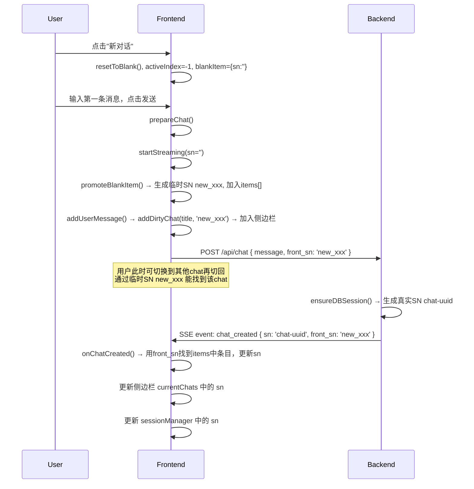

# 新对话尽早加入 items 和侧边栏 — 实现方案

## 问题

当前系统在用户点击"新对话"后，`blankItem` 只有在前端收到后端 SSE `chat_created` 事件后才会被 `promoteBlankItem()` 移入 `items[]`，并通过 `addDirtyChat()` 加入侧边栏。这导致：

1. 用户发出第一条消息后，如果切换到另一个 chat，再想切回新对话时，由于 `items[]` 中还没有该 chat 的条目（SN 为空），无法通过侧边栏找到它。
2. 用户只能再次点击"新对话"来尝试切换，但这会创建又一个空白对话。

## 解决方案

核心思路：**用户发出第一条消息时，前端立即生成临时 SN，将 blankItem 加入 items[] 和侧边栏。** 后端生成真实 SN 后，通过 SSE `chat_created` 事件同时返回 `front_sn`（前端临时 SN）和 `sn`（真实 SN），前端据此更新。

---

## 修改清单

### 1. 前端: `alpine-store.js` — 修改 `promoteBlankItem()` + 添加 `isDirtyChat()`

**`promoteBlankItem()` 修改：**
- 如果 `blankItem.sn` 为空，生成临时 SN：格式 `new_` + 当前时间（精确到秒），如 `new_2026-05-31T10-25-30`
- 然后照常移入 `items[]`

**新增 `isDirtyChat(chat?)` 方法：**
- 判断 chat 是否为脏对话（临时 SN）
- 脏对话的 SN 以 `new_` 开头
- 不传参时检查当前活跃 chat
- 用于拦截标题修改等操作

### 2. 前端: `chat-sse.js` — 修改 `addUserMessage()` 调用 `promoteBlankItem()`

**`prepareChat()` 中修改：**
- 在 `addUserMessage()` 之前或之后，如果是新对话（`activeIndex === -1` 且 `blankItem` 存在），调用 `chats.promoteBlankItem()` 将 blankItem 立即提升到 items[]
- 这样 `addUserMessage()` 中的 `addDirtyChat(title, activeChat.sn)` 就能拿到临时 SN，成功加入侧边栏

**`addUserMessage()` 修改：**
- 不再需要判断 `activeChat.sn` 是否为空，因为此时已有临时 SN
- `addDirtyChat(title, activeChat.sn)` 会正常执行

### 3. 前端: `chat-sse-responser.js` — 修改 `onChatCreated()` 处理新旧 SN 替换

**`onChatCreated()` 修改：**
- 接收 `event.front_sn`（前端临时 SN）和 `event.sn`（真实 SN）
- 使用 `front_sn` 在 `items[]` 和 `currentChats` 中找到对应的 chat 条目
- 更新其 `sn` 为真实 SN
- 同时更新 `sessionManager` 中对应 session 的 SN
- 不再需要 `promoteBlankItem()`（因为已在步骤 2 中提前提升）

### 4. 后端: `internal/agent/on_msg_new.go` — chat_created 事件增加 `front_sn`

**修改 `OnNewMessage()`：**
- 在发送 `chat_created` SSE 事件时，从请求体中解析前端传来的临时 SN（`front_sn`）
- 在 `ChatRequest` 结构体中增加 `FrontSN` 字段
- SSE 事件增加 `FrontSN` 字段

### 5. 后端: `internal/agent/types.go` — SSEEvent 增加 `FrontSN` 字段

**`SSEEvent` 结构体修改：**
- 增加 `FrontSN string` 字段，用于 chat_created 事件

### 6. 前端: 标题修改入口拦截 `isDirtyChat()`

- `chat.js` 中 header 标题点击事件：在 `!activeChat.sn` 判断基础上，增加 `chats.isDirtyChat(activeChat)` 检查
- `chat-list.js` 中 `handleRename()`：增加 `isDirtyChat()` 检查
- `chat-api.js` 中 `fetchChatTitle()`：增加 `isDirtyChat()` 检查

---

## 详细修改

### 修改 1: `frontend/static/alpine-store.js`

```javascript
// 修改 promoteBlankItem
promoteBlankItem: function() {
    if (!this.blankItem) return null;
    var item = this.blankItem;
    // 生成临时 SN：new_ + 当前时间（精确到秒）
    if (!item.sn) {
        item.sn = 'new_' + new Date().toISOString().replace(/[:.]/g, '-').slice(0, 19);
    }
    this.items.push(item);
    this.activeIndex = this.items.length - 1;
    this.blankItem = null;
    return item;
},

// 新增 isDirtyChat
isDirtyChat: function(chat) {
    if (!chat) {
        chat = this.active;
    }
    if (!chat || !chat.sn) return true;
    return chat.sn.startsWith('new_');
},
```

### 修改 2: `frontend/static/chat-sse.js`

在 `prepareChat()` 中，调用 `startStreaming()` 之后、`addUserMessage()` 之前，检查是否为新对话并提升 blankItem：

```javascript
// 在 prepareChat() 中，startStreaming 之后：
// 如果是新对话（blankItem 存在且 activeIndex === -1），立即提升到 items[]
if (chats.blankItem && chats.activeIndex === -1) {
    chats.promoteBlankItem();
    // promoteBlankItem 后：
    //   1. blankItem.sn 被设为临时 SN（如 'new_2026-05-31T10-25-30'）
    //   2. blankItem 被移入 items[]，activeIndex 指向它
    //   3. blankItem 置为 null
    //   4. chats.active 现在指向 items[] 中的这个新条目
    // 此时 activeChat.sn 已有临时 SN
}
```

然后 `addUserMessage()` 被调用时，`activeChat.sn` 已有临时 SN，所以内部的 `addDirtyChat(title, activeChat.sn)` 会成功将条目加入侧边栏 `currentChats` 列表并渲染。

**完整调用链：**
```
prepareChat()
  → chats.startStreaming(sn)          // 创建 streamingMsg
  → chats.promoteBlankItem()          // 生成临时 SN，移入 items[]
  → addUserMessage(content, createdAt)
      → addMessage('user', ...)       // 添加用户消息到 Alpine groups
      → updateHeaderTitle(title)      // 更新标题
      → activeChat.title = title      // 设置标题
      → addDirtyChat(title, sn)       // ★ 此时 sn 是临时 SN，成功加入侧边栏
  → addMessage('assistant', ...)      // 创建空的 assistant 占位
```

### 修改 3: `frontend/static/chat-sse-responser.js`

修改 `onChatCreated()` 方法：

```javascript
onChatCreated(event) {
    if (!event.sn) return;
    var frontSN = event.front_sn;
    
    try {
        var chats = window.Alpine.store('chats');
        if (!chats) return;
        
        if (frontSN) {
            // 使用前端 SN 找到 items 中的 chat 条目，更新 SN
            var idx = chats.items.findIndex(function(c) { return c.sn === frontSN; });
            if (idx >= 0) {
                chats.items[idx].sn = event.sn;
            }
            
            // 更新 sessionManager 中的 SN
            var session = sessionManager.sessions.get(frontSN);
            if (session) {
                session.sn = event.sn;
                sessionManager.sessions.delete(frontSN);
                sessionManager.sessions.set(event.sn, session);
                if (sessionManager.activeSessionSN === frontSN) {
                    sessionManager.activeSessionSN = event.sn;
                }
            }
            
            // 更新侧边栏 currentChats 中的 SN
            var { currentChats, renderChatList } = await import('./chat-list.js');
            var chatIdx = currentChats.findIndex(function(c) { return c.sn === frontSN; });
            if (chatIdx >= 0) {
                currentChats[chatIdx].sn = event.sn;
                renderChatList(currentChats, event.sn);
            }
        }
        
        // 更新 activeChatSN（侧边栏高亮）
        chats.activeChatSN = event.sn;
        
    } catch(e) {
        console.warn('[SSE] onChatCreated 处理失败:', e);
    }
}
```

### 修改 4: `internal/agent/types.go`

```go
// SSEEvent 增加 FrontSN 字段
type SSEEvent struct {
    Type       string                `json:"type"`
    // ... 现有字段 ...
    SN         string                `json:"sn,omitempty"`
    FrontSN    string                `json:"front_sn,omitempty"`  // 新增：前端临时 SN
}
```

### 修改 5: `internal/agent/on_msg_new.go`

在 `ChatRequest` 中增加 `FrontSN` 字段，并在发送 `chat_created` 事件时带上：

```go
type ChatRequest struct {
    Message          Message `json:"message"`
    Stream           bool    `json:"stream"`
    DeepThink        bool    `json:"deep_think"`
    WebSearchEnabled bool    `json:"web_search_enabled"`
    FrontSN          string  `json:"front_sn,omitempty"`  // 新增：前端临时 SN
}
```

发送 chat_created 事件时：

```go
sseWriter.WriteEvent(SSEEvent{
    Type:    "chat_created",
    SN:      session.currentChat.dbChat.SN,
    FrontSN: req.FrontSN,
})
```

### 修改 6: 前端请求体增加 front_sn

在 `chat-sse.js` 的 `fetchStream()` 中，将临时 SN 作为 `front_sn` 发送：

```javascript
body: JSON.stringify({
    message: { id: 0, role: 'user', content, created_at: createdAt },
    stream: true,
    deep_think: settings ? settings.deepThink : false,
    web_search_enabled: settings ? settings.webSearch : false,
    front_sn: session.sn,  // 新增：传递临时 SN
}),
```

### 修改 7: 标题修改入口拦截

在 `chat.js` 的 header 标题点击事件中：

```javascript
// 在原有 !activeChat || !activeChat.sn 判断之后，增加：
if (chats.isDirtyChat(activeChat)) {
    return;  // 脏对话不允许修改标题
}
```

在 `chat-list.js` 的 `handleRename()` 中：

```javascript
// 在 targetIsStreaming 检查之后，增加：
if (chats.isDirtyChat(chatData)) {
    showToast('该对话尚未保存，暂不支持修改标题', 'info');
    return;
}
```

在 `chat-api.js` 的 `fetchChatTitle()` 中：

```javascript
// 在函数开头增加：
var activeChat = chats ? chats.active : null;
if (chats && chats.isDirtyChat(activeChat)) {
    return;  // 脏对话不请求 AI 标题
}
```

---

## 流程图



---

## 涉及文件清单

| 文件 | 修改类型 | 说明 |
|------|---------|------|
| `frontend/static/alpine-store.js` | 修改 + 新增 | `promoteBlankItem()` 生成临时 SN；新增 `isDirtyChat()` |
| `frontend/static/chat-sse.js` | 修改 | `prepareChat()` 中提前调用 `promoteBlankItem()`；`fetchStream()` 传递 `front_sn` |
| `frontend/static/chat-sse-responser.js` | 修改 | `onChatCreated()` 用 `front_sn` 查找并更新 SN |
| `frontend/static/chat.js` | 修改 | header 标题点击增加 `isDirtyChat()` 拦截 |
| `frontend/static/chat-list.js` | 修改 | `handleRename()` 增加 `isDirtyChat()` 拦截 |
| `frontend/static/chat-api.js` | 修改 | `fetchChatTitle()` 增加 `isDirtyChat()` 拦截 |
| `internal/agent/types.go` | 修改 | `SSEEvent` 增加 `FrontSN` 字段 |
| `internal/agent/on_msg_new.go` | 修改 | `ChatRequest` 增加 `FrontSN` 字段；`chat_created` 事件带上 `front_sn` |
