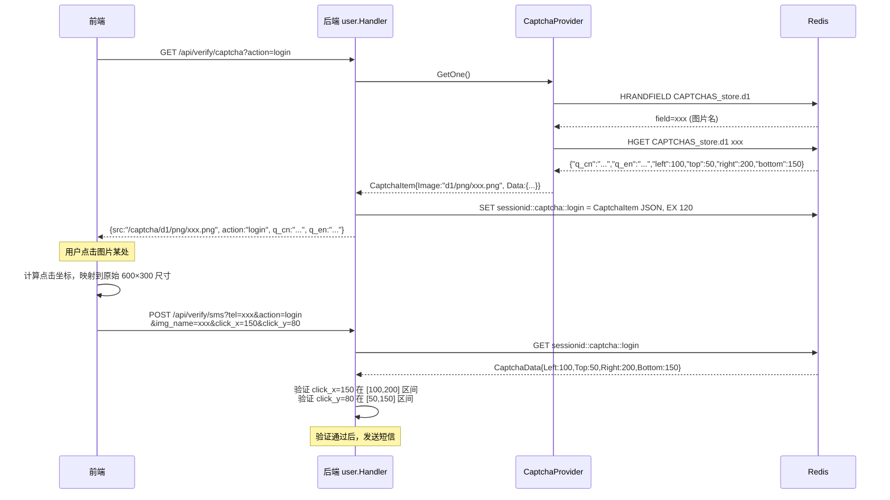
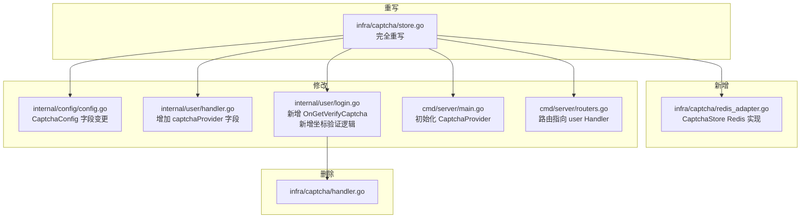
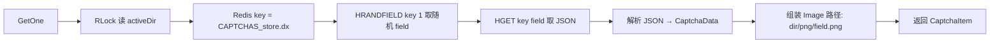

# Captcha 重构计划：改为点击式图形验证码

## 背景

当前 [`infra/captcha/store.go`](infra/captcha/store.go) 使用**文字型验证码**（从 `index.dat` 加载图片名→文本答案映射，用户输入文字匹配）。

新需求改为**点击式图形验证码**：用户看到验证码图片 + 中文/英文提问，点击图片中特定位置即可，后端验证点击坐标是否在预定矩形区域内。

---

## 核心差异：验证方式的变化

| | 旧（文字型） | 新（点击式） |
|---|---|---|
| 数据 | 文本 code | 坐标矩形 (Left,Top,Right,Bottom) + 问题文本 |
| 用户操作 | 输入看到的文字 | 点击图片特定位置 |
| 验证 | `strings.EqualFold(code, input)` | 检查 (x,y) 是否在矩形内 |
| 前端数据 | 发送文字 | 发送文件名 + 点击坐标 |
| 图片尺寸 | 未规定 | 600×300 (2:1)，前端建议显示 480×240 |

---

## 完整验证流程



---

## 涉及文件变更清单



---

## 详细步骤

### 步骤 1：修改配置模型 — [`internal/config/config.go`](internal/config/config.go:227)

当前 `CaptchaConfig` 只有一个 `Dir` 字段，需要扩展为：

```go
type CaptchaConfig struct {
    URLBase string // 验证码图片的 URL 访问基础路径，如 "/static/img/captchas/"
    DirBase string // 服务器本地文件系统路径，如 "./frontend/static/img/captchas/"
}
```

`DirBase` 下包含 `d1/` 和 `d2/` 两个子目录，各含 `png/` 和 `json/` 子目录。

注意：注释说 `captchaDirBase` 和 `captchaURLBase` 指向同一目录，只是前者用于服务端读取，后者用于前端 URL 拼接。

---

### 步骤 2：完全重写 [`infra/captcha/store.go`](infra/captcha/store.go)

**删除全部现有代码，仅保留 `package captcha`**。新文件包含：

#### 2a. 数据模型

```go
// CaptchaData 验证码的问题和点击区域答案。
type CaptchaData struct {
    QCn          string `json:"q_cn"`          // 中文提问
    QEn          string `json:"q_en"`          // 英文提问
    Left, Top    int    `json:"left,top"`      // 点击区域左上角
    Right, Bottom int   `json:"right,bottom"`  // 点击区域右下角
}

// CaptchaItem 单个验证码条目。
type CaptchaItem struct {
    Image string      `json:"image"` // 图片 URL 相对路径，如 "d1/png/xxx.png"
    Data  CaptchaData `json:"data"`  // 验证码数据
}
```

#### 2b. CaptchaStore 接口（抽象 Redis 操作）

```go
// CaptchaStore 验证码数据的存储抽象，由调用方提供 Redis 实现。
type CaptchaStore interface {
    HSet(ctx context.Context, key, field string, value interface{}) error
    HGet(ctx context.Context, key, field string) (string, error)
    HRandField(ctx context.Context, key string, count int) ([]string, error)
    Del(ctx context.Context, key ...string) error
}
```

#### 2c. CaptchaProvider struct

```go
type CaptchaProvider struct {
    captchaURLBase string        // 图片 URL 基础路径
    captchaDirBase string        // 本地文件系统路径
    activeDir      string        // 当前活动目录 "d1" 或 "d2"
    store          CaptchaStore  // Redis 存储
    mu             sync.RWMutex  // 保护 activeDir，GetOne/Refresh 并发安全
}
```

#### 2d. 构造函数 `NewCaptchaProvider()`

1. 调用内部 `loadAndStore(ctx, dir, store)` 加载 d1
2. 调用内部 `loadAndStore(ctx, dir, store)` 加载 d2
3. 检查 `d1.active` / `d2.active` 文件，设置 `activeDir`
4. 默认 `activeDir = "d1"`
5. 加载的 map 数据写入 Redis 后丢弃（注释第 5 条）

#### 2e. 内部方法 `loadAndStore(ctx, dir, store)`

此方法供 d1/d2 共用（注释第 3.1/3.2 条要求）：

1. 读取 `{captchaDirBase}/{dir}/png/` 下所有 `.png` 文件 → 提取文件名（无后缀无路径）
2. 读取 `{captchaDirBase}/{dir}/json/` 下所有 `.json` 文件 → `map[filename]jsonBytes`
3. 遍历 PNG 文件名，检查是否存在对应 JSON → 不存在则跳过
4. 将匹配的 `map[filename]jsonBytes` 用 `HSet` 逐条写入 Redis 哈希表，key = `CAPTCHAS_store.{dir}`
5. 丢弃 map 释放内存

#### 2f. `GetOne() (*CaptchaItem, error)` — 核心方法



注释第 6 条要求：通过 `activeDir` 组装 Redis key，用 `HRANDFIELD` 随机获取一个 field（图片名），返回图片 URL 和 JSON 数据。

#### 2g. `Refresh(activeDir string) error` — 刷新方法

注释第 7 条要求：
1. `mu.Lock()` 写锁
2. 清空 Redis 中原有数据（`Del CAPTCHAS_store.{oldDir}`）
3. 调用 `loadAndStore(ctx, activeDir, store)` 重新加载
4. 更新 `p.activeDir = activeDir`
5. 解锁

并发模型：`GetOne` 用 `RLock`（多个可并行），`Refresh` 用 `Lock`（与 GetOne 互斥）。

---

### 步骤 3：实现 Redis 适配器 — 新建 [`infra/captcha/redis_adapter.go`](infra/captcha/)

```go
type redisStore struct {
    client *redis.Client
}

func (s *redisStore) HSet(ctx context.Context, key, field string, value interface{}) error {
    return s.client.HSet(ctx, key, field, value).Err()
}
func (s *redisStore) HGet(ctx context.Context, key, field string) (string, error) {
    return s.client.HGet(ctx, key, field).Result()
}
func (s *redisStore) HRandField(ctx context.Context, key string, count int) ([]string, error) {
    return s.client.HRandField(ctx, key, count).Result()
}
func (s *redisStore) Del(ctx context.Context, key ...string) error {
    return s.client.Del(ctx, key...).Err()
}
```

**设计说明**：不直接暴露 `*redis.Client`，定义接口以便测试可 mock。

---

### 步骤 4：迁移 Handler 到 [`internal/user/login.go`](internal/user/login.go)

注释第 8 条明确指出：当前 handler 实现位置错误，应移到 `internal/user`。

#### 4a. 修改 [`internal/user/handler.go`](internal/user/handler.go)

增加字段：

```go
type Handler struct {
    sessionManager  *session.Manager
    cookieName      string
    logger          zylog.Logger
    avatarDir       string
    smsCodeCache    *cache.SMSCodeCache
    captchaProvider *captcha.CaptchaProvider  // 新增
}
```

更新 `NewHandler()` 签名增加 `captchaProvider` 参数。

#### 4b. 在 [`internal/user/login.go`](internal/user/login.go) 实现 `OnGetVerifyCaptcha`

```go
func (h *Handler) OnGetVerifyCaptcha(w http.ResponseWriter, r *http.Request) {
    // 1. 解析 session + action 参数
    // 2. 验证 action 合法性（login/resetpwd）
    // 3. 调用 h.captchaProvider.GetOne() 获取随机验证码
    // 4. 将 CaptchaItem 存入 Redis 缓存
    //    key:   {sessionID}::captcha::{action}
    //    value: CaptchaItem JSON
    //    TTL:   120 秒（2分钟）
    // 5. 返回 JSON:
    //    { src: "/captcha/d1/png/xxx.png", action: "login",
    //      q_cn: "请点击图片中的花朵", q_en: "Please click the flower" }
}
```

#### 4c. 在 `OnGetSMSVerifyCode` 中增加点击坐标验证

当前验证逻辑（第 48 行）：

```go
exists, matches := captcha.VerifyCaptchaCacheEx(sess, action, captchaCode)
```

修改为坐标验证：

```go
func (h *Handler) OnGetSMSVerifyCode(w http.ResponseWriter, r *http.Request) {
    // ... 现有参数解析 ...

    // 新增参数：img_name, click_x, click_y
    imgName := r.URL.Query().Get("img_name")
    clickX := r.URL.Query().Get("click_x")
    clickY := r.URL.Query().Get("click_y")

    // 从 Redis 获取之前存储的 CaptchaItem
    cacheKey := sessionID + "::captcha::" + action
    // ... HGET redis ...

    // 验证：
    // 1. img_name 是否匹配缓存的图片名
    // 2. click_x, click_y 是否在 CaptchaData 的矩形区域内
    //    (left ≤ x ≤ right) && (top ≤ y ≤ bottom)

    // ... 后续 SMS 发送逻辑不变 ...
}
```

---

### 步骤 5：修改 [`cmd/server/main.go`](cmd/server/main.go:156)

将旧的：

```go
if count, err := captcha.Refresh(cfg.Captcha.Dir); err != nil { ... }

captchaHandler := captcha.NewHandler(
    chatHandler.GetSessionManager(),
    chatHandler.GetCookieName(),
)
```

改为：

```go
// 从 ChatAgent 获取 Redis client（如果可用）
var captchaStore captcha.CaptchaStore
if redisClient := chatHandler.GetRedisClient(); redisClient != nil {
    captchaStore = captcha.NewRedisStore(redisClient)
} else {
    // Redis 不可用时，使用内存实现（开发/测试用）
    captchaStore = captcha.NewMemoryStore()
}

captchaProvider := captcha.NewCaptchaProvider(
    cfg.Captcha.URLBase,
    cfg.Captcha.DirBase,
    captchaStore,
)

// 将 captchaProvider 传给 userHandler
userHandler := user.NewHandler(
    chatHandler.GetSessionManager(),
    chatHandler.GetCookieName(),
    chatHandler.GetLogger(),
    chatHandler.GetAvatarDir(),
    chatHandler.GetSMSCodeCache(),
    captchaProvider,  // 新增参数
)
```

需要确认 `ChatAgent` 是否有 `GetRedisClient()` 方法暴露 Redis client。如果没有，需要新增，或者通过其他方式获取。

---

### 步骤 6：修改 [`cmd/server/routers.go`](cmd/server/routers.go:111)

1. 移除 `initRouters` 的 `captchaHandler *captcha.Handler` 参数
2. 将路由注册从：
   ```
   srv.GET("/api/verify/captcha", captchaHandler.OnGetVerifyCaptcha)
   ```
   改为：
   ```
   srv.GET("/api/verify/captcha", userHandler.OnGetVerifyCaptcha)
   ```
3. 移除 `"BrainForever/infra/captcha"` import（如果不再直接引用）

同时移除 `main.go` 中创建 `captchaHandler` 的代码行。

---

### 步骤 7：删除旧文件

删除 [`infra/captcha/handler.go`](infra/captcha/handler.go) — 其功能已迁移到 `internal/user/login.go`。

---

### 步骤 8：前端改造 — [`frontend/signin/index.html`](frontend/signin/index.html)

#### 8a. 移除文字输入，改为图片点击

**旧 UI：**
- `<input>` 文本框输入验证码字符
- 点击"确认"发送 `captcha_code` 参数

**新 UI：**
- 显示验证码图片（尺寸可变，建议 `max-width: 480px` 保持比例）
- 显示问题文本（`q_cn` / `q_en`），引导用户点击图片中的目标
- 在 `` 上绑定 `click` 事件，**捕获点击坐标并映射到原始尺寸**
- 点击后立即记录坐标，在点击位置显示视觉反馈（圆点标记）
- 用户若点错位置，点击"换一张"重新获取验证码即可重新开始

#### 8b. 坐标映射逻辑

```javascript
img.addEventListener('click', function(e) {
    var rect = this.getBoundingClientRect();
    var clickX = e.clientX - rect.left;          // 显示区域内的坐标
    var clickY = e.clientY - rect.top;

    // 映射到原始图片尺寸（naturalWidth/naturalHeight 由浏览器自动提供）
    var origX = Math.round((clickX / this.clientWidth)  * this.naturalWidth);
    var origY = Math.round((clickY / this.clientHeight) * this.naturalHeight);

    // 存储坐标供确认时使用
    captchaClickX = origX;
    captchaClickY = origY;
    captchaImgName = currentImgName; // 从 API 响应的 src 中提取
});
```

**关键点**：使用 `HTMLImageElement.naturalWidth / naturalHeight` 获取原始尺寸，与 CSS 缩放无关。详见 [MDN: HTMLImageElement.naturalWidth](https://developer.mozilla.org/en-US/docs/Web/API/HTMLImageElement/naturalWidth)。

#### 8c. API 请求/响应格式变更

**`GET /api/verify/captcha` 响应（新格式）：**
```json
{
    "src": "/captcha/d1/png/xxx.png",
    "action": "login",
    "q_cn": "请点击图片中的花朵",
    "q_en": "Please click the flower"
}
```

**`POST /api/verify/sms` 参数（新格式）：**
```
?tel=138xxxx&action=login&img_name=d1/png/xxx.png&click_x=150&click_y=80
```

#### 8d. 具体 DOM 变更清单

| 元素 | 变更 |
|---|---|
| `#captchaInput`（文本框） | **删除**，不再需要文字输入 |
| `#captchaImg` | **添加** `click` 事件监听；移除 `maxlength` 等图片无关属性 |
| `.captcha-body` | **添加** 问题文本展示区域（`<p id="captchaQuestion">`） |
| `#captchaConfirmBtn` | 保留，但确认时不再校验文本框内容，改为校验坐标是否已记录 |
| `.captcha-reload-btn` | 保留，刷新时重新获取验证码图片 + 问题文本 |

#### 8e. 新增/修改的 JS 变量

```javascript
var captchaClickX = null;      // 记录点击坐标 X（原始尺寸）
var captchaClickY = null;      // 记录点击坐标 Y（原始尺寸）
var captchaImgName = '';       // 当前验证码图片名（从 src 提取）
var captchaQuestionCn = '';    // 当前中文问题
var captchaQuestionEn = '';    // 当前英文问题
```

#### 8f. 视觉点击反馈

在点击位置添加一个临时圆点标记，让用户确认自己点击的位置：

```javascript
function showClickMarker(imgEl, clientX, clientY) {
    // 移除旧标记
    var old = document.querySelector('.captcha-click-marker');
    if (old) old.remove();

    var marker = document.createElement('div');
    marker.className = 'captcha-click-marker';
    var rect = imgEl.getBoundingClientRect();
    marker.style.left = (clientX - rect.left - 8) + 'px';
    marker.style.top  = (clientY - rect.top - 8) + 'px';
    imgEl.parentElement.appendChild(marker);
}
```

对应 CSS：
```css
.captcha-click-marker {
    position: absolute;
    width: 16px; height: 16px;
    border: 2px solid #ff4444;
    border-radius: 50%;
    background: rgba(255, 68, 68, 0.3);
    pointer-events: none;
}
```

注意：`.captcha-img-wrap` 需要设置 `position: relative` 作为定位容器。

---

## 综合 Todo 清单

1. **`internal/config/config.go`** — 重构 `CaptchaConfig`：`Dir` → `URLBase` + `DirBase`
2. **`infra/captcha/store.go`** — 完全重写：定义 `CaptchaData` / `CaptchaItem`、`CaptchaStore` 接口、`CaptchaProvider` struct（构造函数、`loadAndStore`、`GetOne`、`Refresh`）
3. **`infra/captcha/redis_adapter.go`**（新建）— 实现 `CaptchaStore` 接口的 Redis 适配器 + 可选的内存实现
4. **`internal/user/handler.go`** — `Handler` 增加 `captchaProvider` 字段，更新 `NewHandler` 签名
5. **`internal/user/login.go`** — 实现 `OnGetVerifyCaptcha`（获取验证码）+ 修改 `OnGetSMSVerifyCode`（坐标验证）
6. **`cmd/server/main.go`** — 初始化 `CaptchaProvider`，传入 `user.NewHandler`
7. **`cmd/server/routers.go`** — `GET /api/verify/captcha` 路由指向 `userHandler.OnGetVerifyCaptcha`，移除 `captchaHandler`
8. **`frontend/signin/index.html`** — 前端改造：文字型 → 点击式验证码
9. **删除 `infra/captcha/handler.go`** — 功能已迁移完毕
