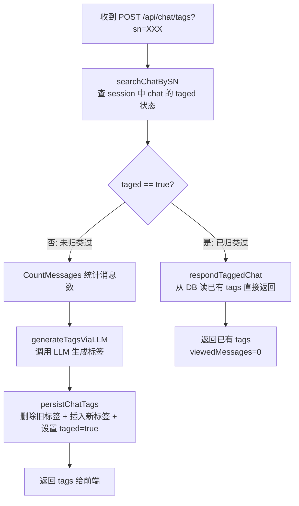
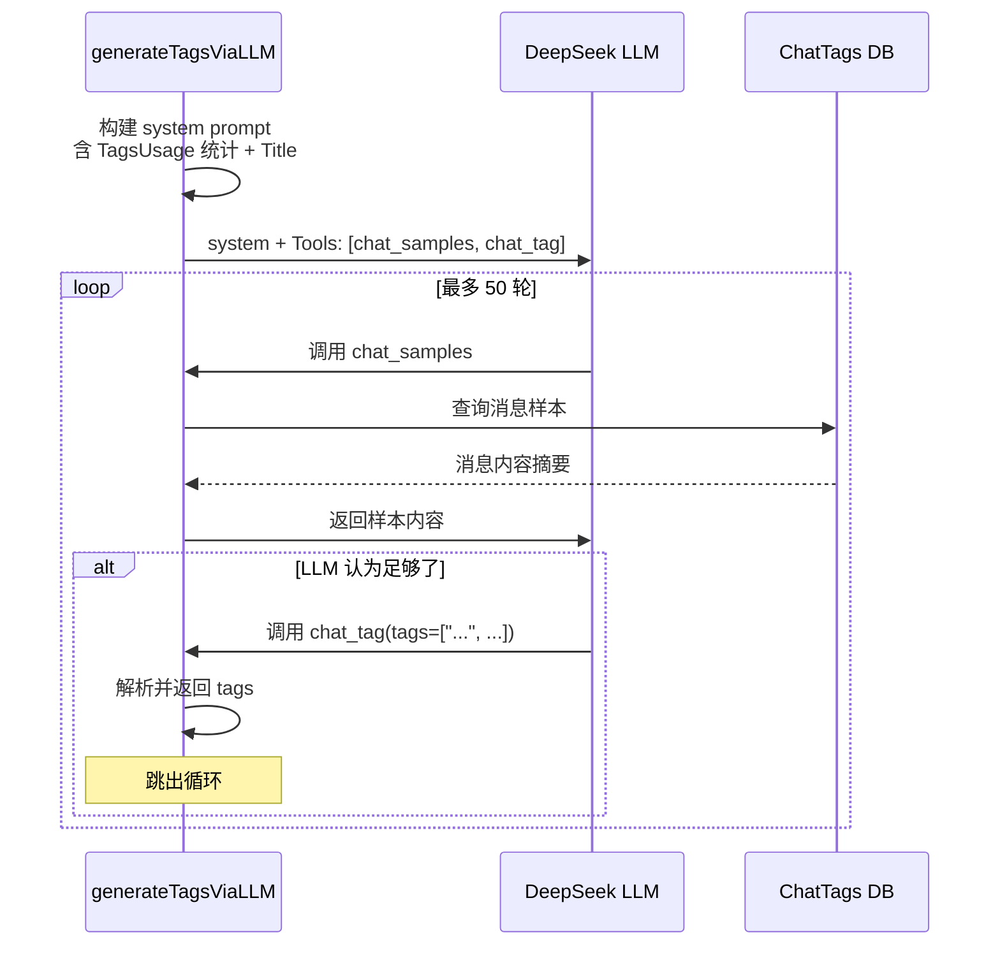

# 对话话题自动打 Tag 计划

## 1. 现状：手动打 Tag 完整流程

### 1.1 用户入口

用户通过侧边栏对话列表的右键菜单 → "归类" 按钮触发。相关代码：
- 菜单构建： [`frontend/static/chat-list.js:528-582`](../../frontend/static/chat-list.js:528)
- API 调用： [`frontend/static/chat-api.js:500-516`](../../frontend/static/chat-api.js:500)
- 路由注册： [`cmd/server/routers.go:60`](../../cmd/server/routers.go:60) — `POST /api/chat/tags`

### 1.2 前端流程

```mermaid
sequenceDiagram
    participant User
    participant ChatListJS as chat-list.js
    participant ChatApiJS as chat-api.js
    participant AlpineStore as Alpine Store chats
    
    User->>ChatListJS: 右键点击 chat → 弹出菜单
    User->>ChatListJS: 点击 "归类"
    ChatListJS->>ChatListJS: 显示 "📑 正在申请归类" Toast
    ChatListJS->>ChatApiJS: fetchChatTags(chat.sn)
    ChatApiJS->>Backend: POST /api/chat/tags?sn=XXX
    Backend-->>ChatApiJS: { sn, title, tags[], totalMessages, viewedMessages, allMessagesViewed }
    ChatApiJS--->>ChatListJS: 返回结果
    ChatListJS->>ChatListJS: 显示归类结果 Toast（标签、标题、查看统计）
    ChatListJS->>AlpineStore: loadChatGroups() 刷新分类 Tab
```

### 1.3 后端核心逻辑

后端入口在 [`internal/agent/on_tag.go:43`](../../internal/agent/on_tag.go:43) `OnGenerateChatTags`：



### 1.4 LLM 标签生成过程

[`generateTagsViaLLM`](../../internal/agent/on_tag.go:178) 使用多轮 Tool Calling 循环：



### 1.5 数据持久化

[`persistChatTags`](../../internal/agent/on_tag.go:96) 完成以下操作：

1. **删除旧标签**：调用 [`DeleteChatTagsByChatID`](../../internal/store/tags.go:112) 清除该 chat 的所有已有标签
2. **插入新标签**：对每个 tag 调用 [`InsertChatTag`](../../internal/store/tags.go:68)，写入 `chat_tags` 表
3. **标记已分类**：调用 [`UpdateChatTagged(chatID, true)`](../../internal/store/chats.go:223) 设置 `taged=true`
4. **更新内存缓存**：同步更新 `sess.User.Chats[i].Taged = true`

### 1.6 数据库模型

**表结构**（来自 [`deploy/settings_template/init.template.sql`](../../deploy/settings_template/init.template.sql)）：

```sql
-- chat_sessions 表相关字段
taged    BOOLEAN NOT NULL DEFAULT FALSE,  -- 是否已分类（一次性标记）

-- chat_tags 表（无 UNIQUE 约束，一个 chat 可有多条 tag）
id        BIGSERIAL PRIMARY KEY,
chat_id   BIGINT NOT NULL REFERENCES chat_sessions(id) ON DELETE CASCADE,
tag       TEXT NOT NULL,
create_at TIMESTAMPTZ NOT NULL DEFAULT NOW()
```

---

## 2. 关键设计问题分析

### 2.1 一个 chat 被归类后是否允许再次归类？

**目前设计：不允许。** 证据如下：

1. **`taged` 布尔标记**：[`chat_sessions.taged`](../../deploy/settings_template/init.template.sql:61) 是一个 `BOOLEAN NOT NULL DEFAULT FALSE`，一旦设为 `true` 就不会变回 `false`。
2. **`searchChatBySN` 守卫**：[`OnGenerateChatTags`](../../internal/agent/on_tag.go:65) 中有如下判断：
   ```go
   if taged {
       h.respondTaggedChat(w, chatID, chatSN, chatTitle)
       return
   }
   ```
   一旦 `taged == true`，直接返回已有标签，不再调用 LLM。
3. **`persistChatTags` 设死**：每次归类成功后调用 [`UpdateChatTagged(chatID, true)`](../../internal/agent/on_tag.go:114) 将 `taged` 设为 `true`，且没有任何代码将其改回 `false`。

**结论**：当前设计是一个 chat **只能被归类一次**。再次点击"归类"只是从 DB 读取已有标签并返回。

---

## 3. chatGroups 客户端自我维护改造

### 3.1 架构思路

- chatGroups 在**页面加载时**从后端加载一次
- 后续不再在切 Tab 时重复请求后端
- 所有数据变更（删除/恢复/重新分类）由前端在客户端直接操作 chatGroups
- 真正需要时（如用户手动点击刷新按钮）才重新拉取

### 3.2 数据模型变更

`chatGroups` 中每个 chat 项增加 `deleted` 字段：

```js
// 当前
{ sn: "xxx", title: "xxx", tag: "xxx", create_at: "...", update_at: "..." }

// 改为
{ sn: "xxx", title: "xxx", tag: "xxx", deleted: false, create_at: "...", update_at: "..." }
```

### 3.3 初始化加载时机

在 [`alpine-store.js`](../../frontend/static/alpine-store.js) 的页面初始化流程中（`init()` 或类似的启动函数），添加 `loadChatGroups()` 调用。确保在页面加载完成后 chatGroups 数据已就绪。

### 3.4 分类 Tab 切换不再重新加载

修改 [`sidebarTab` setter](../../frontend/static/alpine-store.js:414) 中切换至 category Tab 的逻辑，仅在 `chatGroups` 为空时加载：

```js
// 当前（每次都请求后端）
if (tab === 'category') {
    this.loadChatGroups();
}

// 改为（有缓存则不请求）
if (tab === 'category' && Object.keys(this.chatGroups).length === 0) {
    this.loadChatGroups();
}
```

### 3.5 删除/恢复操作 — 改用 deleted 字段

#### 软删除（移入回收站）

修改 [`handleDelete`](../../frontend/static/chat-list.js:1123-1143)：

```js
// 当前：从 chatGroups 中移除
// 改为：设 deleted=true，保留在 chatGroups 中（响应式隐藏）
```

#### 从回收站恢复

修改 [`handleRestore`](../../frontend/static/chat-list.js:1230-1262)：

```js
// 当前：不处理 chatGroups（需要切 Tab 刷新才恢复）
// 改为：设 deleted=false，chatGroups 中 chat 立即恢复显示
```

#### 永久删除

修改 [`handlePermanentDelete`](../../frontend/static/chat-list.js:1267-1335)：

```js
// 当前：从 chatGroups 中移除
// 改为：保持从 chatGroups 中移除（物理删除，前端不再维护）
```

#### 清空回收站

修改 [`handleEmptyTrash`](../../frontend/static/chat-list.js:1340-1363)：

```js
// 当前：不处理 chatGroups（需要切 Tab 刷新）
// 改为：遍历 chatGroups 中 deleted=true 的 chat，从 chatGroups 中移除
```

### 3.6 重新分类操作 — 前端自我更新

#### 归类成功后

修改 [`chat-list.js:565-569`](../../frontend/static/chat-list.js:565)：

```js
// 当前：
chatsStore.loadChatGroups();

// 改为：
chatsStore.moveChatBetweenTags(chat.sn, result.tags);
```

#### 新增 `moveChatBetweenTags` 方法

在 [`alpine-store.js`](../../frontend/static/alpine-store.js) 中新增方法：

```js
moveChatBetweenTags: function(sn, newTags) {
    // 1. 从所有旧分组中移除该 chat
    for (var tag in this.chatGroups) {
        this.chatGroups[tag] = this.chatGroups[tag].filter(c => c.sn !== sn);
        if (this.chatGroups[tag].length === 0) delete this.chatGroups[tag];
    }
    
    // 2. 加入新分组
    var displayTag = tag || '';  // 空串显示为"不知所云"
    for (var tag of newTags) {
        if (!this.chatGroups[displayTag]) this.chatGroups[displayTag] = [];
        if (!this.chatGroups[displayTag].some(c => c.sn === sn)) {
            this.chatGroups[displayTag].push({
                sn: sn,
                title: '',  // 可从 store.chats 中查找
                tag: tag,
                deleted: false,
                create_at: new Date().toISOString(),
                update_at: new Date().toISOString(),
            });
        }
    }
    
    // 3. 触发 Alpine 响应式更新
    this.chatGroups = Object.assign({}, this.chatGroups);
}
```

### 3.7 前端 Alpine 模板调整

#### 分类 Tab 模板

修改 [`frontend/index.html:355-384`](../../frontend/index.html:355)，添加 `x-show` 条件过滤已删除的 chat：

```html
<template x-for="chat in items" :key="chat.sn">
    <div class="chat-item"
         :class="{
             'chat-item-deleted': chat.deleted,
             active: ...
         }"
         x-show="!chat.deleted"
         @click="...">
```

### 3.8 影响分析

| 变更项 | 影响范围 |
|--------|---------|
| `alpine-store.js` | 初始化加载 + `moveChatBetweenTags` 新方法 + sidebarTab 守卫 |
| `chat-list.js` | `handleDelete` / `handleRestore` / `handlePermanentDelete` / `handleEmptyTrash` 中的 chatGroups 操作 + 归类后不再全量刷新 |
| `index.html` | 分类 Tab 模板增加 `x-show="!chat.deleted"` |
| `chat-api.js` | 无需改动 |
| 后端 | 无需改动 |

---

## 4. 后续待确认的问题

| # | 问题 | 建议 |
|---|------|------|
| 1 | chat 菜单中展示 tags 的方案 | 后续处理 |
| 2 | 自动打 tag 的触发时机 | 后续处理 |
| 3 | 是否需要后端定时任务兜底 | 后续处理 |
