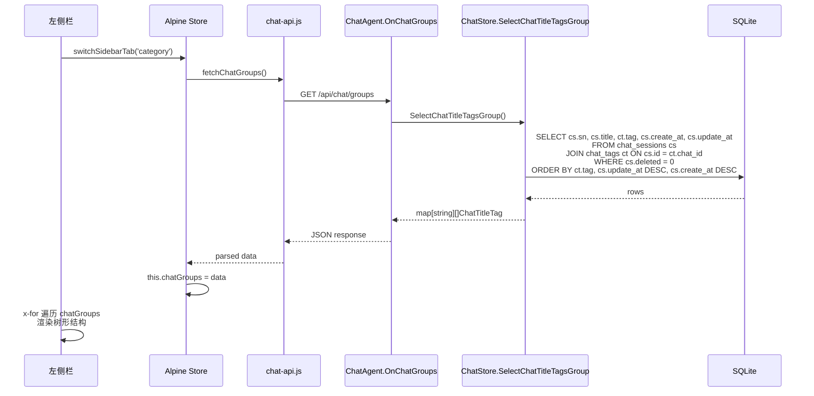

# Chat Groups 类别树形结构改造计划

## 概述

将原有的 `/api/chat/tags/group` 接口（返回 `map[string]int` 标签计数）改造为 `/api/chat/groups` 接口（返回 `map[string][]ChatTitleTag` 标签分组对话列表），并在前端左侧栏"类别"Tab 中以树形结构展示。

---

## 1. 后端改造

### 1.1 数据层：新增 `SelectChatTitleTagsGroup` 方法

**文件**: [`internal/local/store/chats.go`](internal/local/store/chats.go)

新增方法 `SelectChatTitleTagsGroup()`，功能：

- SQL 联表查询：`chat_sessions` JOIN `chat_tags`，筛选 `cs.deleted = 0`
- 查询字段：`cs.sn`, `cs.title`, `ct.tag`, `cs.create_at`, `cs.update_at`
- 结果按 `ct.tag` 分组，组内先按 `cs.update_at DESC`，再按 `cs.create_at DESC` 排序
- 返回类型 `map[string][]ChatTitleTag`，key 为 tag 名称

**`ChatTitleTag` 结构体修改**：在现有字段基础上增加 `UpdateAt` 字段：

```go
type ChatTitleTag struct {
    SN    string `db:"sn" json:"sn"`
    Title string `db:"title" json:"title"`
    Tag   string `db:"tag" json:"tag"`

    CreateAt time.Time `db:"create_at" json:"create_at"`
    UpdateAt time.Time `db:"update_at" json:"update_at"` // 新增：用于排序
}
```

```go
// SelectChatTitleTagsGroup 查询所有已分类对话，按 tag 分组，
// 组内先按 update_at 逆序，再按 create_at 逆序。
// 返回 map[string][]ChatTitleTag，key 为 tag 值。
func (s *ChatStore) SelectChatTitleTagsGroup() (map[string][]ChatTitleTag, error) {
    var rows []ChatTitleTag
    err := s.db.Select(&rows,
        `SELECT cs.sn, cs.title, ct.tag, cs.create_at, cs.update_at
         FROM chat_sessions cs
         JOIN chat_tags ct ON cs.id = ct.chat_id
         WHERE cs.deleted = 0
         ORDER BY ct.tag, cs.update_at DESC, cs.create_at DESC`,
    )
    if err != nil {
        return nil, fmt.Errorf("failed to select chat title tag groups. %w", err)
    }

    result := make(map[string][]ChatTitleTag)
    for _, r := range rows {
        result[r.Tag] = append(result[r.Tag], r)
    }
    // 注：由于 SQL 中已按 ct.tag, cs.update_at DESC, cs.create_at DESC 排序，
    // 每个 result[r.Tag] 内部天然是 update_at 优先、create_at 次之的逆序。
    return result, nil
}
```

> **注意**：`ChatTitleTag` 结构体原定义在 [`internal/local/store/chats.go:625-631`](internal/local/store/chats.go:625)，需新增 `UpdateAt` 字段。排序逻辑改为先按 `update_at DESC` 再按 `create_at DESC`。

### 1.2 Handler 层：新增 `OnChatGroups`，废弃 `OnGetTagsGroups`

**文件**: [`internal/local/agent/on_tag.go`](internal/local/agent/on_tag.go)

- 新增方法 `OnChatGroups`，处理 `GET /api/chat/groups`
- 内部调用 `session.chatsStore.SelectChatTitleTagsGroup()`
- 直接 `json.NewEncoder(w).Encode(result)` 返回 `map[string][]ChatTitleTag`
- 保留 `OnGetTagsGroups` 方法但不再被路由引用，或直接删除（推荐删除以清理代码）

```go
// OnChatGroups handles GET /api/chat/groups — 返回按标签分组的对话列表，
// 格式为 map[string][]ChatTitleTag，组内先按 update_at 逆序，再按 create_at 逆序。
func (h *ChatAgent) OnChatGroups(w http.ResponseWriter, r *http.Request) {
    if r.Method != http.MethodGet {
        http.Error(w, "method not allowed", http.StatusMethodNotAllowed)
        return
    }

    sessionID := h.resolveSessionID(w, r)
    session := h.sessionManager.GetOrCreate(sessionID)

    groups, err := session.chatsStore.SelectChatTitleTagsGroup()
    if err != nil {
        h.logger.Errorf("failed to select chat title tag groups: %v", err)
        toolset.WriteJSONError(w, i18n.TL(h.defaultLang, "api_error_internal"), http.StatusInternalServerError)
        return
    }

    w.Header().Set("Content-Type", "application/json")
    json.NewEncoder(w).Encode(groups)
}
```

### 1.3 路由注册

**文件**: [`cmd/local-server/main.go`](cmd/local-server/main.go)

```go
// 删除（或注释掉）旧路由：
// srv.GET("/api/chat/tags/group", chatHandler.OnGetTagsGroups)

// 新增新路由：
srv.GET("/api/chat/groups", chatHandler.OnChatGroups)
```

---

## 2. 前端改造

### 2.1 API 层：新增 `fetchChatGroups`

**文件**: [`frontend/static/chat-api.js`](frontend/static/chat-api.js)

新增函数替代 `fetchTagsGroups`：

```javascript
/**
 * fetchChatGroups 获取按标签分组的对话列表。
 * @returns {Promise<Object<string, Array<{sn: string, title: string, tag: string, create_at: string, update_at: string}>>|null>}
 */
export async function fetchChatGroups() {
    try {
        const response = await fetch('/api/chat/groups');
        if (!response.ok) {
            console.warn('获取聊天分组失败:', response.status);
            return null;
        }
        return await response.json();
    } catch (e) {
        console.warn('获取聊天分组出错:', e);
        return null;
    }
}
```

> 原 `fetchTagsGroups` 函数可删除或保留（不再引用即可）。

### 2.2 Store 层：改造 `loadTagsGroups` 为 `loadChatGroups`

**文件**: [`frontend/static/alpine-store.js`](frontend/static/alpine-store.js)

需要做的改动：

1. **数据结构变更**：
   - 移除 `tagsGroups` 属性（原 `[{tag, count}, ...]`）
   - 新增 `chatGroups` 属性（`{tagName: [{sn, title, create_at}, ...], ...}`）

2. **`switchSidebarTab` 方法**：将 `loadTagsGroups` 调用改为 `loadChatGroups`

3. **`loadTagsGroups` → `loadChatGroups`** 方法重写：

```javascript
/**
 * loadChatGroups — 从后端加载按标签分组的对话列表，存入 chatGroups。
 * 空串 tag 分组排在最后，显示为"不知所云"。
 */
loadChatGroups: async function() {
    try {
        const { fetchChatGroups } = await import('/static/chat-api.js');
        const data = await fetchChatGroups();
        if (data && Object.keys(data).length > 0) {
            // 重新构造对象：非空 tag 按 key 排序，空串 tag 放在最后
            var ordered = {};
            var emptyItems = null;
            var keys = Object.keys(data).sort();
            for (var i = 0; i < keys.length; i++) {
                if (keys[i] === '') {
                    emptyItems = data[''];
                } else {
                    ordered[keys[i]] = data[keys[i]];
                }
            }
            // 空串 tag 分组追加到最后
            if (emptyItems) {
                ordered[''] = emptyItems;
            }
            this.chatGroups = ordered;
        } else {
            this.chatGroups = {};
        }
    } catch (e) {
        console.warn('加载聊天分组失败:', e);
        this.chatGroups = {};
    }
},
```

4. **移除** `_buildTestTags` 方法（不再需要测试数据）

5. **`resetToBlank` 等方法**中清理相关数据

### 2.3 模板层：侧边栏类别 Tab 树形渲染

**文件**: [`frontend/index.html`](frontend/index.html)

将第 298-301 行的占位内容替换为树形结构模板：

```html
<!-- 类别 Tab 内容 — 树形分组 -->
<div class="sidebar-content" x-data x-show="$store.chats.sidebarTab === 'category'">
    <!-- 空状态 -->
    <template x-if="Object.keys($store.chats.chatGroups || {}).length === 0">
        <div class="chat-list-empty">暂无分类</div>
    </template>

    <!-- 分组列表：按 tag 遍历 -->
    <template x-for="(items, tag) in ($store.chats.chatGroups || {})" :key="tag">
        <div class="chat-group">
            <div class="chat-group-header"
                @click="$store.chats.toggleCollapse('cat_' + tag)"
                @mouseenter="$store.chats.closeContextMenu()">
                <span class="collapse-arrow"
                    :class="{ collapsed: $store.chats.isCollapsed('cat_' + tag) }">&#x276F;</span>
                <span x-text="tag === '' ? '不知所云' : tag"></span>
                <span class="chat-group-count" x-text="'(' + items.length + ')'"></span>
            </div>
            <div class="chat-group-body"
                :class="{ collapsed: $store.chats.isCollapsed('cat_' + tag) }">
                <template x-for="chat in items" :key="chat.sn">
                    <div class="chat-item"
                        :class="{ active: chat.sn === $store.chats.activeChatSN }"
                        :data-sn="chat.sn"
                        @click="$store.chats.selectChat(chat.sn)"
                        @mouseenter="$store.chats.maybeCloseContextMenu(chat)">
                        <svg class="chat-item-loading" x-show="$store.chats.isStreamingBySN(chat.sn)"
                            viewBox="0 0 24 24" width="14" height="14" fill="none"
                            stroke="currentColor" stroke-width="2.5" stroke-linecap="round"
                            x-html="ICON_LOADING">
                        </svg>
                        <div class="chat-item-title" x-text="chat.title || '新对话'"></div>
                    </div>
                </template>
            </div>
        </div>
    </template>
</div>
```

### 2.4 CSS 样式补充

**文件**: [`frontend/static/chat-list.css`](frontend/static/chat-list.css)

可复用现有的 `.chat-group`、`.chat-group-header`、`.chat-group-body`、`.chat-item`、`.chat-item-title` 等样式。

可能需要新增：
- `.chat-group-count` — 分组右侧的对话数量，小字号灰色文字

---

## 3. API 响应示例

```json
{
  "技术": [
    {"sn": "chat-abc123", "title": "如何配置Nginx反向代理", "tag": "技术", "create_at": "2026-06-28T10:30:00+08:00", "update_at": "2026-06-29T15:00:00+08:00"},
    {"sn": "chat-def456", "title": "Go语言并发模型详解", "tag": "技术", "create_at": "2026-06-25T14:20:00+08:00", "update_at": "2026-06-26T09:00:00+08:00"}
  ],
  "生活": [
    {"sn": "chat-ghi789", "title": "周末爬山计划", "tag": "生活", "create_at": "2026-06-30T09:00:00+08:00", "update_at": "2026-06-30T09:00:00+08:00"}
  ],
  "": [
    {"sn": "chat-jkl012", "title": "一些随想", "tag": "", "create_at": "2026-06-20T18:00:00+08:00", "update_at": "2026-06-20T18:00:00+08:00"}
  ]
}
```

前端对空串 tag 分组显示为"不知所云"，且始终排在最末尾。

---

## 4. 数据流图



## 5. 变更文件清单

| # | 文件 | 操作 | 说明 |
|---|------|------|------|
| 1 | [`internal/local/store/chats.go`](internal/local/store/chats.go) | 新增方法 + 修改结构体 | 添加 `SelectChatTitleTagsGroup()`；`ChatTitleTag` 增加 `UpdateAt` 字段 |
| 2 | [`internal/local/agent/on_tag.go`](internal/local/agent/on_tag.go) | 新增 + 删除 | 新增 `OnChatGroups`，可删除 `OnGetTagsGroups` |
| 3 | [`cmd/local-server/main.go`](cmd/local-server/main.go) | 修改路由 | 替换路由注册 |
| 4 | [`frontend/static/chat-api.js`](frontend/static/chat-api.js) | 新增 + 删除 | 新增 `fetchChatGroups`，删除 `fetchTagsGroups` |
| 5 | [`frontend/static/alpine-store.js`](frontend/static/alpine-store.js) | 修改 | 替换 `tagsGroups`/`loadTagsGroups`/`_buildTestTags` 为 `chatGroups`/`loadChatGroups` |
| 6 | [`frontend/index.html`](frontend/index.html) | 修改 | 类别 Tab 占位替换为树形模板 |
| 7 | [`frontend/static/chat-list.css`](frontend/static/chat-list.css) | 可能新增 | 补充 `.chat-group-count` 等样式 |

## 6. 注意事项

1. **SQL 排序**：`ORDER BY ct.tag, cs.update_at DESC, cs.create_at DESC` 确保同一 tag 内的对话先按更新时间逆序，再按创建时间逆序排列。
2. **空 tag 处理**：数据库中存在空串 tag（LLM 未返回标签时保存的占位），后端原样返回。前端在 `loadChatGroups` 中将其排到最后，显示为"不知所云"。
3. **前端 tag 排序**：`loadChatGroups` 中对非空 tag 按 key 字母序排列（`Object.keys(data).sort()`），确保每次刷新顺序一致。空串 tag 分组强制追加到最后。
4. **折叠状态**：复用已有的 `collapsedGroups` 和 `toggleCollapse` 机制，key 前缀 `cat_` 避免与时间线 Tab 的折叠 key 冲突。
5. **点击选择对话**：`@click="$store.chats.selectChat(chat.sn)"` 直接复用现有的选择逻辑。
