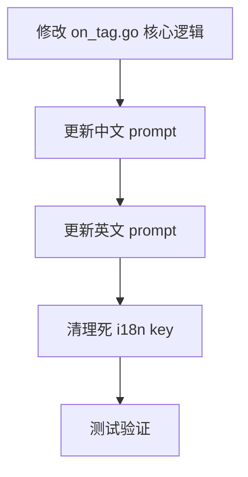

# Chat Tag 分类优化：改为只传标题

## 问题背景

当前 [`OnMakeChatTags`](internal/local/agent/on_tag.go:37) 在调用 LLM 进行话题分类时，同时发送了**标题和完整对话内容**：

```
标题：人与AI的50种分类

对话内容：
用户：...
AI：...
```

这导致了一个问题：**对话中的例子内容干扰了分类结果**。例如对话在讨论"人与AI的50种分类"这一元话题时，用户/AI 举了一个政治/国际话题的例子，LLM 看到具体内容后就误将对话归类为"社会与公共议题/政治与国际"，而忽略了标题反映的元话题。

## 解决方案：只传标题

改为只将**标题**发送给 LLM 进行分类，完全避免对话内容中的例子/细节干扰。

---

## 需要修改的文件

### 1. [`internal/local/agent/on_tag.go`](internal/local/agent/on_tag.go) — 核心逻辑变更

**当前行为**（第 78-117 行）：
1. 调用 `ListMessages()` 从 DB 加载全部消息
2. 调用 `convertDBMessagesToAgentMessages()` 转换消息格式
3. 拼接 `标题：{title}\n\n对话内容：\n用户：...\nAI：...`
4. 构建 `llmMessages` 并发送

**改为**：
1. 不再加载和转换消息（删除消息加载相关代码）
2. 只将标题作为 user message 内容发送
3. 简化后的 llmMessages 构建：
```go
llmMessages := []llm.Message{
    {Role: llm.RoleSystem, Content: systemPrompt},
    {Role: llm.RoleUser, Content: chatTitle},
}
```

**具体修改内容**：

| 行号 | 修改类型 | 说明 |
|------|---------|------|
| 78-83 | 删除 | 删除 `ListMessages` 调用和错误处理 |
| 85-89 | 删除 | 删除 `convertDBMessagesToAgentMessages` 调用和错误处理 |
| 94-112 | 替换 | 删除 `conversationBuilder` 构建逻辑，直接使用 `chatTitle` 作为 user message |
| 3 | 检查 | `strings` 包是否还有引用（如果有其他 strings 用法则保留，否则删除 import） |

**简化后的代码结构**：
```go
func (h *ChatAgent) OnMakeChatTags(w http.ResponseWriter, r *http.Request) {
    // ... 参数解析、session 查找（保持不变）...

    // 获取标题（已存在）
    var dbSessionID int64
    var chatTitle string
    session.chatsMu.Lock()
    for _, c := range session.chats {
        if c.SN == chatSN {
            dbSessionID = c.ID
            chatTitle = c.Title
            break
        }
    }
    session.chatsMu.Unlock()

    if dbSessionID == 0 {
        // ... 错误处理 ...
    }

    // 构建 LLM prompt（简化）
    systemPrompt := i18n.SystemPrompt.TL(lang, "tag", nil)
    llmMessages := []llm.Message{
        {Role: llm.RoleSystem, Content: systemPrompt},
        {Role: llm.RoleUser, Content: chatTitle},
    }

    // ... 其余代码保持不变（tool call、结果解析、返回）...
}
```

### 2. [`lang/local/zh-CN/system_prompt.toml`](lang/local/zh-CN/system_prompt.toml:38) — 中文分类 prompt

**当前描述**（第 39 行）：
```
你是一个话题归类小助手。你的任务是将用户与AI之间的一段对话，基于标题及对话内容，进行话题分类。
```

**改为**：
```
你是一个话题归类小助手。你的任务是根据对话标题，对一段对话进行话题分类。
```

同时检查 prompt 中是否还有其他地方引用"对话内容"或"对话内容"字样，需相应调整。将原先的"基于标题及对话内容"语义统一改为"基于标题"。

**分类框架和规则保持不变**（11 个大类、分类规则、输出格式等都不需要动）。

### 3. [`lang/local/en/system_prompt.toml`](lang/local/en/system_prompt.toml:49) — 英文分类 prompt

**当前描述**（第 50 行）：
```
You are a topic classification assistant. Your task is to classify a conversation between a user and AI, based on the title and conversation content, into topic categories.
```

**改为**：
```
You are a topic classification assistant. Your task is to classify a conversation based on its title into topic categories.
```

### 4. 清理死代码（可选）

修改后，以下 i18n key 不再被任何 Go 代码引用，可清理：

| 文件 | Key |
|------|-----|
| `lang/local/zh-CN.toml:44-54` | `chat_title_label`, `chat_conversation_label`, `role_user_label`, `role_assistant_label` |
| `lang/local/en.toml:44-54` | 同上 |

**注意**：如果将来其他功能可能用到这些 key，也可以保留不删。

---

## 影响范围分析

| 影响点 | 评估 |
|--------|------|
| **API 接口** | `GET /api/chat/tags?sn=XXX` — 输入输出格式不变，响应的 JSON 结构不变 |
| **前端** | 无需改动，前端仅调用 API 并展示返回的 tags |
| **DB 负载** | ✅ 降低 — 不再需要 `ListMessages` 查询 |
| **Token 消耗** | ✅ 大幅降低 — 从可能数千 tokens 降到仅几十 tokens |
| **分类准确度** | ⚠️ 对**元话题对话**（对话本身在讨论某话题的分类/归类）准确度提升；对标题质量差的对话准确度可能下降 |
| **多话题识别** | ⚠️ 标题通常只反映主要话题，细分子话题可能丢失 |

---

## 实施步骤



1. **修改 [`internal/local/agent/on_tag.go`](internal/local/agent/on_tag.go)** — 删除消息加载代码，简化 user message 为仅传标题
2. **修改 [`lang/local/zh-CN/system_prompt.toml`](lang/local/zh-CN/system_prompt.toml:38)** — 更新 prompt 描述
3. **修改 [`lang/local/en/system_prompt.toml`](lang/local/en/system_prompt.toml:49)** — 更新 prompt 描述
4. **（可选）清理 [`lang/local/zh-CN.toml`](lang/local/zh-CN.toml:44) 和 [`lang/local/en.toml`](lang/local/en.toml:44)** — 删除不再使用的 i18n key
5. **测试**：构建并运行，验证分类功能正常

---

## 风险与注意事项

1. **标题为空或默认值**：如果标题是默认的"新对话"，分类结果可能不够准确。当前代码中 `chatTitle` 直接取自 `session.chats`，如果为空字符串，LLM 会收到空内容。建议保留兜底逻辑：如果标题为空或为默认标题，可以考虑使用原方案（传一条消息）或返回空标签。
2. **标题过长**：标题通过 AI 生成或用户输入可能较长（虽然目前限制 40 字符以内），如果是长标题，token 消耗仍可控。
3. **英文/中文标题混合**：prompt 模板目前对中英文分别处理，不存在问题。
