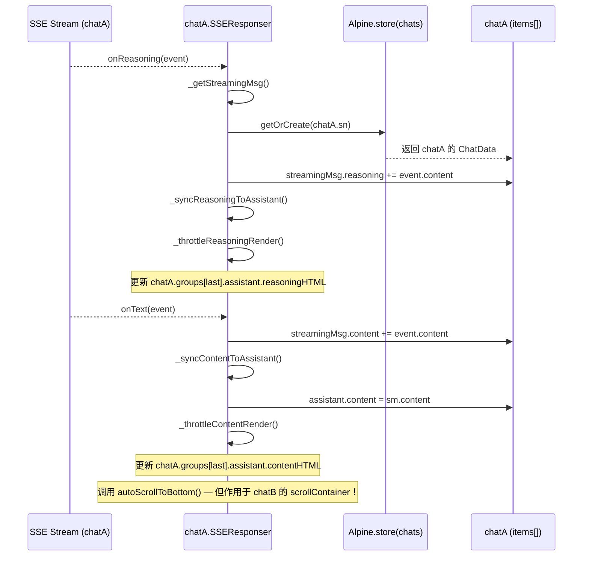
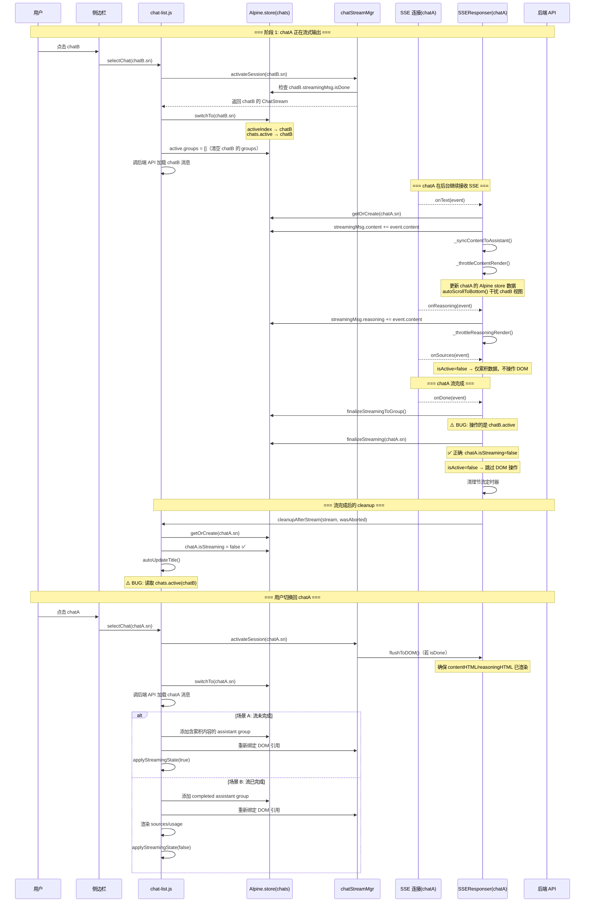

# 流式 Chat 被切换为非活动状态时的完整分析报告

## 概述

当一个正在流式输出的 Chat（称为 **chatA**）被切换为非活动状态（用户选择另一个 Chat **chatB** 成为活跃对话），chatA 会经历一系列精心设计的状态变迁。本文档从多个维度（SSE 连接、DOM、数据层、UI 状态、流完成时的行为）详细分析这一过程。

---

## 一、触发路径

用户从侧边栏点击 chatB 的条目 → [`selectChat(chatB.sn)`](frontend/static/chat-list.js:388) 被调用。

核心执行顺序（[`chat-list.js:388-667`](frontend/static/chat-list.js:388)）：

```
1. chatStreamMgr.activateSession(chatB.sn)  → 准备 chatB 的流
2. chats.switchTo(chatB.sn)                  → 更新 activeIndex
3. 清空当前活跃对话的 groups（此时 active 已是 chatB）
4. 清空 tick 状态、welcome message
5. 调后端 API switchChat(chatB.sn) 加载 chatB 的消息
6. 将 chatB 的消息渲染到 Alpine store 的 groups
7. 检查 chatB 是否有后台流式数据需要恢复
```

---

## 二、SSE 连接 — 不被中断

| 方面 | 行为 |
|------|------|
| `abortController` | **不被调用**，chatA 的 SSE 连接继续在后台运行 |
| `readSSEBuffer()` 循环 | 继续读取 HTTP response 的 chunk |
| `SSEResponser` 事件分发 | 每个 SSE 事件按类型正常分发到 chatA 的 `SSEResponser` |

关键代码（[`chat-sse.js:189-224`](frontend/static/chat-sse.js:189)）：`readSSEBuffer` 的 `while(true)` 循环和 `dispatchEventToResponser` 都不会检查当前 chat 是否为活跃，只依赖 `stream.sn` 定位到正确的 `SSEResponser`。

---

## 三、DOM 引用 — 变为悬空

| 引用字段 | 切换后状态 |
|---------|-----------|
| `stream.assistantBubble` | 指向 chatA 的 DOM 元素，但该元素已被 Alpine 从 DOM 树移除（因为 `chats.active` 切换导致 Alpine 重新渲染 chatB 的 groups） |
| `stream.contentDiv` | 同上，变为悬空引用 |

这些引用**没有在切换时被显式释放**（`releaseDOM()` 仅在 `chatStreamMgr.remove()` 或 `cleanup()` 时调用）。

**影响**：后台 SSE 事件处理中如果尝试通过 `stream.assistantBubble` 操作 DOM，会操作一个不在视图中的废弃元素。但实际情况是：

- [`SSEResponser`](frontend/static/chat-sse-responser.js) 的所有 `onXxx` 方法**不再直接操作 DOM**（方案B），它们只更新 Alpine store 数据
- 唯一直接操作 DOM 的 `_applyDoneToDOM()` 受 `this.isActive` 守卫保护（后台流时返回 false）
- 但 `handleAbortError()`（[`chat-sse.js:310`](frontend/static/chat-sse.js:310)）仍会通过 `stream.assistantBubble` 操作 DOM——这在后台流 abort 时操作的是**废弃元素**，但无害

---

## 四、Alpine Store 数据层 — 完整保留

chatA 的数据在 [`chats.items[]`](frontend/static/alpine-store.js:179) 中按 SN 存储，切换后：

| 字段 | 状态 |
|------|------|
| `chatA.sn` | 不变 |
| `chatA.title` | 不变 |
| `chatA.isStreaming` | **仍为 true**（未显式设置 false） |
| `chatA.streamingMsg` | **继续累积数据**，SSE 事件持续写入 |
| `chatA.groups` | 完整保留（因为 `selectChat` 清空的是 chatB 的 groups） |
| `chatA._groupSeq` | 不变 |
| `chats.active` | 指向 chatB（通过 `activeIndex` 改变） |

### streamingMsg 持续累积过程

当后台 SSE 事件到达时，`SSEResponser` 的方法执行：



### 节流渲染器的行为

chatA 的 `SSEResponser` 有自己的 `_renderTimer` 和 `_reasoningRenderTimer`（实例级变量），因此不会与 chatB 的定时器冲突。它们继续按 180ms 间隔执行节流渲染，更新 Alpine store 中的 `contentHTML`/`reasoningHTML`。

**副作用**：[`_throttleContentRender()`](frontend/static/chat-sse-responser.js:123) 中的 `autoScrollToBottom()` 会滚动**当前可视的 scrollContainer**（即 chatB 的视图），对 chatB 的用户体验有轻微干扰。

---

## 五、关键方法在后台流中的行为对比

### 5.1 `onSources()` — 安全

[`chat-sse-responser.js:324`](frontend/static/chat-sse-responser.js:324)

```javascript
onSources(event) {
    ...
    if (this.isActive) {
        showSources(newSources, 'web');  // 只在活跃时操作 DOM
    }
}
```

`this.isActive` 检查 `chats.active.sn === this.stream.sn` → `false` → sources 仅累积到 `streamingMsg.sources`，不操作 DOM。**安全。**

### 5.2 `onDone()` — 存在 bug

[`chat-sse-responser.js:354`](frontend/static/chat-sse-responser.js:354)

```javascript
onDone(event) {
    ...
    try {
        window.Alpine.store('chats').finalizeStreamingToGroup();  // ⚠️ BUG
    } catch(e) {}
    try {
        window.Alpine.store('chats').finalizeStreaming(this.session.sn);  // ✅ 正确
    } catch(e) {}
    if (this.isActive) {
        this._applyDoneToDOM(event);  // 后台流不执行 → 安全
    }
}
```

**BUG 1**：[`finalizeStreamingToGroup()`](frontend/static/alpine-store.js:643) 内部使用 `var chat = this.active;` 获取当前活跃对话（此时为 chatB），然后尝试设置 `chatB.groups[last].assistant.createdAt`、`sources`、`usage` 等 metadata。这会**错误地将 chatA 的流完成数据写入 chatB 的消息组**。

```javascript
finalizeStreamingToGroup: function() {
    var chat = this.active;          // ← chatB！
    if (!chat || !chat.streamingMsg) return;  // chatB.streamingMsg 可能为 null → 提前 return
    ...
}
```

由于 chatB 的 `streamingMsg` 通常为 `null`（除非 chatB 也在流式），这个函数会**静默提前返回**，因此实际影响有限——chatA 的完成 metadata（`createdAt`、`sources`、`usage`）不会写入任何地方，**数据丢失**。

### 5.3 `cleanupAfterStream()` — 部分正确

[`chat-sse.js:407`](frontend/static/chat-sse.js:407)

```javascript
function cleanupAfterStream(stream, wasAborted) {
    ...
    const isActiveStream = chats && chats.active && chats.active.sn === stream.sn;
    if (isActiveStream) {
        applyStreamingState(false);  // 不执行
        document.getElementById('messageInput').focus();  // 不执行
    } else {
        // 后台流完成分支
        var chatData = chats.getOrCreate(stream.sn);
        if (chatData) {
            chatData.isStreaming = false;  // ✅ 正确设置 chatA.isStreaming = false
        }
    }
    ...
    autoUpdateTitle(wasAborted);  // ⚠️ 不论是否后台流都调用
}
```

**BUG 2**：[`autoUpdateTitle()`](frontend/static/chat-sse.js:382) 内部使用 `chats.active` 获取当前活跃对话的标题进行自动修改：

```javascript
function autoUpdateTitle(wasAborted) {
    var chats = window.Alpine.store('chats');
    var activeChat = chats ? chats.active : null;  // ← chatB
    if (!activeChat) return;
    if (wasAborted || activeChat.titleState >= TITLE_STATE.AI || activeChat.groups.length > 1) return;
    const originalTitle = activeChat.title || '';
    fetchChatTitle(originalTitle, false, activeChat.sn);  // ← 为 chatB 发送标题请求
}
```

当 chatA 的流在后台完成时，如果 chatB 恰好满足自动改标题的条件（第一轮对话、标题未被 AI 改过），会**错误地为 chatB 触发标题修改请求**。

---

## 六、切换回 chatA 时的恢复机制

当用户切换回 chatA 时，[`selectChat(chatA.sn)`](frontend/static/chat-list.js:388) 会通过以下路径恢复：

### 6.1 场景 A：流未完成（`streamingMsg.isDone === false`）

```
1. chatStreamMgr.activateSession(chatA.sn)
   → getOrCreate(chatA.sn) 获取已有 ChatStream
   → streamingMsg.isDone === false，不调用 flushToDOM()

2. 检查 result.messages 最后一条是否为 backend broken message，若是则移除

3. 通过 Alpine store 添加一个空的 assistant group + 已有累积内容
   → groups.push({ assistant: { content: streamingMsg.content, ... } })

4. requestAnimationFrame 中重新绑定 DOM 引用：
   → stream.assistantBubble = assistantMsgEl
   → stream.contentDiv = streamingBubble || ...

5. applyStreamingState(true) 恢复流式 UI
```

### 6.2 场景 B：流已完成（`streamingMsg.isDone === true`）

```
1. chatStreamMgr.activateSession(chatA.sn)
   → streamingMsg.isDone === true → 调用 flushToDOM()

2. flushToDOM() 确保 group.assistant 数据同步：
   → 如果 contentHTML 未渲染：立即渲染
   → 如果 reasoningHTML 未渲染：立即渲染
   → 如果 isDone 且 usage：显示 token usage

3. selectChat 中走场景 B 分支：
   → 添加 completed assistant group
   → 重新绑定 DOM 引用
   → 渲染 reasoning/usage
   → applyStreamingState(false)

4. **注意**：由于 BUG 1（finalizeStreamingToGroup 写到 chatB），
   chatA 的 createdAt/sources/usage 可能已丢失
```

---

## 七、`chatStreamMgr.cleanup()` — 后台流的内存管理

[`chat-stream-mgr.js:70`](frontend/static/chat-stream-mgr.js:70)

- 最多保留 5 个非活跃的已完成 ChatStream
- 超过上限时，从最旧的开始清理（释放 DOM 引用 + 从 Map 删除）
- 清理条件：streamingMsg.isDone === true
- **正在后台流式的 ChatStream（isDone === false）不会被清理**

### cleanup 流程

```javascript
cleanup() {
    const MAX_INACTIVE = 5;
    const activeSN = ...;  // 当前活跃 chat 的 SN
    const inactiveStreams = [];

    for (const [sn, stream] of this.streams) {
        if (sn === activeSN) continue;  // 跳过活跃的
        // 检查 streamingMsg.isDone
        if (isDone) {
            inactiveStreams.push({ sn, stream });
        }
    }

    if (inactiveStreams.length > MAX_INACTIVE) {
        const toRemove = inactiveStreams.slice(0, -MAX_INACTIVE);
        for (const { sn } of toRemove) {
            stream.releaseDOM();
            this.streams.delete(sn);
        }
    }
}
```

---

## 八、已知问题汇总

| # | 严重度 | 问题 | 位置 | 说明 |
|---|--------|------|------|------|
| 1 | **中** | `finalizeStreamingToGroup()` 在后台流完成时操作的是 `chats.active`（chatB）而非正确的 chatA | [`alpine-store.js:643`](frontend/static/alpine-store.js:643) | chatA 的 createdAt/sources/usage 等 metadata 无法正确写入 chatA 的 group；但由于 chatB.streamingMsg 通常为 null 会提前 return，实际表现为 metadata 丢失而非数据错乱 |
| 2 | **低** | `autoUpdateTitle()` 在后台流完成时读取 `chats.active`（chatB）而非 chatA | [`chat-sse.js:382`](frontend/static/chat-sse.js:382) | 可能为错误的 chat 触发标题修改请求，但 guard 条件（`titleState`/`groups.length`）能减轻影响 |
| 3 | **低** | 节流渲染中的 `autoScrollToBottom()` 在后台流中仍会滚动当前 chatB 的视图 | [`chat-sse-responser.js:138`](frontend/static/chat-sse-responser.js:138) | 每次节流渲染都会触发，对 chatB 用户的滚动体验有轻微干扰 |
| 4 | **低** | `handleAbortError()` 操作废弃的 `stream.assistantBubble` DOM 引用 | [`chat-sse.js:310`](frontend/static/chat-sse.js:310) | 操作不在视图中的 DOM 元素，无害但浪费性能 |

---

## 九、生命周期完整流程图



---

## 十、结论

chatA 在切换为非活动状态后，核心设计意图是**无缝后台运行，数据不丢失**。当前实现：

| 方面 | 状态 |
|------|------|
| SSE 连接持续后台运行 | ✅ 正确 |
| Alpine store 数据持续累积 | ✅ 正确 |
| 切换回来数据恢复 | ✅ 基本正确（场景 A/B 均覆盖） |
| 流完成时 metadata 写入 | ⚠️ BUG 1：写入错误的 chat |
| 流完成时标题自动修改 | ⚠️ BUG 2：操作错误的 chat |
| 节流渲染滚动干扰 | ⚠️ 轻微副作用 |
| 内存管理（cleanup） | ✅ 合理，最多保留 5 个非活跃 stream |

两个 BUG 的严重度均为**中/低**，因为它们由守卫条件（如 `chatB.streamingMsg === null` 或 `titleState >= TITLE_STATE.AI`）兜底，在实际使用中触发概率较低，但仍是需要修复的隐患。
