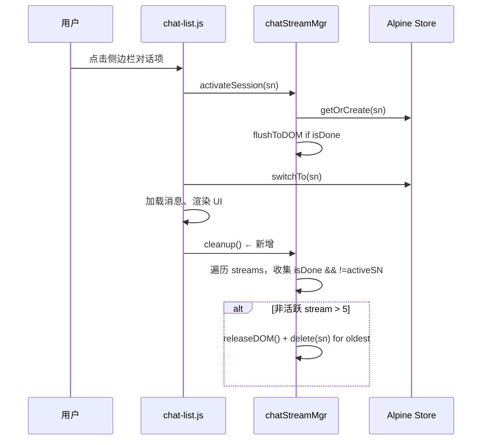

# ChatStreamMgr.cleanup() 集成计划

## 背景

[`chatStreamMgr.cleanup()`](../frontend/static/chat-stream-mgr.js:70) 已被定义但**从未被调用**。该方法的作用是：

- 遍历所有 [`ChatStream`](../frontend/static/chat-stream.js) 实例
- 收集已完成的（`streamingMsg.isDone === true`）非活跃（非当前 active 对话）stream
- 当非活跃 stream 数量超过 `MAX_INACTIVE = 5` 时，按创建顺序释放最早的那些（调用 [`stream.releaseDOM()`](../frontend/static/chat-stream.js) 并 `this.streams.delete(sn)`）

如果不调用，长时间使用后 [`streams` Map](../frontend/static/chat-stream-mgr.js:22) 会不断膨胀，已完成的非活跃 [`ChatStream`](../frontend/static/chat-stream.js) 持有的 DOM 引用无法释放，存在**潜在内存泄漏**。

---

## 调用时机分析

在代码库中，调用 [`chatStreamMgr`](../frontend/static/chat-stream-mgr.js:137) 各方法的入口点：

| 入口点 | 文件 | 调用方式 | 适合添加 cleanup？ |
|--------|------|----------|:---:|
| 对话切换 `selectChat(sn)` | [`chat-list.js:388`](../frontend/static/chat-list.js:388) | `chatStreamMgr.activateSession(sn)` | ✅ **首选** |
| 删除对话 `handleDelete(chat)` | [`chat-list.js:967`](../frontend/static/chat-list.js:967) | `chatStreamMgr.remove(chat.sn)` | ❌ 已 remove，无需重复清理 |
| 发送消息 `sendMessage()` | [`chat-sse.js:509`](../frontend/static/chat-sse.js:509) | `chatStreamMgr.getOrCreate(sn)` | ❌ 发送消息时不应清理 |
| 流结束 `cleanupAfterStream()` | [`chat-sse.js:407`](../frontend/static/chat-sse.js:407) | 内部函数（无直接调用 chatStreamMgr） | ⚠️ 可选辅助点 |

### 首选方案：`selectChat()` 切换对话时触发

**理由：**

1. **语义匹配**：`cleanup()` 清理的是"非活跃"stream——而切换对话时，用户刚刚离开旧对话，旧对话正好变为非活跃，是最自然的清理时机。
2. **性能友好**：`selectChat()` 是一个异步操作，包含网络请求（`switchChat(sn)`），在它之后同步调用一个轻量级的 `cleanup()` 几乎无感知。
3. **频率适中**：用户每次切换对话触发一次，不会过于频繁也不会间隔太久。

**插入位置：** [`selectChat()`](../frontend/static/chat-list.js:388) 函数的末尾，在步骤 9（第 517 行）的场景 A/B 处理完之后，`return` 之前。

### 可选辅助点：`cleanupAfterStream()` 流结束时触发

**理由：**

- 流刚刚结束 → 该对话的 `streamingMsg.isDone` 变为 `true` → 立即成为"可清理"状态
- 如果在该对话完成后用户不再切换，`selectChat` 不会触发，此时 cleanup 永远不会运行

**问题：**

- `cleanupAfterStream()` 在 [`chat-sse.js:407`](../frontend/static/chat-sse.js:407) 中是一个内部辅助函数，没有直接引用 `chatStreamMgr`
- 如果每个流结束时都调用 `cleanup()`，触发频率会较高（尤其是多条消息的多次 SSE 连接）
- `cleanup()` 内部需要 `window.Alpine.store('chats')` 来获取 `active.sn` 和 `streamingMsg.isDone`，在流结束时这些数据已经就绪

**结论：** 作为辅助点可选加入，但不是必需的。仅用 `selectChat` 一个触发点，在正常使用场景下已经足够（用户切换对话时才会积累非活跃 stream）。

---

## 实施方案

### 步骤 1：在 `selectChat()` 末尾添加 cleanup 调用

**文件：** [`frontend/static/chat-list.js`](../frontend/static/chat-list.js)

**位置：** 在步骤 9（场景 A/B 处理）之后、函数返回之前。具体来说，在最后一段代码（第 574 行附近）的 `requestAnimationFrame` 回调和场景 A/B 的 `streamingMsg` 恢复逻辑之后。

**添加代码：**

```javascript
// 10. 清理已完成的非活跃 stream（释放内存）
// 切换对话后，旧对话变为非活跃，触发 cleanup 回收
chatStreamMgr.cleanup();
```

### 步骤 2（可选）：在 `cleanupAfterStream()` 末尾添加 cleanup 调用

**文件：** [`frontend/static/chat-sse.js`](../frontend/static/chat-sse.js)

**位置：** 在 [`cleanupAfterStream()`](../frontend/static/chat-sse.js:407) 函数的末尾，`autoUpdateTitle()` 和 `getCurrentChatIfNeeded()` 之后。

**添加代码：**

```javascript
// 流结束，尝试清理已完成的非活跃 stream
import { chatStreamMgr } from './chat-stream-mgr.js';  // 若尚未导入
// ...
chatStreamMgr.cleanup();
```

> ⚠️ **注意：** 需要在文件顶部添加 `import { chatStreamMgr } from './chat-stream-mgr.js';`。当前文件中已有该 import（第 12 行），无需重复添加。

### 步骤 3：验证

1. **功能验证**：确保 `cleanup()` 不会在 active stream 仍处于 `!isDone` 状态时错误释放它
   - `cleanup()` 内部逻辑：跳过 `sn === activeSN`，并且只清理 `isDone === true` 的 stream → **安全**
2. **边界验证**：当 `streams` Map 中的条目少于 `MAX_INACTIVE` 时，`cleanup()` 不做任何操作 → **安全**
3. **回归验证**：确保 `selectChat()` 的正常流程不受影响

---

## 时序图



---

## 预期效果

- 对话切换后，已完成的非活跃 [`ChatStream`](../frontend/static/chat-stream.js) 自动释放 DOM 引用
- [`streams` Map](../frontend/static/chat-stream-mgr.js:22) 中最多保留 5 个非活跃 stream + 1 个活跃 stream
- 长期使用后内存使用保持稳定，无泄漏风险
- 对用户无感知，不影响正常操作

---

## 遗留问题：后台活跃 SSE 连接上限

[`cleanup()`](../frontend/static/chat-stream-mgr.js:70) 当前只清理 **已完成**（`isDone === true`）的非活跃 stream 的 DOM 引用。

如果用户手快，在多个对话的 SSE 回复都没有完成时频繁切换，会导致**多条并发的活跃 SSE 连接**。HTTP/1.1 下浏览器对同一域名有 6 连接上限（Chrome/Firefox/Safari），超过的请求会被排队。

**2026-06-01 决策：** 暂不处理此问题（方案B）。原因：
- 该问题门槛较高（需在多个回复完成前快速切换 6+ 次）
- HTTP/2 下无此限制
- 后台 SSE 流会自然快速结束
- 如需处理，应在 `cleanup()` 中增加对 `!isDone` 的非活跃 stream 的数量限制，超出则 `abortController.abort()` 最老的
