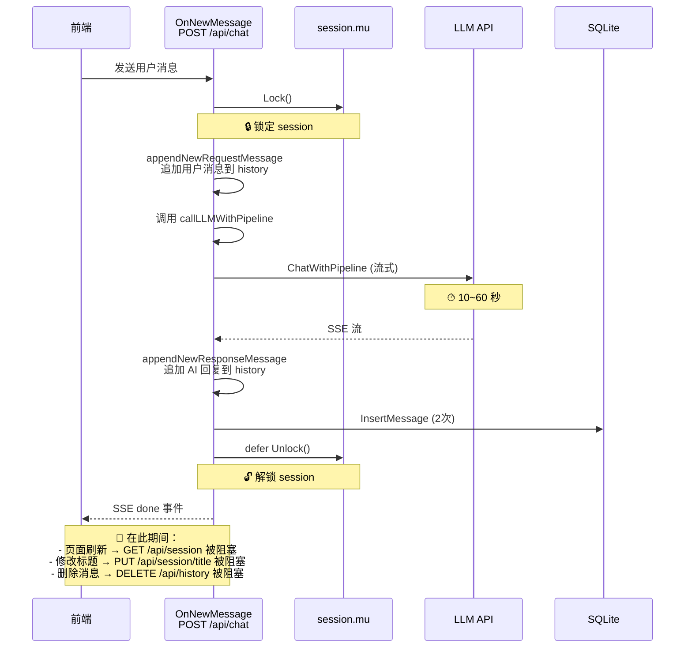
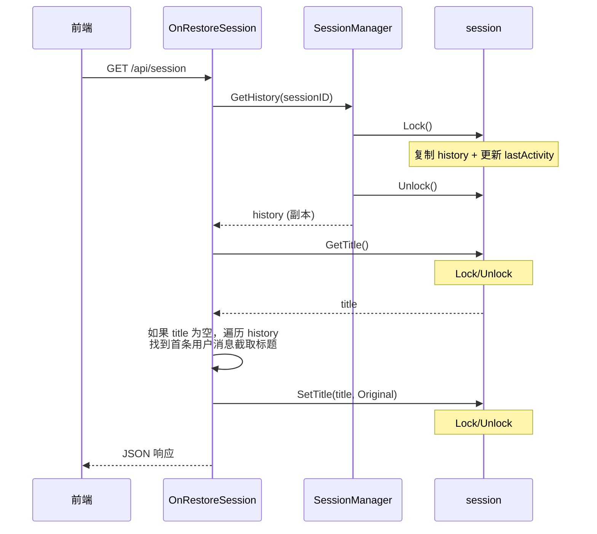
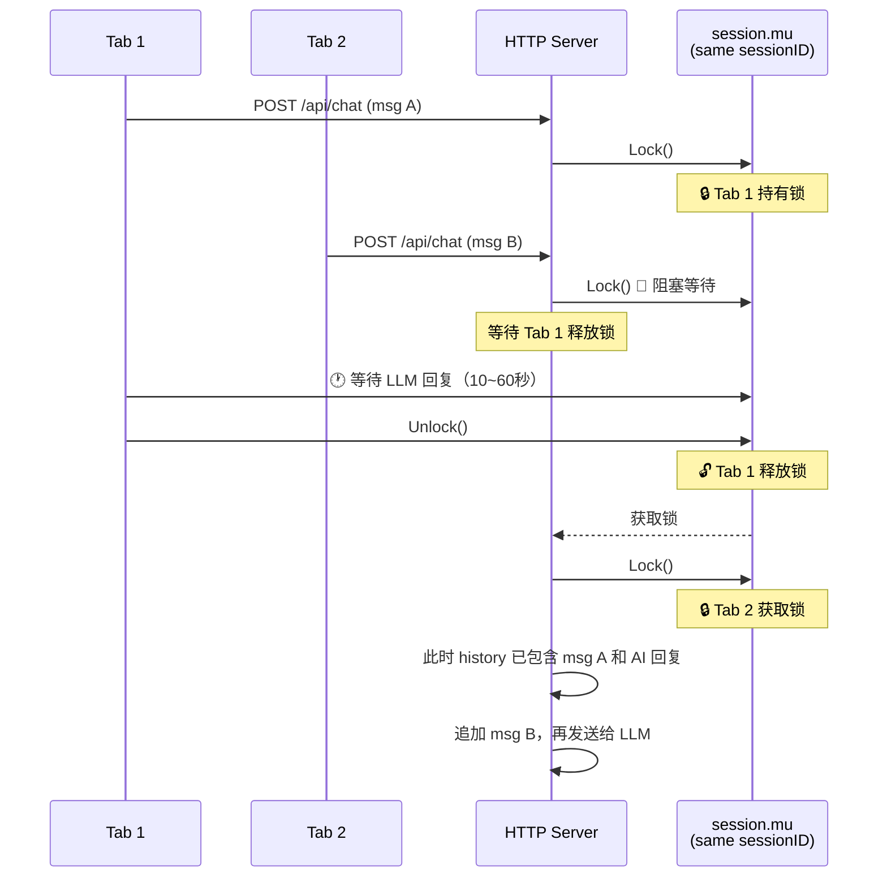

# 并发锁粒度分析报告

## 一、API 路由总览

| 路由 | Method | Handler | 数据库资源 | 是否持有 session.mu |
|------|--------|---------|-----------|-------------------|
| `/api/chat` | POST | [`OnNewMessage`](internal/agent/on_chat.go:274) | `chat_messages` (写), `chat_sessions` (写) | **是**（整个流式调用期间） |
| `/api/chat/info/llm` | GET | [`OnGetLLMInfo`](internal/agent/on_chat.go:50) | 无 | 否 |
| `/api/session` | GET | [`OnRestoreSession`](internal/agent/on_session.go:23) | `chat_sessions` (读) | 是（分段获取） |
| `/api/session` | DELETE | [`OnDeleteSession`](internal/agent/on_session.go:396) | `chat_sessions` (写) | 是 |
| `/api/session/new` | POST | [`OnNewSession`](internal/agent/on_session.go:79) | 无 | 否（操作 SessionManager map） |
| `/api/session/title` | GET | [`OnGetSessionTitle`](internal/agent/on_session.go:248) | 无（仅 LLM 调用） | **是**（读历史快照后释放） |
| `/api/session/title` | PUT | [`OnPutSessionTitle`](internal/agent/on_session.go:120) | `chat_sessions` (写) | 是 |
| `/api/session/pin` | PUT | [`OnUpdateSessionPin`](internal/agent/on_session.go:337) | `chat_sessions` (写) | 是 |
| `/api/history` | DELETE | [`OnDeleteMessage`](internal/agent/on_msg_del.go:19) | 内存 history (写) | 是 |
| `/api/chat/login` | POST | [`OnLogin`](internal/agent/on_login.go:20) | `{sn}.chats.db` (创建, 读) | 是（`switchToUser` 内部） |
| `/api/health` | GET | 内联 | 无 | 否 |

---

## 二、锁层级结构

### 2.1 两级锁体系

```
SessionManager.mu (sync.RWMutex)
  └── 保护：sessions map[string]*session
  └── 读操作：GetOrCreate, GetHistory（先 RLock 读 map）
  └── 写操作：Remove, GC（Lock 修改 map）

session.mu (sync.Mutex)
  └── 保护：session 内部所有字段
      ├── currentChat (history, title, titleState, dbSessionID)
      ├── chats []store.Session（会话列表缓存）
      ├── userNo
      ├── chatStore
      └── lastActivity
```

### 2.2 数据库层

- `users.db`：一个全局 SQLite，`_journal_mode=WAL&_busy_timeout=5000`
- `{sn}.chats.db`：**每个用户独立**的 SQLite 数据库，同样 WAL 模式
- `brain.db`：向量知识库，WAL 模式

数据库层面并发能力良好（WAL 模式允许多读一写），**瓶颈不在数据库层**。

---

## 三、关键并发路径分析

### 3.1 ⚠️ 最大问题：`OnNewMessage` 在整个 LLM 流式调用期间持有 session.mu



### 3.2 `OnRestoreSession`：分段加锁，非原子操作



**问题**：`GetHistory`、`GetTitle`、`SetTitle` 分三次独立加解锁。如果在第二步和第三步之间，另一个 goroutine 修改了标题，会导致覆盖。

### 3.3 `OnGetSessionTitle`：先读快照后释放锁再调 LLM

```go
session.mu.Lock()
samples := extractMessagesForTitle(session.getAllHistoryWithoutLock())
session.mu.Unlock()  // 释放锁，然后调用 LLM

// LLM 调用耗时 ~ 几秒，此时锁已释放
resp, err := h.charLLMClient.Chat(titleCtx, messages)
```

这个模式是正确的——不持锁做 LLM 调用。但 `samples` 是流式结束后才调用的（`autoUpdateTitle` 中），所以快照时流式锁也刚释放，不会有问题。

### 3.4 `OnPutSessionTitle`：写 DB 操作在锁内

```go
session.mu.Lock()
defer session.mu.Unlock()

// 写 DB 操作
session.chatStore.UpdateSessionTitle(...)
// 更新内存缓存
targetSession.Title = newTitle
```

DB 写入在锁内进行，虽然 SQLite 自身有 WAL 保障，但锁内做 IO 增加了持有时间。

### 3.5 `switchToUser`：创建 DB 在锁内

```go
func (s *session) switchToUser(sn string) {
    s.mu.Lock()
    defer s.mu.Unlock()
    // 创建或打开 SQLite 数据库（IO 操作！）
    chatStore, err := store.CreateLocalChatScheme(dbFile)
    // ...
    // 查询会话列表（IO 操作！）
    chats, err := chatStore.ListSessions(100)
}
```

创建 SQLite DB + 查询会话列表在锁内进行，这是一个较重的 IO 操作。

---

## 四、并发冲突场景分析

### 4.1 同一 Session 的并发请求可能性

| 场景 | 触发方式 | 并发风险 |
|------|---------|---------|
| 流式 + 页面刷新 | 用户在 AI 回复时刷新浏览器 | GET /api/session 被 session.mu 阻塞直到流结束 |
| 流式 + 修改标题 | 用户刷新后立即改标题 | PUT /api/session/title 被阻塞 |
| 流式 + 删除消息 | 用户刷新后立即删消息 | DELETE /api/history 被阻塞 |
| 流式 + 删除 Session | 用户删除当前会话 | DELETE /api/session 被阻塞 |
| 标题生成 + 标题修改 | 前端自动请求标题时用户手动改 | **小窗口竞争**：锁已被释放，但 `state.titleState` 检查有时间差 |
| 多 Tab 同 Session | 同一浏览器开两个标签页（共享 cookie） | **真正危险的并发场景**！两个 Tab 同时发消息或做不同操作 |

### 4.2 多 Tab 场景分析



**分析**：此场景下锁的语义正确——保证了 history 的串行化写入。但 Tab 2 的请求会被阻塞很长时间。

---

## 五、锁粒度评估

### 5.1 当前锁粒度：粗粒度（Over-locking）

| Handler | 持有锁时间 | 是否合理 |
|---------|-----------|---------|
| `OnNewMessage` | **10~60 秒**（整个 LLM 流式调用） | ❌ 过大 |
| `switchToUser` | 数百毫秒（含 DB 创建+查询） | ⚠️ 可优化 |
| `OnPutSessionTitle` | 数十毫秒（含 DB 写入） | ✅ 合理 |
| `OnRestoreSession` | 分段：多次微秒级 | ✅ 合理（但非原子） |
| `OnGetSessionTitle` | 微秒级（仅读快照） | ✅ 合理 |
| `OnDeleteMessage` | 微秒级（仅内存操作） | ✅ 合理 |

### 5.2 核心问题

**`OnNewMessage` 在 `session.mu.Lock()` 范围内执行了整个 LLM 流式调用**，这是最严重的粗粒度锁定问题。具体来说：

```go
// on_chat.go:285-286
session.mu.Lock()
defer session.mu.Unlock()  // 直到整个请求结束才解锁
```

锁保护的实际数据：
1. 开始处：追加用户消息到 `history`（微秒级）
2. 中间：读取 `history` 传给 LLM（微秒级）
3. 结尾：追加 AI 回复到 `history`（微秒级）

**90%+ 的锁持有时间浪费在等待 LLM API 返回上**，而这段时间内 `history` 不需要被保护（没有任何写操作）。

---

## 六、改进建议

### 6.1 🔴 高优先级：OnNewMessage 释放流式期间的锁

**当前代码**（[`internal/agent/on_chat.go:285-334`](internal/agent/on_chat.go:285)）：

```go
session.mu.Lock()
defer session.mu.Unlock()
// ... 追加用户消息、读取历史、调 LLM、追加回复 ...
```

**改进方案**：拆分为三段式加解锁

```go
// === 阶段 1：加锁，追加用户消息，读取历史快照 ===
session.mu.Lock()
appendNewRequestMessage(session, &req.Message, lang)
ensureDBSession(session)

// 读取 history 快照
historySnapshot := session.getAllHistoryWithoutLock()  // 注意：读的是原始引用
dbSessionID := session.getDbSessionIDWithoutLock()
chatStore := session.chatStore
session.mu.Unlock()
// ================================================

// === 阶段 2：无锁，LLM 流式调用 ===
// (此时 historySnapshot 是有效引用，因为没有其他写入者修改它)
llmMsgs := toRawMessages(historySnapshot)
// ... 调 LLM ...
reply, reasoning, err := h.charLLMClient.ChatWithPipeline(ctx, messages, &pipeline, withDeepThink)
// ================================================

// === 阶段 3：加锁，追加 AI 回复 ===
session.mu.Lock()
if len(reply) > 0 {
    assistantMsg := Message{...}
    appendNewResponseMessage(session, &assistantMsg)
}
session.mu.Unlock()
// ================================================
```

**关键前提**：在阶段 2 中，不能有其他写入者修改 `history`。由于前端 `state.isStreaming=false` 禁止了同 Tab 的第二次发送，唯一可能的写入者是**其他 Tab**。阶段 3 重新加锁保证了追加操作的原子性。

**风险点**：如果在阶段 2（无锁期间），另一个 goroutine（如 DELETE /api/history）修改了 history，阶段 3 的追加操作需要与当前 history 状态保持一致。解决方案：
- 在阶段 1 记录 `historyLen`，阶段 3 检查 `historyLen` 是否变化
- 或在阶段 3 重新读取 history，基于最新状态追加

### 6.2 🟡 中优先级：OnPutSessionTitle 将 DB 写操作移出锁

**当前**（[`internal/agent/on_session.go:157-205`](internal/agent/on_session.go:157)）：

```go
session.mu.Lock()
defer session.mu.Unlock()
// ... DB UpdateSessionTitle ...
```

**改进**：先更新内存缓存，释放锁后再写 DB

```go
session.mu.Lock()
session.setTitleWithoutLock(newTitle, titleState)
dbSessionID := session.getDbSessionIDWithoutLock()
chatStore := session.chatStore
session.mu.Unlock()

// 无锁写 DB
if chatStore != nil && dbSessionID != 0 {
    chatStore.UpdateSessionTitle(dbSessionID, newTitle, int8(titleState))
}
```

### 6.3 🟡 中优先级：switchToUser 将 IO 移出锁

**当前**（[`internal/agent/types.go:217-244`](internal/agent/types.go:217)）：

```go
func (s *session) switchToUser(sn string) {
    s.mu.Lock()
    defer s.mu.Unlock()
    // IO: CreateLocalChatScheme + ListSessions
}
```

**改进**：先创建 DB，再加锁更新状态

```go
func (s *session) switchToUser(sn string) {
    // 阶段 1：无锁，创建/打开 DB（IO 操作）
    dbFile := "data/" + sn + ".chats.db"
    chatStore, err := store.CreateLocalChatScheme(dbFile)
    // ...
    chats, err := chatStore.ListSessions(100)
    // ...

    // 阶段 2：加锁，更新内存状态
    s.mu.Lock()
    defer s.mu.Unlock()
    s.currentChat = nil
    s.userNo = sn
    s.chatStore = chatStore
    s.chats = chats
}
```

### 6.4 🟢 低优先级：OnRestoreSession 原子化读取

将 `GetHistory`、`GetTitle` 合并为一次加锁操作，避免分段读取导致的不一致。

### 6.5 🟢 低优先级：多 Tab 并发写保护

如果多 Tab 场景是重要的使用场景，可以考虑：
- 在 session 上增加一个 `generation` 计数器
- 每次写入时递增，读取时检查
- 在阶段 3 追加回复前检查 generation 是否在阶段 1 之后被修改

---

## 七、总结

| 评估维度 | 结论 |
|---------|------|
| 锁的正确性 | ✅ 当前实现是**正确**的，没有数据竞争 |
| 锁的粒度 | ❌ `OnNewMessage` 的锁粒度过大，持有锁时间 10-60 秒 |
| 锁的性能影响 | ⚠️ 同 Session 的其他请求在流式期间被完全阻塞 |
| 数据库并发 | ✅ SQLite WAL 模式 + 每用户独立 DB 设计良好 |
| 最需改进点 | **将 LLM 流式调用移出 session.mu 保护范围** |

### 收益预估

仅改进 6.1（OnNewMessage 三段式加解锁），即可：
- 将锁持有时间从 10-60 秒降低到 **微秒级**（仅内存操作）
- 同 Session 的页面刷新、标题修改、消息删除等操作不再被阻塞
- 改善多 Tab 场景下的用户体验

---

## 八、补充分析：前端防护屏障（2026-05-25 修正）

经与开发者讨论后，**重新评估了各场景的锁粒度合理性**。关键发现：前端已经设计了一套完整的 `state.isStreaming` 防护屏障，大部分冲突操作在 UI 层就被拦截了，后端的 `session.mu` 更多是**防御纵深**而非核心防护。

### 8.1 前端 isStreaming 防护覆盖情况

| 操作 | 前端拦截点 | 阻断方式 |
|------|-----------|---------|
| 发送新消息 | [`chat-sse.js:277`](frontend/static/chat-sse.js:277) `if (!content \|\| state.isStreaming) return` | 直接 return |
| AI 标题生成 | [`chat.js:126-130`](frontend/static/chat.js:126) | 按钮点击直接 return |
| header 标题修改 | [`chat.js:792-794`](frontend/static/chat.js:792) | Toast 提示「正在生成回复」 |
| 删除消息按钮 | [`chat-ui.js:126,233`](frontend/static/chat-ui.js:126) | disabled 属性 |
| 代码复制按钮 | [`chat-markdown.js:172`](frontend/static/chat-markdown.js:172) | disabled 属性 |
| 新建对话 | [`chat.js:155`](frontend/static/chat.js:155) | 先 abort 流式，再发请求 |
| **侧栏重命名** | ❌ **未拦截** | 直接发 PUT 请求 |

### 8.2 各场景修正判断

| 场景 | 最初判断 | 修正后判断 | 理由 |
|------|---------|-----------|------|
| 流式期间页面刷新被阻塞 | ❌ 锁太粗 | ✅ **合理** | 用户无合理需求在流式中间看半成品历史 |
| 流式期间改标题（header）被阻塞 | ❌ 锁太粗 | ✅ **合理** | AI 标题生成需完整上下文；前端已拦截 |
| 流式期间改标题（侧栏）被阻塞 | ❌ 锁太粗 | ⚠️ **可优化，但影响极小** | 侧栏改的是**其他历史会话**，与当前 `currentChat` 无数据冲突 |
| 流式期间删除消息被阻塞 | ❌ 锁太粗 | ✅ **合理必须** | 删除会导致 msgId/groupId 错乱和数据竞争 |
| 多用户互相等待 | ❌ (未考虑) | ✅ **设计正确** | 不同 session 独立加锁，完全并行 |

### 8.3 侧栏重命名被阻塞的详细分析

侧栏重命名调用的是 [`PUT /api/session/title?title=xxx&sn=xxx`](internal/agent/on_session.go:160)。

**设计意图**（开发者确认）：侧栏重命名只允许用户**手动修改**标题，不允许调用 AI。如果要 AI 重新生成标题，用户必须先切换到该对话（展现完整消息历史），再点击 header 上的 AI 标题按钮。因此侧栏重命名：
- 不涉及任何 LLM 调用
- 操作的是 `session.chats[i]`（其他历史会话），**不是**当前活跃的 `session.currentChat`
- 写入的数据行是 `chat_sessions` 表中**不同** `session_id` 的记录

**被阻塞的原因**：`OnPutSessionTitle` 在最外层获取了 `session.mu.Lock()`（第 157 行），而流式中的 `OnNewMessage` 也持有同一个锁。但两者保护的数据对象不同。

**实际数据冲突分析**：没有数据竞争。侧栏重命名和流式操作的是完全不同的内存对象（`chats[i]` vs `currentChat`）和 DB 记录（不同 `session_id`）。

**改进建议**（收益很小，一次 PUT 仅几毫秒，主要是概念正确）：

```go
// 当前：整个 handler 在锁内
session.mu.Lock()
defer session.mu.Unlock()

// 改进：只保护 chats 切片的短暂访问
session.mu.Lock()
targetSession := findTarget(session.chats, sn)
chatStore := session.chatStore
session.mu.Unlock()

if targetSession != nil {
    chatStore.UpdateSessionTitle(targetSession.ID, newTitle, int8(titleState))
    session.mu.Lock()
    targetSession.Title = newTitle
    session.mu.Unlock()
}
```

### 8.4 多用户并发结论

**不同用户（不同 sessionID）完全不会互相等待。** 架构设计正确，无需修改。
