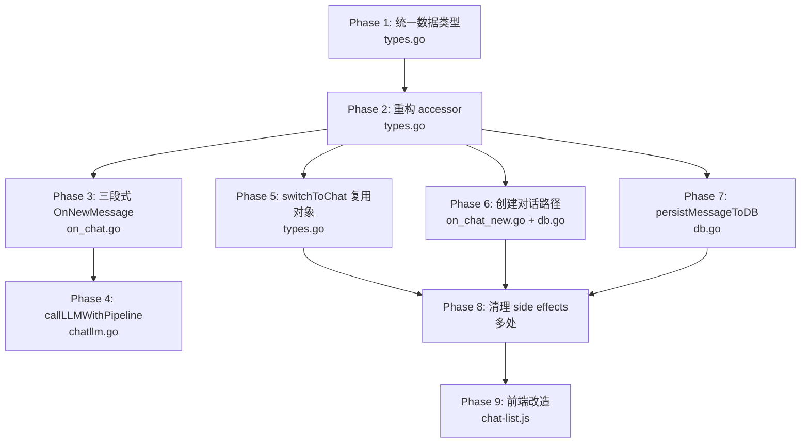

# currentChat 与 chats 重构 — 执行计划

> 基于 [`plans/currentChat-chats-refactor-plan.md`](currentChat-chats-refactor-plan.md) 方案文档，结合当前代码分析，制定的详细执行计划。

## 当前代码状态摘要

| 文件 | 当前状态 | 主要变更 |
|------|---------|---------|
| `internal/agent/types.go` | `chat` 无 `mu`；`chats` 为 `[]store.Chat`；accessor 通过 `session` 操作 | 统一类型、新增 chat 方法 |
| `internal/agent/on_chat.go` | `OnNewMessage` 全程持 `session.mu`；`appendNewRequestMessage` 接受 `*session` | 三段式加解锁 |
| `internal/agent/chatllm.go` | `callLLMWithPipeline` 不依赖 `*session`，仅返回 `*Message` | ✅ 基本无需修改 |
| `internal/agent/on_chat_new.go` | `OnNewChat` 通过 `ensureDBSession` 创建 DB 记录 | 创建 `*chat` 后 append 到 `chats` |
| `internal/agent/db.go` | `ensureDBSession`/`persistMessageToDB` 通过 `session` 操作 | 改为接受 `*chat` 参数 |
| `internal/agent/on_session.go` | `chats` 类型为 `[]store.Chat` | 适配 `[]*chat` |
| `internal/agent/on_login.go` | `chats` 返回 `[]store.Chat` | 适配 `[]*chat` |
| `internal/agent/on_title.go` | `syncCurrentChatTitleToChatList` 调用 | 移除该调用 |
| `internal/agent/on_msg_del.go` | `DeleteMessage` 通过 `s.mu` 操作 | 考虑 chat.mu |
| `frontend/static/chat-list.js` | 无流式 abort | 增加 abort 逻辑 |

---

## 执行顺序与依赖关系



---

## Phase 1: 统一数据类型 — `internal/agent/types.go`

### 1.1 chat 结构体新增 `mu sync.Mutex`

```go
type chat struct {
    mu          sync.Mutex  // 保护本对话的 messages（独立于 session.mu）
    messages    []Message
    title       string
    titleState  TitleState
    dbSessionID int64
}
```

### 1.2 chat 结构体新增元数据字段

```go
type chat struct {
    // ... 现有字段 ...
    SN          string  // 从 store.Chat 合并
    Pinned      bool    // 从 store.Chat 合并
    CreateAt    string  // 从 store.Chat 合并
    UpdateAt    string  // 从 store.Chat 合并
}
```

### 1.3 session.chats 类型变更

```go
type session struct {
    // ...
    currentChat *chat
    chats       []*chat  // 改为 []*chat，而非 []store.Chat
    // ...
}
```

### 1.4 初始化保持不变

`GetOrCreate` 中 `currentChat: &chat{}` 保持不变。

---

## Phase 2: 重构 accessor 函数 — `internal/agent/types.go`

### 2.1-2.7 新增 chat 级别的操作函数

```go
// 新增：操作 *chat 而非 *session 的函数
func appendMessagesToChat(c *chat, msgs ...Message) { ... }
func copyMessagesFromChat(c *chat) []Message { ... }
func getChatTitle(c *chat) (string, TitleState) { ... }
func getChatDbSessionID(c *chat) int64 { ... }
func getChatMessagesLen(c *chat) int { ... }
func getChatLastMsg(c *chat) *Message { ... }
func deleteChatMessagesRange(c *chat, start, end int) { ... }
```

### 2.8 session 上的 WithoutLock 方法改为委托

```go
func (s *session) getMessagesLenWithoutLock() int {
    return getChatMessagesLen(s.currentChat)
}
// ... 其他方法类似
```

---

## Phase 3: 重构 OnNewMessage 为三段式 — `internal/agent/on_chat.go`

### 核心变更

**当前代码问题**：`OnNewMessage` 使用 `defer session.mu.Unlock()`，在整个流式期间（10-60秒）持有 `session.mu`。

**重构后**：

```
阶段1: session.mu.Lock() → 固定 targetChat → 追加用户消息 → 深拷贝快照 → session.mu.Unlock()
阶段2: 无锁 → LLM 流式调用（使用快照）
阶段3: targetChat.mu.Lock() → 追加回复 → targetChat.mu.Unlock()
```

### 3.5 appendNewRequestMessage 改为接受 `*chat`

```go
func appendNewRequestMessage(c *chat, reqMsg *Message, lang string, chatStore *store.ChatStore) {
    // 操作 c.messages 而非 session.currentChat.messages
    // 需要额外传入 chatStore 用于 persistMessageToDB
}
```

### 3.6 appendNewResponseMessage 改为接受 `*chat`

```go
func appendNewResponseMessage(c *chat, resMsg *Message, chatStore *store.ChatStore) {
    // 操作 c.messages
}
```

### 3.7 persistMessageToDB 调用变更

`persistMessageToDB` 改为接受 `*chat` 参数，调用处传入 `targetChat` 而非 `session`。

---

## Phase 4: 重构 callLLMWithPipeline — `internal/agent/chatllm.go`

### 4.1 确认当前状态

当前 `callLLMWithPipeline` 的签名：
```go
func (h *ChatAgent) callLLMWithPipeline(
    ctx context.Context, sseWriter *sse.Writer,
    userMsgID int64, messages []llm.Message,
    tools []llm.ToolIMP, withDeepThink bool, lang string,
) *Message
```

✅ **已不依赖 `*session`**，仅返回 `*Message`。无需修改。

---

## Phase 5: 重构 switchToChat — `internal/agent/types.go`

### 当前代码问题

```go
// 当前：每次切换创建新 *chat 对象
s.currentChat = &chat{
    messages:    msgs,
    title:       targetTitle,
    titleState:  TitleState(targetTitleState),
    dbSessionID: dbSessionID,
}
```

### 重构后

```go
func (s *session) switchToChat(sn string) error {
    s.chatsMu.Lock()
    // ... 在 chats []*chat 中查找 ...
    targetChat := s.chats[i]  // 复用已有对象
    s.chatsMu.Unlock()

    // 加载消息
    dbMessages, _ := s.chatStore.ListMessages(targetChat.dbSessionID)
    msgs := convertDBMessages(dbMessages)

    // 更新目标 chat 的消息
    targetChat.mu.Lock()
    targetChat.messages = msgs
    targetChat.mu.Unlock()

    // 更新 currentChat 指针
    s.mu.Lock()
    s.currentChat = targetChat
    s.mu.Unlock()
    return nil
}
```

---

## Phase 6: 重构创建对话路径

### 6.1 OnNewChat — `internal/agent/on_chat_new.go`

```go
func (h *ChatAgent) OnNewChat(w http.ResponseWriter, r *http.Request) {
    session := h.sessionManager.GetOrCreate(sessionID)

    session.mu.Lock()
    newChat := &chat{}  // 创建新 chat 对象

    session.chatsMu.Lock()
    if session.chatStore != nil {
        sn := generateSessionSN()
        dbChat, _ := session.chatStore.InsertChat(sn, 0, "", 0)
        newChat.dbSessionID = dbChat.ID
        newChat.SN = dbChat.SN
        newChat.CreateAt = dbChat.CreateAt
        newChat.UpdateAt = dbChat.UpdateAt
    }
    session.chats = append(session.chats, newChat)
    session.chatsMu.Unlock()

    session.currentChat = newChat
    session.mu.Unlock()
    // ...
}
```

### 6.2 ensureDBSession — `internal/agent/db.go`

改为接受 `*chat` 参数：
```go
func ensureDBSession(chatStore *store.ChatStore, c *chat) {
    if chatStore == nil { return }
    if c.dbSessionID != 0 { return }
    // ...
    c.dbSessionID = dbChat.ID
    c.SN = dbChat.SN
    c.CreateAt = dbChat.CreateAt
    c.UpdateAt = dbChat.UpdateAt
}
```

### 6.3 addChatToList — `internal/agent/types.go`

改为接受 `*chat` 参数：
```go
func (s *session) addChatToList(c *chat) {
    s.chatsMu.Lock()
    defer s.chatsMu.Unlock()
    if s.chatStore == nil { return }
    for _, existing := range s.chats {
        if existing.SN == c.SN { return }
    }
    s.chats = append([]*chat{c}, s.chats...)
}
```

---

## Phase 7: 重构 persistMessageToDB — `internal/agent/db.go`

### 7.1 改为接受 `*chat` 参数

```go
func persistMessageToDB(chatStore *store.ChatStore, c *chat, msg *Message) {
    if chatStore == nil { return }
    dbSessionID := c.dbSessionID
    if dbSessionID == 0 { return }
    // ... 使用 c.dbSessionID 而非 session.getDbSessionIDWithoutLock() ...
}
```

### 7.2 chats 列表重排逻辑适配 `[]*chat`

```go
// 在 persistMessageToDB 中（或由调用方处理）
session.chatsMu.Lock()
for i, c := range session.chats {
    if c.dbSessionID == dbSessionID {
        // 移到最前
        removed := session.chats[i]
        rest := make([]*chat, 0, len(session.chats)-1)
        rest = append(rest, session.chats[:i]...)
        rest = append(rest, session.chats[i+1:]...)
        session.chats = append([]*chat{removed}, rest...)
        break
    }
}
session.chatsMu.Unlock()
```

---

## Phase 8: 清理 side effects

### 8.1 移除 `syncCurrentChatTitleToChatList`

统一类型后，`currentChat` 指向 `chats` 中的元素，标题数据在同一对象中，无需同步。

### 8.2 switchToUser 中 chats 初始化

```go
// 当前
chats = append([]store.Chat{newChat}, chats...)
// 改为
chatPtr := &chat{
    messages:    anonymousMessages,
    title:       title,
    titleState:  anonymousTitleState,
    dbSessionID: mergedDBSessionID,
    SN:          chatSN,
    CreateAt:    dbChat.CreateAt,
    UpdateAt:    dbChat.UpdateAt,
}
s.chats = append([]*chat{chatPtr}, s.chats...)
```

### 8.3-8.9 各处 chats 类型适配

所有引用 `session.chats` 的地方，类型从 `[]store.Chat` 改为 `[]*chat`，访问方式相应调整。

### 8.10 DeleteMessage 考虑 chat.mu

`SessionManager.DeleteMessage` 当前持 `s.mu`，需考虑 chat.mu 的独立锁：
```go
s.mu.Lock()
if s.currentChat == nil { s.mu.Unlock(); return error }
targetChat := s.currentChat
s.mu.Unlock()

targetChat.mu.Lock()
// 执行删除操作
targetChat.mu.Unlock()
```

---

## Phase 9: 前端改造 — `frontend/static/chat-list.js`

### 9.1 selectChat 前 abort SSE

```javascript
chatItem.addEventListener('click', (e) => {
    if (e.target.closest('.chat-item-more-btn')) return;
    if (state.isStreaming && state.abortController) {
        state.abortController.abort();
    }
    selectChat(chat.sn);
});
```

### 9.2 增加 state.isStreaming 检测

在 `chat-sse.js` 或 `chat-state.js` 中维护 `state.isStreaming` 状态。

---

## 风险与注意事项

| 风险 | 影响 | 缓解措施 |
|------|------|---------|
| `[]*chat` 中 chat 对象被误删除导致悬空指针 | 严重 | 删除 chats 元素时检查 currentChat 是否指向它 |
| Phase 3 三段式改造中 targetChat 在流式期间被删除 | 中等 | 删除操作需检查 chat 是否正在被流式使用 |
| persistMessageToDB 中 chats 重排与流式并发 | 低 | chatsMu 独立锁保护 |
| 前端 abort 后 SSE 连接关闭，后端 context cancelled | 低 | callLLMWithPipeline 已处理 context cancellation |
| switchToUser 中匿名消息迁移后 chats 类型变更 | 中等 | 确保 switchToUser 中创建 *chat 而非 store.Chat |
