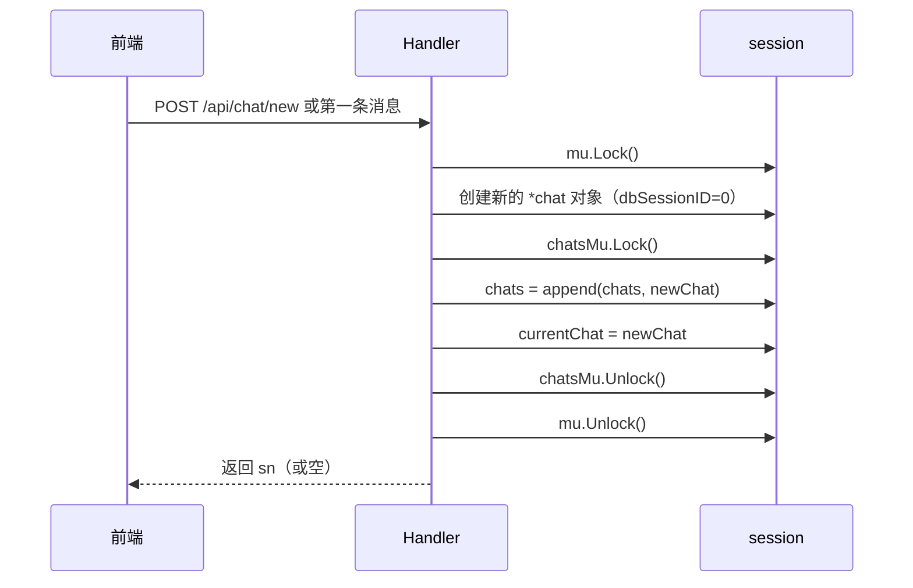
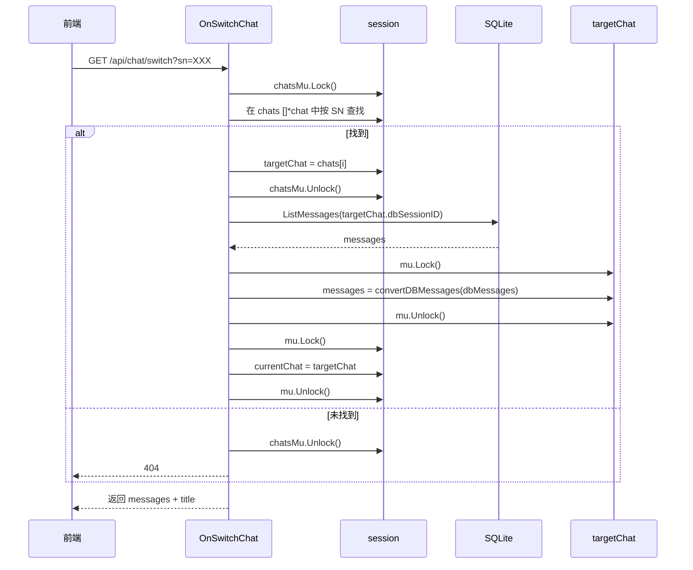
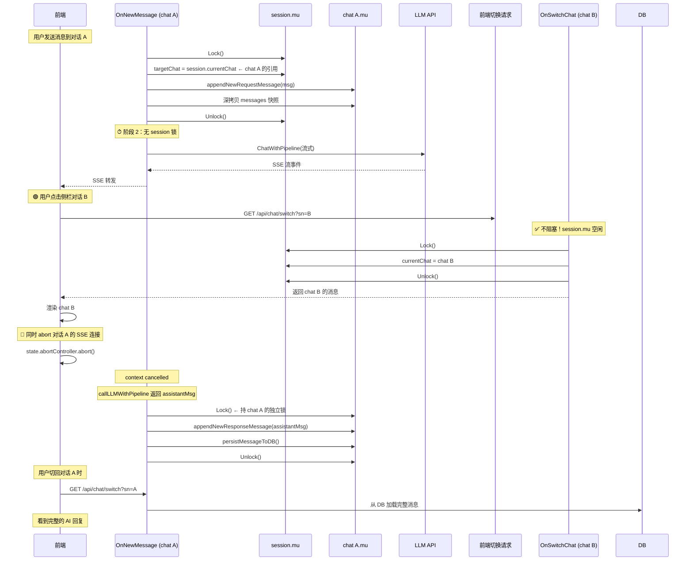

# currentChat 与 chats 关系重构方案

> 基于 [`internal/agent/types.go:110-111`](../internal/agent/types.go:110) 的讨论，重新设计 `currentChat` 与 `chats` 的关系。

## 一、现状分析

### 当前数据结构

```go
// types.go:93-100
type chat struct {
    messages    []Message     // 完整消息列表
    title       string
    titleState  TitleState
    dbSessionID int64
}

// types.go:109-114
type session struct {
    mu          sync.Mutex
    chatsMu     sync.Mutex
    
    currentChat *chat            // 独立的指针，自己拥有数据
    chats       []store.Chat     // 轻量元数据列表（无 messages）
    userNo      string
    chatStore   *store.ChatStore
}
```

### 核心问题

| 问题 | 说明 |
|------|------|
| **类型不统一** | `currentChat` 是 `*chat`，`chats` 是 `[]store.Chat`，完全不同的类型，无法指向 |
| **数据冗余** | 标题、titleState 等字段在两个地方分别维护 |
| **切换时丢对象** | `switchToChat` 创建新 `*chat`，旧对象被 GC，无法在切换后继续引用 |
| **流式锁粒度过大** | `OnNewMessage` 在整个流式期间持有 `session.mu`，阻止一切其他操作 |

### 相关文件

| 文件 | 作用 |
|------|------|
| [`internal/agent/types.go`](../internal/agent/types.go) | 数据类型定义，核心 struct |
| [`internal/agent/on_chat.go`](../internal/agent/on_chat.go) | OnNewMessage / OnSwitchChat handler |
| [`internal/agent/on_chat_new.go`](../internal/agent/on_chat_new.go) | OnNewChat handler |
| [`internal/agent/chatllm.go`](../internal/agent/chatllm.go) | callLLMWithPipeline 流式调用 |
| [`internal/agent/db.go`](../internal/agent/db.go) | DB 持久化（ensureDBSession / persistMessageToDB） |
| [`internal/agent/on_session.go`](../internal/agent/on_session.go) | OnRestoreSession / OnNewSession |
| [`internal/store/chats.go`](../internal/store/chats.go) | store.Chat / store.ChatStore DB 层 |
| [`frontend/static/chat-list.js`](../frontend/static/chat-list.js) | 前端侧栏选择对话 |
| [`frontend/static/chat-sse.js`](../frontend/static/chat-sse.js) | 前端 SSE 流式处理 |
| [`frontend/static/chat-api.js`](../frontend/static/chat-api.js) | 前端 switchChat API 调用 |
| [`plans/chats-independent-lock-plan.md`](chats-independent-lock-plan.md) | 之前的 chatsMu 独立锁方案（已完成） |
| [`plans/concurrency-lock-analysis.md`](concurrency-lock-analysis.md) | 并发锁粒度分析报告 |
| [`plans/onnewmessage-lock-refinement.md`](onnewmessage-lock-refinement.md) | OnNewMessage 三段式加解锁方案 |

---

## 二、目标

```
currentChat（指针）不自己拥有数据，而是指向 chats 中的某个元素。
```

具体需求：

1. **`newChat` 时**：在 `chats` 中添加新数据，再让 `currentChat` 指向它
2. **切换对话时**：在 `chats` 中找到对应元素，`currentChat` 指向它
3. **流式中途切换**：AI 在对话 A 流式回复时，用户切换到对话 B，后端应将 AI 回复正确写入对话 A

---

## 三、数据模型设计

### 3.1 统一数据类型

将 `chats` 从 `[]store.Chat` 改为 `[]*chat`，让 `chat` 结构体同时承载运行时数据和元数据。

```go
// 重构后的 chat 结构体
type chat struct {
    mu          sync.Mutex     // 保护本对话的 messages（独立于 session.mu）
    messages    []Message

    title       string
    titleState  TitleState
    dbSessionID int64

    // 从 store.Chat 合并过来的元数据字段（用于侧栏展示）
    SN          string
    RoleNo      int
    Pinned      bool
    Category    int
    CreateAt    string
    UpdateAt    string
}

// 重构后的 session 结构体
type session struct {
    mu          sync.Mutex       // 保护：currentChat 指针切换, userNo, lastActivity
    chatsMu     sync.Mutex       // 保护：chats 切片, chatStore

    currentChat *chat            // 指向 chats 中的某一个元素
    chats       []*chat          // 改为存储 *chat，而非 store.Chat

    userNo      string
    chatStore   *store.ChatStore
}
```

**为什么用 `[]*chat` 而不是 `[]chat`？**

Go 中 slice append 可能重新分配底层数组。如果用 `[]chat`（值类型），`currentChat = &chats[i]` 的指针在 append 后可能悬空。用 `[]*chat`（指针类型），append 拷贝的是指针本身，底层 `chat` 对象地址不变，`currentChat` 始终有效。

### 3.2 变更后的关系图

```mermaid
classDiagram
    class session {
        mu sync.Mutex
        chatsMu sync.Mutex
        currentChat *chat
        chats []*chat
        userNo string
        chatStore ChatStore
    }
    class chat {
        mu sync.Mutex
        messages []Message
        title string
        titleState TitleState
        dbSessionID int64
        SN string
        Pinned bool
        CreateAt string
        UpdateAt string
    }
    
    session --> chat : currentChat 指向 chats 中某元素
    session o--> chat : chats 列表持有所有 *chat
    
    note for session: ✓ 同一类型\n✓ currentChat 是 chats 的子集指针\n✓ 不会被 GC
```

---

## 四、三个需求的实现方案

### 4.1 newChat 时



关键代码（`OnNewChat` 重构后）：

```go
func (h *ChatAgent) OnNewChat(w http.ResponseWriter, r *http.Request) {
    session := h.sessionManager.GetOrCreate(sessionID)
    
    session.mu.Lock()
    
    // 创建新的 chat 对象
    newChat := &chat{}
    
    // 如果是登录用户，创建 DB 记录
    session.chatsMu.Lock()
    if session.chatStore != nil {
        sn := generateSessionSN()
        dbChat, _ := session.chatStore.InsertChat(sn, 0, "", 0)
        newChat.dbSessionID = dbChat.ID
        newChat.SN = dbChat.SN
        newChat.CreateAt = dbChat.CreateAt
        newChat.UpdateAt = dbChat.UpdateAt
    }
    session.chats = append(session.chats, newChat)
    session.chatsMu.Unlock()
    
    session.currentChat = newChat  // 指向新元素
    session.mu.Unlock()
    
    // 返回响应
    json.NewEncoder(w).Encode(map[string]interface{}{
        "sn": newChat.SN,
    })
}
```

### 4.2 切换对话时



关键代码（`switchToChat` 重构后）：

```go
func (s *session) switchToChat(sn string) error {
    // Phase 1: 在 chats 中查找（chatsMu 保护）
    s.chatsMu.Lock()
    if s.chatStore == nil {
        s.chatsMu.Unlock()
        return fmt.Errorf("user not logged in")
    }
    
    var targetChat *chat
    for _, c := range s.chats {
        if c.SN == sn {
            targetChat = c
            break
        }
    }
    s.chatsMu.Unlock()
    
    if targetChat == nil {
        return fmt.Errorf("session not found: %s", sn)
    }
    
    // Phase 2: 从 DB 加载消息（无锁 IO）
    dbMessages, err := s.chatStore.ListMessages(targetChat.dbSessionID)
    if err != nil {
        return fmt.Errorf("failed to load messages: %w", err)
    }
    
    msgs := make([]Message, 0, len(dbMessages))
    for _, m := range dbMessages {
        // ... convert DB messages to agent.Message
    }
    
    // Phase 3: 更新目标 chat 的消息（持 chat.mu）
    targetChat.mu.Lock()
    targetChat.messages = msgs
    targetChat.mu.Unlock()
    
    // Phase 4: 更新 currentChat 指针（持 session.mu）
    s.mu.Lock()
    s.currentChat = targetChat
    s.mu.Unlock()
    
    return nil
}
```

### 4.3 流式中途切换对话（核心难点）

#### 问题描述

```
当前对话是 A，AI 还在流式回复中，用户切换到对话 B。
此时需要：
  1. 前端：显示对话 B 的内容
  2. 后端：AI 回复应写入对话 A 的最后一条消息
  3. 锁：不因 session.mu 被流式持有而阻塞切换
```

#### 方案：三段式加解锁 + chat 独立锁



#### 关键代码

```go
// 重构后的 OnNewMessage
func (h *ChatAgent) OnNewMessage(w http.ResponseWriter, r *http.Request) {
    req := h.resolveNewMessageRequest(w, r)
    if req == nil { return }

    session := h.sessionManager.GetOrCreate(h.resolveSessionID(w, r))

    // ============================================================
    // 阶段 1：持 session.mu，微秒级
    // ============================================================
    session.mu.Lock()

    lang := i18n.GetAcceptLanguage(r.Header.Get("Accept-Language"))
    if lang == "" { lang = h.defaultLang }

    // ★ 保存目标 chat 的引用（不是 currentChat，是整个流式期间固定指向这个 chat）
    targetChat := session.currentChat
    if targetChat == nil {
        session.mu.Unlock()
        http.Error(w, "no active chat", http.StatusBadRequest)
        return
    }

    // 追加用户消息到 targetChat
    targetChat.mu.Lock()
    appendNewRequestMessageToChat(targetChat, &req.Message, lang)
    // 深拷贝消息快照（给阶段 2 的 LLM 用）
    historySnapshot := copyMessagesFromChat(targetChat)
    targetChat.mu.Unlock()

    session.mu.Unlock()
    // ============================================================

    // ============================================================
    // 阶段 2：无 session 锁，LLM 流式调用（10-60 秒）
    // ============================================================
    sseWriter := sse.NewSSEWriter(w)

    llmMsgs := toRawMessages(historySnapshot)
    messages := append([]llm.Message{{
        Role:    llm.RoleSystem,
        Content: makeFixSystemPromptContent(lang),
    }}, llmMsgs...)

    toolsImp := buildToolsImp(r.Context(), h, req)

    assistantMsg := h.callLLMWithPipeline(
        r.Context(), sseWriter, req.Message.ID,
        messages, toolsImp, req.DeepThink, lang)
    // ============================================================

    // ============================================================
    // 阶段 3：持 targetChat.mu（不是 session.mu），追加回复
    // ============================================================
    if assistantMsg != nil {
        targetChat.mu.Lock()
        appendNewResponseMessageToChat(targetChat, assistantMsg)
        targetChat.mu.Unlock()
    }
    // ============================================================

    // SSE done 事件（无需锁）
    if usage := calculateUsage(...); usage != nil {
        sseWriter.WriteEvent(SSEEvent{Type: "done", Usage: usage, ...})
    }
}

// 辅助函数：不依赖 session，只操作 *chat
func appendNewRequestMessageToChat(c *chat, reqMsg *Message, lang string) {
    // 逻辑同原 appendNewRequestMessage，但操作 c.messages 而非 session.currentChat.messages
    var lastID int64 = 0
    if len(c.messages) > 0 {
        lastMsg := c.messages[len(c.messages)-1]
        lastID = lastMsg.ID
        if lastMsg.Role == llm.RoleUser {
            // 中断恢复：追加 broken message
            assistantMsg := makeAssistantBrokenMessage(lang, lastID+1)
            c.messages = append(c.messages, assistantMsg)
        }
    }
    reqMsg.ID = lastID + 1
    c.messages = append(c.messages, *reqMsg)
}

func appendNewResponseMessageToChat(c *chat, resMsg *Message) {
    c.messages = append(c.messages, *resMsg)
}
```

#### 前端处理（策略 A：Abort + 后台完成）

```javascript
// frontend/static/chat-list.js 改造
// 在 selectChat 调用处增加 abort

chatItem.addEventListener('click', (e) => {
    if (e.target.closest('.chat-item-more-btn')) return;
    
    // ★ 新增：流式中切换 → abort 当前 SSE
    if (state.isStreaming && state.abortController) {
        state.abortController.abort();
        // 不等待流式结束，立即开始切换
    }
    
    selectChat(chat.sn);
});
```

#### 并发安全性矩阵

| 场景 | 锁 | 是否阻塞 | 说明 |
|------|-----|---------|------|
| 流式 A 期间切到 B | `session.mu` 空闲，`chatA.mu` 被流式持有 | ✅ 不阻塞 | `OnSwitchChat` 只需 `session.mu` |
| 流式 A 期间向 B 发消息 | `session.mu` 被切 B 操作短暂持有 | ✅ 不阻塞 | 流式 A 的 `targetChat` 已固定 |
| 流式 A 期间删 A 的消息 | `chatA.mu` 竞争 | ⚠️ 短暂等待 | 删除和追加都是微秒级操作 |
| 流式 A 期间删 B 的消息 | 无关 | ✅ 不阻塞 | 操作不同 chat 对象 |
| 两个流式同时（多 Tab） | 不同 `session` | ✅ 完全独立 | 不同 session 不同锁 |

---

## 五、变更清单

### 5.1 后端变更

#### Phase 1: 统一数据类型

- [`internal/agent/types.go`](../internal/agent/types.go)
  - `chat` 结构体新增 `mu sync.Mutex` 字段
  - `chat` 结构体新增元数据字段：`SN string`, `Pinned bool`, `CreateAt string`, `UpdateAt string`
  - `session.chats` 类型从 `[]store.Chat` 改为 `[]*chat`
  - 所有 `WithoutLock` 方法改为操作 `*chat` 参数而非 `session.currentChat`
  - 为 `chat` 类型添加 messages 访问器方法

#### Phase 2: 重构 append/accessor 函数

- [`internal/agent/types.go`](../internal/agent/types.go)
  - 新增 `appendMessagesToChat(c *chat, msgs ...Message)`
  - 新增 `copyMessagesFromChat(c *chat) []Message`
  - 新增 `getChatTitle(c *chat) (string, TitleState)`
  - 原 `session.appendMessagesWithoutLock` 改为委托 `chat` 方法

#### Phase 3: 重构 OnNewMessage 为三段式

- [`internal/agent/on_chat.go`](../internal/agent/on_chat.go)
  - `OnNewMessage` 拆分为三段式加解锁
  - 阶段 1：保存 `targetChat`，追加用户消息，深拷贝快照
  - 阶段 2：无锁流式调用
  - 阶段 3：持 `targetChat.mu` 追加回复
  - `appendNewRequestMessage` 改为操作 `*chat` 参数
  - `appendNewResponseMessage` 改为操作 `*chat` 参数

#### Phase 4: 重构 callLLMWithPipeline

- [`internal/agent/chatllm.go`](../internal/agent/chatllm.go)
  - `callLLMWithPipeline` 移除内部的 `appendNewResponseMessage`
  - 函数签名不再接收 `*session`，只返回 `*Message`
  - 参考 [`plans/onnewmessage-lock-refinement.md`](onnewmessage-lock-refinement.md) 的方案

#### Phase 5: 重构 switchToChat

- [`internal/agent/types.go`](../internal/agent/types.go) `switchToChat` 方法
  - 在 `chats []*chat` 中查找
  - 复用已有的 `*chat` 对象（只更新 messages）
  - 设置 `currentChat = found`

#### Phase 6: 重构创建对话的路径

- [`internal/agent/on_chat_new.go`](../internal/agent/on_chat_new.go) `OnNewChat`
  - 创建 `*chat` 对象，append 到 `chats`
  - `currentChat = newChat`
- [`internal/agent/db.go`](../internal/agent/db.go) `ensureDBSession`
  - 操作传入的 `*chat` 参数，而非通过 `session.currentChat`
- [`internal/agent/db.go`](../internal/agent/db.go) `addChatToList`
  - 接受 `*chat` 参数，append 到 `session.chats`

#### Phase 7: 重构 persistMessageToDB

- [`internal/agent/db.go`](../internal/agent/db.go) `persistMessageToDB`
  - 改为接受 `*chat` 参数，从 `chat.dbSessionID` 读取 session ID
  - `TouchChat` 后的 `chats` 列表重排逻辑需适配 `[]*chat`

#### Phase 8: 清理 side effects

- `syncCurrentChatTitleToChatList` 不再需要（数据已在同一对象中）
- `switchToUser` 中的 `chats` 初始化改为 `[]*chat`
- `OnRestoreSession` 中的 chats 读取逻辑适配
- `deduplicateChats` 适配新类型

### 5.2 前端变更

- [`frontend/static/chat-list.js`](../frontend/static/chat-list.js):398
  - `selectChat` 调用前 abort 当前 SSE 流
  - 增加 `state.isStreaming` 检测

### 5.3 DB 层

- [`internal/store/chats.go`](../internal/store/chats.go)
  - `store.Chat` 保持不变（仍作为 DB 模型）
  - 提供从 `store.Chat` 到 `agent.chat` 的转换函数

---

## 六、执行顺序与依赖关系

```mermaid
graph TD
    A[Phase 1: 统一数据类型<br/>chats []*chat + chat.mu] --> B[Phase 2: 重构 accessor 函数<br/>append/copy/get 操作 *chat]
    B --> C[Phase 3: 重构 OnNewMessage<br/>三段式 + targetChat 引用]
    C --> D[Phase 4: 重构 callLLMWithPipeline<br/>移除 session 依赖]
    B --> E[Phase 5: 重构 switchToChat<br/>复用 *chat 对象]
    B --> F[Phase 6: 重构创建对话路径<br/>OnNewChat + ensureDBSession]
    B --> G[Phase 7: 重构 persistMessageToDB<br/>接受 *chat 参数]
    E --> H[Phase 8: 清理 side effects<br/>syncCurrentChatTitleToChatList 等]
    F --> H
    G --> H
    H --> I[Phase 9: 前端改造<br/>流式期间 abort]
```

### 推荐执行顺序

1. **Phase 1** — 数据模型变更（所有其他阶段依赖此变更）
2. **Phase 2** — accessor 函数重构
3. **Phase 3 + 4** — OnNewMessage 和 callLLMWithPipeline 解耦（核心变更）
4. **Phase 5** — switchToChat 复用对象
5. **Phase 6 + 7** — 创建对话和持久化适配
6. **Phase 8** — 清理
7. **Phase 9** — 前端改造

---

## 七、参考文献

- [`plans/chats-independent-lock-plan.md`](chats-independent-lock-plan.md) — chatsMu 独立锁方案（已有部分实现）
- [`plans/concurrency-lock-analysis.md`](concurrency-lock-analysis.md) — 完整锁粒度分析
- [`plans/onnewmessage-lock-refinement.md`](onnewmessage-lock-refinement.md) — OnNewMessage 三段式加解锁详细方案
