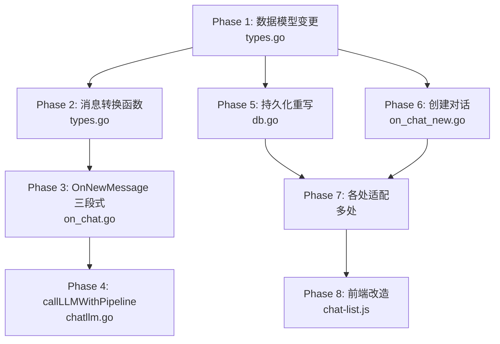

# currentChat 与 chats 重构 v2 — 新设计分析与执行计划

> 基于用户提出的新设计方向，重新分析影响范围并制定执行计划。

---

## 一、新设计数据模型

### 1.1 核心结构体定义

```go
// agent.Message — 仅用于和前端交互时传递消息
// 保留现有字段不变：ID, Role, Content, Usage, Reasoning, Sources, CreatedAt
type Message struct {
    ID        int64  `json:"id"`
    Role      string `json:"role"`
    Content   string `json:"content"`
    Usage     *Usage `json:"usage,omitempty"`
    Reasoning string `json:"reasoning,omitempty"`
    Sources   []toolimp.WebSource `json:"sources,omitempty"`
    CreatedAt string `json:"created_at"`
}

// chat — 运行时对话对象，桥接 store.Chat
type chat struct {
    mu    sync.RWMutex  // 读写锁，保护 messages 和 dbChat 的并发访问
    dbChat *store.Chat  // 桥接 store.Chat，绑定具体 chat 的所有元数据
    
    messages []store.Message  // 消息列表，使用 store.Message 而非 agent.Message
}

// session — 用户会话
type session struct {
    mu          sync.Mutex       // 保护：currentChat 指针切换, userNo, lastActivity
    chatsMu     sync.Mutex       // 保护：chats 切片, chatStore
    
    lastActivity time.Time
    
    id          string
    currentChat *chat             // 指向 chats 中的某一个元素
    chats       []*chat           // 运行时对话列表
    userNo      string
    chatStore   *store.ChatStore
}
```

### 1.2 关系图

```mermaid
classDiagram
    class session {
        mu sync.Mutex
        chatsMu sync.Mutex
        currentChat *chat
        chats []*chat
        userNo string
        chatStore ChatStore
    }
    
    class chat {
        mu sync.RWMutex
        dbChat *store.Chat
        messages []store.Message
    }
    
    class store_Chat {
        ID int64
        SN string
        Title string
        TitleState int8
        Pinned bool
        CreateAt string
        UpdateAt string
        ...更多DB字段
    }
    
    class store_Message {
        ID int64
        SessionID int64
        GroupIndex int
        Role int8
        Content string
        Reasoning *string
        Extracted bool
        CreateAt string
    }
    
    class agent_Message {
        ID int64
        Role string
        Content string
        Usage *Usage
        Reasoning string
        Sources []WebSource
        CreatedAt string
    }
    
    session --> chat : currentChat 指向 chats 中某元素
    session o--> chat : chats 持有所有 *chat
    chat --> store_Chat : dbChat 桥接
    chat --> store_Message : messages 使用 store.Message
    
    note for agent_Message: 仅用于前端交互\n序列化为 JSON 传给前端
    note for chat: 读写锁 RWMutex\n读多写少场景
```

---

## 二、关键设计决策

### 2.1 为什么 `chat.mu` 用 `sync.RWMutex`？

| 操作 | 频率 | 锁类型 |
|------|------|--------|
| 读取 messages（给 LLM 用、给前端返回） | 高频 | `RLock()` |
| 追加消息（流式回复） | 中频 | `Lock()` |
| 删除消息 | 低频 | `Lock()` |
| 切换 chat 时更新 messages | 低频 | `Lock()` |

读多写少，RWMutex 合适。

### 2.2 `agent.Message` 的定位

`agent.Message` **不再存储在 `chat.messages` 中**，而是：
- **输出时**：从 `store.Message` 转换为 `agent.Message`，序列化为 JSON 返回前端
- **输入时**：前端发送 `agent.Message` JSON，后端解析后转为 `store.Message` 存储

```go
// store.Message → agent.Message（输出给前端）
func toAgentMessage(sm store.Message) agent.Message {
    role := llm.RoleUser
    if sm.Role == 1 {
        role = llm.RoleAssistant
    }
    return agent.Message{
        ID:        int64(sm.GroupIndex),
        Role:      role,
        Content:   sm.Content,
        CreatedAt: sm.CreateAt,
        // Reasoning 从 sm.Reasoning 转换
        // Usage/Sources 暂不持久化
    }
}

// agent.Message → store.Message（输入时存储）
func toStoreMessage(sessionID int64, am agent.Message) store.Message {
    role := int8(0) // user
    if am.Role == llm.RoleAssistant {
        role = 1
    }
    return store.Message{
        SessionID:  sessionID,
        GroupIndex: int(am.ID),
        Role:       role,
        Content:    am.Content,
        // Reasoning 转换
    }
}
```

### 2.3 `dbChat *store.Chat` 的作用

`dbChat` 桥接了 `store.Chat` 的所有元数据，意味着：
- **`chat.title`** → `chat.dbChat.Title`
- **`chat.titleState`** → `chat.dbChat.TitleState`
- **`chat.dbSessionID`** → `chat.dbChat.ID`
- **`chat.SN`** → `chat.dbChat.SN`
- **`chat.Pinned`** → `chat.dbChat.Pinned`
- **`chat.CreateAt`** → `chat.dbChat.CreateAt`
- **`chat.UpdateAt`** → `chat.dbChat.UpdateAt`

**好处**：不再需要在 `chat` 结构体中维护重复字段，所有元数据通过 `dbChat` 指针访问。

**注意**：`dbChat` 可能为 `nil`（匿名用户场景），访问时需判空。

---

## 三、影响范围分析

### 3.1 文件级影响矩阵

| 文件 | 影响程度 | 主要变更 |
|------|---------|---------|
| `internal/agent/types.go` | 🔴 高 | chat 结构体重构；accessor 函数重写；switchToChat/switchToUser 重写 |
| `internal/agent/on_chat.go` | 🔴 高 | OnNewMessage 三段式；appendNewRequest/ResponseMessage 重写；store.Message 转换 |
| `internal/agent/chatllm.go` | 🟡 中 | callLLMWithPipeline 返回 *agent.Message 不变，但调用方处理方式变 |
| `internal/agent/on_chat_new.go` | 🟡 中 | OnNewChat 创建 *chat 时初始化 dbChat |
| `internal/agent/db.go` | 🔴 高 | ensureDBSession/persistMessageToDB 重写；deduplicateChats 移除 |
| `internal/agent/on_session.go` | 🟡 中 | OnRestoreSession 中 chats 类型适配；消息转换逻辑 |
| `internal/agent/on_login.go` | 🟢 低 | chats 返回类型适配 |
| `internal/agent/on_title.go` | 🟡 中 | 标题访问改为 chat.dbChat.Title |
| `internal/agent/on_msg_del.go` | 🟢 低 | DeleteMessage 适配 chat.mu 读写锁 |
| `frontend/static/chat-list.js` | 🟢 低 | 流式 abort（不变） |

### 3.2 详细变更清单

#### Phase 1: 数据模型变更 — `types.go`

1. **`chat` 结构体重构**
   ```go
   type chat struct {
       mu      sync.RWMutex  // 读写锁
       dbChat  *store.Chat   // 桥接 store.Chat（可能为 nil）
       messages []store.Message  // 使用 store.Message
   }
   ```

2. **`session` 结构体更新**
   ```go
   type session struct {
       // ... 现有字段不变 ...
       currentChat *chat       // 指向 chats 中某元素
       chats       []*chat     // 改为 []*chat
   }
   ```

3. **移除的 session 方法**
   - `getTitleWithoutLock()` — 改为通过 `chat.dbChat.Title` 访问
   - `setTitleWithoutLock()` — 改为通过 `chat.dbChat.Title` 设置
   - `getDbSessionIDWithoutLock()` — 改为 `chat.dbChat.ID`
   - `setDbSessionIDWithoutLock()` — 改为设置 `chat.dbChat.ID`
   - `syncCurrentChatTitleToChatList()` — 不再需要
   - `addChatToList(store.Chat)` — 改为接受 `*chat`

4. **新增/重写的 chat 方法**
   ```go
   // chat 级别的 accessor（持 chat.mu 的 RLock/Lock）
   func (c *chat) getMessages() []store.Message        // RLock
   func (c *chat) copyMessages() []store.Message        // RLock + copy
   func (c *chat) appendMessages(msgs ...store.Message) // Lock
   func (c *chat) deleteMessagesRange(start, end int)   // Lock
   func (c *chat) getLastMsg() *store.Message           // RLock
   func (c *chat) getMessagesLen() int                  // RLock
   
   // 元数据访问（通过 dbChat）
   func (c *chat) getTitle() (string, TitleState)
   func (c *chat) setTitle(title string, state TitleState)
   func (c *chat) getDBSessionID() int64
   func (c *chat) getSN() string
   ```

5. **`switchToChat` 重写**
   - 在 `chats []*chat` 中查找
   - 复用已有 `*chat` 对象，只更新 `messages`
   - `currentChat = found`

6. **`switchToUser` 重写**
   - `chats` 初始化为 `[]*chat`
   - 匿名消息迁移后创建 `*chat` 对象（含 `dbChat`）

#### Phase 2: 消息转换函数 — 新增文件或 types.go

7. **`store.Message` ↔ `agent.Message` 转换**
   ```go
   func toAgentMessages(sms []store.Message) []agent.Message
   func toAgentMessage(sm store.Message) agent.Message
   func toStoreMessage(sessionID int64, am agent.Message) store.Message
   ```

#### Phase 3: OnNewMessage 三段式 — `on_chat.go`

8. **`OnNewMessage` 三段式加解锁**
   - 阶段1：持 `session.mu`，固定 `targetChat`，追加用户消息（`store.Message`），深拷贝快照
   - 阶段2：无锁，LLM 流式调用（快照需转为 `llm.Message`）
   - 阶段3：持 `targetChat.mu.Lock()`，追加回复（`store.Message`）

9. **`appendNewRequestMessage` 重写**
   - 接受 `*chat` 参数
   - 操作 `chat.messages`（`[]store.Message`）
   - 调用 `persistMessageToDB` 传入 `*chat`

10. **`appendNewResponseMessage` 重写**
    - 接受 `*chat` 参数
    - 追加 `store.Message`
    - 调用 `persistMessageToDB` 传入 `*chat`

11. **`toRawMessages` 适配**
    - 输入从 `[]agent.Message` 改为 `[]store.Message`
    - 输出 `[]llm.Message` 不变

#### Phase 4: callLLMWithPipeline — `chatllm.go`

12. **基本不变**
    - 签名不变，仍返回 `*agent.Message`
    - 调用方（OnNewMessage）负责将返回的 `*agent.Message` 转为 `store.Message` 后存储

#### Phase 5: 持久化 — `db.go`

13. **`ensureDBSession` 重写**
    - 接受 `*chat` 参数
    - 通过 `chat.dbChat` 判断是否已有 DB 记录
    - 创建后设置 `chat.dbChat`

14. **`persistMessageToDB` 重写**
    - 接受 `*chat` 和 `*store.Message` 参数
    - 通过 `chat.dbChat.ID` 获取 session ID
    - 直接调用 `chatStore.InsertMessage`
    - chats 列表重排逻辑适配 `[]*chat`

15. **`deduplicateChats` 移除**
    - 不再需要，`[]*chat` 不存在重复问题

#### Phase 6: 创建对话 — `on_chat_new.go`

16. **`OnNewChat` 重写**
    - 创建 `*chat` 对象
    - 登录用户：创建 `store.Chat` 记录，设置 `chat.dbChat`
    - `chats = append(chats, newChat)`
    - `currentChat = newChat`

#### Phase 7: 各处 chats 类型适配

17. **`on_session.go`**
    - `OnRestoreSession`：`chats` 变量类型 `[]*chat`；消息返回前转为 `[]agent.Message`
    - `OnDeleteSession`：`session.chats` 操作适配 `[]*chat`

18. **`on_login.go`**
    - `OnLogin`：返回 `chats` 时需将 `[]*chat` 转为 `[]store.Chat`（或直接返回 `[]*chat` 的 JSON）

19. **`on_chat.go`**
    - `OnChatPin`：通过 `chat.dbChat` 操作
    - `OnGetCurrentChat`：通过 `chat.dbChat.SN` 获取 SN

20. **`on_title.go`**
    - `OnPutChatTitle`：标题操作改为 `chat.dbChat.Title`
    - `sn != ""` 分支：通过 `chat.dbChat` 操作
    - `sn == ""` 分支：通过 `currentChat.dbChat` 操作
    - 移除 `syncCurrentChatTitleToChatList` 调用

21. **`on_msg_del.go`**
    - `DeleteMessage`：使用 `chat.mu.RLock()`/`Lock()` 替代 `s.mu`

#### Phase 8: 前端改造

22. **`chat-list.js`**
    - `selectChat` 前 abort SSE 流（不变）

---

## 四、执行顺序



### 推荐执行顺序

1. **Phase 1** — 数据模型变更（所有其他阶段依赖此变更）
2. **Phase 2** — 消息转换函数（Phase 3/5/6/7 都需要）
3. **Phase 3 + 4** — OnNewMessage 三段式 + callLLMWithPipeline（核心变更）
4. **Phase 5** — 持久化重写
5. **Phase 6** — 创建对话
6. **Phase 7** — 各处适配
7. **Phase 8** — 前端改造

---

## 五、与 v1 方案的关键差异

| 项目 | v1 方案 | v2 新设计 |
|------|---------|----------|
| `chat.messages` 类型 | `[]agent.Message` | `[]store.Message` |
| `chat` 元数据字段 | 独立字段（SN/Title/Pinned 等） | 通过 `dbChat *store.Chat` 桥接 |
| `chat` 锁类型 | `sync.Mutex` | `sync.RWMutex` |
| `agent.Message` 用途 | 运行时存储 + 前端交互 | 仅前端交互（转换边界） |
| `store.Message` 用途 | 仅 DB 模型 | 运行时存储 + DB 模型 |
| 消息转换 | 仅在 DB 读写时转换 | 每次与前端交互时转换 |
| `syncCurrentChatTitleToChatList` | 移除 | 不再需要（天然一致） |
