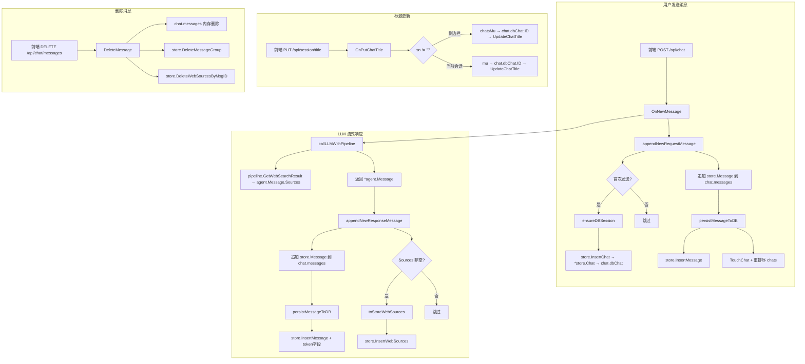

# currentChat 与 chats 重构 v3 — 最终设计方案

> 基于用户 7 点补充要求，更新设计。

---

## 一、要点回应

### 要点 1：store.Message 增加 Usage 字段 + WebSources 持久化

#### 1a. Token 用量字段

`store.Message` 结构体增加 token 用量字段，`agent.Message` 中体现为 `Usage` 结构体。

```go
// store.Message — 增加 token 用量字段
type Message struct {
    ID        int64  `db:"id"`
    SessionID int64  `db:"session_id"`
    GroupIndex int   `db:"group_index"` // 对应 agent.Message.ID
    Role       int8  `db:"role"`        // 0: user, 1: assistant
    Reasoning  *string `db:"reasoning"`
    Content    string  `db:"content"`
    
    // Token 用量（仅 assistant 消息有值）
    PromptTokens     int `db:"prompt_tokens" json:"-"`
    CompletionTokens int `db:"completion_tokens" json:"-"`
    TotalTokens      int `db:"total_tokens" json:"-"`
    IsEstimated      bool `db:"is_estimated" json:"-"`
    
    Extracted bool   `db:"extracted"`
    CreateAt  string `db:"create_at"`
    UpdateAt  string `db:"update_at"`
}
```

**DB schema 变更**：`chat_messages` 表新增 4 列：
```sql
prompt_tokens     INTEGER NOT NULL DEFAULT 0,
completion_tokens INTEGER NOT NULL DEFAULT 0,
total_tokens      INTEGER NOT NULL DEFAULT 0,
is_estimated      INTEGER NOT NULL DEFAULT 0,
```

#### 1b. WebSources 持久化 — 新增 `web_sources` 表

`agent.Message.Sources`（`[]toolimp.WebSource`）目前不持久化到 DB，导致切换 session 后 sources 丢失。需要新增一张 `web_sources` 表来存储。

**设计原则**：按 chat（session_id）批量查询，而非按 msg_id 逐条查询。`chat.messages` 中的每条 assistant 消息可能关联多个 web sources，一次性查出整个 chat 的所有 sources 后，在 `chat` 结构体中按 `msg_id` 分组存储。

```go
// store 层新增
type WebSource struct {
    ID          int64   `db:"id"`            // 自增主键
    SessionID   int64   `db:"session_id"`    // 指向 chat_sessions.id，用于按 chat 批量查询
    MsgID       int64   `db:"msg_id"`        // 指向 chat_messages.id，用于分组
    Title       string  `db:"title"`
    Content     string  `db:"content"`
    URL         string  `db:"url"`
    SiteName    string  `db:"site_name"`
    SiteIcon    string  `db:"site_icon"`
    PublishDate string  `db:"publish_date"`
    Score       float64 `db:"score"`
    CreateAt    string  `db:"create_at"`
}
```

**DB schema 新增**：
```sql
CREATE TABLE IF NOT EXISTS web_sources (
    id           INTEGER PRIMARY KEY AUTOINCREMENT,
    session_id   INTEGER NOT NULL REFERENCES chat_sessions(id),
    msg_id       INTEGER NOT NULL REFERENCES chat_messages(id),
    title        TEXT    NOT NULL DEFAULT '',
    content      TEXT    NOT NULL DEFAULT '',
    url          TEXT    NOT NULL DEFAULT '',
    site_name    TEXT    NOT NULL DEFAULT '',
    site_icon    TEXT    NOT NULL DEFAULT '',
    publish_date TEXT    NOT NULL DEFAULT '',
    score        REAL    NOT NULL DEFAULT 0,
    create_at    DATETIME NOT NULL DEFAULT CURRENT_TIMESTAMP
);
CREATE INDEX IF NOT EXISTS idx_web_sources_session_id ON web_sources(session_id);
```

**chat 结构体中的存储方式**：

```go
type chat struct {
    mu       sync.RWMutex
    dbChat   *store.Chat
    messages []store.Message
    
    // WebSources 按 msg_id 分组存储，key = store.Message.ID
    // 一次性从 DB 查出整个 chat 的所有 sources，避免逐条查询
    webSources map[int64][]toolimp.WebSource  // key: msg_id
}
```

**store 层新增方法**：
- `InsertWebSources(sessionID int64, msgID int64, sources []toolimp.WebSource) error` — 批量插入
- `ListWebSourcesBySession(sessionID int64) (map[int64][]toolimp.WebSource, error)` — 按 session_id 查出所有 sources，按 msg_id 分组返回
- `DeleteWebSourcesBySession(sessionID int64) error` — 删除某 chat 的所有 sources

**双向转换逻辑**：

LLM 产生的是 `agent.Message`（含 `Usage`、`Sources []toolimp.WebSource`），store 层不感知 agent 类型。转换在两个方向进行：

**方向 1：agent → store（持久化方向）**

LLM 回复完成后产生 `*agent.Message`，持久化时拆解为 `store.Message` + `store.WebSource`。

```go
// agent.Message → store.Message（Usage 拆解到字段）
func toStoreMessage(msg *agent.Message, sessionID int64, groupIndex int) store.Message {
    role := int8(0) // user
    if msg.Role == llm.RoleAssistant {
        role = 1 // assistant
    }
    sm := store.Message{
        SessionID:  sessionID,
        GroupIndex: groupIndex,
        Role:       role,
        Content:    msg.Content,
    }
    if msg.Reasoning != "" {
        sm.Reasoning = &msg.Reasoning
    }
    // Usage 拆解到独立字段
    if msg.Usage != nil {
        sm.PromptTokens = msg.Usage.PromptTokens
        sm.CompletionTokens = msg.Usage.CompletionTokens
        sm.TotalTokens = msg.Usage.TotalTokens
        sm.IsEstimated = msg.Usage.IsEstimated
    }
    return sm
}

// agent.Message.Sources → []store.WebSource（批量转换）
func toStoreWebSources(sessionID int64, msgID int64, sources []toolimp.WebSource) []store.WebSource {
    if len(sources) == 0 {
        return nil
    }
    result := make([]store.WebSource, len(sources))
    for i, s := range sources {
        result[i] = store.WebSource{
            SessionID:   sessionID,
            MsgID:       msgID,
            Title:       s.Title,
            Content:     s.Content,
            URL:         s.URL,
            SiteName:    s.SiteName,
            SiteIcon:    s.SiteIcon,
            PublishDate: s.PublishDate,
            Score:       s.Score,
        }
    }
    return result
}
```

**方向 2：store → agent（读取方向）**

从 DB 读出后，组装为 `agent.Message` 发给前端。sources 从 `chat.webSources` 中按 msg_id 取出。

```go
// store.Message + []toolimp.WebSource → agent.Message（含 Usage 组装 + Sources 组装）
// sources 参数传 nil 表示该消息没有关联的 web sources（如匿名用户无 DB 可查）
func toAgentMessage(sm store.Message, sources []toolimp.WebSource) agent.Message {
    role := llm.RoleUser
    if sm.Role == 1 {
        role = llm.RoleAssistant
    }
    msg := agent.Message{
        ID:        int64(sm.GroupIndex),
        Role:      role,
        Content:   sm.Content,
        CreatedAt: sm.CreateAt,
    }
    if sm.Reasoning != nil {
        msg.Reasoning = *sm.Reasoning
    }
    // Usage 组装（仅 assistant 消息有值）
    if sm.Role == 1 && (sm.PromptTokens > 0 || sm.CompletionTokens > 0) {
        msg.Usage = &Usage{
            PromptTokens:     sm.PromptTokens,
            CompletionTokens: sm.CompletionTokens,
            TotalTokens:      sm.TotalTokens,
            IsEstimated:      sm.IsEstimated,
        }
    }
    // Sources 组装
    if len(sources) > 0 {
        msg.Sources = sources
    }
    return msg
}
```

### 要点 2：GroupIndex = agent.Message.ID

确认：`store.Message.GroupIndex` 就是 `agent.Message.ID`，表示同一轮次的消息（用户+助手共享同一 ID）。这不是 unique 的，而是**组标识**。

```go
// 同一轮次的消息示例：
// GroupIndex=1, Role=0  → 用户消息 "你好"
// GroupIndex=1, Role=1  → 助手回复 "你好！有什么可以帮助你的？"
// GroupIndex=2, Role=0  → 用户消息 "今天天气怎么样？"
// GroupIndex=2, Role=1  → 助手回复 "今天天气晴朗..."
```

### 要点 3：session 增加 IsAnonymous() 方法

```go
// isAnonymousWithoutLock 判断当前 session 是否为匿名用户（调用者必须持有 s.mu）
func (s *session) isAnonymousWithoutLock() bool {
    return s.userNo == ""
}

// IsAnonymous 判断当前 session 是否为匿名用户
func (s *session) IsAnonymous() bool {
    s.mu.Lock()
    defer s.mu.Unlock()
    return s.isAnonymousWithoutLock()
}
```

匿名用户特征：
- `userNo == ""`
- `chatStore == nil`
- `chats` 为 `nil` 或空切片
- `currentChat` 非空，但其 `dbChat` 的 `ID==0`、`SN==""`

### 要点 4：匿名用户下 currentChat 的 dbChat 固定非空

匿名用户下：
```go
// 匿名用户初始化 currentChat
currentChat := &chat{
    dbChat: &store.Chat{
        // ID=0, SN="" 表示未持久化
    },
    messages: []store.Message{},
}
```

即使匿名用户，`dbChat` 也非 nil，但 `ID==0` 且 `SN==""`。这样所有访问 `chat.dbChat` 的地方都不需要判空，只需判断 `dbChat.ID == 0` 即可知道是否已持久化。

### 要点 5：匿名 vs 登录状态下的操作差异

| 操作 | 匿名用户 | 登录用户 |
|------|---------|---------|
| `currentChat` 与 `chats` 关系 | 独立，不在 chats 中 | 指向 chats 中某元素 |
| `chats` | `nil` 或空切片 | `[]*chat` 列表 |
| 重置 currentChat | 清空 messages + dbChat | 清空 messages + dbChat |
| 切换 chat | 不支持（无 chats） | 在 chats 中按 SN 查找 |
| 删除 chat | 不支持 | 逻辑删除，不移出数组 |
| 新建 chat | 直接重置 currentChat | new *chat → append 到 chats → currentChat 指向它 |

### 要点 6：pipeline 传入 *chat 指针副本

流式期间，`OnNewMessage` 将 `targetChat`（`*chat` 指针）保存下来，即使后续 `session.currentChat` 被切换走，`targetChat` 仍然指向原来的 `*chat` 对象。

```go
// OnNewMessage 阶段 1
session.mu.Lock()
targetChat := session.currentChat  // 保存指针副本
// ... 追加用户消息 ...
session.mu.Unlock()

// 阶段 2：LLM 流式（无 session 锁）
// targetChat 仍然有效，即使 session.currentChat 已被切换
assistantAgentMsg := h.callLLMWithPipeline(...)

// 阶段 3：持 targetChat.mu 追加回复
targetChat.mu.Lock()
// 将 assistantAgentMsg 转为 store.Message 追加到 targetChat.messages
targetChat.mu.Unlock()
```

### 要点 7：流式切换时前端的 DOM 问题 — SSEReceiver 抽象层

**问题**：用户从 chat A 切换到 chat B 时，chat A 的 SSE 流可能还在进行中。不能简单 abort，因为：
- abort 后后端 context cancelled，流式回复中断，浪费已生成的 token
- 用户切回 chat A 时，需要重新从 DB 加载，丢失了流式过程中的实时性

**解决方案：`SSEReceiver` 抽象层**

每个 chat 拥有一个 `SSEReceiver` 实例，负责接收该 chat 的所有 SSE 事件。切换 chat 时不中断 SSE 连接，只是切换 DOM 更新的目标。

#### 节流渲染机制的保留与适配

原有的节流 markdown→HTML 转换逻辑（`throttleRender` + `state.accumulatedMarkdown` + `state.renderTimer`）需要保留，但适配到 SSEReceiver 架构：

**核心原则**：
- `state.accumulatedMarkdown` 仍然是全局唯一的，始终指向**当前 active chat** 的累积内容
- 当 active chat 切换时，`state.accumulatedMarkdown` 要切换到新 chat 的 `streamContent`
- 每个 `SSEReceiver` 自身持有 `streamReason` / `streamContent` 作为持久化累积
- 节流定时器 `state.renderTimer` 全局唯一，只对 active chat 生效

**切换时的关键操作**：
1. chat A 失活前：`state.accumulatedMarkdown` 已包含 chat A 的最新内容，无需额外保存（因为 `SSEReceiver.onText` 已同步追加到 `receiver.streamContent`）
2. 切换到 chat B 时：将 `state.accumulatedMarkdown` 设为 chat B 的 `receiver.streamContent`（或空串）
3. 切回 chat A 时：将 `state.accumulatedMarkdown` 设回 chat A 的 `receiver.streamContent`，并重建 DOM

```javascript
// ============================================================
// SSEReceiver — 每个 chat 的 SSE 事件接收器
// ============================================================
class SSEReceiver {
    constructor(chatSN) {
        this.chatSN = chatSN;           // 所属 chat 的 SN
        this.streamReason = '';         // 累积的 reasoning 内容（持久化）
        this.streamContent = '';        // 累积的 text 内容（持久化）
        this.isActive = false;          // 当前是否为活动 chat
        this.abortController = null;    // 用于取消 fetch
        this.assistantBubble = null;    // 对应的 DOM 气泡（仅 active 时有）
        this.renderTimer = null;        // 节流渲染定时器（仅 active 时使用）
    }

    // 处理 reasoning 事件：总是追加到 streamReason
    onReasoning(text) {
        this.streamReason += text;
        if (this.isActive) {
            // 只有活动 chat 才更新 DOM
            handleReasoningEvent({ content: text }, this.assistantBubble);
        }
    }

    // 处理 text 事件：总是追加到 streamContent
    onText(text) {
        this.streamContent += text;
        if (this.isActive) {
            // 只有活动 chat 才更新 DOM
            const contentDiv = this.assistantBubble.querySelector('.bubble');
            if (contentDiv) {
                state.accumulatedMarkdown = this.streamContent; // 同步到全局
                contentDiv.classList.add('streaming');
                scheduleContentRender(contentDiv);
            }
        }
    }

    // 处理 done 事件：标记流结束
    onDone(event) {
        if (this.isActive) {
            // 确保最终渲染完成
            if (this.renderTimer) {
                clearTimeout(this.renderTimer);
                this.renderTimer = null;
            }
            const contentDiv = this.assistantBubble.querySelector('.bubble');
            if (contentDiv) {
                contentDiv.innerHTML = renderMarkdown(this.streamContent);
            }
            handleDoneEvent(event, this.assistantBubble, contentDiv);
        }
        // 即使非活动，streamReason/streamContent 已完整记录
    }

    // 处理 sources 事件
    onSources(event) {
        if (this.isActive) {
            handleSourcesEvent(event);
        }
    }

    // 处理 error 事件
    onError(message) {
        if (this.isActive) {
            showError(this.assistantBubble, message);
        }
    }
}
```

**全局状态变更**：

```javascript
// chat-state.js 新增
export const state = {
    // ... 现有字段 ...
    
    // 每个 chat 的 SSEReceiver 映射表
    sseReceivers: {},  // key: chatSN, value: SSEReceiver
    
    // 当前活动的 SSEReceiver（指向 sseReceivers[state.currentChatSN]）
    activeReceiver: null,
};
```

**selectChat 流程变更**（不再 abort SSE）：

```javascript
// chat-list.js — selectChat 修改
async function selectChat(sn) {
    // 不再 abort SSE！只是切换 activeReceiver
    if (state.activeReceiver) {
        state.activeReceiver.isActive = false;
        // 清除旧 active chat 的节流定时器（避免切走后还在渲染）
        if (state.activeReceiver.renderTimer) {
            clearTimeout(state.activeReceiver.renderTimer);
            state.activeReceiver.renderTimer = null;
        }
    }
    
    // 切换到新 chat 的 receiver
    const receiver = state.sseReceivers[sn];
    if (receiver) {
        receiver.isActive = true;
        state.activeReceiver = receiver;
        // 同步 accumulatedMarkdown 到新 chat 的累积内容
        state.accumulatedMarkdown = receiver.streamContent;
    } else {
        state.activeReceiver = null;
        state.accumulatedMarkdown = '';
    }
    
    // ... 其余逻辑（清空 DOM、加载消息等）...
}
```

**sendMessage 流程变更**：

```javascript
// chat-sse.js — sendMessage 修改
export async function sendMessage() {
    // ... 现有逻辑 ...
    
    const { content, createdAt, assistantBubble } = chatData;
    
    // 为当前 chat 创建 SSEReceiver
    const receiver = new SSEReceiver(state.currentChatSN);
    receiver.isActive = true;
    receiver.assistantBubble = assistantBubble;
    receiver.abortController = state.abortController;
    state.sseReceivers[state.currentChatSN] = receiver;
    state.activeReceiver = receiver;
    state.accumulatedMarkdown = ''; // 重置累积
    
    try {
        await fetchStream(assistantBubble, content, createdAt, receiver);
    } catch (err) {
        handleStreamError(err, assistantBubble);
    } finally {
        cleanupAfterStream(assistantBubble, !!state._wasAborted);
    }
}
```

**readSSEBuffer 变更**：将事件分发给 receiver 而非直接操作 DOM：

```javascript
async function readSSEBuffer(response, assistantBubble, receiver) {
    const reader = response.body.getReader();
    const decoder = new TextDecoder();
    let buffer = '';

    while (true) {
        const { done, value } = await reader.read();
        if (done) break;

        buffer += decoder.decode(value, { stream: true });
        const lines = buffer.split('\n');
        buffer = lines.pop() || '';

        for (const line of lines) {
            const trimmed = line.trim();
            if (!trimmed || !trimmed.startsWith('data: ')) continue;

            const jsonStr = trimmed.slice(6);
            try {
                const event = JSON.parse(jsonStr);
                // 通过 receiver 分发，而非直接 handleSSEEvent
                dispatchToReceiver(event, receiver);
            } catch (e) {
                console.warn('解析 SSE 事件失败:', jsonStr);
            }
        }
    }
}

function dispatchToReceiver(event, receiver) {
    switch (event.type) {
        case 'reasoning':
            receiver.onReasoning(event.content || '');
            break;
        case 'reasoning_end':
            if (receiver.isActive) {
                finalizeReasoningArea(receiver.assistantBubble);
            }
            break;
        case 'text':
            receiver.onText(event.content || '');
            break;
        case 'sources':
            receiver.onSources(event);
            break;
        case 'done':
            receiver.onDone(event);
            break;
        case 'error':
            receiver.onError(event.message);
            break;
    }
}
```

**切回 chat 时恢复流式状态**（`restoreChat` / `selectChat` 中）：

当用户切回一个正在流式的 chat 时：
1. 检查 `state.sseReceivers[sn]` 是否存在且 `streamContent !== ''`
2. 如果存在，说明该 chat 的 SSE 流仍在进行中
3. 检查 `state.messages` 最后一个消息角色是否为 assistant
4. 如果不是（或最后一个 assistant 消息不完整），使用 `receiver.streamReason` 和 `receiver.streamContent` 构建出助手消息气泡 DOM
5. 将 `state.accumulatedMarkdown` 设为 `receiver.streamContent`
6. 将 receiver 设为 active，后续 SSE 事件直接追加到该 DOM

```javascript
// selectChat 中，加载消息后检查是否有进行中的流
async function selectChat(sn) {
    // ... 清空 DOM、加载消息 ...
    
    // 检查是否有进行中的 SSEReceiver
    const receiver = state.sseReceivers[sn];
    if (receiver && receiver.streamContent) {
        // 该 chat 有未完成的流式回复
        const lastMsg = state.messages[state.messages.length - 1];
        if (!lastMsg || lastMsg.role !== 'assistant') {
            // 最后一个消息不是 assistant，需要构建占位气泡
            const assistantBubble = addMessage('assistant', '', null, true);
            receiver.assistantBubble = assistantBubble;
            
            // 恢复已累积的 reasoning 内容
            if (receiver.streamReason) {
                // 重建 reasoning 区域
                // ... reasoning 恢复逻辑 ...
            }
            
            // 恢复已累积的 text 内容
            if (receiver.streamContent) {
                const contentDiv = assistantBubble.querySelector('.bubble');
                if (contentDiv) {
                    state.accumulatedMarkdown = receiver.streamContent;
                    contentDiv.innerHTML = renderMarkdown(receiver.streamContent);
                    contentDiv.classList.add('streaming');
                }
            }
        }
        receiver.isActive = true;
        state.activeReceiver = receiver;
    }
}
```

**后端配合**：后端不需要任何修改。SSE 连接保持打开，后端继续流式输出。`targetChat` 指针副本确保即使 `session.currentChat` 被切换，原 chat 的流式写入仍然正常进行。

---

## 二、更新后的数据模型

```go
// ============================================================
// agent.Message — 仅用于和前端交互时传递消息
// ============================================================
type Message struct {
    ID        int64  `json:"id"`              // = store.Message.GroupIndex
    Role      string `json:"role"`            // user | assistant | system
    Content   string `json:"content"`
    Usage     *Usage `json:"usage,omitempty"`
    Reasoning string `json:"reasoning,omitempty"`
    Sources   []toolimp.WebSource `json:"sources,omitempty"`
    CreatedAt string `json:"created_at"`
}

// ============================================================
// chat — 运行时对话对象
// ============================================================
type chat struct {
    mu       sync.RWMutex    // 读写锁，保护 messages 并发访问
    dbChat   *store.Chat     // 桥接 store.Chat（匿名用户也非空，但 ID=0, SN=""）
    messages []store.Message // 消息列表
}

// ============================================================
// session — 用户会话
// ============================================================
type session struct {
    mu          sync.Mutex       // 保护：currentChat 指针切换, userNo, lastActivity
    chatsMu     sync.Mutex       // 保护：chats 切片, chatStore
    
    lastActivity time.Time
    id          string
    currentChat *chat            // 指向 chats 中某元素（匿名用户独立）
    chats       []*chat          // 运行时对话列表（匿名用户为 nil）
    userNo      string           // 空串表示匿名
    chatStore   *store.ChatStore // nil 表示匿名
}

// IsAnonymous 判断当前 session 是否为匿名用户
func (s *session) IsAnonymous() bool {
    s.mu.Lock()
    defer s.mu.Unlock()
    return s.userNo == ""
}
```

---

## 三、更新后的执行计划

### Phase 0: store 层变更 — `internal/store/chats.go` + `internal/store/messages.go`

[ ] 0.1 store.Message 新增 token 用量字段（PromptTokens, CompletionTokens, TotalTokens, IsEstimated）
[ ] 0.2 chat_messages 表 schema 新增 4 列（initSchema 中）
[ ] 0.3 InsertMessage 签名增加 token 参数
[ ] 0.4 ListMessages SELECT 增加 token 字段
[ ] 0.5 新增 store.WebSource 结构体（含 SessionID + MsgID 双字段）
[ ] 0.6 initSchema 中新增 web_sources 表（含 session_id 外键 + 索引）
[ ] 0.7 新增 `InsertWebSources(sessionID int64, msgID int64, sources []toolimp.WebSource) error`
[ ] 0.8 新增 `ListWebSourcesBySession(sessionID int64) (map[int64][]toolimp.WebSource, error)` — 按 session_id 批量查询，按 msg_id 分组
[ ] 0.9 新增 `DeleteWebSourcesBySession(sessionID int64) error` — 删除某 chat 的所有 sources

### Phase 1: 数据模型变更 — `internal/agent/types.go`

[ ] 1.1 chat 结构体重构：`mu sync.RWMutex` + `dbChat *store.Chat` + `messages []store.Message` + `webSources map[int64][]toolimp.WebSource`
[ ] 1.2 session.chats 类型从 `[]store.Chat` 改为 `[]*chat`
[ ] 1.3 session 增加 IsAnonymous() 方法
[ ] 1.4 新增 chat 级别的 accessor 方法（持 RWMutex），含 `GetWebSources(msgID int64) []toolimp.WebSource`
[ ] 1.5 重写 session 上的 WithoutLock 方法（委托 chat 方法）
[ ] 1.6 重写 switchToChat：在 chats []*chat 中查找，复用对象
[ ] 1.7 重写 switchToUser：chats 初始化为 []*chat，匿名消息迁移适配

### Phase 2: 消息转换函数 — `internal/agent/types.go`

[ ] 2.1 新增 `toAgentMessage(sm store.Message, sources []toolimp.WebSource) agent.Message` — store→agent 方向（含 Usage 组装 + Sources 组装）
[ ] 2.2 新增 `toStoreMessage(msg *agent.Message, sessionID int64, groupIndex int) store.Message` — agent→store 方向（含 Usage 拆解到独立字段）
[ ] 2.3 新增 `toStoreWebSources(sessionID int64, msgID int64, sources []toolimp.WebSource) []store.WebSource` — agent→store 方向（Sources 批量转换）
[ ] 2.4 新增 `storeMessagesToLLMMessages([]store.Message) []llm.Message` — 替代原 toRawMessages

### Phase 3: OnNewMessage 三段式 — `internal/agent/on_chat.go`

[ ] 3.1 OnNewMessage 拆分为三段式加解锁
[ ] 3.2 阶段1：持 session.mu，保存 targetChat，追加用户 store.Message，深拷贝快照
[ ] 3.3 阶段2：无锁，LLM 流式调用（快照转为 llm.Message）
[ ] 3.4 阶段3：持 targetChat.mu，将返回的 agent.Message 转为 store.Message 追加
[ ] 3.5 appendNewRequestMessage 重写：接受 *chat，操作 store.Message
[ ] 3.6 appendNewResponseMessage 重写：接受 *chat，操作 store.Message

### Phase 4: callLLMWithPipeline — `internal/agent/chatllm.go`

[ ] 4.1 签名不变，返回 *agent.Message
[ ] 4.2 OnNewMessage 中调用方处理返回的 *agent.Message 转为 store.Message

### Phase 5: 持久化重写 — `internal/agent/db.go`

[ ] 5.1 ensureDBSession 重写：接受 *chat 参数，操作 chat.dbChat
[ ] 5.2 persistMessageToDB 重写：接受 *chat + *store.Message 参数
[ ] 5.3 chats 列表重排逻辑适配 []*chat
[ ] 5.4 移除 deduplicateChats

### Phase 6: 创建对话 — `internal/agent/on_chat_new.go`

[ ] 6.1 OnNewChat 重写：创建 *chat（含 dbChat），append 到 chats，currentChat 指向它

### Phase 7: 各处适配

[ ] 7.1 OnRestoreSession 适配 — on_session.go
[ ] 7.2 OnDeleteSession 适配 — on_session.go
[ ] 7.3 OnLogin 适配 — on_login.go
[ ] 7.4 OnChatPin 适配 chat.dbChat — on_chat.go
[ ] 7.5 OnGetCurrentChat 适配 chat.dbChat — on_chat.go
[ ] 7.6 OnPutChatTitle 适配 chat.dbChat — on_title.go
[ ] 7.7 移除 syncCurrentChatTitleToChatList — on_title.go + types.go
[ ] 7.8 DeleteMessage 适配 chat.mu 读写锁 — types.go

### Phase 8: 前端 SSEReceiver 改造

涉及文件：`frontend/static/chat-state.js`, `frontend/static/chat-sse.js`, `frontend/static/chat-list.js`, `frontend/static/chat-restore.js`

[ ] 8.1 `chat-state.js` — 全局状态新增 `sseReceivers: {}` 和 `activeReceiver: null`
[ ] 8.2 `chat-sse.js` — 新增 `SSEReceiver` 类（含 `onReasoning`, `onText`, `onDone`, `onSources`, `onError` 方法，以及 `renderTimer` 字段）
[ ] 8.3 `chat-sse.js` — 新增 `dispatchToReceiver(event, receiver)` 分发函数
[ ] 8.4 `chat-sse.js` — `readSSEBuffer` 签名增加 `receiver` 参数，事件通过 `dispatchToReceiver` 分发
[ ] 8.5 `chat-sse.js` — `sendMessage` 中创建 `SSEReceiver` 实例并注册到 `state.sseReceivers`
[ ] 8.6 `chat-sse.js` — `handleDoneEvent` 适配：非 active 时不操作 DOM，但 `streamContent` 已完整记录
[ ] 8.7 `chat-sse.js` — `scheduleContentRender` 适配：active chat 使用 `state.accumulatedMarkdown` 节流渲染
[ ] 8.8 `chat-list.js` — `selectChat` 不再 abort SSE，改为切换 `activeReceiver` + 同步 `accumulatedMarkdown`
[ ] 8.9 `chat-list.js` — `selectChat` 中增加切回恢复逻辑：检查 `sseReceivers[sn]`，重建 DOM 气泡
[ ] 8.10 `chat-restore.js` — `restoreChat` 中增加 SSEReceiver 恢复逻辑（检查进行中的流）
[ ] 8.11 `chat-state.js` — `resetStreamingState` 适配：清理所有 `sseReceivers` 中的定时器

---

## 四、DB 写逻辑完整分析

> 基于用户要求，检查后端写数据的逻辑：写 chat_sessions、写 chat_messages、写 web_sources。
> 检查点：在什么环节/时机下写？需要从哪些类型的数据一步步转换到 store.XXX？

### 4.1 写 `chat_sessions`（`ensureDBSession`）

**当前代码位置**：[`internal/agent/db.go:29`](internal/agent/db.go:29)

**触发时机（2 处）：**

| 调用方 | 时机 | 文件位置 |
|--------|------|----------|
| `appendNewRequestMessage` | 用户发送第一条消息时，在追加用户消息后立即调用 | [`on_chat.go:137`](internal/agent/on_chat.go:137) |
| `OnNewChat` | 前端调用 POST `/api/chat/new` 时 | [`on_chat_new.go:33`](internal/agent/on_chat_new.go:33) |

**当前数据流：**

```
session.getTitleWithoutLock()  →  string title
         ↓
session.chatStore.InsertChat(sn, 0, title, 0)  →  *store.Chat
         ↓
session.setDbSessionIDWithoutLock(dbChat.ID)   // 存入 currentChat.dbSessionID
session.addChatToList(*dbChat)                  // 存入 session.chats []store.Chat
```

**新设计下的改造：**

- `ensureDBSession` 签名改为 `ensureDBSession(s *session, c *chat)`，操作 `c.dbChat`
- 不再调用 `session.setDbSessionIDWithoutLock`，改为 `c.dbChat = dbChat`
- `addChatToList` 改为接受 `*chat` 而非 `*store.Chat`
- 匿名用户：`c.dbChat = &store.Chat{ID: 0, SN: ""}`（始终非 nil）

### 4.2 写 `chat_messages`（`persistMessageToDB`）

**当前代码位置**：[`internal/agent/db.go:64`](internal/agent/db.go:64)

**触发时机（2 处）：**

| 调用方 | 时机 | 文件位置 |
|--------|------|----------|
| `appendNewRequestMessage` | 追加用户消息后立即调用 | [`on_chat.go:140`](internal/agent/on_chat.go:140) |
| `appendNewResponseMessage` | LLM 返回完整响应后追加助手消息时调用 | [`on_chat.go:152`](internal/agent/on_chat.go:152) |

**当前数据流：**

```
*agent.Message  →  手动字段映射
  msg.Role        →  int (0=user, 1=assistant)
  msg.ID          →  groupIndex (int)
  msg.Reasoning   →  *string
  msg.Content     →  string
         ↓
session.chatStore.InsertMessage(dbSessionID, groupIndex, role, content, reasoning)
         ↓
session.chatStore.TouchChat(dbSessionID)     // 更新 update_at
         ↓
session.chats 切片重排序（移到最前）           // 操作 []store.Chat
```

**新设计下的改造：**

- `persistMessageToDB` 签名改为 `persistMessageToDB(s *session, c *chat, sm *store.Message)`
- 数据流变为：

  ```
  chat.messages 中新增的 store.Message  →  直接传给 InsertMessage
  ```

- 不再需要手动字段映射（因为已经是 `store.Message` 类型）
- 但需要额外写入 4 个 token 字段（`prompt_tokens`, `completion_tokens`, `total_tokens`, `is_estimated`）
- 切片重排序改为操作 `[]*chat`，找到 `c` 后移到最前

**关键问题**：`persistMessageToDB` 在 `appendNewRequestMessage` 中被调用时，`store.Message` 还没有 token 数据（用户消息没有 Usage）。这是正常的——用户消息的 token 字段为 0/NULL。

### 4.3 写 `web_sources`（新功能，当前不存在）

**当前状态**：不存在。WebSource 目前只存在于 [`chatllm.go:242`](internal/agent/chatllm.go:242) 的 `pipeline.GetWebSearchResult()` 返回的 `[]toolimp.WebSource`，仅通过 SSE 推送到前端，不做持久化。

**触发时机（新设计）：**

- 在 `appendNewResponseMessage` 中，助手消息持久化之后
- 当 `assistantMsg.Sources` 非空时调用

**新数据流：**

```
callLLMWithPipeline 返回 *agent.Message
  .Sources = pipeline.GetWebSearchResult()  →  []toolimp.WebSource
         ↓
toStoreWebSources(sessionID, msgID, sources)  →  []store.WebSource
  // 转换：toolimp.WebSource → store.WebSource
  // 填充 sessionID 和 msgID
         ↓
store.InsertWebSources(ws []store.WebSource)  // 批量 INSERT
```

**存储位置：**

- DB：`web_sources` 表，通过 `session_id` 可批量查询
- 内存：`chat.webSources map[int64][]toolimp.WebSource`，key 为 `msg_id`

### 4.4 写 `chat_sessions.title`（`UpdateChatTitle`）

**当前代码位置**：[`internal/agent/on_title.go:29`](internal/agent/on_title.go:29)

**触发时机（1 处，2 个分支）：**

| 分支 | 时机 | 锁 |
|------|------|-----|
| `sn != ""` | 侧边栏重命名历史会话 | `chatsMu` |
| `sn == ""` | 当前会话标题编辑（header 区域） | `mu` |

**当前数据流（`sn != ""` 分支）：**

```
session.chats[targetIndex].ID  →  targetID
         ↓
chatStore.UpdateChatTitle(targetID, newTitle, int8(titleState))
         ↓
session.chats[i].Title = newTitle      // 更新内存缓存
session.chats[i].TitleState = int8(titleState)
```

**当前数据流（`sn == ""` 分支）：**

```
session.setTitleWithoutLock(newTitle, titleState)   // 更新 currentChat
dbSessionID := session.getDbSessionIDWithoutLock()
         ↓
chatStore.UpdateChatTitle(dbSessionID, newTitle, int8(titleState))
         ↓
session.syncCurrentChatTitleToChatList(newTitle, int(titleState))  // 同步到 chats[]
```

**新设计下的改造：**

- `sn != ""` 分支：`session.chats[i]` 从 `store.Chat` 变为 `*chat`，所以 `session.chats[i].ID` 变为 `session.chats[i].dbChat.ID`
- `sn == ""` 分支：`dbSessionID` 从 `session.getDbSessionIDWithoutLock()` 变为 `session.currentChat.dbChat.ID`
- `syncCurrentChatTitleToChatList` 改为操作 `[]*chat`，同步到 `c.dbChat.Title`

### 4.5 删除消息（`DeleteMessage`）

**当前代码位置**：[`internal/agent/types.go:546`](internal/agent/types.go:546)

**触发时机**：前端调用 DELETE `/api/chat/messages`

**当前数据流：**

```
session.getMessagesWithoutLock()  →  找到 msgID 对应的范围 [start, end)
         ↓
session.deleteMessagesRangeWithoutLock(start, end)   // 内存删除
```

**当前问题**：只删除了内存中的消息，**没有删除 DB 中的对应记录**。

**新设计下的改造：**

- 需要同时删除 DB 中的 `chat_messages` 和 `web_sources`
- 调用 `store.DeleteMessageGroup(sessionID, groupIndex)` + `store.DeleteWebSourcesByMsgID(sessionID, msgID)`
- 操作对象从 `session.currentChat.messages []Message` 变为 `chat.messages []store.Message`

### 4.6 数据流总图



### 4.7 新设计下各写操作的转换链总结

| 写操作 | 源数据类型 | 转换函数 | 目标 DB 表 |
|--------|-----------|----------|-----------|
| 创建会话 | `session` 上下文 → `title string` | 无（直接调用 `InsertChat`） | `chat_sessions` |
| 写消息（用户） | `store.Message`（chat.messages 中新增的） | 无（直接传递） | `chat_messages` |
| 写消息（助手） | `store.Message`（chat.messages 中新增的） | 无（直接传递） | `chat_messages` |
| 写 WebSource | `agent.Message.Sources []toolimp.WebSource` | `toStoreWebSources(sessionID, msgID, sources)` | `web_sources` |
| 更新标题 | `string title + TitleState` | 无（直接调用 `UpdateChatTitle`） | `chat_sessions.title` |
| 删除消息 | `msgID → groupIndex` | 无（直接调用 `DeleteMessageGroup`） | `chat_messages` |
| 删除 WebSource | `msgID` | 无（直接调用 `DeleteWebSourcesByMsgID`） | `web_sources` |

**关键结论**：在新设计中，`persistMessageToDB` 不再需要手动字段映射（`agent.Message` → `store.InsertMessage` 参数），因为 `chat.messages` 本身就是 `[]store.Message`。唯一需要转换的是 `web_sources`（`toolimp.WebSource` → `store.WebSource`），因为 `toolimp.WebSource` 是 LLM pipeline 层的类型，不包含 DB 所需的 `session_id` 和 `msg_id`。
