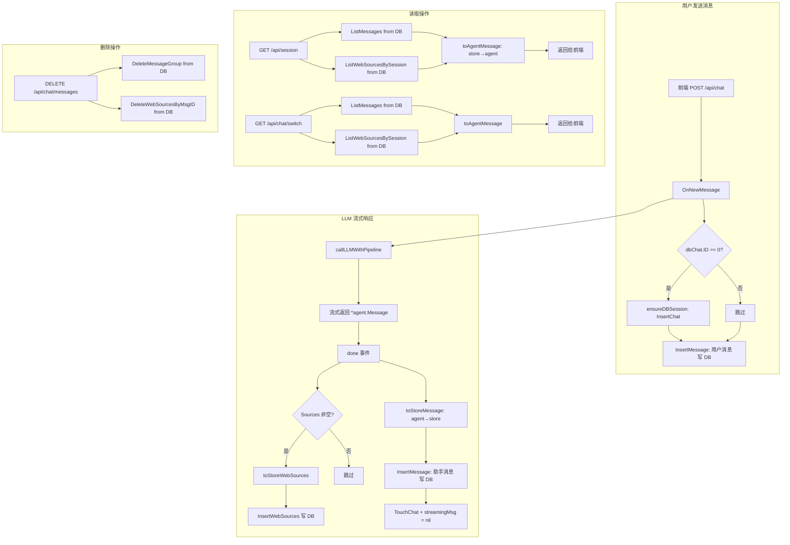

# currentChat 与 chats 重构 v4 — 融合"大胆想法"的最终设计方案

> 基于 v3 设计方案 + 用户的两个"大胆想法"进行融合重构。
> 分两个阶段实施：Phase A（匿名统一化）→ Phase B（去内存化）。

---

## 总体架构变化

### 想法 1：匿名用户统一化

**变更**：匿名用户不再特殊处理，而是像登录用户一样拥有独立的 `.db` 文件（`data/anonymous.db`），使用固定 SN 标识。

**效果**：
- `session.chatStore` 永远非 nil（匿名用户也指向 `data/anonymous.db` 的 ChatStore）
- `session.userNo` 匿名时为 `"anonymous"`，登录后为真实 userNo
- 所有 `if chatStore == nil` 的条件分支全部移除
- 所有 `if userNo == ""` 的条件分支改为 `if userNo == "anonymous"`
- 前端不再需要区分 `localStorage` 中是否有 `user_no` 来判断是否登录

### 想法 2：去内存化

**变更**：后端内存中不再存储完整的 `messages []store.Message` 和 `chats []*chat` 列表。所有数据读写直接操作 DB。

**效果**：
- `chat` 结构体简化为：`dbChat *store.Chat` + `streamingMsg *agent.Message`
- `session.chats` 移除，`session.currentChat` 简化为轻量指针
- 所有 handler 从 DB 直接读写
- 流式期间使用 `chat.streamingMsg` 暂存未完成的助手消息
- done 事件后一次性写入 DB

---

## Phase A：匿名用户统一化

### A.1 后端变更

#### A.1.1 `internal/agent/types.go` — session 结构体变更

```go
type session struct {
    mu      sync.Mutex
    chatsMu sync.Mutex

    lastActivity time.Time
    id          string
    currentChat *chat
    chats       []*chat          // 类型从 []store.Chat 改为 []*chat（v3 已有）
    userNo      string           // 匿名时为 "anonymous"，登录后为真实 userNo
    chatStore   *store.ChatStore // 永远非 nil
}
```

**变更点**：
- `userNo` 默认值从 `""` 改为 `"anonymous"`
- `chatStore` 在 session 创建时即初始化（指向 `data/anonymous.db`）
- `IsAnonymous()` 方法改为判断 `userNo == "anonymous"`
- `switchToUser` 中不再需要"匿名消息迁移"逻辑（因为匿名消息已经持久化在 `anonymous.db` 中）

#### A.1.2 `internal/agent/init.go` — 初始化变更

```go
// InitAgent 中，在创建 ChatHandler 之前，先初始化匿名用户的 ChatStore
func InitAgent(ctx context.Context, cfg config.Config, cookieName string, defaultLang string) (*ChatAgent, error) {
    // ... 现有初始化逻辑 ...
    
    // 初始化匿名用户的 ChatStore（全局共享）
    anonymousStore, err := store.CreateLocalChatScheme("data/anonymous.db")
    if err != nil {
        return nil, fmt.Errorf("failed to initialize anonymous chat store: %w", err)
    }
    
    chatHandler := NewChatHandler(
        &traitSearchAdapter{store: vectorStore},
        webSearchClient,
        chatLLMClient,
        cookieName,
        defaultLang,
        anonymousStore,  // 新增参数：匿名用户的 ChatStore
    )
    // ...
}
```

#### A.1.3 `internal/agent/types.go` — SessionManager.GetOrCreate 变更

```go
func (sm *SessionManager) GetOrCreate(sessionID string) *session {
    // ... 现有逻辑 ...
    
    s = &session{
        id:           sessionID,
        lastActivity: time.Now(),
        currentChat:  &chat{},
        userNo:       "anonymous",     // 默认匿名
        chatStore:    sm.anonymousStore, // 使用全局匿名 ChatStore
    }
    // ...
}
```

#### A.1.4 各处 `if chatStore == nil` 条件移除

涉及文件：
- [`internal/agent/db.go`](internal/agent/db.go) — `ensureDBSession` 和 `persistMessageToDB` 中的匿名判断移除
- [`internal/agent/on_session.go`](internal/agent/on_session.go) — `OnDeleteSession` 中的 `chatStore == nil` 判断移除
- [`internal/agent/on_title.go`](internal/agent/on_title.go) — `OnPutChatTitle` 中的 `chatStore == nil` 判断移除
- [`internal/agent/on_chat.go`](internal/agent/on_chat.go) — `OnChatPin` 中的 `chatStore == nil` 判断移除
- [`internal/agent/on_chat_new.go`](internal/agent/on_chat_new.go) — `OnNewChat` 中的匿名分支简化

#### A.1.5 `internal/agent/on_login.go` — switchToUser 简化

```go
func (s *session) switchToUser(sn string) {
    // 不再需要"匿名消息迁移"逻辑！
    // 因为匿名消息已经持久化在 anonymous.db 中
    
    dbFile := "data/" + sn + ".chats.db"
    chatStore, err := store.CreateLocalChatScheme(dbFile)
    // ...
    
    // 加载用户的 chat 列表
    chats, err := chatStore.ListChats(100)
    // ...
    
    s.chatsMu.Lock()
    s.chatStore = chatStore
    s.chats = chats
    s.chatsMu.Unlock()
    
    s.mu.Lock()
    s.userNo = sn
    s.currentChat = nil  // 清空匿名对话，前端会重新加载
    s.mu.Unlock()
}
```

**关键变化**：匿名消息不再需要"迁移"到用户 DB。匿名消息保留在 `anonymous.db` 中。用户登录后，`currentChat` 置 nil，前端通过 `GET /api/session` 重新加载用户的消息列表。

#### A.1.6 `internal/agent/on_session.go` — OnRestoreSession 简化

```go
// 不再需要 syncCurrentChatTitleToChatList
// 不再需要区分 userNo != "" 的逻辑
// 统一处理：所有用户都有 chatStore
```

### A.2 前端变更

#### A.2.1 `frontend/static/chat-restore.js` — restoreChat 简化

```javascript
// 不再需要检查 data.user_no 来判断是否登录
// 统一处理：后端始终返回 user_no（匿名时为 "anonymous"）
// 不再需要 localStorage 中的 user_no 恢复逻辑
```

#### A.2.2 `frontend/static/chat-sse.js` — addUserMessage 简化

```javascript
// 不再需要检查 localStorage 中的 user_no
// 匿名用户也显示侧边栏（因为 anonymous.db 中有数据）
```

#### A.2.3 `frontend/static/chat-list.js` — 匿名用户也渲染侧边栏

匿名用户现在也有持久化的 chat 列表（在 `anonymous.db` 中），所以侧边栏始终显示。

---

## Phase B：去内存化

### B.1 新的数据模型

```go
// ============================================================
// chat — 运行时对话对象（轻量级）
// ============================================================
type chat struct {
    mu           sync.RWMutex
    dbChat       *store.Chat     // 桥接 store.Chat（永远非空）
    streamingMsg *agent.Message  // 流式进行中的助手消息（nil 表示无进行中的流）
}

// ============================================================
// session — 用户会话（轻量级）
// ============================================================
type session struct {
    mu           sync.Mutex
    chatsMu      sync.Mutex
    
    lastActivity time.Time
    id           string
    currentChat  *chat            // 当前活动对话
    chats        []*chat          // 运行时对话列表（仅缓存 dbChat 元数据，不缓存 messages）
    userNo       string           // "anonymous" 或真实 userNo
    chatStore    *store.ChatStore // 永远非 nil
}
```

### B.2 关键变更点

#### B.2.1 OnNewMessage 数据流（核心变更）

```
1. 用户消息 → 直接写 DB（InsertMessage）
2. callLLMWithPipeline 流式返回 *agent.Message
3. 流式期间：chat.streamingMsg = assistantMsg（逐步累积）
4. done 事件：streamingMsg 转为 store.Message + store.WebSource 写入 DB
5. streamingMsg = nil
```

```go
func (h *ChatAgent) OnNewMessage(w http.ResponseWriter, r *http.Request) {
    // ... 解析请求 ...
    
    session.mu.Lock()
    targetChat := session.currentChat  // 保存指针副本
    
    // 阶段 1：用户消息直接写 DB
    userMsg := &store.Message{
        SessionID:  targetChat.dbChat.ID,
        GroupIndex: nextGroupIndex,
        Role:       0, // user
        Content:    req.Message.Content,
    }
    // 先 ensureDBSession（如果 dbChat.ID == 0）
    if targetChat.dbChat.ID == 0 {
        ensureDBSession(session, targetChat)
    }
    session.chatStore.InsertMessage(userMsg)
    session.chatStore.TouchChat(targetChat.dbChat.ID)
    session.mu.Unlock()
    
    // 阶段 2：LLM 流式（无 session 锁）
    assistantMsg := h.callLLMWithPipeline(...)
    
    // 阶段 3：done 后写 DB
    if assistantMsg != nil {
        targetChat.mu.Lock()
        // 将 agent.Message 转为 store.Message
        sm := toStoreMessage(assistantMsg, targetChat.dbChat.ID, groupIndex)
        session.chatStore.InsertMessage(sm)
        // 写 web_sources
        if len(assistantMsg.Sources) > 0 {
            ws := toStoreWebSources(targetChat.dbChat.ID, sm.ID, assistantMsg.Sources)
            session.chatStore.InsertWebSources(ws)
        }
        targetChat.streamingMsg = nil
        targetChat.mu.Unlock()
    }
}
```

#### B.2.2 OnRestoreSession — 从 DB 读取

```go
func (h *ChatAgent) OnRestoreSession(w http.ResponseWriter, r *http.Request) {
    session := h.sessionManager.GetOrCreate(sessionID)
    
    var msgs []Message
    var chats []store.Chat
    var currentChatSN string
    
    // 从 DB 读取当前 chat 的消息
    session.mu.Lock()
    if session.currentChat != nil && session.currentChat.dbChat.ID > 0 {
        dbSessionID := session.currentChat.dbChat.ID
        
        // 从 DB 读取消息
        dbMessages, _ := session.chatStore.ListMessages(dbSessionID)
        // 从 DB 读取 web_sources
        webSources, _ := session.chatStore.ListWebSourcesBySession(dbSessionID)
        
        // 转换为 agent.Message
        msgs = make([]Message, len(dbMessages))
        for i, m := range dbMessages {
            msgs[i] = toAgentMessage(m, webSources[m.ID])
        }
        
        // 检查是否有进行中的流
        if session.currentChat.streamingMsg != nil {
            // 追加未完成的流式消息
            // ...
        }
        
        currentChatSN = session.currentChat.dbChat.SN
    }
    session.mu.Unlock()
    
    // 从 DB 读取 chat 列表
    session.chatsMu.Lock()
    dbChats, _ := session.chatStore.ListChats(100)
    chats = dbChats
    session.chatsMu.Unlock()
    
    // 返回给前端
    json.NewEncoder(w).Encode(map[string]interface{}{
        "messages":        msgs,
        "chats":           chats,
        "current_chat_sn": currentChatSN,
        // ...
    })
}
```

#### B.2.3 OnSwitchChat — 从 DB 读取

```go
func (s *session) switchToChat(sn string) error {
    // 从 DB 查找 chat
    s.chatsMu.Lock()
    // 从 DB 查询
    dbChat, err := s.chatStore.FindChatBySN(sn)
    s.chatsMu.Unlock()
    
    if dbChat == nil {
        return fmt.Errorf("session not found: %s", sn)
    }
    
    // 从 DB 读取消息
    dbMessages, _ := s.chatStore.ListMessages(dbChat.ID)
    webSources, _ := s.chatStore.ListWebSourcesBySession(dbChat.ID)
    
    // 转换为 agent.Message
    msgs := make([]Message, len(dbMessages))
    for i, m := range dbMessages {
        msgs[i] = toAgentMessage(m, webSources[m.ID])
    }
    
    // 设置 currentChat
    s.mu.Lock()
    s.currentChat = &chat{
        dbChat: dbChat,
    }
    s.mu.Unlock()
    
    return nil
}
```

#### B.2.4 DeleteMessage — 直接操作 DB

```go
func (sm *SessionManager) DeleteMessage(sessionID string, msgID int64) error {
    session := sm.GetOrCreate(sessionID)
    
    session.mu.Lock()
    if session.currentChat == nil || session.currentChat.dbChat.ID == 0 {
        session.mu.Unlock()
        return fmt.Errorf("no active chat")
    }
    dbSessionID := session.currentChat.dbChat.ID
    session.mu.Unlock()
    
    // 直接操作 DB
    if err := session.chatStore.DeleteMessageGroup(dbSessionID, int(msgID)); err != nil {
        return err
    }
    if err := session.chatStore.DeleteWebSourcesByMsgID(dbSessionID, msgID); err != nil {
        return err
    }
    
    return nil
}
```

#### B.2.5 移除的代码

以下函数/方法在 Phase B 中移除：
- `session.getMessagesLenWithoutLock()` — 不再需要
- `session.getMessagesLastMsgWithoutLock()` — 不再需要
- `session.appendMessagesWithoutLock()` — 不再需要
- `session.deleteMessagesRangeWithoutLock()` — 不再需要
- `session.copyMessagesWithoutLock()` — 不再需要
- `session.getMessagesWithoutLock()` — 不再需要
- `session.getDbSessionIDWithoutLock()` — 改为 `session.currentChat.dbChat.ID`
- `session.setDbSessionIDWithoutLock()` — 改为直接赋值 `session.currentChat.dbChat`
- `session.syncCurrentChatTitleToChatList()` — 不再需要（chats 从 DB 读取）
- `session.addChatToList()` — 不再需要（chats 从 DB 读取）
- `deduplicateChats()` — 不再需要
- `appendNewRequestMessage()` — 逻辑内联到 OnNewMessage
- `appendNewResponseMessage()` — 逻辑内联到 OnNewMessage
- `persistMessageToDB()` — 逻辑内联到 OnNewMessage
- `ensureDBSession()` — 简化，只创建 DB 记录

---

## 执行计划

### Phase A：匿名用户统一化

| # | 任务 | 涉及文件 | 说明 |
|---|------|---------|------|
| A.1 | SessionManager 持有 anonymousStore | `internal/agent/types.go`, `internal/agent/init.go` | 新增 `anonymousStore` 字段，`GetOrCreate` 中初始化 |
| A.2 | session 默认 userNo="anonymous" | `internal/agent/types.go` | `GetOrCreate` 中设置默认值 |
| A.3 | 移除所有 `chatStore == nil` 判断 | `db.go`, `on_session.go`, `on_title.go`, `on_chat.go`, `on_chat_new.go` | 约 6 处 |
| A.4 | 简化 `switchToUser` | `internal/agent/types.go` | 移除匿名消息迁移逻辑 |
| A.5 | 简化 `OnRestoreSession` | `internal/agent/on_session.go` | 移除 userNo 分支判断 |
| A.6 | 前端 `restoreChat` 简化 | `frontend/static/chat-restore.js` | 移除 localStorage user_no 恢复逻辑 |
| A.7 | 前端 `addUserMessage` 简化 | `frontend/static/chat-sse.js` | 匿名用户也显示侧边栏 |
| A.8 | 前端 `chat-list.js` 适配 | `frontend/static/chat-list.js` | 匿名用户也渲染侧边栏 |

### Phase B：去内存化

| # | 任务 | 涉及文件 | 说明 |
|---|------|---------|------|
| B.1 | `chat` 结构体精简 | `internal/agent/types.go` | 移除 `messages []store.Message`，新增 `streamingMsg *agent.Message` |
| B.2 | `session` 结构体精简 | `internal/agent/types.go` | `chats` 改为 `[]*chat`（仅缓存元数据） |
| B.3 | 新增 `toAgentMessage` / `toStoreMessage` / `toStoreWebSources` | `internal/agent/types.go` | 转换函数（从 v3 方案继承） |
| B.4 | 新增 `store.FindChatBySN` | `internal/store/chats.go` | 按 SN 查询单个 chat |
| B.5 | 新增 `store.DeleteWebSourcesByMsgID` | `internal/store/chats.go` | 删除某消息的 web sources |
| B.6 | 新增 `store.ListWebSourcesBySession` | `internal/store/chats.go` | 按 session 批量查询 web sources |
| B.7 | 新增 `store.InsertWebSources` | `internal/store/chats.go` | 批量插入 web sources |
| B.8 | `OnNewMessage` 重写 | `internal/agent/on_chat.go` | 用户消息直接写 DB，流式完成后写 DB |
| B.9 | `callLLMWithPipeline` 适配 | `internal/agent/chatllm.go` | 返回 `*agent.Message` 含 Sources |
| B.10 | `OnRestoreSession` 重写 | `internal/agent/on_session.go` | 从 DB 读取消息 + web_sources |
| B.11 | `OnSwitchChat` 重写 | `internal/agent/on_chat.go` | 从 DB 读取，不再加载到内存 |
| B.12 | `DeleteMessage` 重写 | `internal/agent/types.go` | 直接操作 DB |
| B.13 | `OnPutChatTitle` 简化 | `internal/agent/on_title.go` | 直接操作 DB，移除 sync 逻辑 |
| B.14 | `OnChatPin` 简化 | `internal/agent/on_chat.go` | 直接操作 DB |
| B.15 | `OnNewChat` 简化 | `internal/agent/on_chat_new.go` | 直接创建 DB 记录 |
| B.16 | `OnDeleteSession` 简化 | `internal/agent/on_session.go` | 直接操作 DB |
| B.17 | 移除废弃函数 | `internal/agent/types.go`, `internal/agent/db.go` | 移除约 10 个函数 |
| B.18 | 前端 SSEReceiver 改造 | `frontend/static/chat-sse.js`, `chat-state.js`, `chat-list.js`, `chat-restore.js` | 从 v3 方案继承 |

---

## 数据流总图（Phase B 完成后）



---

## 关键设计决策

### 1. streamingMsg 的生命周期

```
OnNewMessage 开始
  → chat.streamingMsg = nil
  → callLLMWithPipeline 返回 *agent.Message
  → chat.streamingMsg = assistantMsg（含逐步累积的 reasoning/text/sources）
  → done 事件
  → 写入 DB
  → chat.streamingMsg = nil
```

### 2. 切换 chat 时 streamingMsg 的处理

- 用户从 chat A 切换到 chat B
- chat A 的 `streamingMsg` 不为 nil（流式进行中）
- `targetChat` 指针副本确保 chat A 的流式继续
- 切回 chat A 时，检查 `chat.streamingMsg`
- 如果 `streamingMsg` 不为 nil，从 DB 读取已持久化的消息 + 从 `streamingMsg` 恢复未完成内容

### 3. 前端 SSEReceiver 与 streamingMsg 的对应关系

- 后端 `chat.streamingMsg` ↔ 前端 `SSEReceiver.streamContent/streamReason`
- done 事件后，后端写入 DB，前端完成最终渲染
- 切换 chat 时，前端切换 `activeReceiver`，后端 `streamingMsg` 继续累积

### 4. chats 列表的缓存策略

`session.chats` 仍然保留，但只缓存 `[]*chat`（仅 `dbChat` 元数据，不缓存 messages）。这是因为：
- 侧边栏需要频繁读取 chat 列表（标题、时间等）
- 每次从 DB 读取 100 条 chat 列表的开销可以接受
- 但完全去掉缓存会导致每次侧边栏渲染都查 DB

**替代方案**：也可以完全去掉 `session.chats`，每次从 DB 读取。这取决于性能考量，建议 Phase B 先保留轻量缓存，后续再优化。
