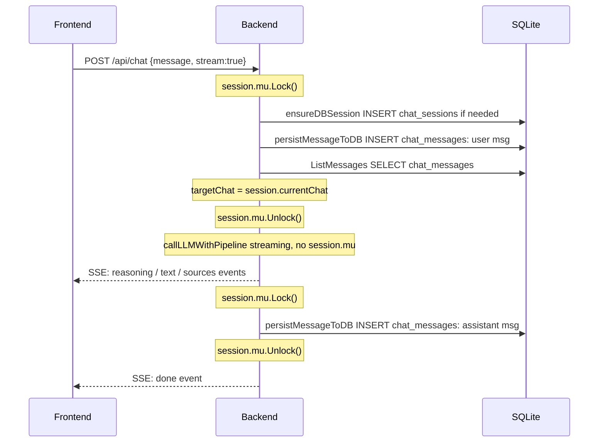
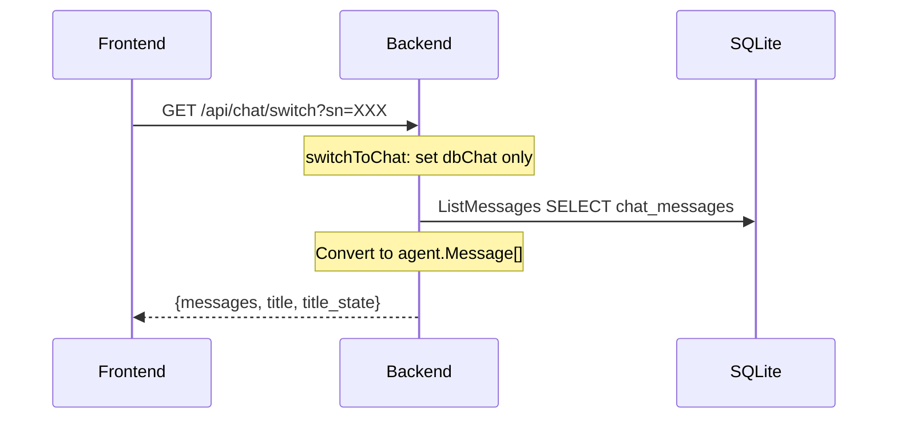

# Phase B 实施方案 — 去除后端内存中间数据

## 目标

移除 `chat.messages []Message` 内存存储，改为：
- 读取时：从 DB 查询
- 写入时：直接写入 DB
- 流式进行中：无需中间存储，[`callLLMWithPipeline`](internal/agent/chatllm.go:183) 内部已构建完整 `*Message`

## 核心变更

### 1. `chat` 结构体简化

```go
// types.go
type chat struct {
    dbChat *store.Chat // 桥接 store.Chat（永远非空）
    title       string     // Session title
    titleState  TitleState // Title modification state
}
```

**变更说明：**
- 移除 `messages []Message` — 不再在内存中存储完整消息列表
- 移除 `dbSessionID int64` — 改为通过 `dbChat.ID` 访问
- 新增 `dbChat *store.Chat` — 桥接数据库记录，包含 ID/SN/title/titleState 等
- **不需要 `streamingMsg`** — [`callLLMWithPipeline`](internal/agent/chatllm.go:183) 内部已构建完整 `*Message` 并返回

### 2. `session` 结构体调整

```go
// types.go
type session struct {
    mu      sync.Mutex
    chatsMu sync.Mutex

    lastActivity time.Time

    id          string
    currentChat *chat
    chats       []store.Chat
    userNo      string
    chatStore   *store.ChatStore
}
```

`session` 结构体本身不变，但 `currentChat` 指向的 `chat` 结构体变了。

### 3. 消息访问器重构

移除所有基于 `chat.messages` 的访问器：
- `getMessagesLenWithoutLock`
- `getMessagesLastMsgWithoutLock`
- `appendMessagesWithoutLock`
- `deleteMessagesRangeWithoutLock`
- `copyMessagesWithoutLock`
- `getMessagesWithoutLock`

新增基于 DB 的辅助函数：
- `loadMessagesAsLLMMessages(session)` — 从 DB 加载并转换为 `[]llm.Message`
- `convertDBMessagesToAgentMessages(dbMessages)` — `store.Message` → `agent.Message`

### 4. `OnNewMessage` 流程重构

当前流程（Phase A 后）：
```
session.mu.Lock()
  appendNewRequestMessage(session, &req.Message, lang)
    → appendMessagesWithoutLock(*reqMsg)        // 写入内存
    → ensureDBSession(session)                   // 写入 DB
    → persistMessageToDB(session, reqMsg)        // 写入 DB
  llmMsgs := toRawMessages(session.getMessagesWithoutLock())  // 从内存读取
  assistantMsg := callLLMWithPipeline(...)
  if assistantMsg != nil {
    appendNewResponseMessage(session, assistantMsg)
      → appendMessagesWithoutLock(*resMsg)      // 写入内存
      → persistMessageToDB(session, resMsg)      // 写入 DB
  }
session.mu.Unlock()
```

Phase B 新流程：
```
session.mu.Lock()
  // 1. 确保 DB session 存在
  ensureDBSession(session)
  
  // 2. 持久化用户消息到 DB
  persistMessageToDB(session, &req.Message)
  
  // 3. 从 DB 加载完整消息列表（用于 LLM 调用）
  llmMsgs := loadMessagesAsLLMMessages(session)
  
  // 4. 保存 targetChat 指针，释放锁，开始流式调用
  targetChat := session.currentChat
  session.mu.Unlock()
  
  // 5. 流式调用（不持有锁）
  assistantMsg := h.callLLMWithPipeline(r.Context(), sseWriter,
    req.Message.ID, llmMsgs, toolsImp, req.DeepThink, lang)
  
  // 6. 重新获取锁，持久化助手消息
  session.mu.Lock()
  if assistantMsg != nil {
    persistMessageToDB(session, assistantMsg)
  }
session.mu.Unlock()
```

**关键变化：**
1. 流式调用期间不持有 `session.mu`，允许其他操作（如切换 chat）并发执行
2. 不再写入内存 `chat.messages`
3. 从 DB 加载消息列表用于 LLM 调用
4. `targetChat` 指针保存了原始 chat 的引用，即使 `session.currentChat` 被切换走，`persistMessageToDB` 仍然写入正确的 chat

### 5. `targetChat` 指针拷贝

在 [`OnNewMessage`](internal/agent/on_chat.go:194) 中，流式调用前保存 `targetChat` 指针：

```go
// OnNewMessage 中
session.mu.Lock()
// ... 持久化用户消息 ...
targetChat := session.currentChat  // 保存指针拷贝
session.mu.Unlock()

// 流式调用期间，即使 session.currentChat 被切换走，
// targetChat 仍然指向原始的 chat 对象
// callLLMWithPipeline 返回完整 *Message，直接 persistMessageToDB
```

**注意：** `persistMessageToDB` 使用 `session.chatStore` 和 `session.getDbSessionIDWithoutLock()`。由于 `targetChat` 的 `dbChat.ID` 就是 dbSessionID，我们需要确保 `persistMessageToDB` 能接受一个外部的 `dbSessionID` 参数，或者在流式完成后重新从 `targetChat.dbChat.ID` 获取。

### 6. `switchToChat` 重构

当前 [`switchToChat`](internal/agent/types.go:253) 从 DB 加载消息到内存。Phase B 中不再需要加载消息到内存，只需设置 `dbChat`：

```go
func (s *session) switchToChat(sn string) error {
    s.chatsMu.Lock()
    // 查找 chat
    var foundChat *store.Chat
    for i := range s.chats {
        if s.chats[i].SN == sn {
            foundChat = &s.chats[i]
            break
        }
    }
    s.chatsMu.Unlock()
    
    if foundChat == nil {
        return fmt.Errorf("session not found: %s", sn)
    }
    
    s.mu.Lock()
    s.currentChat = &chat{
        dbChat:     foundChat,
        title:      foundChat.Title,
        titleState: TitleState(foundChat.TitleState),
    }
    s.mu.Unlock()
    
    return nil
}
```

### 7. `OnRestoreSession` 重构

当前从 `session.currentChat.messages` 读取消息。Phase B 中改为从 DB 加载：

```go
// OnRestoreSession 中
session.mu.Lock()
dbSessionID := session.getDbSessionIDWithoutLock()
title, titleState := session.getTitleWithoutLock()
session.mu.Unlock()

var msgs []Message
if dbSessionID > 0 {
    dbMessages, err := session.chatStore.ListMessages(dbSessionID)
    if err == nil {
        msgs = convertDBMessagesToAgentMessages(dbMessages)
    }
}
```

### 8. `OnSwitchChat` 重构

当前 `switchToChat` 加载消息到内存后，[`OnSwitchChat`](internal/agent/on_chat.go:324) 从内存拷贝消息返回给前端。Phase B 中改为从 DB 加载后直接返回：

```go
func (h *ChatAgent) OnSwitchChat(w http.ResponseWriter, r *http.Request) {
    // ... 解析 sn ...
    session := h.sessionManager.GetOrCreate(sessionID)
    
    // 切换 chat（只设置 dbChat，不加载消息）
    if err := session.switchToChat(sn); err != nil {
        http.Error(w, err.Error(), http.StatusBadRequest)
        return
    }
    
    // 从 DB 加载消息
    session.mu.Lock()
    dbSessionID := session.getDbSessionIDWithoutLock()
    title, titleState := session.getTitleWithoutLock()
    session.mu.Unlock()
    
    dbMessages, err := session.chatStore.ListMessages(dbSessionID)
    if err != nil {
        http.Error(w, "failed to load messages", http.StatusInternalServerError)
        return
    }
    msgs := convertDBMessagesToAgentMessages(dbMessages)
    
    w.Header().Set("Content-Type", "application/json")
    json.NewEncoder(w).Encode(map[string]interface{}{
        "status":      "ok",
        "messages":    msgs,
        "title":       title,
        "title_state": int(titleState),
    })
}
```

### 9. `DeleteMessage` 重构

当前 [`DeleteMessage`](internal/agent/types.go:453) 操作内存中的 `chat.messages`。Phase B 中改为直接操作 DB：

```go
func (sm *SessionManager) DeleteMessage(sessionID string, msgID int64) error {
    sm.mu.RLock()
    s, ok := sm.sessions[sessionID]
    sm.mu.RUnlock()
    if !ok {
        return fmt.Errorf("session not found")
    }
    
    s.mu.Lock()
    defer s.mu.Unlock()
    s.lastActivity = time.Now()
    
    if s.currentChat == nil {
        return fmt.Errorf("no active chat")
    }
    
    dbSessionID := s.currentChat.dbChat.ID
    if dbSessionID == 0 {
        return fmt.Errorf("no DB session")
    }
    
    // 直接操作 DB
    return s.chatStore.DeleteMessageGroup(dbSessionID, int(msgID))
}
```

需要新增 [`store.ChatStore.DeleteMessageGroup`](internal/store/chats.go) 方法。

### 10. `OnPutChatTitle` 重构

当前 `sn == ""` 分支通过 `session.currentChat.title` 和 `session.currentChat.titleState` 访问标题。Phase B 中适配新的 `chat` 结构体（title/titleState 仍在 `chat` 上，但 dbSessionID 改为 `dbChat.ID`）：

```go
// sn == "" 分支
session.mu.Lock()
session.currentChat.title = newTitle
session.currentChat.titleState = titleState

dbSessionID := session.currentChat.dbChat.ID

// 同步到 DB
if dbSessionID != 0 {
    session.chatStore.UpdateChatTitle(dbSessionID, newTitle, int8(titleState))
}
session.mu.Unlock()
```

### 11. `OnNewChat` 重构

当前 [`OnNewChat`](internal/agent/on_chat_new.go:22) 调用 `ensureDBSession` 后读取 `dbSessionID`。Phase B 中逻辑类似，但 `dbSessionID` 改为从 `dbChat.ID` 获取。

### 12. 辅助函数

```go
// convertDBMessagesToAgentMessages 将 store.Message 切片转换为 agent.Message 切片。
//
// 注意：store.Message 结构体没有 Sources 字段，chat_messages 表也没有
// 存储 web_sources 的列。persistMessageToDB 只持久化了 content 和 reasoning，
// Sources（WebSources）从未写入 DB。
// 因此从 DB 恢复的消息中 Sources 始终为空，页面刷新后前端无法恢复
// WebSources 面板。
//
// v3 设计文档（plans/currentChat-chats-refactor-v3-design.md）已规划了
// web_sources 表和 store.WebSource 结构体，但尚未实现。
// WebSources 持久化是独立的功能增强，不在 Phase B 范围内，
// 将在 Phase B 完成后单独处理。
func convertDBMessagesToAgentMessages(dbMessages []store.Message) []Message {
    msgs := make([]Message, 0, len(dbMessages))
    for _, m := range dbMessages {
        role := llm.RoleUser
        if m.Role == 1 {
            role = llm.RoleAssistant
        }
        agentMsg := Message{
            ID:        int64(m.GroupIndex),
            Role:      role,
            Content:   m.Content,
            CreatedAt: m.CreateAt,
        }
        if m.Reasoning != nil {
            agentMsg.Reasoning = *m.Reasoning
        }
        msgs = append(msgs, agentMsg)
    }
    return msgs
}

// loadMessagesAsLLMMessages 从 DB 加载消息并转换为 llm.Message 切片
func loadMessagesAsLLMMessages(s *session) ([]llm.Message, error) {
    dbSessionID := s.currentChat.dbChat.ID
    if dbSessionID == 0 {
        return nil, fmt.Errorf("no DB session")
    }
    dbMessages, err := s.chatStore.ListMessages(dbSessionID)
    if err != nil {
        return nil, err
    }
    result := make([]llm.Message, 0, len(dbMessages))
    for _, m := range dbMessages {
        role := llm.RoleUser
        if m.Role == 1 {
            role = llm.RoleAssistant
        }
        result = append(result, llm.Message{Role: role, Content: m.Content})
    }
    return result, nil
}
```

### 13. 需要新增的 store 方法

```go
// store/chats.go — 新增
func (s *ChatStore) DeleteMessageGroup(sessionID int64, groupIndex int) error {
    _, err := s.db.Exec(
        `DELETE FROM chat_messages WHERE session_id = ? AND group_index = ?`,
        sessionID, groupIndex,
    )
    return err
}
```

## 执行计划

### Phase B.1: 新增辅助函数和 store 方法
- 在 `types.go` 或新文件 `helpers.go` 中添加 `convertDBMessagesToAgentMessages` 和 `loadMessagesAsLLMMessages`
- 在 [`store/chats.go`](internal/store/chats.go) 中添加 `DeleteMessageGroup` 方法

### Phase B.2: 重构 `chat` 结构体
- 修改 [`chat` 结构体](internal/agent/types.go:92)：移除 `messages []Message`、`dbSessionID int64`，新增 `dbChat *store.Chat`
- 更新所有访问器（`getTitleWithoutLock`、`setTitleWithoutLock`、`getDbSessionIDWithoutLock`、`setDbSessionIDWithoutLock` 等）
- 移除基于 `chat.messages` 的访问器（`getMessagesLenWithoutLock`、`getMessagesLastMsgWithoutLock`、`appendMessagesWithoutLock`、`deleteMessagesRangeWithoutLock`、`copyMessagesWithoutLock`、`getMessagesWithoutLock`）

### Phase B.3: 重构 `OnNewMessage` 流程
- 修改 [`appendNewRequestMessage`](internal/agent/on_chat.go:108)：不再写入内存，只写入 DB
- 移除 `appendNewResponseMessage`（不再需要，因为 `callLLMWithPipeline` 返回后直接 `persistMessageToDB`）
- 修改 [`OnNewMessage`](internal/agent/on_chat.go:194)：流式调用期间不持有 `session.mu`，使用 `targetChat` 指针

### Phase B.4: 重构 `switchToChat` 和 `OnSwitchChat`
- [`switchToChat`](internal/agent/types.go:253) 不再加载消息到内存
- [`OnSwitchChat`](internal/agent/on_chat.go:324) 从 DB 加载消息后直接返回给前端

### Phase B.5: 重构 `OnRestoreSession`
- [`OnRestoreSession`](internal/agent/on_session.go:18) 从 DB 加载消息，而非从内存

### Phase B.6: 重构 `DeleteMessage`
- [`DeleteMessage`](internal/agent/types.go:453) 直接操作 DB，而非操作内存
- [`OnDeleteMessage`](internal/agent/on_msg_del.go:19) 适配

### Phase B.7: 重构 `OnPutChatTitle` 和 `OnNewChat`
- [`OnPutChatTitle`](internal/agent/on_title.go) 适配新的 `chat` 结构体
- [`OnNewChat`](internal/agent/on_chat_new.go) 适配新的 `chat` 结构体

### Phase B.8: 清理和构建测试
- 移除不再使用的函数（`deduplicateChats`、旧的访问器等）
- 构建测试

## 数据流图

### Phase B 后的 OnNewMessage 流程



### Phase B 后的 switchToChat 流程



## 与 v3 计划的关键区别

1. **不需要 `streamingMsg`**：`callLLMWithPipeline` 内部已构建完整 `*Message`，无需 SSE 回调写入 `chat.streamingMsg`
2. **不需要 `chat.mu sync.RWMutex`**：没有 `streamingMsg` 就不需要额外的锁
3. **`title`/`titleState` 保留在 `chat` 上**：避免每次访问标题都从 `dbChat` 读取，减少耦合
4. **`dbChat *store.Chat` 替代 `dbSessionID int64`**：通过指针访问 ID/SN/title/titleState
