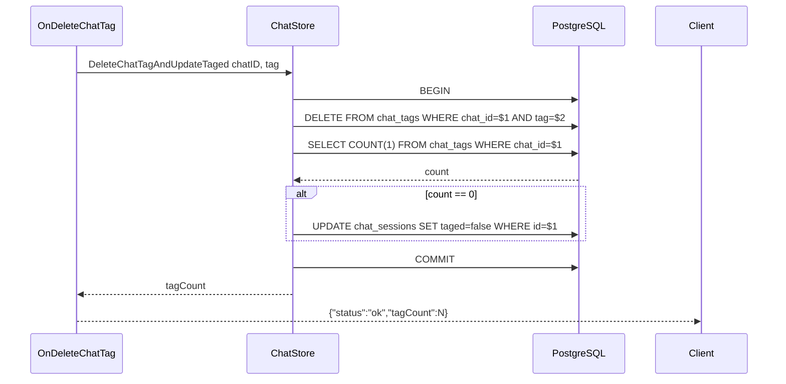

# 删除 Chat 分类后更新方案（完整版）

## 语义约定

| 状态 | `taged` | `chat_tags` 是否有记录 | 含义 |
|------|---------|----------------------|------|
| 从未分类 | `false` | 无 | LLM 尚未处理过 |
| 已处理但无匹配 | `true` | 无 | LLM 尝试过，但无法生成合适分类（"暂无合适分类"） |
| 已分类且有标签 | `true` | 有（N 条） | 正常分类 |
| 曾被分类后被删空 | `false` | 无 | 用户删除了所有标签，可重新申请分类 |

**关键区分**：`taged` 只表示"LLM 是否处理过"，是否有 tag 记录是另外的事。

**变动**：不再插入 `''` 空串作为"不知所云"占位。`taged=true + 无 tag 记录` 即可表达"已处理但无匹配"。

## 改动范围

### 1. `internal/store/chats.go`

#### 1a. `ChatTitleTag` 结构体新增 `Taged` 字段

```go
type ChatTitleTag struct {
    ID       int64     `db:"id" json:"id"`
    SN       string    `db:"sn" json:"sn"`
    Title    string    `db:"title" json:"title"`
    Tag      string    `db:"tag" json:"tag"`     // 实际tag值；LEFT JOIN无匹配时 COALESCE 为 ''
    Taged    bool      `db:"taged" json:"taged"` // 新增：chat_sessions.taged
    CreateAt time.Time `db:"create_at" json:"create_at"`
    UpdateAt time.Time `db:"update_at" json:"update_at"`
}
```

#### 1b. `SelectChatTitlesGroupByTags` SQL 改为 LEFT JOIN

```sql
SELECT cs.id, cs.sn, cs.title,
       COALESCE(ct.tag, '') AS tag,
       cs.taged,
       cs.create_at, cs.update_at
FROM chat_sessions cs
LEFT JOIN chat_tags ct ON cs.id = ct.chat_id
WHERE cs.user_id = $1 AND cs.deleted = FALSE
ORDER BY ct.tag, cs.update_at DESC, cs.create_at DESC
```

`COALESCE(ct.tag, '')` 将 NULL 转为 `''`，保持数据结构兼容。

### 2. `internal/store/tags.go` — 新增两个事务方法

#### 2a. 删除单个标签 + 更新 taged

```go
// DeleteChatTagAndUpdateTaged atomically deletes a tag and, if no non-empty
// tags remain, sets chat_sessions.taged = false.
//
// 语义说明：
// - 当最后一个非空 tag 被删除时，taged=false，表示"曾分类过但被删空"
//   这与 taged=true（LLM 处理过但无法生成分类）不同
// - 返回剩余非空标签个数，供前端判断 UI 状态
func (s *ChatStore) DeleteChatTagAndUpdateTaged(chatID int64, tag string) (int, error) {
    tx, err := s.db().Beginx()
    if err != nil {
        return 0, fmt.Errorf("failed to begin transaction. %w", err)
    }
    defer tx.Rollback()

    sqlStr := "DELETE FROM chat_tags WHERE chat_id = $1 AND tag = $2"
    if _, err := tx.Exec(sqlStr, chatID, tag); err != nil {
        s.logger.Errorf("SQL [%s] args=[chatID=%d tag=%s]:\n%v", sqlStr, chatID, tag, err)
        return 0, fmt.Errorf("failed to delete chat tag. %w", err)
    }

    sqlStr = "SELECT COUNT(1) FROM chat_tags WHERE chat_id = $1 AND tag != ''"
    var count int
    if err := tx.Get(&count, sqlStr, chatID); err != nil {
        s.logger.Errorf("SQL [%s] args=[chatID=%d]:\n%v", sqlStr, chatID, err)
        return 0, fmt.Errorf("failed to count chat tags. %w", err)
    }

    // 仅在删除了最后一个非空 tag 时更新 taged=false
    // 若还有剩余 tag，taged 必然已是 true，无需写 DB
    if count == 0 {
        sqlStr = "UPDATE chat_sessions SET taged = FALSE WHERE id = $1"
        if _, err := tx.Exec(sqlStr, chatID); err != nil {
            s.logger.Errorf("SQL [%s] args=[chatID=%d]:\n%v", sqlStr, chatID, err)
            return 0, fmt.Errorf("failed to update chat taged flag. %w", err)
        }
    }

    if err := tx.Commit(); err != nil {
        s.logger.Errorf("failed to commit transaction. %v", err)
        return 0, fmt.Errorf("failed to commit transaction. %w", err)
    }

    return count, nil
}
```

#### 2b. 替换全部标签 + 更新 taged（用于重新生成标签）

```go
// ReplaceChatTags atomically replaces all tags for a chat and marks it as
// classified (taged=true), regardless of whether any tags were generated.
//
// 语义说明：
// - taged=true 表示"LLM 已尝试对此 chat 做分类"，与 chat_tags 是否有记录无关
// - 若 tags 非空：写入新标签（从不插入空串占位）
// - 若 tags 为空：清空标签后仅设 taged=true，表示"已处理但无匹配分类"
// - "已分类无标签"与"已分类有标签"的区分，由 chat_tags 是否有记录自然表达
func (s *ChatStore) ReplaceChatTags(chatID int64, tags []string) error {
    tx, err := s.db().Beginx()
    if err != nil {
        return fmt.Errorf("failed to begin transaction. %w", err)
    }
    defer tx.Rollback()

    // Step 1: Delete all existing tags
    sqlStr := "DELETE FROM chat_tags WHERE chat_id = $1"
    if _, err := tx.Exec(sqlStr, chatID); err != nil {
        s.logger.Errorf("SQL [%s] args=[chatID=%d]:\n%v", sqlStr, chatID, err)
        return fmt.Errorf("failed to delete chat tags. %w", err)
    }

    // Step 2: Insert new tags (only if non-empty; never insert '' placeholder)
    for _, tag := range tags {
        sqlStr = "INSERT INTO chat_tags(chat_id, tag) VALUES($1, $2)"
        if _, err := tx.Exec(sqlStr, chatID, tag); err != nil {
            s.logger.Errorf("SQL [%s] args=[chatID=%d tag=%s]:\n%v", sqlStr, chatID, tag, err)
            return fmt.Errorf("failed to insert chat tag %q. %w", tag, err)
        }
    }

    // Step 3: Mark as classified — taged=true means LLM has processed this chat
    sqlStr = "UPDATE chat_sessions SET taged = TRUE WHERE id = $1"
    if _, err := tx.Exec(sqlStr, chatID); err != nil {
        s.logger.Errorf("SQL [%s] args=[chatID=%d]:\n%v", sqlStr, chatID, err)
        return fmt.Errorf("failed to update chat taged flag. %w", err)
    }

    return tx.Commit()
}
```

### 3. `internal/agent/on_tag.go` — 修改两个 handler

#### 3a. `OnDeleteChatTag`

```go
func (h *ChatAgent) OnDeleteChatTag(w http.ResponseWriter, r *http.Request) {
    chatIDStr := r.URL.Query().Get("chat")
    tag := r.URL.Query().Get("tag")
    if chatIDStr == "" || tag == "" {
        toolset.WriteError(w, "missing chat or tag parameter", http.StatusBadRequest)
        return
    }

    var chatID int64
    if _, err := fmt.Sscan(chatIDStr, &chatID); err != nil {
        toolset.WriteError(w, "invalid chat id", http.StatusBadRequest)
        return
    }

    tagCount, err := theChatStore.DeleteChatTagAndUpdateTaged(chatID, tag)
    if err != nil {
        h.logger.Errorf("failed to delete chat tag. %v", err)
        toolset.WriteError(w, i18n.TL(h.defaultLang, "api_error_internal"), http.StatusInternalServerError)
        return
    }

    w.WriteHeader(http.StatusOK)
    json.NewEncoder(w).Encode(map[string]any{
        "status":   "ok",
        "tagCount": tagCount,
    })
}
```

#### 3b. `persistChatTags`

```go
// persistChatTags 用新标签替换 chat 的所有旧标签，并标记为"已分类"。
// 无论 tags 是否为空，都将 taged 设为 true：
// - tags 非空 → 正常分类，写入标签
// - tags 为空 → taged=true 但 chat_tags 无记录，表示"已处理但无匹配"
//   与"从未分类"(taged=false) 区分
func (h *ChatAgent) persistChatTags(chatID int64, chatSN string, tags []string, sess *session.Session) {
    if err := theChatStore.ReplaceChatTags(chatID, tags); err != nil {
        h.logger.Errorf("failed to replace chat tags for chat %d. %v", chatID, err)
    }

    // 更新内存中的 taged 状态
    sess.User.ChatsMu.Lock()
    for i := range sess.User.Chats {
        if sess.User.Chats[i].SN == chatSN {
            sess.User.Chats[i].Taged = true
            break
        }
    }
    sess.User.ChatsMu.Unlock()
}
```

### 4. `frontend/static/chat-api.js` — 前端 API

`deleteChatTag` 返回 JSON 对象（含 `tagCount`），失败返回 `null`：

```js
export async function deleteChatTag(chatID, tag) {
    if (!chatID || chatID === 0 || !tag) return null;
    try {
        const url = '/api/chat/tags?chat=' + encodeURIComponent(chatID) +
            '&tag=' + encodeURIComponent(tag);
        const response = await fetch(url, { method: 'DELETE' });
        if (!response.ok) {
            const t = await response.text();
            showToast('删除标签失败：' + t, 'error');
            return null;
        }
        const data = await response.json();
        return data; // { status: 'ok', tagCount: N }
    } catch (e) {
        console.warn('删除标签失败:', e);
        return null;
    }
}
```

### 5. `frontend/static/chat-list.js` — 前端调用方

```js
removeItem.addEventListener('click', async function() {
    closeContextMenu();
    var chatId = chat.id;
    if (!chatId || chatId === 0) {
        showToast('错误的操作', 'error');
        return;
    }
    var result = await deleteChatTag(chatId, tag);
    if (!result) {
        return;
    }
    var tagCount = result.tagCount;

    // 从 chatGroups 中移除该 chat
    var chatsStore = window.Alpine.store('chats');
    if (chatsStore && chatsStore.chatGroups) {
        var group = chatsStore.chatGroups[tag];
        if (group) {
            var filtered = group.filter(function(c) { return c.sn !== chat.sn; });
            if (filtered.length > 0) {
                chatsStore.chatGroups[tag] = filtered;
            } else {
                delete chatsStore.chatGroups[tag];
            }
            chatsStore.chatGroups = Object.assign({}, chatsStore.chatGroups);
        }
    }

    // 若为最后一个标签被删除（tagCount=0），同步前端 taged=false
    if (tagCount === 0 && chatsStore && chatsStore.chats) {
        var chatInStore = chatsStore.chats.find(function(c) { return c.id === chatId; });
        if (chatInStore) {
            chatInStore.taged = false;
        }
    }

    showToast('已从当前分类中移除', 'success');
});
```

### 6. `frontend/static/alpine-store.js` — `loadChatGroups` 更新

LEFT JOIN 后，`tag==''` 的条目可能来自两种场景：
- `taged=true` → "已处理但无匹配"，归入 `__uncategorizable__` 组
- `taged=false` → "未分类"，不显示在分类 Tab 中

```javascript
loadChatGroups: async function() {
    try {
        const { fetchChatGroups } = await import('/static/chat-api.js');
        const data = await fetchChatGroups();
        if (data && Object.keys(data).length > 0) {
            var ordered = {};
            var uncategorizableItems = null; // taged=true + tag=''
            var keys = Object.keys(data).sort();
            for (var i = 0; i < keys.length; i++) {
                if (keys[i] === '') {
                    // LEFT JOIN 产生的空串 tag，需按 taged 拆分
                    var allEmpty = data[''];
                    var categorizedEmpty = allEmpty.filter(function(c) { return c.taged; });
                    if (categorizedEmpty.length > 0) {
                        uncategorizableItems = categorizedEmpty;
                    }
                } else {
                    ordered[keys[i]] = data[keys[i]];
                }
            }
            // 已处理但无匹配的分类排在最后
            if (uncategorizableItems) {
                ordered['__uncategorizable__'] = uncategorizableItems;
            }
            this.chatGroups = ordered;
            var newCollapsed = Object.assign({}, this.collapsedGroups);
            for (var tag in ordered) {
                if (ordered.hasOwnProperty(tag)) {
                    newCollapsed['cat_' + tag] = true;
                }
            }
            this.collapsedGroups = newCollapsed;
        } else {
            this.chatGroups = {};
        }
    } catch (e) {
        console.warn('加载聊天分组失败:', e);
        this.chatGroups = {};
    }
},
```

### 7. `frontend/index.html` — 模板更新

将"不知所云"改为"暂无合适分类"：

```html
<span x-text="tag === '__uncategorizable__' ? '暂无合适分类' : tag"></span>
```

### 8. `frontend/static/alpine-store.js` — `collectOldTags` 和 `moveChatBetweenTags` 更新

这两个方法需要处理 `__uncategorizable__` 特殊 key：

```javascript
// collectOldTags: 跳过特殊 key
collectOldTags: function(sn) {
    var tags = [];
    if (!this.chatGroups) return tags;
    for (var tag in this.chatGroups) {
        if (this.chatGroups.hasOwnProperty(tag) && tag !== '__uncategorizable__') {
            var hasChat = this.chatGroups[tag].some(function(c) { return c.sn === sn; });
            if (hasChat) tags.push(tag);
        }
    }
    return tags;
},
```

`moveChatBetweenTags` 中也要跳过 `__uncategorizable__` 的处理（因为这个组不参与常规的 tag 移动逻辑）。

## 事务时序图



## 改动汇总

| # | 文件 | 改动 |
|---|------|------|
| 1 | `internal/store/chats.go` | `ChatTitleTag` 新增 `Taged` 字段；SQL `JOIN` → `LEFT JOIN`，加 `COALESCE` 和 `cs.taged` |
| 2 | `internal/store/tags.go` | 新增 `DeleteChatTagAndUpdateTaged` + `ReplaceChatTags`（均事务） |
| 3 | `internal/agent/on_tag.go` | `OnDeleteChatTag` 改用事务方法；`persistChatTags` 改用 `ReplaceChatTags` |
| 4 | `frontend/static/chat-api.js` | `deleteChatTag` 返回 JSON 对象 |
| 5 | `frontend/static/chat-list.js` | 调用方处理 `tagCount` 和 `taged` 同步 |
| 6 | `frontend/static/alpine-store.js` | `loadChatGroups` 拆分 `taged=true/false` 的空标签项；`collectOldTags` 跳过特殊 key |
| 7 | `frontend/index.html` | "不知所云" → "暂无合适分类" 显示逻辑 |
