# Excerpt 对话中引用 — 召回方案设计

## 1. 问题背景

项目已实现后台定时任务 [`internal/tasks/excerpt_job.go`](internal/tasks/excerpt_job.go)，通过 LLM 从用户对话中摘录有价值的语录，存储在 [`excerpts`](bin.template/settings_template/init_sql.template/002.excerpts.template.sql:34) 表中。

每条语录包含：
- `content` — 用户原话（摘录原文）
- `context_summary` — 上下文摘要
- `reason` — 收录原因
- `values` (SMALLINT[]) — 14 种收录价值标签
- `msg_time`, `last_ref_at` — 时间信息

**关键约束**：与 [`traits`](internal/store/traits.go) 不同，excerpts **没有** embedding vector 和 keyword，无法做语义向量搜索或关键词匹配。

## 2. 召回方案（最终确认）

### 最终决策：values 标签过滤 + embedding 语义搜索，一步到位

| 召回手段 | 实现方式 | 成本 |
|---------|---------|------|
| **values 标签过滤** | `search_excerpts(value_types[], limit)` — 利用 `values && $1` GIN 索引过滤 | 零额外成本 |
| **embedding 语义搜索** | `search_excerpts(query_text, limit)` — content + context_summary 组合生成向量，pgvector 余弦距离搜索 | 提取时 + 搜索时各一次 embedder 调用 |

**为什么最终决定加 embedding**：
1. 如讨论中所分析的，用户聊"工作挨批"时，精采语录可能用"拼乐高"这样的比喻——values 标签能粗筛（`vent`），但 embedding 能精准定位语义相似的内容
2. 复用现有 embedder 基础设施，工程量不大
3. context_summary 字段作为语义桥梁，解决了 query 短 document 长的匹配问题

## 3. 整体架构

```mermaid
flowchart TD
    subgraph "后台定时任务（Offline）"
        A[excerpt_job 定时触发] --> B[ListChatsPendingExcerpt]
        B --> C{有未处理对话？}
        C -->|有| D[只取从 last_msg_id 之后的新消息]
        D --> E[调用 LLM 提取摘录]
        E --> F[生成 embedding（content + context_summary）]
        F --> G[存入 excerpts + excerpt_vectors]
        G --> H[更新 excerpt_progress<br/>processed_at + last_msg_id]
        C -->|无| I[跳过]
    end

    subgraph "对话时（Online）"
        J[用户发送消息] --> K[构建 System Prompt<br/>含引用指引]
        K --> L[注册 search_excerpts 工具]
        L --> M[LLM 推理]
        M --> N{LLM 判断是否<br/>适合引用语录?}
        N -->|是| O[调用 search_excerpts]
        O --> P{用哪种方式搜索?}
        P -->|按标签| Q[values 过滤 + last_ref_at 排序]
        P -->|按语义| R[embed + pgvector 搜索]
        Q --> S[返回语录列表]
        R --> S
        S --> T[LLM 挑选 1-2 条自然引用]
        T --> U[更新 last_ref_at]
        N -->|否| V[正常回复]
        U --> V
    end
```



## 4. 数据模型变更

### 4.1 `excerpt_progress` 表 — 新增 `last_msg_id`

当前 [`excerpt_progress`](bin.template/settings_template/init_sql.template/002.excerpts.template.sql:59) 只有 `chat_id` 和 `processed_at`，每次重新处理时会发送**全部消息**给 LLM，浪费 token 且可能产生重复摘录。

新增 `last_msg_id` 字段：
- 首次处理：`last_msg_id = 0`，发送全部消息
- 增量处理：从 `last_msg_id` 之后的消息中摘录新语录
- 同时保留前后几条消息作为上下文（context window）

```sql
-- 变更 excerpt_progress 表
ALTER TABLE excerpt_progress ADD COLUMN last_msg_id BIGINT NOT NULL DEFAULT 0;
```

### 4.2 `excerpt_vectors` 表 — 新增 embedding 存储

参照 [`trait_vectors`](bin.template/settings_template/init_sql.template/000.init.template.sql) 模式，使用独立表存放向量：

```sql
CREATE TABLE IF NOT EXISTS excerpt_vectors (
    excerpt_id  BIGINT       PRIMARY KEY REFERENCES excerpts(id) ON DELETE CASCADE,
    embedding   VECTOR({dimension}) NOT NULL
);

CREATE INDEX IF NOT EXISTS idx_excerpt_vectors_embedding
    ON excerpt_vectors USING hnsw (embedding vector_cosine_ops);
```

### 4.3 现有索引已覆盖的查询模式

| 查询场景 | 使用的索引 |
|----------|-----------|
| 按 user_id + values 过滤 | `idx_excerpts_values_gin` (GIN on values) + `idx_excerpts_user_id` |
| 按 last_ref_at 排序（优先未引用） | `idx_excerpts_user_last_ref` |
| 按 msg_time 排序（优先最近） | `idx_excerpts_user_msg_time` |
| 语义向量搜索（新增） | `idx_excerpt_vectors_embedding` (HNSW) |

## 5. 文件变更清单

### 5.1 新建文件

| # | 文件 | 说明 |
|---|------|------|
| 1 | [`internal/agent/toolimp/excerpt_search.go`](internal/agent/toolimp/excerpt_search.go) | `search_excerpts` 工具定义（含按标签 + 按语义两种搜索） |
| 2 | [`internal/agent/excerpt_searcher.go`](internal/agent/excerpt_searcher.go) | ExcerptSearcher 适配器（类似 [`trait_searcher.go`](internal/agent/trait_searcher.go)） |
| 3 | [`lang/zh-CN/tools/search_excerpts.toml`](lang/zh-CN/tools/search_excerpts.toml) | 中文 i18n 资源 |
| 4 | [`lang/en/tools/search_excerpts.toml`](lang/en/tools/search_excerpts.toml) | 英文 i18n 资源 |
| 5 | `bin.template/settings_template/init_sql.template/004.excerpts_embedding.template.sql` | 新增 excerpt_vectors 表 |
| 6 | `bin.template/settings_template/init_sql.template/005.excerpt_progress_last_msg_id.template.sql` | excerpt_progress 追加 last_msg_id |

### 5.2 修改文件

| # | 文件 | 变更内容 |
|---|------|----------|
| 1 | [`internal/store/excerpts.go`](internal/store/excerpts.go) | 新增 `SearchByVector`、`SearchByValues`、`InsertExcerptVector`、更新 `ChatPendingExcerpt`、`ListChatsPendingExcerpt`、`UpsertExcerptProgress` |
| 2 | [`internal/agent/on_msg_new.go`](internal/agent/on_msg_new.go) | 注册 `search_excerpts` 工具到对话流程 |
| 3 | [`internal/agent/on_excerpts.go`](internal/agent/on_excerpts.go) | 新增 `EmbedExcerpt` 函数生成 embedding |
| 4 | [`internal/tasks/excerpt_job.go`](internal/tasks/excerpt_job.go) | 增量处理：只取 last_msg_id 之后的消息；生成 embedding |
| 5 | [`lang/zh-CN/system_prompt.toml`](lang/zh-CN/system_prompt.toml) | 新增 `[chat_excerpt_section]` 系统提示词段 |
| 6 | [`lang/en/system_prompt.toml`](lang/en/system_prompt.toml) | 同上，英文版 |
| 7 | [`infra/i18n/tlfile.go`](infra/i18n/tlfile.go) | 注册 `"search_excerpts"` 到全局 `Tools` 列表 |
| 8 | `bin.template/settings_template/init_sql.template/002.excerpts.template.sql` | excerpt_progress 表新增 last_msg_id 默认值 |
| 9 | `bin.template/settings_template/init_sql.template/unique.init.sql` | 合并所有变更 |

## 6. 详细设计

### 6.1 Store 层 — `excerpt_progress` 进度追踪

**`ChatPendingExcerpt`** 新增 `LastMsgID` 字段：

```go
type ChatPendingExcerpt struct {
    ID          int64      `db:"id"`
    UserID      int64      `db:"user_id"`
    Title       string     `db:"title"`
    ProcessedAt *time.Time `db:"processed_at"`
    LastMsgID   int64      `db:"last_msg_id"` // 新增：上次处理到哪条消息
    UpdateAt    time.Time  `db:"update_at"`
    Settings    string     `db:"settings"`
}
```

**`UpsertExcerptProgress`** 同时更新 `processed_at` 和 `last_msg_id`：

```go
func (s *ExcerptStore) UpsertExcerptProgress(chatID int64, lastMsgID int64) error {
    sqlStr := `INSERT INTO excerpt_progress(chat_id, processed_at, last_msg_id)
               VALUES($1, NOW(), $2)
               ON CONFLICT (chat_id) DO UPDATE
               SET processed_at = NOW(), last_msg_id = $2`
    _, err := s.db().Exec(sqlStr, chatID, lastMsgID)
    // ...
}
```

### 6.2 Store 层 — 按 values 标签过滤查询

**`ListExcerptsByValues`** — 按 values 标签过滤 + `last_ref_at` 排序：

```go
// ListExcerptsByValues returns excerpts for a user filtered by value type IDs.
// Ordered by last_ref_at ASC NULLS FIRST (never-referenced first), then create_at DESC.
func (s *ExcerptStore) ListExcerptsByValues(userID int64, valueIDs []int16, limit int) ([]Excerpt, error) {
    if limit <= 0 {
        limit = 10
    }
    if len(valueIDs) == 0 {
        return s.ListExcerptsByUser(userID, limit, 0)
    }

    sqlStr := `SELECT id, user_id, chat_id, msg_id, msg_time, last_ref_at, values, content,
                      context_summary, reason, create_at
               FROM excerpts
               WHERE user_id = $1 AND values && $2
               ORDER BY last_ref_at ASC NULLS FIRST, create_at DESC
               LIMIT $3`
    var rows []Excerpt
    err := s.db().Select(&rows, sqlStr, userID, valueIDs, limit)
    // ...
}
```

**关键设计**：
- `values && $2` 数组重叠操作符，走 GIN 索引
- `last_ref_at ASC NULLS FIRST` — 从未被引用过的优先

### 6.3 Store 层 — 语义向量搜索

**`SearchByVector`** — pgvector 余弦距离搜索，可选 values 标签二次过滤：

```go
// SearchByVector performs vector similarity search on excerpts.
// Optionally filters by value type IDs. Results ordered by similarity (closest first).
func (s *ExcerptStore) SearchByVector(userID int64, query []float32, valueIDs []int16, topK int) ([]Excerpt, error) {
    pgVec := pgvector.NewVector(query)

    sqlQuery := `SELECT e.id, e.user_id, e.chat_id, e.msg_id, e.msg_time,
                        e.last_ref_at, e.values, e.content,
                        e.context_summary, e.reason, e.create_at,
                        ev.embedding <=> $1 AS distance
                 FROM excerpts e
                 INNER JOIN excerpt_vectors ev ON ev.excerpt_id = e.id
                 WHERE e.user_id = $2`
    args := []interface{}{pgVec, userID}

    if len(valueIDs) > 0 {
        sqlQuery += ` AND e.values && $3`
        args = append(args, valueIDs)
        sqlQuery += ` ORDER BY distance LIMIT $4`
    } else {
        sqlQuery += ` ORDER BY distance LIMIT $3`
    }
    args = append(args, topK)

    // Execute and return results with score = 1 - distance
    // ...
}
```

### 6.4 Store 层 — 写入 embedding

**`InsertExcerptVector`** — 插入单条 excerpt 的向量：

```go
func (s *ExcerptStore) InsertExcerptVector(excerptID int64, vector []float32) error {
    sqlStr := `INSERT INTO excerpt_vectors(excerpt_id, embedding) VALUES($1, $2)
               ON CONFLICT (excerpt_id) DO UPDATE SET embedding = $2`
    pgVec := pgvector.NewVector(vector)
    _, err := s.db().Exec(sqlStr, excerptID, pgVec)
    // ...
}
```

`ON CONFLICT` 保证幂等性——重新提取时更新 vector 而非报错。

### 6.5 Tool 层 — `search_excerpts` 工具

**工具定义**（支持两种搜索方式）：

```json
{
  "type": "object",
  "properties": {
    "value_types": {
      "type": "array",
      "items": { "type": "string", "enum": ["insight","humor","vent","methodology","rule",
        "confession","nostalgia","regret","self_discovery","conviction","touching","deed","privacy","literary"] },
      "description": "按价值标签筛选。留空表示不筛选。"
    },
    "query": {
      "type": "string",
      "description": "语义搜索关键词，用自然语言描述你想找什么样的语录。填写此字段时将使用语义搜索。"
    },
    "limit": {
      "type": "number",
      "description": "返回条数上限，默认 5，最大 10"
    }
  }
}
```

**两种搜索路径**：
1. **仅 `value_types` 不为空** → SQL values 过滤（零成本）
2. **`query` 不为空** → embedder 生成向量 → pgvector 搜索（精度高）
3. **两者都提供** → 语义搜索 + values 二次过滤（最精确）

**返回值格式**：

```json
{
  "excerpts": [
    {
      "id": 42,
      "content": "做PPT像是在拼乐高，我都快搭完第18层了……",
      "context_summary": "用户吐槽改PPT时领导临时推翻基础框架",
      "reason": "用拼乐高比喻改PPT，生动形象且富有画面感",
      "value_types": ["vent", "literary"],
      "msg_time": "2026-07-20T15:30:00Z"
    }
  ]
}
```

### 6.6 Agent 层 — ExcerptSearcher 适配器

```go
type excerptSearchAdapter struct {
    store   *store.ExcerptStore
    vdCache *cache.ExcerptValueDictCache
    embedder embedder.Embedder
    embedderAPIKey string
    lang     string
    userID   int64
}

// SearchByValues — 按标签过滤，零成本
func (a *excerptSearchAdapter) SearchByValues(ctx context.Context, valueTypes []string, limit int) ([]toolimp.ExcerptSource, error)

// SearchByText — 语义搜索，需要 embedder
func (a *excerptSearchAdapter) SearchByText(ctx context.Context, query string, valueTypes []string, limit int) ([]toolimp.ExcerptSource, error)

// MarkAsReferenced — 乐观更新 last_ref_at
func (a *excerptSearchAdapter) MarkAsReferenced(ctx context.Context, ids []int64) error
```

### 6.7 对话流程集成

在 [`on_msg_new.go`](internal/agent/on_msg_new.go) 的 [`OnNewMessage`](internal/agent/on_msg_new.go:123) 中：

```go
// 新增：excerpt 搜索工具
emb := sessionEmbedder(sess)
embedderSetting := sessionEmbedderApiSetting(sess)
excerptSearcher := &excerptSearchAdapter{
    store:          excerptStore,
    vdCache:        excerptVDCache,
    embedder:       emb,
    embedderAPIKey: embedderSetting.ApiKey,
    lang:           lang,
    userID:         sess.User.ID,
}
excerptSearchToolImp := toolimp.MakeExcerptSearchTool(r.Context(), excerptSearcher, lang)
toolsImp = append(toolsImp, excerptSearchToolImp)
```

### 6.8 后台任务 — 增量提取 + embedding 生成

**`processChatForExcerpt`** 改造为增量处理：

```go
func processChatForExcerpt(row store.ChatPendingExcerpt, ...) {
    // 1. ...（解析 settings、语言等）

    // 2. 获取消息：根据 last_msg_id 决定取哪些
    if row.LastMsgID > 0 {
        // 增量：取 last_msg_id 之后的消息 + 前 5 条作为上下文
        messages = chatStore.ListMessagesAfter(row.ID, row.LastMsgID, 5)
    } else {
        // 首次：取全部消息
        messages = chatStore.ListMessages(row.ID)
    }

    // 3. 调用 LLM 提取摘录（只传新消息，但保留上下文编号供 LLM 理解）
    result := agent.CallExcerptLLMStandalone(ctx, row.Title, messages, lang, llmClient, llmAPIKey)

    // 4. 计算 maxMsgID = 本次处理的消息中的最大 ID
    maxMsgID := maxMessageID(messages)

    // 5. 插入摘录 + 生成 embedding
    for _, item := range result.Excerpts {
        // 跳过已处理过的消息（如果 item.MsgID <= row.LastMsgID）
        if row.LastMsgID > 0 && item.MsgID <= row.LastMsgID {
            continue
        }
        // 插入 excerpt
        // 生成 embedding: embedder.Embed(content + " " + context_summary)
        // 插入 excerpt_vectors
    }

    // 6. 更新进度
    excerptStore.UpsertExcerptProgress(row.ID, maxMsgID)
}
```

**注意**：`ListMessagesAfter` 是新增方法，返回 `id > lastMsgID` 的消息 + 前 N 条上下文消息（用于 LLM 理解对话脉络）。

## 7. System Prompt 设计

在 [`lang/zh-CN/system_prompt.toml`](lang/zh-CN/system_prompt.toml) 新增：

```toml
[chat_excerpt_section]
other = """
**用户金句引用指引**：
系统收录了用户以往对话中说过的精彩语录，涵盖深刻见解、人生感悟、幽默妙语、感人言论等正面表达。

你可以通过 search_excerpts 工具查询用户的语录，支持两种搜索方式：
1. 按标签筛选（value_types）：根据当前话题选择最相关的 1-3 个标签
2. 语义搜索（query）：用自然语言描述你想找什么样的语录，系统会自动匹配

引用时机参考：
- 用户当前话题与某条语录的主题相似时
- 想表达对用户观点的认同或共鸣时
- 用户情绪状态与某条语录的情绪基调一致时

引用方式示例：
- "记得你之前说过：'……'，现在看来你一直都很坚持这个想法"
- "你上次提到的'……'，让我想到……"
- "就像你曾经说过的：'……'，我觉得这句话用在这里也很合适"

注意事项：
- 确保引用自然流畅，不要生硬插入
- 每次回复最多引用 1-2 条
- 优先选择未被引用过的语录（系统会优先返回）
- 如果查询结果为空或不合适，正常回复即可
- 切勿曲解或断章取义用户的原意"""
```

## 8. 与 Trait 搜索的对比

| 维度 | Trait Search | Excerpt Search |
|------|-------------|----------------|
| 搜索方式1 | 语义向量搜索 (`trait_search_by_text`) | **语义向量搜索** (`search_excerpts` with `query`) |
| 搜索方式2 | 关键词搜索 (`trait_search_by_keyword`) | **values 标签过滤** (`search_excerpts` with `value_types`) |
| 存储方式 | `trait_vectors` 独立表 | `excerpt_vectors` 独立表 |
| API 成本 | 每次搜索需调用 embedder | 按标签搜索零成本，语义搜索需 embedder |
| 新鲜度保证 | 无专门机制 | `last_ref_at ASC NULLS FIRST` |
| 隐私等级 | 有 privacy_level 字段 | 全是正面内容，无隐私问题 |
| 进度追踪 | `chat_sessions.extracted_at` | `excerpt_progress` 独立表（含 `last_msg_id`） |

## 9. 实施步骤

| 步骤 | 文件 | 内容 |
|------|------|------|
| 1 | `004.excerpts_embedding.template.sql` | 新建迁移：excerpt_vectors 表 |
| 2 | `005.excerpt_progress_last_msg_id.template.sql` | 新建迁移：excerpt_progress 加 last_msg_id |
| 3 | [`internal/store/excerpts.go`](internal/store/excerpts.go) | 新增 SearchByVector、SearchByValues、InsertExcerptVector；更新 ChatPendingExcerpt、UpsertExcerptProgress、ListChatsPendingExcerpt |
| 4 | [`internal/store/chats.go`](internal/store/chats.go) | 新增 ListMessagesAfter |
| 5 | [`internal/agent/toolimp/excerpt_search.go`](internal/agent/toolimp/excerpt_search.go) | 新建 search_excerpts 工具 |
| 6 | [`internal/agent/excerpt_searcher.go`](internal/agent/excerpt_searcher.go) | 新建 ExcerptSearcher 适配器 |
| 7 | [`lang/zh-CN/tools/search_excerpts.toml`](lang/zh-CN/tools/search_excerpts.toml) | 中文工具描述 |
| 8 | [`lang/en/tools/search_excerpts.toml`](lang/en/tools/search_excerpts.toml) | 英文工具描述 |
| 9 | [`lang/zh-CN/system_prompt.toml`](lang/zh-CN/system_prompt.toml) | 新增 `[chat_excerpt_section]` |
| 10 | [`lang/en/system_prompt.toml`](lang/en/system_prompt.toml) | 同上，英文版 |
| 11 | [`internal/agent/on_msg_new.go`](internal/agent/on_msg_new.go) | 注册工具 + 追加 system prompt |
| 12 | [`internal/agent/on_excerpts.go`](internal/agent/on_excerpts.go) | 新增 EmbedExcerpt 辅助函数 |
| 13 | [`internal/tasks/excerpt_job.go`](internal/tasks/excerpt_job.go) | 增量处理逻辑 + embedding 生成 |
| 14 | [`infra/i18n/tlfile.go`](infra/i18n/tlfile.go) | 注册 `"search_excerpts"` |
| 15 | `unique.init.sql` | 合并所有变更 |

## 10. 验收标准

1. **增量处理**：excerpt_job 只处理 `last_msg_id` 之后的新消息，不重复处理
2. **embedding 生成**：新提取的语录自动生成 embedding 并存入库
3. **按标签搜索**：`search_excerpts(value_types=["vent"])` 正确返回 vent 标签的语录
4. **语义搜索**：`search_excerpts(query="用户吐槽工作的精采言论")` 正确匹配语义相近的语录
5. **新鲜度排序**：`last_ref_at ASC NULLS FIRST` 确保未被引用过的优先返回
6. **引用自然**：LLM 在回复中自然引用语录，不突兀
7. **不滥用**：每次回复不超过 2 条引用
8. **中英文同步**：system prompt 和工具描述中英文版本一致
9. **无回归**：现有 trait_search、web_search 等功能不受影响

---

**决策记录**：

- **为什么最终选择加 embedding**：values 标签过滤是粗筛，embedding 是做精排，两者互补。context_summary 作为语义桥梁，解决了 query 短 document 长的匹配稀释问题
- **为什么 excerpt_vectors 用独立表**：与 trait_vectors 保持一致；解耦 vector 维度变更
- **为什么用 HNSW 索引**：相比 IVFFlat，HNSW 在查询精度和速度上更优，适合 excerpts 这种中等数据量（万级~十万级）的场景
- **为什么加 last_msg_id**：避免重复处理已提取过的消息，节省 token 和 embedder 调用
- **为什么乐观更新 last_ref_at**：简单可靠，避免解析 LLM 回复文本的复杂度
