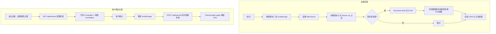
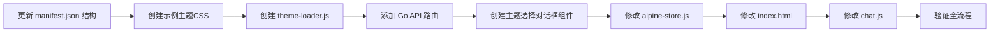

# 外源主题系统 — 实施方案 v3（终版）

## 1. 需求总结

1. **明暗切换按钮不变** — 现有 `#themeToggle` 功能不变，仍是 light↔dark 切换
2. **用户菜单新增"选择颜色主题"** — 弹出对话框，通过 API 获取可用主题，亮/暗两组 ComboBox 列表，每组首项为"内置亮色"/"内置暗色"
3. **确认后存 manifest.json** — 通过 API 提交到 local-server，后端写入 [`frontend/themes/manifest.json`](frontend/themes/manifest.json)
4. **零 FOUC 加载** — 用 `document.write` 同步注入外源 CSS `<link>`，无 loading 页、无跳转

---

## 2. 整体架构

### 2.1 防闪烁方案（关键设计决策）

| 方案 | 结论 |
|------|------|
| ❌ loading 页 + redirect | 多一次跳转、历史记录污染 |
| ✅ **document.write 同步注入** | 零跳转、零 FOUC、对现有代码改动最小 |

**原理**：在 [`index.html`](frontend/index.html) 的 `<head>` 中，`theme.css` 的 `<link>` 之后紧跟一个内联 `<script>`，使用 `document.write` 同步写入外源主题 CSS 的 `<link>`。浏览器在解析 HTML 流时遇到 `document.write` 会同步执行，遇到 `<link>` 会阻塞后续渲染直到 CSS 加载完成——这就从根源上杜绝了闪烁。

### 2.2 数据流



---

## 3. 文件变更清单

### 3.1 创建

| # | 文件 | 说明 |
|---|------|------|
| 1 | [`frontend/static/theme-loader.js`](frontend/static/theme-loader.js) | 外源主题加载器 |
| 2 | [`frontend/static/components/theme-dialog.js`](frontend/static/components/theme-dialog.js) | 主题选择对话框 Alpine 组件 |
| 3 | [`frontend/static/components/theme-dialog.css`](frontend/static/components/theme-dialog.css) | 主题选择对话框样式 |
| 4 | [`frontend/themes/catppuccin-light/theme.css`](frontend/themes/catppuccin-light/theme.css) | Catppuccin 亮色 |
| 5 | [`frontend/themes/catppuccin-dark/theme.css`](frontend/themes/catppuccin-dark/theme.css) | Catppuccin 暗色 |
| 6 | [`frontend/themes/nord-light/theme.css`](frontend/themes/nord-light/theme.css) | Nord 亮色 |
| 7 | [`frontend/themes/nord-dark/theme.css`](frontend/themes/nord-dark/theme.css) | Nord 暗色 |

### 3.2 修改

| # | 文件 | 修改内容 |
|---|------|----------|
| 8 | [`frontend/themes/manifest.json`](frontend/themes/manifest.json) | 新增 `actived`/`actived-light`/`actived-dark` 配置字段 |
| 9 | [`frontend/static/alpine-store.js`](frontend/static/alpine-store.js) | settings store 新增 `activedLight`/`activedDark` + `setThemeSelection()` |
| 10 | [`frontend/static/chat.js`](frontend/static/chat.js) | `applyTheme()` 调用 `ThemeLoader.apply()` |
| 11 | [`frontend/index.html`](frontend/index.html) | ② 中增加 document.write 注入脚本；引入 theme-loader.js；添加主题选择入口 |
| 12 | [`cmd/local-server/main.go`](cmd/local-server/main.go) | 新增 `GET /api/themes`、`POST /api/themes` |

---

## 4. 详细设计

### 4.1 [`frontend/themes/manifest.json`](frontend/themes/manifest.json)

同时作为"主题注册清单"和"用户偏好配置文件"。

```json
{
  "description": "第2大脑 外源主题清单",
  "actived": "light",
  "actived-light": "catppuccin-light",
  "actived-dark": "nord-dark",
  "themes": [
    {
      "id": "catppuccin-light",
      "name": "Catppuccin Latte",
      "name_zh": "猫布奇诺·拿铁",
      "mode": "light",
      "description": "温暖柔和的亮色主题"
    },
    {
      "id": "catppuccin-dark",
      "name": "Catppuccin Mocha",
      "name_zh": "猫布奇诺·摩卡",
      "mode": "dark",
      "description": "温暖柔和的暗色主题"
    },
    {
      "id": "nord-light",
      "name": "Nord Snow Storm",
      "name_zh": "北欧·雪暴",
      "mode": "light",
      "description": "冷静优雅的亮色主题"
    },
    {
      "id": "nord-dark",
      "name": "Nord Polar Night",
      "name_zh": "北欧·极夜",
      "mode": "dark",
      "description": "冷静优雅的暗色主题"
    }
  ]
}
```

新增字段：

| 字段 | 类型 | 说明 |
|------|------|------|
| `actived` | string | 当前活跃色系 `"light"` / `"dark"` |
| `actived-light` | string | 当前选中的亮色主题 ID，空串=使用内置亮色 |
| `actived-dark` | string | 当前选中的暗色主题 ID，空串=使用内置暗色 |

### 4.2 [`frontend/index.html`](frontend/index.html) — 防闪烁的 document.write 方案

**关键改动**：在 `theme.css` 的 `<link>` 之后插入一个内联脚本，同步注入外源主题 CSS。

```html
<link rel="stylesheet" href="/static/theme.css">
<script>
    // ★ 零 FOUC：在 theme.css 之后同步注入外源主题 CSS
    //    document.write 是阻塞的，浏览器加载完此 CSS 之前不会渲染后续内容
    (function () {
        try {
            var themeStr = document.documentElement.getAttribute('data-theme');
            if (!themeStr) themeStr = 'light';
            var externalLight = localStorage.getItem('brainforever_theme_light') || '';
            var externalDark = localStorage.getItem('brainforever_theme_dark') || '';
            var externalId = themeStr === 'light' ? externalLight : externalDark;
            if (externalId) {
                document.write(
                    '<link rel="stylesheet" href="/themes/' + encodeURIComponent(externalId) + '/theme.css">'
                );
            }
        } catch(e) {}
    })();
</script>
```

**为什么这能零 FOUC？**
1. 浏览器从上到下解析 HTML
2. 遇到 `theme.css` → 开始加载，但继续解析
3. 遇到内联 `<script>` → 暂停解析，执行脚本
4. 脚本中 `document.write('<link ...>')` → 将 `<link>` 写入 HTML 流
5. 浏览器遇到这个新 `<link>` → 开始加载外源 CSS
6. **浏览器不会渲染任何后续内容，直到外源 CSS 加载完成**
7. 最终用户看到的是：`data-theme` 已设置 + 外源 CSS 已加载 = **零闪烁**

### 4.3 [`frontend/static/theme-loader.js`](frontend/static/theme-loader.js)

```javascript
/**
 * ThemeLoader — 外源主题加载器
 * 职责：
 *   1. 运行时切换外源主题（用户通过对话框修改后刷新）
 *   2. 提供可用的 manifest 缓存
 */
window.ThemeLoader = (function() {
    var _currentId = '';      // 当前加载的外源主题 ID
    var _manifestCache = null; // themes[] 缓存

    return {
        /** 获取当前加载的外源主题 ID */
        get currentId() { return _currentId; },

        /** 应用外源主题：根据 data-theme 决定加载 actived-light 还是 actived-dark */
        apply: function() {
            var mode = document.documentElement.getAttribute('data-theme') || 'light';
            var themeId = mode === 'light'
                ? (localStorage.getItem('brainforever_theme_light') || '')
                : (localStorage.getItem('brainforever_theme_dark') || '');

            if (!themeId) {
                this.clear();
                return;
            }

            if (_currentId === themeId) return; // 已加载，跳过

            this.clear();

            var link = document.createElement('link');
            link.rel = 'stylesheet';
            link.href = '/themes/' + encodeURIComponent(themeId) + '/theme.css';
            link.id = 'external-theme-css';
            document.head.appendChild(link);
            _currentId = themeId;
        },

        /** 清除外源主题 CSS */
        clear: function() {
            var old = document.getElementById('external-theme-css');
            if (old) old.remove();
            _currentId = '';
        },

        /** 从 /api/themes 加载 manifest（含主题列表 + 用户选择） */
        loadManifest: async function() {
            try {
                var resp = await fetch('/api/themes');
                var data = await resp.json();
                _manifestCache = data.themes || [];
                return data;
            } catch(e) {
                console.warn('ThemeLoader: failed to load manifest', e);
                return null;
            }
        },

        /** 获取缓存的 themes 列表 */
        getThemes: function() {
            return _manifestCache || [];
        },
    };
})();
```

### 4.4 [`frontend/static/alpine-store.js`](frontend/static/alpine-store.js) — 修改

在 `settings` store 中新增：

```javascript
// 新增字段
activedLight: localStorage.getItem('brainforever_theme_light') || '',
activedDark: localStorage.getItem('brainforever_theme_dark') || '',

// _save() 中增加持久化到独立 key
_save: function() {
    localStorage.setItem('brainforever_settings', JSON.stringify({
        sendMode: this.sendMode,
        deepThink: this.deepThink,
        traitSearch: this.traitSearch,
        webSearch: this.webSearch,
        theme: this.theme,
    }));
    localStorage.setItem('brainforever_theme_light', this.activedLight);
    localStorage.setItem('brainforever_theme_dark', this.activedDark);
},

// 新增方法：设置主题选择 + 同步服务端
setThemeSelection: async function(lightId, darkId) {
    this.activedLight = lightId;
    this.activedDark = darkId;
    this._save();

    // 触发 ThemeLoader 刷新
    if (window.ThemeLoader) window.ThemeLoader.apply();

    // 同步到服务端
    try {
        var mode = document.documentElement.getAttribute('data-theme') || 'light';
        await fetch('/api/themes', {
            method: 'POST',
            headers: { 'Content-Type': 'application/json' },
            body: JSON.stringify({
                actived: mode,
                'actived-light': lightId,
                'actived-dark': darkId,
            }),
        });
    } catch(e) {
        console.warn('Failed to sync theme selection to server:', e);
    }
},
```

### 4.5 [`frontend/static/chat.js`](frontend/static/chat.js) — 修改

`applyTheme()` 末尾追加 `ThemeLoader.apply()`：

```javascript
function applyTheme(themeVal) {
    const themeStr = resolveTheme(themeVal);
    document.documentElement.setAttribute('data-theme', themeStr);
    switchHighlightTheme(themeStr);

    // ★ 外源主题联动：切换明暗时自动切换对应的外源主题 CSS
    if (window.ThemeLoader) {
        window.ThemeLoader.apply();
    }
}
```

### 4.6 主题选择对话框

**文件**：`frontend/static/components/theme-dialog.js` + `theme-dialog.css`

**Alpine 组件设计**：

```javascript
document.addEventListener('alpine:init', function() {
    Alpine.data('themeDialog', function() {
        return {
            show: false,
            availableLight: [],   // 亮色主题列表
            availableDark: [],    // 暗色主题列表
            selectedLight: '',    // 当前选中的亮色主题 ID
            selectedDark: '',     // 当前选中的暗色主题 ID

            async open() {
                // 从服务端加载 manifest
                var data = await window.ThemeLoader.loadManifest();

                // 构建列表：首项为"内置"默认项
                var builtinLight = { id: '', name: '内置亮色', name_zh: '内置亮色' };
                var builtinDark  = { id: '', name: '内置暗色', name_zh: '内置暗色' };

                this.availableLight = [builtinLight].concat(
                    (data && data.themes || []).filter(function(t) { return t.mode === 'light'; })
                );
                this.availableDark = [builtinDark].concat(
                    (data && data.themes || []).filter(function(t) { return t.mode === 'dark'; })
                );

                // 设置当前选中值
                this.selectedLight = localStorage.getItem('brainforever_theme_light') || '';
                this.selectedDark  = localStorage.getItem('brainforever_theme_dark') || '';

                this.show = true;
            },

            close() {
                this.show = false;
            },

            confirm() {
                // 通过 settings store 保存
                Alpine.store('settings').setThemeSelection(this.selectedLight, this.selectedDark);
                this.close();
            },
        };
    });
});
```

**对话框 HTML**（放在 `index.html` 的 `</body>` 前）：

```html
<div class="dialog-overlay" id="themeDialog"
    x-data="themeDialog()"
    :class="{ show: show }"
    @click.self="close">
    <div class="dialog-box">
        <div class="dialog-header">
            <h3>选择颜色主题</h3>
            <button class="dialog-close-btn" @click="close">&times;</button>
        </div>
        <div class="dialog-body">
            <div class="theme-select-group">
                <label>亮色主题</label>
                <select x-model="selectedLight">
                    <template x-for="t in availableLight" :key="t.id">
                        <option :value="t.id" x-text="t.name_zh || t.name"></option>
                    </template>
                </select>
            </div>
            <div class="theme-select-group">
                <label>暗色主题</label>
                <select x-model="selectedDark">
                    <template x-for="t in availableDark" :key="t.id">
                        <option :value="t.id" x-text="t.name_zh || t.name"></option>
                    </template>
                </select>
            </div>
        </div>
        <div class="dialog-footer">
            <button class="dialog-btn dialog-btn-cancel" @click="close">取消</button>
            <button class="dialog-btn dialog-btn-confirm" @click="confirm">确认</button>
        </div>
    </div>
</div>
```

### 4.7 [`cmd/local-server/main.go`](cmd/local-server/main.go) — 新增 API

**`GET /api/themes`** — 读取 manifest.json 返回

```go
srv.GET("/api/themes", func(w http.ResponseWriter, r *http.Request) {
    data, err := os.ReadFile("./frontend/themes/manifest.json")
    if err != nil {
        http.Error(w, `{"error":"cannot read theme manifest"}`, 500)
        return
    }
    w.Header().Set("Content-Type", "application/json")
    w.Write(data)
})
```

**`POST /api/themes`** — 更新 actived 三个字段

```go
srv.POST("/api/themes", func(w http.ResponseWriter, r *http.Request) {
    var req struct {
        Actived      string `json:"actived"`
        ActivedLight string `json:"actived-light"`
        ActivedDark  string `json:"actived-dark"`
    }
    if err := json.NewDecoder(r.Body).Decode(&req); err != nil {
        http.Error(w, `{"error":"invalid JSON"}`, 400)
        return
    }
    // 读取原文件，保持 themes[] 不变，只更新三个配置字段
    raw, _ := os.ReadFile("./frontend/themes/manifest.json")
    var m map[string]any
    json.Unmarshal(raw, &m)
    m["actived"] = req.Actived
    m["actived-light"] = req.ActivedLight
    m["actived-dark"] = req.ActivedDark
    out, _ := json.MarshalIndent(m, "", "  ")
    os.WriteFile("./frontend/themes/manifest.json", out, 0644)
    w.Header().Set("Content-Type", "application/json")
    json.NewEncoder(w).Encode(map[string]bool{"ok": true})
})
```

### 4.8 外源主题 CSS 模板

每个 `theme.css` 只需覆盖对应 `[data-theme="light"]` 或 `[data-theme="dark"]` 下的 CSS 自定义属性：

```css
/* [frontend/themes/xxx-light/theme.css] — 亮色示例 */
[data-theme="light"] {
    --bg-primary:       #eff1f5;
    --bg-secondary:     #e6e9ef;
    --bg-user:          #dce0e8;
    --bg-assistant:     #eff1f5;
    --bg-input:         #e6e9ef;
    --switch-track-bg:  #ccd0da;
    --text-primary:     #4c4f69;
    --text-secondary:   #5c5f77;
    --text-muted:       #9ca0b0;
    --accent:           #1e66f5;
    --accent-hover:     #2a7af5;
    --border:           #ccd0da;
    --shadow:           rgba(0, 0, 0, 0.06);
    --shadow-inset:     inset 0 1.5px 2.5px rgba(0, 0, 0, 0.12);
    --bg-code:          #e6e9ef;
    --success-text:     #40a02b;
    --error-bg:         rgba(210, 15, 57, 0.08);
    --error-border:     rgba(210, 15, 57, 0.25);
    --error-text:       #d20f39;
    --pure-black:       #000000;
    --pure-white:       #ffffff;
    --warning-bg:       #fef3cd;
    --warning-border:   #df8e1d;
    --warning-text:     #7c4c00;
    --tooltip-bg:       #e6e9ef;
    --tooltip-text:     #4c4f69;
}
```

暗色同理，选择器改为 `[data-theme="dark"]`。

---

## 5. 实施步骤



| 步 | 文件 | 内容 |
|----|------|------|
| 1 | [`frontend/themes/manifest.json`](frontend/themes/manifest.json) | 补充 `actived`、`actived-light`、`actived-dark` |
| 2 | 4× `theme.css` | 创建示例主题（catppuccin-light/dark, nord-light/dark） |
| 3 | [`frontend/static/theme-loader.js`](frontend/static/theme-loader.js) | ThemeLoader 全局对象 |
| 4 | [`cmd/local-server/main.go`](cmd/local-server/main.go) | `GET /api/themes` + `POST /api/themes` |
| 5 | [`frontend/static/components/theme-dialog.js`](frontend/static/components/theme-dialog.js) + `theme-dialog.css` | Alpine 对话框组件 |
| 6 | [`frontend/static/alpine-store.js`](frontend/static/alpine-store.js) | `activedLight`/`activedDark` + `setThemeSelection()` |
| 7 | [`frontend/index.html`](frontend/index.html) | document.write 注入脚本 + 引入 loader + 对话框 HTML + 用户菜单入口 |
| 8 | [`frontend/static/chat.js`](frontend/static/chat.js) | `applyTheme()` 调用 `ThemeLoader.apply()` |
| 9 | 验证 | 全流程测试 |

---

## 6. 注意事项

1. **`document.write` 只在首次 HTML 解析时生效** — 运行时切换主题（对话框确认后）不依赖 `document.write`，而是通过 `ThemeLoader.apply()` 动态添加/移除 `<link>`。这会产生一次短暂闪烁（外源 CSS 异步加载期间显示内置主题），但由于是用户主动触发的操作，感知不明显。

2. **CSS 层叠顺序**：`theme.css`（内置）→ `document.write` 注入的外源 CSS。同一个 CSS 选择器 `[data-theme="light"]`，后加载的样式胜出，无需 `!important`。

3. **`encodeURIComponent`** — 注入 `<link>` 时对外源主题 ID 做 URL 编码，防止特殊字符导致路径错误。

4. **manifest.json 读写并发** — local-server 为单用户场景，不存在并发冲突。但 `os.ReadFile` + `os.WriteFile` 在理论上不是原子操作，未来可考虑加文件锁。

5. **主题列表默认项** — ComboBox 首项 `id: ''` 表示"内置亮色/暗色"，`ThemeLoader.apply()` 遇到空 id 会调用 `clear()` 移除外源 CSS，回退到内置主题。
