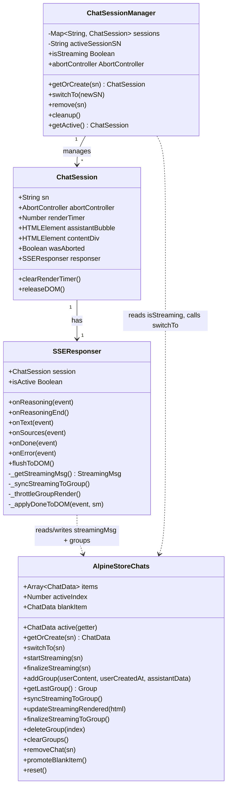
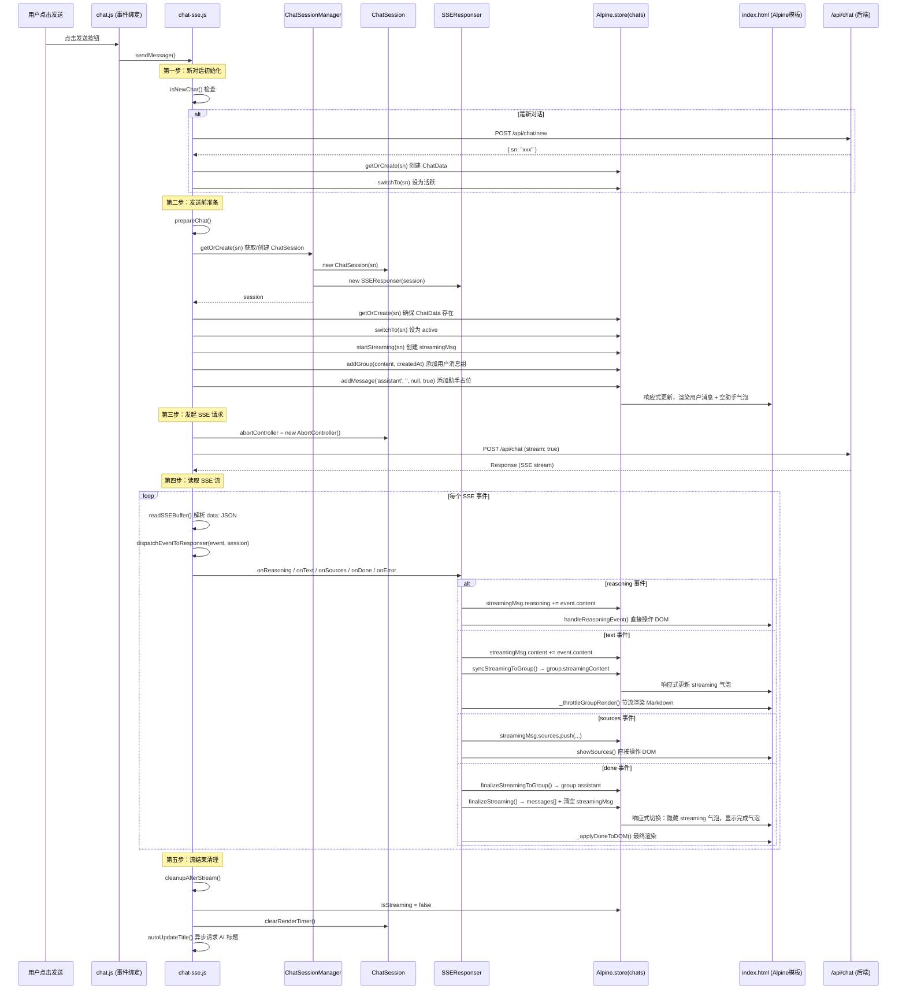
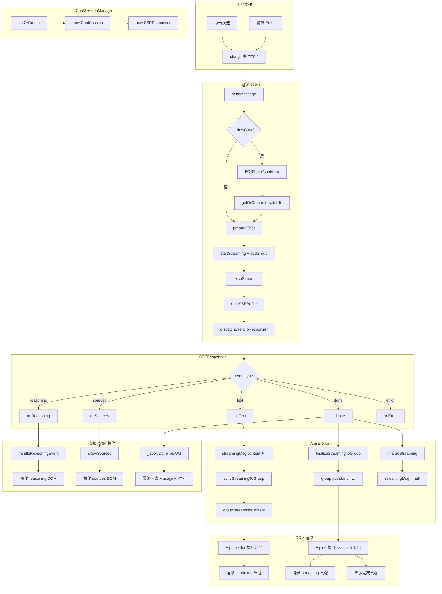
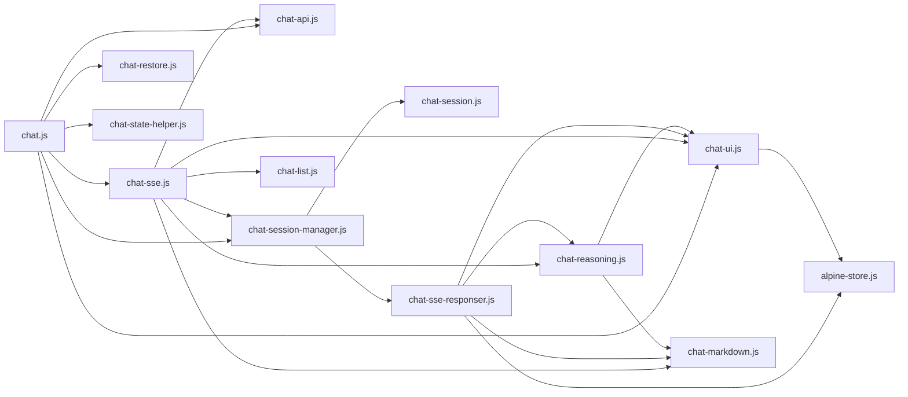

# 前端架构分析报告

## 1. 整体架构概览

本前端是一个基于 **Alpine.js** 的 SPA（单页应用），采用 **数据驱动渲染** 模式。核心架构分为三层：

```
┌─────────────────────────────────────────────────────────┐
│                    HTML 模板层 (index.html)               │
│  Alpine x-for, x-show, x-text, x-html 数据绑定           │
│  $store.chats.active.groups[] 驱动消息列表渲染            │
└──────────────────────┬──────────────────────────────────┘
                       │ 响应式绑定
┌──────────────────────▼──────────────────────────────────┐
│                  Alpine Store 数据层                      │
│  Alpine.store('chats')  ←  ChatData[]                    │
│  Alpine.store('settings') ← 用户设置                      │
│  Alpine.store('ui') ← Toast 等 UI 状态                   │
└──────────────────────┬──────────────────────────────────┘
                       │ 读写
┌──────────────────────▼──────────────────────────────────┐
│              ES Module 业务逻辑层                         │
│  chat-sse.js  →  sendMessage / SSE 流读取                │
│  chat-session-manager.js → 多会话管理                     │
│  chat-session.js → 单会话状态                             │
│  chat-sse-responser.js → SSE 事件处理                     │
│  chat-ui.js → DOM 操作 / 数据写入                        │
│  chat-reasoning.js → 深度思考区域管理                     │
│  chat.js → 初始化 / 事件绑定 / 侧栏布局                   │
└─────────────────────────────────────────────────────────┘
```

---

## 2. 核心数据模型：ChatData

定义在 [`alpine-store.js`](frontend/static/alpine-store.js:203) 的 `Alpine.store('chats')` 中。

```typescript
interface ChatData {
  sn: string;                    // 对话唯一标识
  title: string;                 // 对话标题
  titleState: 0 | 1 | 2;        // 标题修改状态
  isStreaming: boolean;          // 是否正在流式接收
  userScrolledUp: boolean;       // 用户是否手动上滚
  messages: Message[];           // 消息历史（用于后端交互）
  streamingMsg: StreamingMsg | null;  // 流式累积数据
  groups: Group[];               // 消息组（Alpine x-for 驱动渲染）
  _groupSeq: number;             // 自增序列
}

interface Group {
  id: number;                    // x-for :key
  msgId: number;                 // 后端消息 ID
  user: { content, createdAt } | null;
  assistant: { content, createdAt, reasoning?, sources?, usage? } | null;
  streamingContent: string;      // 流式累积文本
  streamingRendered: string;     // 节流渲染后的 HTML
  streamingReasoning: string;    // 累积的 reasoning
}

interface StreamingMsg {
  reasoning: string;
  content: string;
  sources: Source[];
  usage: Usage | null;
  msgId: number;
  createdAt: string | null;
  isDone: boolean;
  error: string | null;
  reasoningState: 'thinking' | 'done' | 'interrupted';
}
```

**关键设计**：`groups[]` 是 Alpine x-for 的直接数据源，`streamingMsg` 是流式过程中的临时累积区。流式完成后，`streamingMsg` 的内容被归档到 `groups[last].assistant` 和 `messages[]`。

### 2.1 blankItem — 空白对话设计

`blankItem` 是独立于 `items[]` 数组之外的一个特殊 ChatData 对象，用于表示"新对话"状态。

| 属性 | 说明 |
|------|------|
| **位置** | `Alpine.store('chats')` 的顶层属性 `blankItem`，不在 `items[]` 中 |
| **初始值** | `null`（页面加载时） |
| **创建时机** | `startNewSession()` 被调用时（点击"新对话"或首次加载无历史时） |
| **侧栏可见性** | **不可见** — 侧栏只渲染 `items[]` 中的 ChatData |
| **`active` getter** | 当 `activeIndex === -1` 时返回 `blankItem`，而非 `null` |
| **`promoteBlankItem()`** | 用户发送消息时调用：将 `blankItem` 移入 `items[]`，更新 `activeIndex`，置 `blankItem = null` |

**blankItem 的生命周期**：

```
页面加载 (blankItem = null)
    │
    ├── 有历史对话 → restoreChat() 填充 items[]，activeIndex >= 0
    │
    └── 无历史对话 / 点击"新对话"
         │
         startNewSession() → activeIndex = -1
         │
         └── 创建 blankItem = { sn: "tmp_xxx", title: "", titleState: 0, ... }
              │
              ├── 用户发送消息
              │   │
              │   └── promoteBlankItem() → items.push(blankItem)
              │                            activeIndex = items.length - 1
              │                            blankItem = null
              │
              └── 用户再次点击"新对话"
                  │
                  └── startNewSession() → 如果 blankItem 存在则复用，否则创建新的
```

---

## 3. 核心类关系图



---

## 4. 消息发送与流式接收完整流程



---

## 5. 各文件职责与关系

### 5.1 [`chat-session.js`](frontend/static/chat-session.js:30) — 单会话状态

**职责**：管理单个 SSE 会话的运行时状态。

| 属性 | 类型 | 说明 |
|------|------|------|
| `sn` | string | 对话 SN |
| `abortController` | AbortController | 用于中断 fetch 请求 |
| `renderTimer` | number | 节流渲染定时器 |
| `assistantBubble` | HTMLElement | 当前会话的助手气泡 DOM 引用 |
| `contentDiv` | HTMLElement | 气泡内的内容容器 |
| `wasAborted` | boolean | 是否被用户中断 |
| `responser` | SSEResponser | 关联的 SSE 事件处理器 |

**关键设计**：这是一个轻量级会话对象，**不持有流式数据**（streamingMsg 已迁移到 Alpine store）。它只持有 DOM 引用和运行时控制状态。

---

### 5.2 [`chat-session-manager.js`](frontend/static/chat-session-manager.js:17) — 多会话管理器

**职责**：管理所有 `ChatSession` 实例，支持多对话并发流式。

| 方法 | 说明 |
|------|------|
| `getOrCreate(sn)` | 获取或创建 ChatSession + SSEResponser 对 |
| `switchTo(newSN)` | 切换活跃会话，调用旧会话的 `flushToDOM()` |
| `remove(sn)` | 移除会话（中断 SSE + 清理 DOM） |
| `cleanup()` | 清理非活跃会话（最多保留 5 个） |
| `get isStreaming` | 委托到 Alpine store 的 `chats.active.isStreaming` |

**关键设计**：
- 使用 `Map<string, ChatSession>` 存储，SN 为 key
- `switchTo()` 时调用旧 session 的 `responser.flushToDOM()`，确保后台累积的数据渲染到 DOM
- 单例模式：`export const sessionManager = new ChatSessionManager()`

---

### 5.3 [`chat-sse-responser.js`](frontend/static/chat-sse-responser.js:36) — SSE 事件处理器

**职责**：处理 SSE 事件，将数据写入 Alpine store 和 DOM。

| 方法 | 触发事件 | 行为 |
|------|---------|------|
| `onReasoning(event)` | `reasoning` | 追加到 `streamingMsg.reasoning`，调用 `handleReasoningEvent()` 操作 DOM |
| `onReasoningEnd()` | `reasoning_end` | 调用 `finalizeReasoningArea()` 标记思考完成 |
| `onText(event)` | `text` | 追加到 `streamingMsg.content`，调用 `_syncStreamingToGroup()` |
| `onSources(event)` | `sources` | 去重后追加到 `streamingMsg.sources`，调用 `showSources()` |
| `onDone(event)` | `done` | 归档 streamingMsg → group.assistant + messages，最终渲染 |
| `onError(event)` | `error` | 设置 `streamingMsg.error`，显示错误提示 |
| `flushToDOM()` | 切换会话时 | 将后台累积的 streamingMsg 渲染到 DOM |

**关键设计**：
- `isActive` getter 判断当前 session 是否是 Alpine store 中的活跃会话
- 非活跃时，`onText` 等事件**只写 Alpine store**，不操作 DOM
- `onDone` 的执行顺序至关重要：先 `finalizeStreamingToGroup()` → 再 `finalizeStreaming()` → 最后 `_applyDoneToDOM()`
- `flushToDOM()` 支持两种场景：流已完成（完整渲染）和流仍在后台（渲染累积内容）

---

### 5.4 [`chat-sse.js`](frontend/static/chat-sse.js:1) — SSE 流处理主入口

**职责**：消息发送、SSE 流读取、事件分发、流结束清理。

| 函数 | 说明 |
|------|------|
| `sendMessage()` | 主入口：新对话初始化 → prepareChat → fetchStream → cleanup |
| `prepareChat()` | 发送前准备：验证输入、清理 UI、初始化 Alpine store、创建 DOM 占位 |
| `addUserMessage()` | 添加用户消息到 Alpine store 和 messages |
| `fetchStream()` | 发起 POST /api/chat 请求，读取 SSE 流 |
| `readSSEBuffer()` | 逐行解析 SSE data: JSON，调用 dispatchEventToResponser |
| `dispatchEventToResponser()` | 按 event.type 路由到 SSEResponser 对应方法 |
| `cleanupAfterStream()` | 流结束清理：重置状态、清理定时器、自动修改标题 |

**关键设计**：
- `prepareChat()` 中先调用 `chats.startStreaming(sn)` 再 `addUserMessage()`，确保 Alpine store 已就绪
- `readSSEBuffer()` 使用 `TextDecoder` 处理流式 UTF-8，buffer 处理跨 chunk 的行分割
- `cleanupAfterStream()` 区分活跃会话和后台会话：活跃会话操作全局 UI，后台会话只更新 Alpine store

---

### 5.5 [`chat-ui.js`](frontend/static/chat-ui.js:1) — UI 操作层

**职责**：DOM 操作、数据写入 Alpine store、UI 状态管理。

| 函数 | 说明 |
|------|------|
| `addMessage(role, content, createdAt, isStreaming)` | 写入 Alpine store：user → addGroup，assistant → 更新 lastGroup |
| `showWelcomeMessage()` | 创建欢迎消息 DOM，将 input-area 移入 |
| `autoScrollToBottom()` | 自动滚动到底部 |
| `throttleRender()` | 节流渲染 Markdown |
| `showSources()` | 显示来源面板（web / knowledge） |
| `showTokenUsage()` | 显示 token 用量 |
| `showError()` | 显示错误提示 |
| `collapseInputArea()` / `restoreInputArea()` | 折叠/展开输入面板 |

**关键设计**：
- `addMessage('user')` 调用 `chats.addGroup()` 创建新的消息组
- `addMessage('assistant', '', null, true)` 设置 `lastGroup.streamingContent = ''`，触发 Alpine 显示 streaming 气泡
- 这是一个**混合层**：既写 Alpine store（数据驱动），也直接操作 DOM（reasoning、sources 等 Alpine 难以处理的复杂 UI）

---

### 5.6 [`chat-reasoning.js`](frontend/static/chat-reasoning.js:1) — 深度思考区域管理

**职责**：管理 assistant 气泡中的 reasoning（深度思考）区域。

| 函数 | 说明 |
|------|------|
| `createReasoningArea()` | 创建 reasoning 区域 DOM（标题栏 + 内容区） |
| `handleReasoningEvent()` | 处理 reasoning 事件：追加文本、工具调用提示 |
| `finalizeReasoningArea()` | 标记思考完成，最终渲染 Markdown |
| `restoreReasoningArea()` | 恢复已完成的 reasoning 区域（切换回对话时） |
| `toggleReasoningCollapse()` | 折叠/展开 reasoning 区域 |

**关键设计**：
- reasoning 区域**完全由 JS 直接操作 DOM**，不经过 Alpine 数据绑定
- 使用 `throttleRender()` 节流渲染 reasoning 内容
- 支持三种状态：`thinking`（进行中）、`done`（完成）、`interrupted`（中断）

---

### 5.7 [`chat.js`](frontend/static/chat.js:1) — 主入口与初始化

**职责**：模块导入、初始化、事件绑定、侧栏布局管理。

| 功能 | 说明 |
|------|------|
| 初始化 | `initDom()`、`initTooltip()`、`applyTheme()` |
| 事件绑定 | 发送按钮、键盘事件、停止流式、新对话、AI 标题、主题切换 |
| `startNewSession()` | 无刷新开启新对话 |
| 侧栏布局 | `updateBrandLayout()` 管理品牌元素在左栏/主栏间的动态迁移 |
| 响应式 | `switchMode()` 监听 resize，切换宽屏/小屏模式 |

**关键设计**：
- 作为 ES Module 加载，是应用的**唯一入口**
- 通过 `window.__settingsStore` 访问 Alpine store（因为 Alpine store 在普通 `<script>` 中注册）
- 侧栏布局逻辑复杂：宽屏模式下品牌在左栏，小屏模式下品牌在主栏

---

## 6. 数据流全景图



---

## 7. 关键架构决策

### 7.1 为什么 streamingMsg 在 Alpine store 中，而 reasoning/sources 直接操作 DOM？

- **streamingMsg.content** 通过 `group.streamingContent` → Alpine x-html 渲染，因为文本内容是消息的主体，需要 Alpine 的响应式能力来切换 streaming/完成状态
- **reasoning** 和 **sources** 是辅助信息，UI 结构复杂（折叠/展开、图标、去重），Alpine 模板难以表达，所以由 JS 直接操作 DOM

### 7.2 为什么 ChatSession 不持有 streamingMsg？

这是重构的结果。早期版本中 `ChatSession` 持有所有流式数据，但多会话并发时需要跨会话共享数据给 Alpine 模板。重构后将数据迁移到 `Alpine.store('chats')`，`ChatSession` 只保留运行时控制状态和 DOM 引用。

### 7.3 为什么需要 ChatSessionManager？

支持**多对话并发流式**。用户可以在对话 A 流式进行时切换到对话 B 发消息，对话 A 的 SSE 连接继续在后台接收数据。`ChatSessionManager` 管理这些并发会话，`switchTo()` 时调用 `flushToDOM()` 将后台累积的数据渲染到 DOM。

### 7.4 Alpine store 的加载时序

```
1. alpine-store.js (普通 <script>)  → 注册 Alpine.store('chats'), ('settings'), ('ui')
2. components/buttons.js (普通 <script>) → 注册 Alpine 组件函数
3. alpine.min.js (defer) → 触发 alpine:init，扫描 DOM，绑定 $store 引用
4. chat.js (type="module") → 异步加载，导入各模块，初始化
```

---

## 8. 已知问题与风险

### 8.1 数据一致性风险
- `streamingMsg` 在 Alpine store 中，但 `reasoning` 和 `sources` 的 DOM 由 JS 直接管理。切换对话再切回时，`flushToDOM()` 需要同时恢复 Alpine 数据和 JS 管理的 DOM，两者可能不同步
- `finalizeStreamingToGroup()` 和 `finalizeStreaming()` 的执行顺序敏感：必须先归档到 group，再归档到 messages（因为后者会清空 streamingMsg）

### 8.2 内存泄漏风险
- `ChatSessionManager` 的 `cleanup()` 只清理非活跃会话，但如果用户创建了大量对话，`sessions` Map 可能持续增长
- DOM 引用（`assistantBubble`, `contentDiv`）在 Alpine 重新渲染后可能变为悬挂引用

### 8.3 竞态条件
- `prepareChat()` 中使用 `requestAnimationFrame` 获取 DOM 引用，但如果 Alpine 渲染延迟，`assistantBubble` 可能为 null
- 快速连续发送消息时，`isNewChat()` 的判断可能不准确

### 8.4 删除对话时 Alpine store 未同步移除 ChatData
- **问题**：删除对话时，[`chat-list.js:1054`](frontend/static/chat-list.js:1054) 调用了 `sessionManager.remove(chat.sn)` 从 `ChatSessionManager.sessions` Map 中完整清理（abort SSE + clear timer + release DOM + delete），但 [`chat-list.js:1066-1071`](frontend/static/chat-list.js:1066) 只清空了 `chats.active` 的 messages 内容，**没有从 `Alpine.store('chats').items[]` 数组中移除 ChatData 元素**。
- **后果**：`items[]` 中残留已删除对话的 ChatData 对象（内容为空），可能导致后续切换对话时出现空对话。
- **根因**：`Alpine.store('chats')` 中缺少 `removeChat(sn)` 方法。现有方法只有 `deleteGroup()`（删除消息组）和 `clearGroups()`（清空组），没有删除 ChatData 的接口。
- **建议修复**：在 Alpine store 中添加 `removeChat(sn)` 方法，从 `items[]` 中 splice 移除并调整 `activeIndex`。

### 8.5 "新对话"语义错误 — 引入 blankItem 设计方案

#### 问题描述

[`startNewSession()`](frontend/static/chat.js:103) 当前的实现将"新对话"错误地实现为"清空当前对话"：

1. 清空 `activeChat.messages`、`title`、`titleState`、`groups`
2. **不重置** `activeChat.sn` — SN 仍然是旧的
3. **不修改** `activeIndex` — 仍指向旧对话的索引

**后果**：点击"新对话"后，`isNewChat()` 检查 `activeChat.sn` 不为空 → 返回 false → 不会调用 `newChat()` 获取新 SN → 消息发到了旧对话中。

#### 根因分析

根本原因是缺少一个**独立于 `items[]` 的"空白对话"概念**。`activeIndex = -1` 时 `chats.active` 返回 `null`，导致所有依赖 `active` 的代码都需要处理 null 情况，增加了复杂性和 BUG 风险。

#### 修复方案：blankItem

在 [`Alpine.store('chats')`](frontend/static/alpine-store.js:181) 中引入 `blankItem` 设计：

**a) 新增属性：**
```javascript
blankItem: null,  // 独立于 items[] 的空白对话
```

**b) 修改 `active` getter：**
```javascript
get active() {
    if (this.activeIndex === -1 && this.blankItem) {
        return this.blankItem;
    }
    return this.items[this.activeIndex] || null;
}
```

**c) 新增 `promoteBlankItem()` 方法：**
```javascript
promoteBlankItem: function() {
    if (!this.blankItem) return null;
    this.items.push(this.blankItem);
    this.activeIndex = this.items.length - 1;
    var chat = this.blankItem;
    this.blankItem = null;  // 置 null，表示没有空白对话了
    return chat;
}
```

**d) 修改 `startNewSession()`：**
```javascript
async function startNewSession() {
    // ...
    var chats = Alpine.store('chats');
    chats.activeIndex = -1;
    // 创建 blankItem（如果不存在）
    if (!chats.blankItem) {
        chats.blankItem = {
            sn: '',           // 临时 SN，发送消息时由 newChat() 填充
            title: '',
            titleState: 0,
            isStreaming: false,
            userScrolledUp: false,
            messages: [],
            streamingMsg: null,
            groups: [],
            _groupSeq: 0,
        };
    }
    showWelcomeMessage();
    // ...
}
```

**e) 修改 `sendMessage()`：**
```javascript
export async function sendMessage() {
    if (isNewChat()) {
        const data = await newChat();
        if (data && data.sn) {
            var chats = Alpine.store('chats');
            // blankItem 存在时，填充 SN 并 promote
            if (chats.blankItem) {
                chats.blankItem.sn = data.sn;
                chats.promoteBlankItem();
            } else {
                // 兼容：没有 blankItem 时走原有逻辑
                var cd = chats.getOrCreate(data.sn);
                if (cd) {
                    cd.sn = data.sn;
                    chats.switchTo(data.sn);
                }
            }
        }
    }
    // ...
}
```

**f) 修改 `prepareChat()`：**
```javascript
function prepareChat() {
    var chats = Alpine.store('chats');
    var activeChat = chats.active;  // 现在即使 activeIndex === -1，也能拿到 blankItem
    const sn = activeChat ? activeChat.sn : '';
    // sn 不再为空（blankItem 有临时 SN 或已由 newChat() 填充）
    const session = sessionManager.getOrCreate(sn);
    // ...
}
```

**g) 修改 `isNewChat()`：**
```javascript
function isNewChat() {
    var chats = Alpine.store('chats');
    var activeChat = chats ? chats.active : null;
    // blankItem 存在 → 新对话
    if (chats && chats.blankItem) return true;
    // 原有逻辑
    return !activeChat || (!activeChat.sn && activeChat.messages.length === 0);
}
```

#### 解决的问题

| # | 原问题 | blankItem 方案如何解决 |
|---|--------|----------------------|
| 1 | 首次加载 `chats.active` 为 null | `active` getter 返回 `blankItem` |
| 2 | "新对话"后 SN 未重置 | `startNewSession()` 重置 `activeIndex = -1`，创建新 `blankItem` |
| 3 | `prepareChat()` 中 `sn = ''` | `blankItem.sn` 始终有值（临时或正式） |
| 4 | `getOrCreate('')` 不一致 | 不再需要，因为 `sn` 不会为空 |
| 5 | 侧栏出现空对话 | `blankItem` 不在 `items[]` 中，侧栏不渲染 |
| 6 | `sendMessage()` 中需要特殊处理 null | `active` 始终返回有效对象 |

### 8.6 prepareChat() 中 getOrCreate('') 的防御性不足
- **问题**：[`chat-sse.js:108-111`](frontend/static/chat-sse.js:108) 中，`prepareChat()` 从 `activeChat.sn` 取值，如果 `activeChat` 为 null 则 `sn = ''`，然后调用 `sessionManager.getOrCreate('')`。
- **分析**：`ChatSessionManager.getOrCreate('')` 在 [`chat-session-manager.js:31`](frontend/static/chat-session-manager.js:31) 中不会拒绝空字符串，`Map.has('')` 为 false 时会创建一个 key 为 `''` 的 ChatSession。而 `Alpine.store('chats').getOrCreate('')` 在 [`alpine-store.js:200`](frontend/static/alpine-store.js:200) 中会 `if (!sn) return null` 拒绝空字符串。
- **后果**：两个 `getOrCreate` 对空字符串的处理不一致。Alpine store 安全拒绝，但 ChatSessionManager 会创建空 ChatSession，导致 `sessions` Map 中多出一个 key 为 `''` 的无效条目。
- **blankItem 方案的影响**：引入 `blankItem` 后，`activeChat` 不再为 null（返回 `blankItem`），`sn` 始终有值，此问题自然解决。但仍建议在 `ChatSessionManager.getOrCreate()` 中添加空字符串防御作为安全网。

---

## 9. 文件依赖关系图



---

## 10. 总结

本前端架构的核心模式是 **Alpine.js 数据驱动渲染 + JS 直接 DOM 操作** 的混合模式：

1. **消息主体**（用户消息、助手消息的 content）通过 Alpine store 的 `groups[]` 驱动渲染
2. **流式内容**通过 `streamingMsg → group.streamingContent` 路径实现实时更新
3. **复杂 UI**（reasoning 区域、sources 面板、token usage）由 JS 直接操作 DOM
4. **多会话并发**由 `ChatSessionManager` + `ChatSession` + `SSEResponser` 三层架构支撑
5. **数据流向**是单向的：SSE 事件 → SSEResponser → Alpine store（数据） + DOM（UI）

### 发现的架构问题汇总

| # | 问题 | 严重程度 | 涉及文件 | 状态 |
|---|------|---------|---------|------|
| 1 | 删除对话时 Alpine store 未同步移除 ChatData | 中 | [`chat-list.js:1054`](frontend/static/chat-list.js:1054), [`alpine-store.js:181`](frontend/static/alpine-store.js:181) | 待修复 |
| 2 | "新对话"语义错误 — 需引入 blankItem 方案 | 高 | [`chat.js:103`](frontend/static/chat.js:103), [`alpine-store.js:181`](frontend/static/alpine-store.js:181), [`chat-sse.js:481`](frontend/static/chat-sse.js:481) | 已设计，待实现 |
| 3 | `ChatSessionManager.getOrCreate('')` 会创建空 ChatSession | 低 | [`chat-session-manager.js:30`](frontend/static/chat-session-manager.js:30), [`chat-sse.js:111`](frontend/static/chat-sse.js:111) | blankItem 方案可自然解决 |
| 4 | `sendMessage()` 中变量名冲突导致模块加载失败 | 高 | [`chat-sse.js:489`](frontend/static/chat-sse.js:489) | ✅ 已修复 |
| 5 | 首次加载时 `chats.active` 为 null 导致消息无法显示 | 高 | [`chat-sse.js:486-495`](frontend/static/chat-sse.js:486) | ✅ 已修复（临时方案，blankItem 将彻底解决） |
