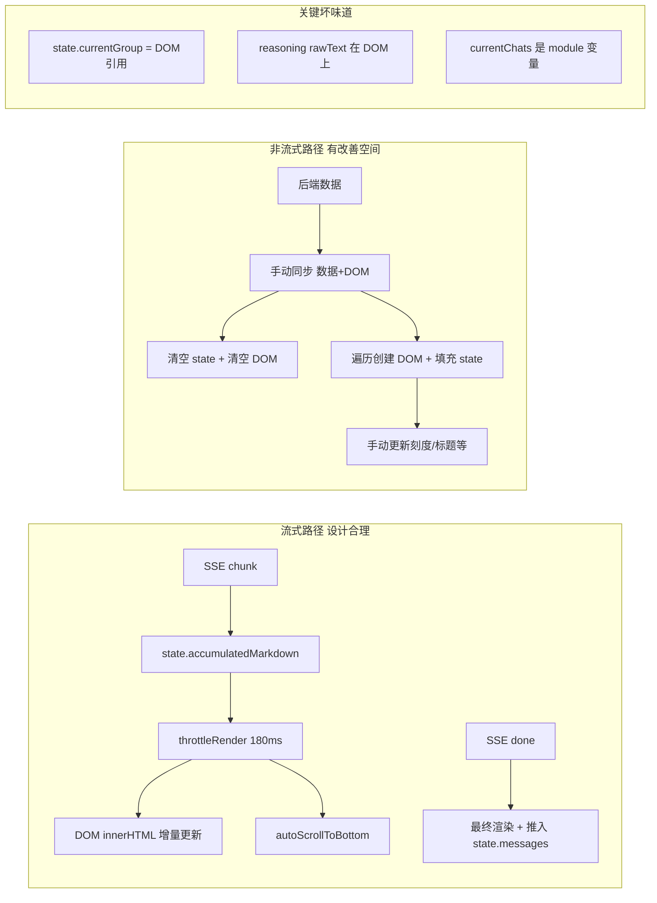

# 前端数据与视图分离问题分析及重构计划

> **文档版本**: v3 — 修正了对流式渲染的分析，区分了"流式路径"和"非流式路径"

## 一、当前架构概览

```
┌─────────────────────────────────────────────────────────┐
│                    前端架构现状（简化）                      │
├─────────────────────────────────────────────────────────┤
│                                                         │
│  chat-state.js      ← 集中状态 (state.messages[])         │
│       │                                                  │
│       ├── chat-ui.js       ← DOM 创建 (addMessage)       │
│       ├── chat-sse.js      ← SSE 流式处理                │
│       ├── chat-list.js     ← 对话列表 (currentChats[])   │
│       ├── chat-ticknav.js  ← 刻度导航 (依赖 DOM 属性)     │
│       ├── chat-reasoning.js← 思考链 (rawText 挂 DOM 上)   │
│       ├── chat-restore.js  ← 恢复会话                    │
│       ├── chat-api.js      ← API 请求封装                │
│       └── chat.js          ← 主入口                      │
│                                                         │
└─────────────────────────────────────────────────────────┘
```

---

## 二、关键区分：流式路径 vs 非流式路径

这里需要做一个**重要的区分**。代码中有两条完全不同的数据路径，它们的耦合情况截然不同：

### 路径 A：流式输出路径（SSE 实时渲染）— ✅ 设计合理

```
SSE chunk arrives
    → state.accumulatedMarkdown += content    (累积到缓冲区)
    → throttleRender() 每 180ms:
        → contentDiv.innerHTML = renderMarkdown(buffer)  (增量渲染)
        → autoScrollToBottom()                           (自动滚动)
    → SSE done event:
        → 最终渲染 + 推入 state.messages                  (归档)
```

**这条路径的实际做法是"增量渲染"，而非"全量刷新"**。它只更新了一个特定 DOM 元素的 innerHTML，没有重建整个消息列表。这本质上就是 **chunked incremental render**，是正确的流式渲染模式——即使使用 Vue/React，流式输出也走同一个模式（直接操作 ref 的 innerHTML）。

> **结论**：流式路径没有问题。`accumulatedMarkdown` 作为渲染缓冲区而存在，未归档前不进入 `state.messages`，这是合理的。

### 路径 B：非流式路径（恢复/切换/初始化）— ⚠️ 存在耦合问题

```
restoreChat / selectChat / switchToUser
    → 清空 DOM（手动移除所有 .message-group）
    → 清空 state（state.messages = []）
    → 调后端 API 获取数据
    → 遍历数据：
        → addMessage() 创建 DOM 节点   (DOM 操作)
        → state.messages.push()        (数据操作)
    → 手动更新刻度导航、标题等
```

**这条路径的问题才是真正的关注点**：数据和 DOM 的同步是**完全手动且紧耦合的**。每处都需要：
1. 手动清空 DOM
2. 手动清空 state
3. 手动遍历创建 + 推入

---

## 三、真正的核心问题

### 问题 1：`state.currentGroup` 存储 DOM 引用（真正的坏味道）

**文件**：[`chat-state.js`](../frontend/static/chat-state.js:126)

```js
export const state = {
    messages: [],
    currentGroup: null,   // ← 存储的是 DOM 元素 (.message-group) 的引用
    ...
};
```

`currentGroup` 在流式路径和非流式路径中都被使用：
- 流式路径中用于 `state.currentGroup.appendChild(div)` 追加 assistant 消息到同一 group
- 非流式路径中同样用于追加

**问题**：如果 DOM 重建（如切换会话后），这个引用指向旧的 DOM 节点，会悬空。更合理的做法是存 `currentGroupMsgId`（消息组 ID），通过 ID 查找 DOM。

### 问题 2：`currentChats`（对话列表）是 module 局部变量

**文件**：[`chat-list.js`](../frontend/static/chat-list.js:154)

```js
let currentChats = [];       // ← module 局部变量
let activeChatSN = null;     // ← module 局部变量
```

- 其他模块要获取对话列表需要迂回方式
- 没有事件通知机制——标题变更后需要手动调用 `updateCurrentChatTitle()` 来同步
- `updateCurrentChatTitle()` 又通过 DOM 选择器定位元素（`querySelectorAll(.chat-item[data-sn="...])`），这是另一种 DOM 耦合

### 问题 3：reasoning（思考链）的 `rawText` 挂在 DOM 元素上

**文件**：[`chat-reasoning.js`](../frontend/static/chat-reasoning.js:174)

```js
contentEl.rawText += event.content;  // ← 文本状态挂在 DOM 元素的属性上
```

这意味着：
- 切换对话后，旧 DOM 被移除，`rawText` 丢失（虽然切换时当前没有活跃的流式 reasoning）
- 数据不可序列化、不可在修复后恢复
- 与 addMessage 的 `state.messages.push({content, ...})` 不一致——消息内容进 state，reasoning 内容不进 state

### 问题 4：刻度导航依赖 DOM 查询而非数据源

**文件**：[`chat-ticknav.js`](../frontend/static/chat-ticknav.js:31-33)

```js
const userMessages = chatContainer.querySelectorAll('.message.user');
const tickCount = userMessages.length;
```

刻度导航通过 **查询 DOM** 来确定有多少条用户消息：

```js
const targetMsg = scrollContainer.querySelector(`.message.user[data-msg-index="${i}"]`);
```

如果用 `state.messages` 作为唯一数据源：

```js
const userMessages = state.messages.filter(m => m.role === 'user');
const tickCount = userMessages.length;
```

这就不需要在 DOM 上挂 `data-msg-index` 属性了。

### 问题 5：`addMessage()` 在非流式路径中耦合了数据和 DOM

**文件**：[`chat-ui.js`](../frontend/static/chat-ui.js:248)

当**非流式**（如 restoreChat/selectChat）调用 `addMessage()` 时：

```js
export function addMessage(role, content, ...) {
    // ── 创建 DOM ──
    const div = document.createElement('div');
    // ── 管理分组（操作 DOM + state.currentGroup） ──
    if (role === 'user') {
        state.currentGroup = group;  // 记录 DOM 引用
        dom.chatContainer.appendChild(group);
    } else {
        state.currentGroup.appendChild(div);
    }
    // ── 递增计数器 ──
    state.userMsgCount++;
    // ── 自动滚动 ──
    autoScrollToBottom();
    return div;  // 返回 DOM 元素供调用方使用
}
```

**但注意**：对于流式路径，`addMessage('user', ...)` 和 `addMessage('assistant', '', ..., true)` 也是走这个函数——流式路径也依赖 `state.currentGroup`。如果修改 `currentGroup` 的行为，需要确保流式路径不受影响。

### 问题 6：消息分组没有显式的数据模型

`state.messages` 是扁平的：

```js
state.messages = [
    { role: 'user', content: '你好', id: 1 },
    { role: 'assistant', content: '你好！', id: 1, usage: {...} },
    { role: 'user', content: '再问一个', id: 2 },
    { role: 'assistant', content: '好的', id: 2, reasoning: '...' },
];
```

"哪些消息属于同一个 group"完全由 DOM 结构隐式表达（`.message-group` 包裹层）。如果需要删除一个 group，当前的做法是通过 `msgId` 来匹配（因为 user 和 assistant 共享同一个 `msgId`），这实际上已经是一种隐式的分组 ID 方案。但 `state.messages` 中没有显式的 groupId 字段。

---

## 四、复杂度具体表现（非流式路径）

以下是非流式路径中手动同步"数据 → DOM"的典型模式：

| 文件 | 手动同步代码片段 |
|------|----------------|
| [`chat-restore.js`](../frontend/static/chat-restore.js:76-99) | 遍历消息 → `addMessage()` 创建 DOM → `state.messages.push()` |
| [`chat-list.js`](../frontend/static/chat-list.js:384-471) (selectChat) | 清空 state → 清空 DOM → 调 API → 遍历结果创建 DOM + 填充 state |
| [`chat-api.js`](../frontend/static/chat-api.js:177-250) (switchToUser) | 清空 state → 清空 DOM → 调 API → 创建 DOM → 填充 state |

另外还有标题变更的级联手动同步链：

```
用户点击保存标题
  → putChatTitle() 调 API
  → updateHeaderTitle(newTitle)        // 更新 DOM
  → state.dialogTitle = title          // 更新 state
  → updateCurrentChatTitle(title)      // 更新侧边栏 DOM
    → currentChats.find()              // 更新内存中数据
    → querySelectorAll(.chat-item[data-sn="...])  // DOM 选择器更新
```

---

## 五、关于"无框架 = 刷新即生效"的思考

你提到的这个优势非常实在。当前项目没有构建步骤，修改 JS 后刷新浏览器即生效。如果引入框架：

| 方面 | 无框架（当前） | 有框架 |
|------|---------------|--------|
| 修改后生效 | 刷新即生效 | 需要构建（npm run build/dev） |
| 依赖管理 | 无 | package.json + node_modules |
| 开发复杂度 | 低 | 中（需要了解框架生态） |
| 状态/视图管理 | 手动 | 自动（响应式） |
| 代码体积 | ~60KB 手写 JS | 额外增加框架体积（Vue ~30KB gzip） |

**可能的中间路线**：给当前代码加上轻量的数据层封装，但不引入框架。这样既保留了"刷新即生效"的优势，又改善了数据管理的可维护性。

---

## 六、当前代码的亮点（也应被认可）

在批评之前，需要承认当前代码做了很多正确的事情：

1. **ES modules 模块化**：按功能拆分成独立文件，职责清晰
2. **`state` 集中管理**：尽管有瑕疵，但比全局变量满天飞好得多
3. **流式处理路径清晰**：`chat-sse.js` 中的事件分发 `handleSSEEvent()` 设计合理
4. **`throttleRender` 模式正确**：流式渲染用节流而非全量刷新
5. **`applyStreamingState()` 集中管理 UI 状态**：替代了散落的 8 个 enable/disable 函数
6. **刻度导航的锁定机制**：`tick-nav-locked` 状态管理平滑滚动期间的 UI 锁定，设计巧妙

---

## 七、重构建议（从最关键的开始）

考虑到"刷新即生效"的开发和部署优势，建议**保持无框架路线**，只做精准的局部改善：

### 优先级 P0（最关键，改动最小）

**消除 `state.currentGroup` DOM 引用**

- 将 `state.currentGroup` 改为 `state.currentGroupMsgId`（数字 ID）
- 视图层通过 `document.querySelector(.message-group[data-msg-id="xxx"])` 查找 DOM
- 这直接消除了数据层中的 DOM 引用，是架构层面的改善

### 优先级 P1（重要，中等改动）

**将 reasoning 文本从 DOM 属性移到 `state.messages` 中**

- 在 `state.messages` 的 assistant 条目中增加 `reasoning` 字段
- 流式输出期间，reasoning 内容也在 state 中累积
- 恢复会话时可以直接从数据恢复 reasoning 区域，不需要额外处理

### 优先级 P2（有价值，但不紧急）

**将 `currentChats` 集中到 `chat-state.js` 或独立 store**

- 提供统一的 `setChats()` / `getChats()` API
- 添加简单的变更通知机制（回调或事件）
- 减少模块间耦合

### 优先级 P3（可做可不做）

**将刻度导航改为使用 `state.messages` 而非 DOM 查询**

- 不改变交互逻辑
- 只是数据源从 DOM 改为 state
- 可以消除 `data-msg-index` 这个只用于刻度导航的 DOM 属性

---

## 八、不做的事（明确排除）

以下是不应该做的事：

| ❌ 不应该做 | 原因 |
|------------|------|
| 把 `addMessage()` 拆分为"纯数据 + 纯渲染"的两步调用 | 流式路径需要增量渲染，不能全量刷新 |
| 引入 Vue/React 等框架 | 破坏了"刷新即生效"的优势，且当前规模的 SPA 不值得 |
| 全量重写前端 | 风险高，收益不确定 |
| 给 `state.messages` 增加 group 嵌套结构 | 扁平数组 + msgId 隐式分组已经够用，增加嵌套反而不灵活 |

---

## 九、总结



**一句话总结**：
- **流式渲染路径设计合理**，不需要动
- **非流式路径（恢复/切换/初始化）** 有改善空间，但改善方式不是"拆分数据与渲染"，而是**消除数据层中的 DOM 引用**、**把散落的状态收拢**、**让数据模型更完整**
- 最大的三个问题：`state.currentGroup` 存 DOM 引用、`rawText` 在 DOM 上、`currentChats` 不在集中 store
