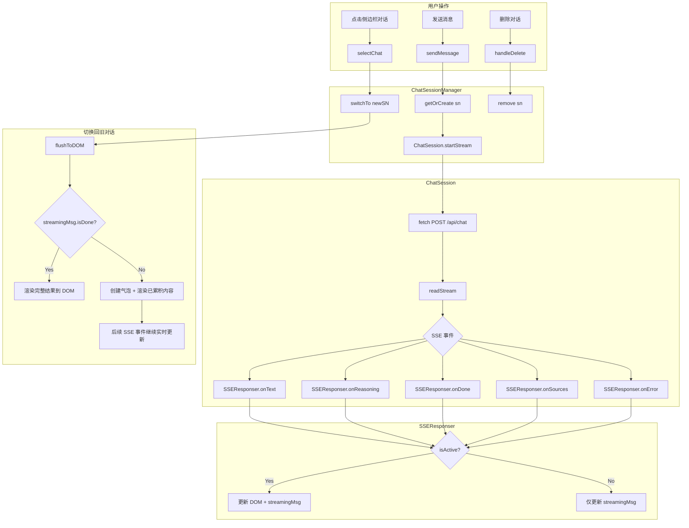

# 前端 SSEResponser 抽象层 + 多会话管理设计方案

## 1. 问题分析

### 1.1 当前架构（单例模式）

```
state (全局单例)
├── isStreaming: boolean
├── abortController: AbortController | null
├── accumulatedMarkdown: string
├── currentChatSN: string
├── messages: Array
└── ...

chat-sse.js
├── sendMessage()          ← 唯一入口
├── fetchStream()          ← 发起 fetch + 读取 SSE
├── readSSEBuffer()        ← 读取流
├── handleSSEEvent()       ← 事件分发
├── handleTextEvent()      ← 直接操作 DOM
├── handleDoneEvent()      ← 直接操作 DOM
└── ...
```

**核心问题**：页面上只有一个 SSE 连接，切换对话时只能 `abortController.abort()` 中断旧流。

### 1.2 目标架构（多会话模式）

```
ChatSessionManager
├── activeSessionSN: string          ← 当前活跃的对话 SN
├── sessions: Map<string, ChatSession>
│
└── ChatSession (每个对话一个)
    ├── sn: string
    ├── sseResponser: SSEResponser   ← 抽象层
    ├── abortController: AbortController
    ├── isStreaming: boolean
    ├── streamingMsg: {
    │     reasoning: string,
    │     content: string,
    │     webSources: Array,
    │     usage: object | null,
    │     msgId: number,
    │     createdAt: string | null,
    │     error: string | null,
    │     isDone: boolean,
    │   }
    ├── renderTimer: number | null
    └── readStream(response)         ← 独立的流读取循环
```

**核心能力**：切换对话时，旧对话的 SSE 连接继续在后台接收，数据存入 `streamingMsg`，不丢失。

---

## 2. 新增文件

### 2.1 `frontend/static/chat-session.js` — ChatSession 类

每个 ChatSession 实例代表一个对话的 SSE 生命周期。

```javascript
// chat-session.js — 对话级 SSE 会话管理

export class ChatSession {
    constructor(sn) {
        this.sn = sn;
        this.abortController = null;
        this.isStreaming = false;
        this.renderTimer = null;

        // 流式累积数据
        this.streamingMsg = {
            reasoning: '',
            content: '',
            webSources: [],
            usage: null,
            msgId: 0,
            createdAt: null,
            error: null,
            isDone: false,
        };

        // DOM 引用（由 UI 层设置，SSEResponser 通过它更新 DOM）
        this.assistantBubble = null;
        this.contentDiv = null;
    }

    /** 重置流式状态（新一次 SSE 开始前调用） */
    resetStreaming() {
        this.streamingMsg = {
            reasoning: '',
            content: '',
            webSources: [],
            usage: null,
            msgId: 0,
            createdAt: null,
            error: null,
            isDone: false,
        };
        this.renderTimer = null;
    }

    /** 清理渲染定时器 */
    clearRenderTimer() {
        if (this.renderTimer) {
            clearTimeout(this.renderTimer);
            this.renderTimer = null;
        }
    }
}
```

### 2.2 `frontend/static/chat-sse-responser.js` — SSEResponser 抽象层

对标后端的 [`SSEResponser`](infra/llm/sse_responser.go:3) 接口，每个 ChatSession 实例化一个。

```javascript
// chat-sse-responser.js — SSE 事件响应器抽象层
//
// 对标后端 infra/llm/sse_responser.go 的 SSEResponser 接口。
// 每个 ChatSession 拥有一个 SSEResponser 实例，负责将 SSE 事件
// 转化为对 streamingMsg 的累积 + DOM 更新。

import { renderMarkdown, enableCopyButtons } from './chat-markdown.js';
import { handleReasoningEvent, finalizeReasoningArea } from './chat-reasoning.js';
import { showSources, showTokenUsage, autoScrollToBottom, showError, restoreInputArea, showToast, throttleRender } from './chat-ui.js';
import { state } from './chat-state.js';

/**
 * SSEResponser — 每个 ChatSession 的 SSE 事件处理器
 *
 * 职责：
 *   1. 将 SSE 事件数据累积到 session.streamingMsg
 *   2. 更新关联的 DOM（assistantBubble）
 *
 * 当 session 是"活跃的"（activeSessionSN === session.sn）时，
 * DOM 更新立即生效；否则仅累积数据，不操作 DOM。
 */
export class SSEResponser {
    /**
     * @param {import('./chat-session.js').ChatSession} session
     */
    constructor(session) {
        this.session = session;
    }

    /** 判断当前 session 是否是活跃会话 */
    get isActive() {
        // 由 ChatSessionManager 在切换时更新
        return this.session._isActive;
    }

    // ---- 事件处理方法 ----

    onReasoning(event) {
        this.session.streamingMsg.reasoning += event.content || '';
        if (this.isActive && this.session.assistantBubble) {
            handleReasoningEvent(event, this.session.assistantBubble);
        }
    }

    onReasoningEnd() {
        if (this.isActive && this.session.assistantBubble) {
            finalizeReasoningArea(this.session.assistantBubble);
        }
    }

    onText(event) {
        this.session.streamingMsg.content += event.content || '';
        if (this.isActive && this.session.contentDiv) {
            // 累积 + 节流渲染（复用现有逻辑）
            const contentDiv = this.session.contentDiv;
            contentDiv.classList.add('streaming');
            throttleRender(this.session, contentDiv, () => this.session.streamingMsg.content);
        }
    }

    onSources(event) {
        if (event.sources) {
            this.session.streamingMsg.webSources.push(...(event.sources || []));
        }
        if (event.web_sources) {
            this.session.streamingMsg.webSources.push(...(event.web_sources || []));
        }
        if (this.isActive) {
            showSources(event.sources || event.web_sources || [], event.sources ? 'rag' : 'web');
        }
    }

    onDone(event) {
        const msg = this.session.streamingMsg;
        msg.isDone = true;
        msg.msgId = event.msg_id || 0;
        msg.createdAt = event.created_at || null;
        msg.usage = event.usage || null;

        if (this.isActive && this.session.assistantBubble) {
            this._applyDoneToDOM(event);
        }
    }

    onError(event) {
        this.session.streamingMsg.error = event.message || '未知错误';
        if (this.isActive && this.session.assistantBubble) {
            showError(this.session.assistantBubble, this.session.streamingMsg.error);
        }
    }

    /** 当 session 从非活跃变为活跃时，将累积的 streamingMsg 渲染到 DOM */
    flushToDOM() {
        const msg = this.session.streamingMsg;
        if (!msg.isDone) return; // 流未结束，不渲染

        // 如果还没有 assistantBubble，需要创建
        if (!this.session.assistantBubble) {
            // 由 ChatSessionManager 在切换时负责创建或获取
            return;
        }

        // 渲染 reasoning
        if (msg.reasoning) {
            const { restoreReasoningArea } = require('./chat-reasoning.js');
            restoreReasoningArea(this.session.assistantBubble, msg.reasoning);
        }

        // 渲染 content
        if (msg.content && this.session.contentDiv) {
            this.session.contentDiv.innerHTML = renderMarkdown(msg.content);
            this.session.contentDiv.classList.remove('streaming');
            enableCopyButtons(this.session.assistantBubble);
        }

        // 渲染 sources
        if (msg.webSources.length > 0) {
            showSources(msg.webSources, 'web');
        }

        // 渲染 usage
        if (msg.usage) {
            showTokenUsage(this.session.assistantBubble, msg.usage);
        }

        autoScrollToBottom();
    }

    /** 内部：将 done 事件应用到 DOM */
    _applyDoneToDOM(event) {
        const bubble = this.session.assistantBubble;
        const contentDiv = this.session.contentDiv;
        if (!contentDiv) return;

        // 1. 完成 reasoning
        finalizeReasoningArea(bubble);

        // 2. 最终渲染 content
        contentDiv.classList.remove('streaming');
        this.session.clearRenderTimer();
        contentDiv.innerHTML = renderMarkdown(this.session.streamingMsg.content);
        enableCopyButtons(bubble);

        // 3. 更新 msgId
        const msgId = event.msg_id || 0;
        if (msgId) {
            for (let i = state.messages.length - 1; i >= 0; i--) {
                if (state.messages[i].role === 'user' && state.messages[i].id === 0) {
                    state.messages[i].id = msgId;
                    break;
                }
            }
            const group = bubble.closest('.message-group');
            if (group) group.dataset.msgId = msgId;
        }

        // 4. 推入 messages
        state.messages.push({
            role: 'assistant',
            content: this.session.streamingMsg.content,
            id: msgId,
            usage: event.usage || null,
            created_at: event.created_at || null,
        });

        // 5. 显示时间
        if (event.created_at) {
            // ... 复用现有时间显示逻辑
        }

        // 6. 显示 token 用量
        if (event.usage) {
            showTokenUsage(bubble, event.usage);
        }

        // 7. 清理 + 滚动
        autoScrollToBottom();
        restoreInputArea();
        setTimeout(() => autoScrollToBottom(), 480);

        if (state.userScrolledUp) {
            setTimeout(() => showToast('AI 回复完毕', 'info'), 500);
        }
    }
}
```

### 2.3 `frontend/static/chat-session-manager.js` — 多会话管理器

```javascript
// chat-session-manager.js — 多会话管理器
//
// 管理所有对话的 ChatSession 实例。
// 切换对话时，旧对话的 SSE 连接继续在后台接收数据。

import { ChatSession } from './chat-session.js';
import { SSEResponser } from './chat-sse-responser.js';
import { state } from './chat-state.js';

class ChatSessionManager {
    constructor() {
        /** @type {Map<string, ChatSession>} */
        this.sessions = new Map();
        /** 当前活跃的对话 SN */
        this.activeSessionSN = null;
    }

    /**
     * 获取或创建指定 SN 的 ChatSession
     * @param {string} sn
     * @returns {ChatSession}
     */
    getOrCreate(sn) {
        if (!this.sessions.has(sn)) {
            const session = new ChatSession(sn);
            session.responser = new SSEResponser(session);
            this.sessions.set(sn, session);
        }
        return this.sessions.get(sn);
    }

    /**
     * 获取当前活跃的 ChatSession
     * @returns {ChatSession|null}
     */
    getActive() {
        return this.activeSessionSN ? this.sessions.get(this.activeSessionSN) || null : null;
    }

    /**
     * 切换活跃对话
     * @param {string} newSN - 目标对话 SN
     * @returns {ChatSession} 目标对话的 ChatSession
     */
    switchTo(newSN) {
        const prevSN = this.activeSessionSN;

        // 标记旧 session 为非活跃
        if (prevSN && this.sessions.has(prevSN)) {
            const prevSession = this.sessions.get(prevSN);
            prevSession._isActive = false;
            // 旧 session 的 assistantBubble 引用保留，但不再更新 DOM
        }

        // 标记新 session 为活跃
        this.activeSessionSN = newSN;
        const newSession = this.getOrCreate(newSN);
        newSession._isActive = true;

        // 如果新 session 有已完成的 streamingMsg，刷新到 DOM
        if (newSession.streamingMsg.isDone) {
            newSession.responser.flushToDOM();
        }

        return newSession;
    }

    /**
     * 移除指定 SN 的 ChatSession（对话被删除时调用）
     * @param {string} sn
     */
    remove(sn) {
        const session = this.sessions.get(sn);
        if (session) {
            // 如果有正在进行的 SSE 流，abort 它
            if (session.abortController) {
                session.abortController.abort();
            }
            this.sessions.delete(sn);
        }
        if (this.activeSessionSN === sn) {
            this.activeSessionSN = null;
        }
    }

    /**
     * 清理所有已完成的非活跃 session（释放内存）
     */
    cleanup() {
        for (const [sn, session] of this.sessions) {
            if (sn !== this.activeSessionSN && session.streamingMsg.isDone) {
                this.sessions.delete(sn);
            }
        }
    }
}

/** 全局单例 */
export const sessionManager = new ChatSessionManager();
```

---

## 3. 需要修改的现有文件

### 3.1 [`frontend/static/chat-state.js`](frontend/static/chat-state.js)

**变更**：移除全局流式状态，或标记为 deprecated。

| 字段 | 操作 | 说明 |
|------|------|------|
| `isStreaming` | 保留，但改为委托给 `sessionManager.getActive()?.isStreaming` | 兼容现有代码中大量对 `state.isStreaming` 的引用 |
| `abortController` | 移除 | 由 ChatSession 持有 |
| `accumulatedMarkdown` | 移除 | 由 ChatSession.streamingMsg.content 替代 |
| `renderTimer` | 移除 | 由 ChatSession.renderTimer 替代 |

**新增**：`state.sessionManager` 引用，供全局访问。

### 3.2 [`frontend/static/chat-sse.js`](frontend/static/chat-sse.js)

**最大变更文件**。重构 `sendMessage()` 和 SSE 读取流程。

| 函数 | 变更 |
|------|------|
| `sendMessage()` | 改为通过 `sessionManager.getOrCreate(sn)` 获取 ChatSession，调用 `session.startStream()` |
| `fetchStream()` | 改为 `ChatSession.startStream()` 方法 |
| `readSSEBuffer()` | 改为 `ChatSession.readStream()` 方法，事件分发委托给 `session.responser` |
| `handleSSEEvent()` | 移除，由 `SSEResponser` 替代 |
| `handleTextEvent()` | 移除，由 `SSEResponser.onText()` 替代 |
| `handleDoneEvent()` | 移除，由 `SSEResponser.onDone()` 替代 |
| `handleSourcesEvent()` | 移除，由 `SSEResponser.onSources()` 替代 |
| `handleReasoningEndEvent()` | 移除，由 `SSEResponser.onReasoningEnd()` 替代 |
| `prepareChat()` | 保留，但改为操作 ChatSession 而非全局 state |
| `cleanupAfterStream()` | 保留，但改为操作 ChatSession |
| `autoUpdateTitle()` | 保留 |
| `getCurrentChatIfNeeded()` | 保留 |

### 3.3 [`frontend/static/chat-list.js`](frontend/static/chat-list.js)

**变更**：`selectChat()` 函数。

```javascript
// 修改前：直接 abort + 清空
async function selectChat(sn) {
    // 如果有正在流式的对话，abort 它
    if (state.isStreaming && state.abortController) {
        state.abortController.abort();
    }
    // 清空消息状态...
    // 加载新对话...
}

// 修改后：通过 sessionManager 切换
async function selectChat(sn) {
    // 切换活跃 session（旧 session 继续后台接收）
    sessionManager.switchTo(sn);

    // 清空消息状态（DOM 层面）...
    // 加载新对话...
}
```

### 3.4 [`frontend/static/chat.js`](frontend/static/chat.js)

**变更**：初始化时创建 `sessionManager`。

```javascript
// 新增导入
import { sessionManager } from './chat-session-manager.js';

// 初始化后
state.sessionManager = sessionManager;
```

### 3.5 [`frontend/static/chat-restore.js`](frontend/static/chat-restore.js)

**变更**：恢复对话时，如果该对话有后台完成的 streamingMsg，优先使用。

```javascript
// restoreChat() 中，在加载历史消息之前：
const session = sessionManager.getOrCreate(data.current_chat_sn);
if (session.streamingMsg.isDone) {
    // 有后台完成的流式数据，渲染它
    // 然后继续加载历史消息
}
```

---

## 4. 切换对话时的完整流程

### 4.1 用户点击侧边栏另一个对话

```
1. selectChat(newSN) 被调用
2. sessionManager.switchTo(newSN)
   a. 旧 session._isActive = false
      → 旧 SSEResponser 不再更新 DOM，但继续接收数据到 streamingMsg
   b. 新 session._isActive = true
   c. 如果新 session.streamingMsg.isDone === true
      → 调用 flushToDOM() 将后台累积的数据渲染到界面
3. 清空 chatContainer 的 DOM（移除旧对话的消息）
4. 调用 switchChat(newSN) 加载新对话的历史消息
5. 渲染历史消息到 DOM
```

### 4.2 用户切回有后台流式数据的对话

```
1. selectChat(prevSN) 被调用
2. sessionManager.switchTo(prevSN)
   a. 当前活跃 session 标记为非活跃
   b. prevSN 的 session 标记为活跃
   c. 检查 prevSession.streamingMsg
      - 如果 isDone === true → flushToDOM() 渲染完整结果
      - 如果 isDone === false（流还在进行中）
        → 创建 assistantBubble，将已累积的 content/reasoning 渲染进去
        → 后续 SSE 事件继续实时更新 DOM
3. 加载历史消息（如果有）+ 合并 streamingMsg
```

### 4.3 用户删除一个正在后台流式的对话

```
1. handleDelete(chat) 被调用
2. sessionManager.remove(sn)
   a. 找到对应的 ChatSession
   b. abortController.abort() 中断 SSE 连接
   c. 从 sessions Map 中删除
3. 继续现有删除逻辑
```

---

## 5. 后端配合变更

### 5.1 后端需要支持"同一用户多个并发 SSE 连接"

当前后端 [`OnNewMessage`](internal/agent/on_chat.go:172) 中，每个请求创建一个新的 SSE writer。这本身是支持并发的——因为每个 HTTP 请求独立。

但需要注意 session 锁的问题：

```go
// on_chat.go 中 callLLMWithPipeline 的注释：
// NOTE: session.mu is NOT held during streaming, allowing other handlers
// (e.g., OnSwitchChat) to proceed concurrently.
```

这意味着后端**已经支持**在流式输出期间切换对话。前端只需要不 abort 连接即可。

### 5.2 潜在问题：消息顺序

如果用户同时在两个对话中发送消息，后端需要正确处理消息的持久化顺序。但这是后端已有的能力——每个对话的 SN 不同，消息按 `GroupIndex` 排序。

---

## 6. 边界情况处理

### 6.1 页面刷新

页面刷新时，所有 ChatSession 丢失。`restoreChat()` 从后端加载当前对话的历史消息。如果有后台完成的流式数据，它们已经由后端持久化到 DB，刷新后自然可见。

### 6.2 内存管理

后台 session 的 `streamingMsg` 可能占用内存（尤其是长对话的 content）。策略：
- 流完成后（`isDone === true`），如果 session 不是活跃的，保留引用但不再增长
- `cleanup()` 方法定期清理已完成的非活跃 session
- 最大保留 5 个非活跃 session（LRU 策略）

### 6.3 网络断开

如果用户切换对话后，旧对话的 SSE 连接因网络问题断开：
- `readStream()` 中的 `reader.read()` 会 reject
- `handleStreamError()` 被调用，标记 `streamingMsg.error`
- 用户切回该对话时，`flushToDOM()` 检查到 error，显示错误提示

### 6.4 同一对话的重复 SSE 连接

防止用户在同一个对话中快速点击发送多次：
- `sendMessage()` 中检查 `session.isStreaming`，如果为 true 则忽略
- 这通过 `state.isStreaming` 的全局检查已经实现

---

## 7. 实施步骤

### 第 1 步：创建新文件

1. 创建 [`frontend/static/chat-session.js`](frontend/static/chat-session.js) — `ChatSession` 类
2. 创建 [`frontend/static/chat-sse-responser.js`](frontend/static/chat-sse-responser.js) — `SSEResponser` 类
3. 创建 [`frontend/static/chat-session-manager.js`](frontend/static/chat-session-manager.js) — `ChatSessionManager` + 全局单例

### 第 2 步：修改 chat-state.js

- 移除 `abortController`、`accumulatedMarkdown`、`renderTimer`
- 添加 `state.sessionManager` 引用
- `isStreaming` 改为 getter 委托给 sessionManager

### 第 3 步：重构 chat-sse.js

- 将 `fetchStream()` + `readSSEBuffer()` 迁移到 `ChatSession` 的方法
- 将 `handleSSEEvent()` 及所有子处理函数迁移到 `SSEResponser`
- `sendMessage()` 改为通过 `sessionManager` 操作

### 第 4 步：修改 chat-list.js

- `selectChat()` 中调用 `sessionManager.switchTo()` 替代直接 abort

### 第 5 步：修改 chat.js

- 导入并初始化 `sessionManager`

### 第 6 步：修改 chat-restore.js

- 恢复对话时检查 session 的 streamingMsg

### 第 7 步：测试

- 测试：发送消息 → 切换对话 → 切回 → 流式数据完整
- 测试：发送消息 → 切换对话 → 等待流完成 → 切回 → 数据完整
- 测试：删除正在后台流式的对话
- 测试：页面刷新后数据正确恢复
- 测试：内存泄漏（长时间运行后检查 session 数量）

---

## 8. 架构图



---

## 9. 与后端 SSEResponser 的对应关系

| 后端 `SSEResponser` | 前端 `SSEResponser` | SSE Event `type` |
|---|---|---|
| `OnReasoning(string)` | `onReasoning(event)` | `reasoning` |
| `OnToolReasoning(...)` | `onReasoning(event)` (含 subject/tool) | `reasoning` |
| `OnReasoningEnd()` | `onReasoningEnd()` | `reasoning_end` |
| `OnText(string)` | `onText(event)` | `text` |
| `OnError(error)` | `onError(event)` | `error` |
| (后端通过 SSEEvent 发送) | `onSources(event)` | `sources` |
| (后端通过 SSEEvent 发送) | `onDone(event)` | `done` |

---

## 10. 风险与注意事项

1. **并发 SSE 连接数**：如果用户快速切换多个对话，每个对话都会有一个持久的 SSE 连接。浏览器对同一域名的并发连接数有限制（通常 6 个）。建议限制后台 session 数量（最多 3 个非活跃 session 保持连接）。

2. **后端资源**：每个 SSE 连接占用一个 goroutine。如果用户打开多个对话的流，后端需要处理多个并发的 LLM 调用。这可能需要后端增加并发控制（如限制每个用户的最大并发 LLM 调用数）。

3. **消息 ID 冲突**：`handleDoneEvent` 中更新 `state.messages` 的逻辑假设消息是按顺序到达的。多会话场景下，不同对话的消息独立管理，不会冲突。

4. **DOM 引用失效**：当用户切换对话时，旧对话的 `assistantBubble` DOM 元素可能被移除（`chatContainer.innerHTML = ''`）。`SSEResponser` 在 `isActive === false` 时不操作 DOM，因此不会出错。但切回时需要重新创建气泡。
