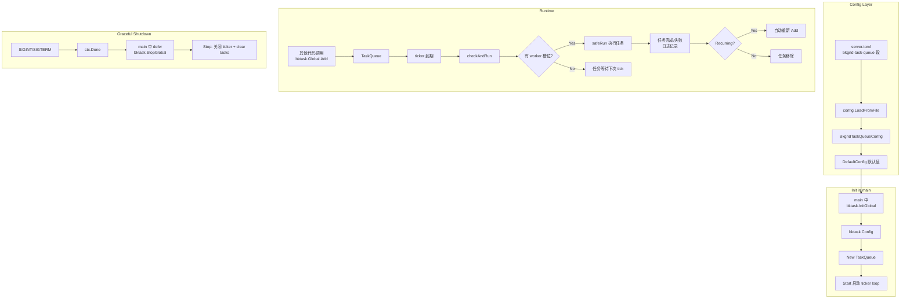

# 全局慢任务队列计划

## 概述

在 `infra/bktask/` 中已存在一个定时后台任务队列（`TaskQueue`），但：
- 尚未在任何实际代码中使用
- 没有 Config 配置结构体
- 没有全局单例入口
- 没有工作池（worker pool）限制并发数

本计划的目标是：添加 **Config → 全局单例 → main 初始化** 的一整套链路。

---

## 1. Config —— `internal/config/config.go`

参考现有配置模式（如 `SessionGCConfig`），在 [`Config`](internal/config/config.go:62) 中新增字段：

```go
// BkgndTaskQueueConfig 配置全局后台慢任务队列。
type BkgndTaskQueueConfig struct {
    // Enabled 是否启用后台任务队列。默认 true。
    Enabled bool `toml:"enabled"`

    // CheckIntervalSeconds 检查到期任务的间隔（秒）。默认 30。
    CheckIntervalSeconds int `toml:"check_interval_seconds"`

    // WorkerCount 最大并发执行的任务数。默认 3。
    WorkerCount int `toml:"worker_count"`

    // QueueSize 排队任务的最大数量。默认 100。
    QueueSize int `toml:"queue_size"`
}
```

在 `DefaultConfig()` 中设置默认值：
```go
BkgndTaskQueue: BkgndTaskQueueConfig{
    Enabled:              true,
    CheckIntervalSeconds: 30,
    WorkerCount:          3,
    QueueSize:            100,
},
```

在 [`Config`](internal/config/config.go:62) 结构体中添加字段：
```go
BkgndTaskQueue BkgndTaskQueueConfig `toml:"bkgnd-task-queue"`
```

---

## 2. 增强 `infra/bktask/bktask.go`

### 2.1 添加全局单例

遵循项目中 `theApiKeysPool` / `InitApiKeysPool` 的模式：

```go
// 包级变量
var globalQueue *TaskQueue

// InitGlobal 使用配置初始化全局队列。
// 必须在 main 中调用，且只调用一次。
func InitGlobal(cfg Config, logger Logger) {
    if globalQueue != nil {
        return // 已初始化
    }
    globalQueue = New(cfg, logger)
    globalQueue.Start()
}

// Global 返回全局队列实例。
func Global() *TaskQueue {
    return globalQueue
}
```

### 2.2 添加 Config 结构体

```go
// Config 是 TaskQueue 的配置。
type Config struct {
    // CheckInterval 检查到期任务的时间间隔。
    CheckInterval time.Duration

    // WorkerCount 最大并发执行的任务数。0 或负数表示不限制。
    WorkerCount int

    // QueueSize 排队任务的最大数量。
    QueueSize int
}
```

### 2.3 修改 New() 接受 Config

```go
func New(cfg Config, logger Logger) *TaskQueue {
    checkInterval := cfg.CheckInterval
    if checkInterval <= 0 {
        checkInterval = 10 * time.Minute
    }
    // ...
}
```

### 2.4 添加 Semaphore-based Worker Pool

在 `safeRun` 中增加并发控制——使用带缓冲 channel 作为信号量：

```go
type TaskQueue struct {
    // ... 原有字段 ...
    semaphore chan struct{} // 控制并发数，nil = 不限制
}

func (q *TaskQueue) safeRun(entry *taskEntry) {
    // 如果设置了信号量，先获取一个槽位
    if q.semaphore != nil {
        q.semaphore <- struct{}{}
        defer func() { <-q.semaphore }()
    }
    // ... 原有逻辑 ...
}
```

### 2.5 添加 StopGlobal 用于优雅关闭

```go
// StopGlobal 停止全局队列。
func StopGlobal() {
    if globalQueue != nil {
        globalQueue.Stop()
        globalQueue = nil
    }
}
```

---

## 3. `cmd/server/main.go` 初始化

在 [`main()`](cmd/server/main.go:33) 中的初始化流程中，选择一个合适的位置（比如在 `InitAgent` 之后、`captchaProvider` 之后），添加：

```go
// ============================================================
// 初始化全局后台慢任务队列
// ============================================================
if cfg.BkgndTaskQueue.Enabled {
    bktaskCfg := bktask.Config{
        CheckInterval: time.Duration(cfg.BkgndTaskQueue.CheckIntervalSeconds) * time.Second,
        WorkerCount:   cfg.BkgndTaskQueue.WorkerCount,
        QueueSize:     cfg.BkgndTaskQueue.QueueSize,
    }
    bktask.InitGlobal(bktaskCfg, theLogger)
    defer bktask.StopGlobal()
    theLogger.Infof("background task queue initialized (checkInterval=%ds, workers=%d, queueSize=%d)",
        cfg.BkgndTaskQueue.CheckIntervalSeconds, cfg.BkgndTaskQueue.WorkerCount, cfg.BkgndTaskQueue.QueueSize)
}
```

---

## 4. TOML 配置示例（`bin.template/settings_template/server.template.toml`）

在 [`server.template.toml`](bin.template/settings_template/server.template.toml) 末尾 `[session-gc]` 节之后添加：

```toml
# ============================================================
# 后台慢任务队列（可选）
# 用于处理非实时、耗时较长的后台任务，如标签生成、特征提取等。
# 队列以固定间隔检查到期任务，并限制最大并发数以避免资源耗尽。
# 如果未配置此节，使用 DefaultConfig() 中的内置默认值。
# ============================================================
[bkgnd-task-queue]
# 是否启用后台任务队列
enabled = true
# 检查到期任务的时间间隔（秒）
check_interval_seconds = 30
# 最大并发执行的任务数
worker_count = 3
# 排队任务的最大数量
queue_size = 100
```

---

## 5. 接口汇总

| 函数/类型 | 所在文件 | 说明 |
|---|---|---|
| [`BkgndTaskQueueConfig`](internal/config/config.go) | `internal/config/config.go` | 配置结构体 |
| [`Config.BkgndTaskQueue`](internal/config/config.go:62) | `internal/config/config.go` | 嵌入顶级 Config |
| [`bktask.Config`](infra/bktask/bktask.go) | `infra/bktask/bktask.go` | 运行时配置 |
| [`bktask.InitGlobal(cfg, logger)`](infra/bktask/bktask.go) | `infra/bktask/bktask.go` | 初始化全局单例 |
| [`bktask.Global()`](infra/bktask/bktask.go) | `infra/bktask/bktask.go` | 获取全局队列 |
| [`bktask.StopGlobal()`](infra/bktask/bktask.go) | `infra/bktask/bktask.go` | 优雅关闭 |
| main 初始化 | [`cmd/server/main.go`](cmd/server/main.go:33) | 配置→初始化→defer 关闭 |

---

## 6. 架构图



---

## 执行顺序

1. **`internal/config/config.go`** — 添加 `BkgndTaskQueueConfig` 结构体 + 嵌入 `Config` + `DefaultConfig` 默认值
2. **`infra/bktask/bktask.go`** — 添加 `Config` 结构体 + 修改 `New` 签名 + 添加 worker pool semaphore + 全局单例函数
3. **`cmd/server/main.go`** — 在 main 中初始化全局队列
4. **`bin.template/settings_template/server.template.toml`** — 在模板配置中添加 `[bkgnd-task-queue]` 节
