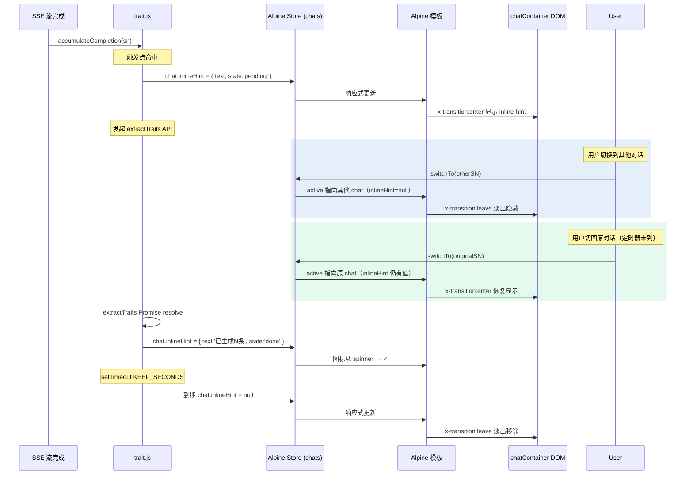

# InlineHint 在切换/新建对话时的残留问题分析与修复方案（最终版）

## 问题确认

**结论：该问题确实存在。**

当用户在当前对话的 SSE 流完成后，触发了 [`accumulateCompletion(sn)`](../frontend/static/trait.js:101)，InlineHint 通过 `container.appendChild(this.el)` 手动追加到 [`#chatContainer`](../frontend/index.html:564)。由于该元素**不属于 Alpine `x-for` 的管理范围**，当用户切换对话或新建对话时，InlineHint 不会自动消失。

---

## 修复方案：Alpine-ify（将 InlineHint 完全 Alpine 化）

为每个 [`ChatData`](../frontend/static/alpine-store.js:301-323) 对象添加一个 `inlineHint` 字段，在 HTML 模板中用 Alpine 渲染，利用 Alpine 的响应式系统自动处理显示/隐藏。

### 核心设计

```javascript
/**
 * ChatData.inlineHint 数据模型
 *
 * null                                    → 隐藏
 * { text: string,                         → 显示文本
 *   state: 'pending' | 'done' | 'fail' }  → 控制图标
 *
 * keepSeconds 由业务调用方（trait.js）控制，不放 Alpine store。
 */
```

**关键决策：**
- 路线 A：`null` = 隐藏，对象 = 显示 ✅
- 显示时长：`trait.js` 中用局部变量控制（当前默认 `KEEP_SECONDS = 10`），不入侵数据模型
- 恢复显示：切换回原对话时，因 `inlineHint` 是 per-chat 字段，会自动恢复（免费能力），保留
- 动画：Alpine `x-transition` 简化淡入淡出，不做高度锁定收缩

### 修改清单

#### 1. [`alpine-store.js`](../frontend/static/alpine-store.js) — 为 ChatData 添加 `inlineHint` 字段

**① `resetToBlank()` 的 `blankItem`**（第 375 行）——添加 `inlineHint: null`

**② `getOrCreate()` 的 ChatData 创建**（第 935 行）——添加 `inlineHint: null`

#### 2. [`chat.js`](../frontend/static/chat.js) — `startNewChat()` 的 `blankItem`

**③ `startNewChat()` 的 blankItem 创建**（第 187 行）——添加 `inlineHint: null`

#### 3. [`index.html`](../frontend/index.html) — 在 x-for 模板之后添加 Alpine-ified InlineHint

在 `</template>` 之后、`</main>` 之前（第 680-681 行之间）插入：

```html
<!-- 行内提示（Alpine 响应式驱动，位于消息组列表底部）
     由 trait.js 通过设置 $store.chats.active.inlineHint 控制显示 -->
<div class="inline-hint" 
     x-show="$store.chats.active?.inlineHint"
     x-transition:enter="inline-hint-enter"
     x-transition:enter-start="inline-hint-enter-start"
     x-transition:enter-end="inline-hint-enter-end"
     x-transition:leave="inline-hint-leave"
     x-transition:leave-start="inline-hint-leave-start"
     x-transition:leave-end="inline-hint-leave-end">
    <!-- 旋转进度圈（仅 pending 状态） -->
    <span class="inline-hint__spinner" 
          x-show="$store.chats.active?.inlineHint?.state === 'pending'"></span>
    <!-- 成功图标（仅 done 状态） -->
    <span class="inline-hint__icon inline-hint__icon--success" 
          x-show="$store.chats.active?.inlineHint?.state === 'done'">✓</span>
    <!-- 失败图标（仅 fail 状态） -->
    <span class="inline-hint__icon inline-hint__icon--error" 
          x-show="$store.chats.active?.inlineHint?.state === 'fail'">✗</span>
    <!-- 提示文字 -->
    <span class="inline-hint__text" 
          x-text="$store.chats.active?.inlineHint?.text || ''"></span>
</div>
```

#### 4. [`inline-hint.css`](../frontend/static/components/inline-hint.css) — 适配 Alpine 动画

移除 `animation: inline-hint-fade-in`（由 Alpine `x-transition` 接管），添加 `x-transition` 对应的 CSS 类：

```css
/* 移除：animation: inline-hint-fade-in 0.25s ease; */
.inline-hint {
    display: flex;
    align-items: center;
    gap: 8px;
    padding: 8px 16px;
    font-size: 0.82rem;
    line-height: 1.4;
    color: var(--text-secondary);
}

/* 新增：Alpine x-transition 类名 */
.inline-hint-enter {
    transition: opacity 0.25s ease, transform 0.25s ease;
}
.inline-hint-enter-start {
    opacity: 0;
    transform: translateY(-4px);
}
.inline-hint-enter-end {
    opacity: 1;
    transform: translateY(0);
}
.inline-hint-leave {
    transition: opacity 0.3s ease;
}
.inline-hint-leave-start {
    opacity: 1;
}
.inline-hint-leave-end {
    opacity: 0;
}

/* 移除：.inline-hint--fade-out 相关样式（不再需要） */
```

同时移除不再需要的 `@keyframes inline-hint-fade-in`。

#### 5. [`trait.js`](../frontend/static/trait.js) — 核心重构

将原本的 `new InlineHint(container, ...)` → `hint.show()` / `hint.done()` / `hint.fail()` 模式，改为直接操作 Alpine store 的 `inlineHint` 字段：

```javascript
// ---- 新增：自动清除时长常量 ----
var KEEP_SECONDS = 10;

// 在 accumulateCompletion 中：
export function accumulateCompletion(sn) {
    if (!sn) return;
    // ... 计数器逻辑不变 ...

    if (isTriggerPoint(c.count) && !c._extracting) {
        c._extracting = true;

        // 1. 随机取一条提示文本
        var texts = TRAIT_HINT_TEXTS;
        var idx = Math.floor(Math.random() * texts.length);
        var hintText = texts[idx];

        // 2. 通过 Alpine store 设置 inlineHint（触发响应式渲染）
        try {
            var chats = window.Alpine.store('chats');
            var chat = chats.getOrCreate(sn);
            chat.inlineHint = { text: hintText, state: 'pending' };
        } catch(e) {}

        // 3. 发起提取请求（不变）
        extractTraits(sn).then(function(data) {
            if (!data) {
                try {
                    var chats = window.Alpine.store('chats');
                    var chat = chats.getOrCreate(sn);
                    chat.inlineHint = { text: '提取个人特征失败', state: 'fail' };
                    setTimeout(function() {
                        if (chat.inlineHint?.state === 'fail') {
                            chat.inlineHint = null;
                        }
                    }, KEEP_SECONDS * 1000);
                } catch(e) {}
                clearExtractingLock(sn);
                return;
            }

            // 更新侧边栏数据（不变）...

            var featureCount = data.extracted_count || 0;
            try {
                var chats = window.Alpine.store('chats');
                var chat = chats.getOrCreate(sn);
                var successText = '已生成' + featureCount + '条特征';
                chat.inlineHint = { text: successText, state: 'done' };
                setTimeout(function() {
                    if (chat.inlineHint?.state === 'done') {
                        chat.inlineHint = null;
                    }
                }, KEEP_SECONDS * 1000);
            } catch(e) {}

            clearExtractingLock(sn);
        });
    }
}

// ---- 移除：不再需要 InlineHint 导入 ----
// 移除：import { InlineHint } from './components/inline-hint.js';
// 移除：var container = getChatContainer();
// 移除：var hint = new InlineHint(...)
// 移除：getChatContainer() 函数
```

### 行为变化

| 场景 | 当前（有 Bug） | 修复后（Alpine 化） |
|------|---------------|-------------------|
| 触发提取，显示提示 | `hint = new InlineHint(container)` + `hint.show()` — 手动追加 DOM | `chat.inlineHint = { text, state: 'pending' }` — Alpine 响应式渲染 |
| 提取成功 | `hint.done(count)` | `chat.inlineHint = { text: '已生成N条', state: 'done' }` + setTimeout 置 null |
| 提取失败 | `hint.fail(msg)` | `chat.inlineHint = { text: msg, state: 'fail' }` + setTimeout 置 null |
| 用户切换对话 | InlineHint **残留** | Alpine 自动隐藏（新 chat 的 `inlineHint` 为 null） |
| 用户新建对话 | InlineHint **残留** | `blankItem.inlineHint` 为 null → 自动隐藏 |
| 切回原对话（定时器未到） | N/A | 原 chat 的 `inlineHint` 还在 → **自动恢复显示** |
| 自动清除（10 秒后） | `hint.remove()` 动画移除 | `chat.inlineHint = null` → Alpine 淡出 |

### 流程图



### 影响范围

| 文件 | 变更 | 说明 |
|------|------|------|
| `alpine-store.js` | +2 行 | `blankItem` 和 `getOrCreate` 各加一行 `inlineHint: null` |
| `chat.js` | +1 行 | `startNewChat()` 的 `blankItem` 加一行 `inlineHint: null` |
| `index.html` | +~20 行 | x-for 模板后添加 Alpine-ified inline-hint 元素 |
| `inline-hint.css` | 修改 | 移除 `animation` 和 `--fade-out` 规则，添加 `x-transition` 类 |
| `trait.js` | 重构 | 从 `new InlineHint()` + DOM 操作改为设置 `chat.inlineHint` |
| `inline-hint.js` | 不再被引用 | 可保留或移除，不影响功能 |
