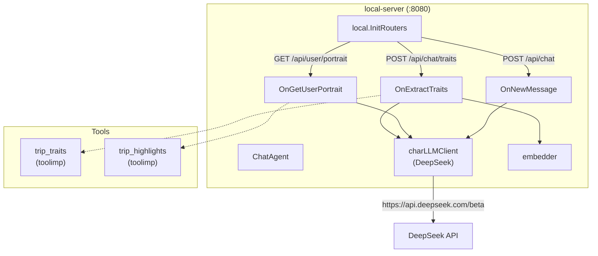

# 合并 remote-server 功能到 local-server 计划

## 1. 背景分析

### 当前架构

```
┌─────────────────────────────────────────────────────────────────────┐
│                         local-server (:8080)                        │
│                                                                     │
│  /api/chat/traits  ──→  OnExtractTraits()                          │
│                            │                                        │
│                            │ HTTP POST /api/traits                  │
│                            ▼                                        │
│  /api/user/portrait ──→  OnGetUserPortrait()                       │
│                            │                                        │
│                            │ HTTP POST /api/portrait (streaming)    │
│                            ▼                                        │
│  /api/chat          ──→  OnNewMessage() ──→ charLLMClient (已有)   │
└─────────────────────────────────────────────────────────────────────┘
         │                                    │
         │                                    │
         ▼                                    ▼
┌─────────────────────────────────────────────────────────────────────┐
│                       remote-server (:8088)                         │
│                                                                     │
│  POST /api/traits    ──→  OnTripTraits()  ──→ DeepSeek API         │
│  POST /api/portrait  ──→  OnTripPortrait() ──→ DeepSeek API (SSE)  │
└─────────────────────────────────────────────────────────────────────┘
```

### 核心发现

1. **local-server 已有 `charLLMClient`**（DeepSeek 客户端），在 [`ChatAgent`](internal/local/agent/on_chat.go:254) 中，已在聊天功能中直接使用。
2. **remote-server 的工具实现是纯逻辑** - [`trip_traits.go`](internal/remote/agent/toolimp/trip_traits.go) 和 [`trip_highlights.go`](internal/remote/agent/toolimp/trip_highlights.go) 只依赖 `infra/llm` 和 `infra/i18n`，无 remote-server 特有依赖，可移植。
3. **i18n 加载机制** - [`i18n.Init("lang/local")`](cmd/server/main.go:110) 递归加载 `lang/local/` 下所有 `.toml` 文件。remote 的 system prompt 和工具翻译文件需要移到 `lang/local/` 下。
4. **Portrait 的 SSE 格式与 Chat 不同** - portrait 使用 `{"event":"text", "data":"..."}` 格式，chat 使用 `{"type":"text", "content":"..."}` 格式，需要独立实现。

## 2. 合并方案

### 目标架构

```
┌─────────────────────────────────────────────────────────────────────────┐
│                           local-server (:8080)                          │
│                                                                         │
│  /api/chat/traits   ──→  OnExtractTraits()  ──→ charLLMClient (直接)    │
│  /api/user/portrait ──→  OnGetUserPortrait() ──→ charLLMClient (直接SSE)│
│  /api/chat          ──→  OnNewMessage()      ──→ charLLMClient          │
└─────────────────────────────────────────────────────────────────────────┘
```

remote-server 保留，但不再被 local-server 依赖，可作为独立部署选项保留。

### 2.1 文件迁移清单

#### 需要新建/拷贝的文件

| # | 源文件 | 目标文件 | 说明 |
|---|--------|----------|------|
| 1 | [`internal/remote/agent/toolimp/trip_traits.go`](internal/remote/agent/toolimp/trip_traits.go) | [`internal/local/agent/toolimp/trip_traits.go`](internal/local/agent/toolimp/) | 拷贝，保持包名一致 (`toolimp`) |
| 2 | [`internal/remote/agent/toolimp/trip_highlights.go`](internal/remote/agent/toolimp/trip_highlights.go) | [`internal/local/agent/toolimp/trip_highlights.go`](internal/local/agent/toolimp/) | 拷贝，保持包名一致 |
| 3 | [`lang/remote/zh-CN/tools/trip_traits.toml`](lang/remote/zh-CN/tools/trip_traits.toml) | [`lang/local/zh-CN/tools/trip_traits.toml`](lang/local/zh-CN/tools/) | 拷贝到 local 语言目录 |
| 4 | [`lang/remote/zh-CN/tools/trip_highlights.toml`](lang/remote/zh-CN/tools/trip_highlights.toml) | [`lang/local/zh-CN/tools/trip_highlights.toml`](lang/local/zh-CN/tools/) | 拷贝到 local 语言目录 |

#### 需要修改的文件

| # | 文件 | 修改内容 |
|---|------|----------|
| 5 | [`internal/local/agent/on_traits.go`](internal/local/agent/on_traits.go) | 重写 `OnExtractTraits` 和 `callTraitsRemote`，移除 HTTP 调用，改为直接使用 `h.charLLMClient` |
| 6 | [`internal/local/agent/on_portrait.go`](internal/local/agent/on_portrait.go) | 重写 `OnGetUserPortrait` 和 `callPortraitRemote`，移除 HTTP 代理，改为直接使用 `h.charLLMClient` 流式调用 |
| 7 | [`internal/local/routers.go`](internal/local/routers.go) | 路由不变，handler 方法名不变 |
| 8 | [`infra/i18n/tlfile.go`](infra/i18n/tlfile.go) | 全局 `Tools` 变量中 `trip_traits` 和 `trip_highlights` 已注册，无需修改 |

#### 可以考虑清理的文件（可选）

| # | 文件 | 说明 |
|---|------|------|
| 9 | [`internal/remote/agent/on_traits.go`](internal/remote/agent/on_traits.go) | 保留，remote-server 仍可独立运行 |
| 10 | [`internal/remote/agent/on_portrait.go`](internal/remote/agent/on_portrait.go) | 保留，remote-server 仍可独立运行 |

### 2.2 需要新增的 i18n 翻译项

local 的 [`lang/local/zh-CN.toml`](lang/local/zh-CN.toml) 中需要新增以下 portrait 相关的错误消息（当前 `on_portrait.go` 中引用了但可能不存在）：

```
[api_error_portrait_service_unavailable]
other = "画像服务暂时不可用：{{.Error}}"

[portrait_hot_tags_prefix]
other = "你的话题最热门领域是："

[trait_cat_1]
other = "人口学特征"
...（其他 category 翻译）
[trait_cat_desc_1]
other = "用户的自然属性或社会属性"
...（其他 category 描述）

[trait_halflife_1]
other = "短期"
...（其他 halflife 翻译）

[trait_confidence_high]
other = "高置信度"
...
```

实际上，这些翻译在 [`lang/local/zh-CN.toml`](lang/local/zh-CN.toml) 中**已存在部分**（如 `api_error_portrait_service_unavailable`）。需要检查并补充缺失的 portrait 相关翻译。

**关键发现**: `remote/agent/on_portrait.go` 中的 `formatTraitItems()`, `confidenceLevelKey()`, `formatChatTitles()` 这些辅助函数，以及 `portraitTraitItem.ToString()` 方法，都需要被迁移或重现在 local-server 中。

## 3. 详细实施步骤

### Step 1: 拷贝工具实现文件

将 `internal/remote/agent/toolimp/trip_traits.go` 和 `trip_highlights.go` 拷贝到 `internal/local/agent/toolimp/` 目录。

这两个文件：
- 包名为 `toolimp`，与 local 的 toolimp 包一致
- 导入路径为 `BrainForever/infra/llm` 和 `BrainForever/infra/i18n`，已存在于 local 的 go.mod 中
- 无需修改代码

### Step 2: 拷贝 i18n 翻译文件

将 `lang/remote/zh-CN/tools/trip_traits.toml` 和 `lang/remote/zh-CN/tools/trip_highlights.toml` 拷贝到 `lang/local/zh-CN/tools/` 目录。

i18n 系统在 `Init("lang/local")` 时会递归加载所有 `.toml` 文件，包括子目录中的文件。文件路径决定了语言标签（`zh-CN` 目录 → 语言 `zh-CN`），文件名作为 message ID 前缀（`trip_traits-XXX`, `trip_highlights-XXX`）。

### Step 3: 补充 local 的 system_prompt 翻译

将 `lang/remote/zh-CN/system_prompt.toml` 中的以下 section 复制到 `lang/local/zh-CN/system_prompt.toml`（新建）：

- `[trip_trait]` - trait 提取的 system prompt
- `[portrait]` - 画像生成的 system prompt
- `[portrait_user_prompt]` - 画像生成的 user prompt
- `[highlights]` - 画像元数据提取的 system prompt

这些内容会通过 `i18n.SystemPrompt.TL(lang, "trip_trait", ...)` 访问，key 模式为 `system_prompt-trip_trait`。

### Step 4: 补充 local 翻译文件中 portrait 所需的 i18n key

检查 [`lang/local/zh-CN.toml`](lang/local/zh-CN.toml) 并补充以下 key（如缺失）：

- `trait_cat_1` ~ `trait_cat_14`（类别名称）
- `trait_cat_desc_1` ~ `trait_cat_desc_14`（类别描述）
- `trait_halflife_1` ~ `trait_halflife_4`（半衰期名称）
- `trait_halflife_desc_1` ~ `trait_halflife_desc_4`（半衰期描述）
- `trait_confidence_high` / `trait_confidence_medium` / `trait_confidence_low`
- `trait_item_format`（单个 trait 的格式化模板）
- `chat_titles_header`（标题列表头部）
- `chat_title_item_format`（标题格式化模板）

### Step 5: 重写 `on_traits.go`

**核心变更**：将 `OnExtractTraits()` 中的 HTTP 调用替换为直接 LLM 调用。

当前流程：
```
OnExtractTraits → 读DB消息 → callTraitsRemote(HTTP) → 解析响应 → storeTraitsInSession
```

新流程：
```
OnExtractTraits → 读DB消息 → buildLLMMessages → charLLMClient.ChatWithOptions() → 解析ToolCall → storeTraitsInSession
```

需要移除：
- `callTraitsRemote()` 函数（整个删除）
- `traitsRemoteRequest`、`traitsRemoteResponse` 结构体
- HTTP 相关的导入 (`net/http` 保留因 handler 需要)

需要新增/调整：
- 使用 `h.charLLMClient`（类型 `llm.Client`）直接调用
- 构建 `llm.ChatCompletionRequest`，包含 system prompt（通过 `i18n.SystemPrompt.TL`）、工具定义（`toolimp.TripTraitsTool`）
- 使用 `ForceToolChoice` 强制调用 `trip_traits` 工具
- 解析 response 中的 `ToolCalls`，提取 `TripTraitsParams`
- 保持后续的 embedding + 存储逻辑不变

**注意事项**：
- local-server 目前没有 `getTraitSystemPrompt()` 函数，需要在 local 的 `on_traits.go` 中添加（或直接使用 `i18n.SystemPrompt.TL`）
- 需要从 `lang/remote/zh-CN/system_prompt.toml` 中获取 `trip_trait` 的 system prompt 内容，已迁移到 Step 3

### Step 6: 重写 `on_portrait.go`

**核心变更**：将 HTTP 代理模式替换为直接 LLM 流式调用。

当前流程：
```
OnGetUserPortrait → 读DB traits → callPortraitRemote(HTTP SSE) → 代理SSE流
```

新流程：
```
OnGetUserPortrait → 读DB traits → buildLLMMessages → charLLMClient.ChatStreamWithOptions() → 直接SSE流
└── 流完成后 → 第二步LLM调用提取highlights (非流式, ForceToolChoice)
```

需要移除：
- `callPortraitRemote()` 函数
- `portraitRemoteRequest` 结构体
- HTTP 客户端相关代码

需要新增/调整：
- 使用 `h.charLLMClient` 直接流式调用
- 构建 system prompt + user prompt（使用 `i18n.SystemPrompt.TL`）
- 流式读取 `ChatCompletionChunkDecoder`，转发为 SSE 事件
- 流完成后，进行第二次 LLM 调用（非流式）提取 highlights
- 使用 `toolimp.TripHighlightsTool` 解析 highlights

**关键问题**：portrait 与 chat 的 SSE 格式不同。
- Portrait SSE（当前 `remote/agent/pipeline.go` 风格）：`{"event":"text", "data":"..."}`
- Chat SSE（当前 local 风格）：`{"type":"text", "content":"..."}`

需要确认前端期望的 portrait SSE 格式。从 [`on_portrait.go`](internal/local/agent/on_portrait.go:188-215) 的当前代码看，local-server 已经按 `{"event":"info", "data":...}` 的格式发送 info 事件，然后代理 remote 的 SSE 流。所以 portait 的 SSE 格式与 remote-server 一致。

**解决方案**：在 local-server 中直接实现 portrait SSE 格式，使用 `sse.Writer` 写入 `{"event":"...", "data":"..."}` 格式的事件。

需要保留的辅助函数（从 remote 迁移）：
- `portraitTraitItem.ToString()` - 格式化单个 trait
- `formatTraitItems()` - 格式化所有 traits
- `formatChatTitles()` - 格式化聊天标题
- `confidenceLevelKey()` - 置信度级别
- `extractPortraitHighlights()` - 提取 highlights
- `sendPortraitSSE()` - 发送 SSE 事件
- `PortraitHighlights` 结构体

这些函数原本在 [`internal/remote/agent/on_portrait.go`](internal/remote/agent/on_portrait.go) 中，需要移到 [`internal/local/agent/on_portrait.go`](internal/local/agent/on_portrait.go) 中。

### Step 7: 移除 REMOTE_SERVER_URL 环境变量依赖

当前 [`on_traits.go`](internal/local/agent/on_traits.go:294-298) 和 [`on_portrait.go`](internal/local/agent/on_portrait.go:304-308) 都读取 `REMOTE_SERVER_URL` 环境变量。合并后不再需要。可以：

- 从相关代码中移除引用
- 或者保留但不再使用（标记为 deprecated）

## 4. 影响范围分析

### 正面影响
- **减少一次网络跳转**：trait 提取和 portrait 生成不再需要 HTTP 调用 remote-server，延迟降低
- **简化部署**：不再需要同时部署和运维两个服务
- **统一 LLM 配置**：所有 LLM 调用共享同一份配置（`charLLMClient`）
- **减少故障点**：不再因 remote-server 不可用而导致功能失败

### 负面影响
- **增加 local-server 的负载**：trait 和 portrait 的 LLM 调用会占用 local-server 的资源
- **增加代码复杂度**：local-server 需要包含更多 LLM 调用逻辑
- **remote-server 代码重复风险**：部分工具代码被拷贝到 local 端

### 向后兼容性
- API 路由不变（`/api/chat/traits` 和 `/api/user/portrait`）
- 请求/响应格式不变
- 前端无需修改
- remote-server 保留，已部署的用户可以继续使用（但 local-server 不再调用它）

## 5. 架构图

### 变更后架构



### 数据流对比

**Trait 提取（变更前）**：
```
Frontend → local-server → HTTP → remote-server → DeepSeek API → remote-server → HTTP → local-server → Embedding → DB
```

**Trait 提取（变更后）**：
```
Frontend → local-server → DeepSeek API → local-server → Embedding → DB
```

**Portrait 生成（变更前）**：
```
Frontend → local-server → HTTP(SSE) → remote-server → DeepSeek API(SSE) → remote-server → HTTP(SSE) → local-server(SSE) → Frontend
```

**Portrait 生成（变更后）**：
```
Frontend → local-server → DeepSeek API(SSE) → local-server(SSE) → Frontend
```

## 6. 实施顺序

| 步骤 | 文件 | 依赖 | 风险 |
|------|------|------|------|
| 1. 拷贝工具实现 | `trip_traits.go`, `trip_highlights.go` | 无 | 低 - 纯文件拷贝 |
| 2. 拷贝 i18n 翻译 | `trip_traits.toml`, `trip_highlights.toml` | 无 | 低 - 纯文件拷贝 |
| 3. 补充 system_prompt | `lang/local/zh-CN/system_prompt.toml` | 无 | 低 - 纯配置 |
| 4. 补充 portrait i18n keys | `lang/local/zh-CN.toml` | 无 | 低 - 纯配置 |
| 5. 重写 `on_traits.go` | `internal/local/agent/on_traits.go` | 步骤 1, 3 | 中 - 需要理解 LLM 工具调用逻辑 |
| 6. 重写 `on_portrait.go` | `internal/local/agent/on_portrait.go` | 步骤 1, 3, 4 | 高 - 流式处理 + SSE 格式转换较复杂 |
| 7. 构建验证 | - | 步骤 1-6 | 中 - 需要处理编译错误和导入冲突 |
