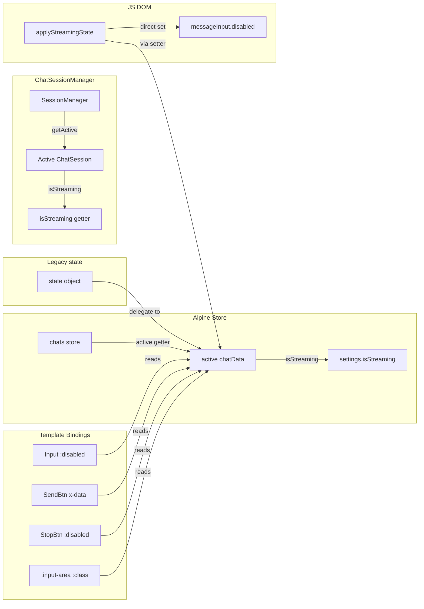

# 多 Chat 并发 Streaming 时输入面板状态修复方案

## 问题描述

当 chat A 正在 streaming 时，用户切换到 chat B（非 streaming），输入面板仍处于禁用状态，无法输入。

## 根因分析

### 根本原因：Alpine store 的 active chat 未同步

通过调用链分析，问题的核心链路如下：

1. 用户在侧栏点击 chat B → [`chat-list.js:selectChat(sn)`](frontend/static/chat-list.js:433) 被调用
2. `selectChat` 第 447 行调用了 [`sessionManager.switchTo(sn)`](frontend/static/chat-session-manager.js:60) — 这正确地切换了 `ChatSessionManager` 的 active session
3. 但 **`Alpine.store('chats').switchTo(sn)` 从未被调用** — Alpine store 的 `activeIndex` 仍然指向 chat A
4. 因此 `$store.chats.active` 始终返回 chat A（其 `isStreaming = true`）
5. Alpine 模板绑定 `:disabled="$store.chats.active?.isStreaming"` 持续评估为 `true`
6. 输入面板 `messageInput.disabled = true` 无法恢复

### 时序流程对比

```
当前（有问题）：
  selectChat(chatB)
    → sessionManager.switchTo(chatB)       // ChatSessionManager 正确切换
    → Alpine.store('chats').switchTo(X)     // ❌ 遗漏！
    → ...                                   // Alpine: $store.chats.active 仍为 chatA
    → Alpine: :disabled 仍为 true           // ❌ 输入面板不可用

修复后（预期）：
  selectChat(chatB)
    → sessionManager.switchTo(chatB)       // ChatSessionManager 正确切换
    → Alpine.store('chats').switchTo(chatB) // ✅ 同步 Alpine store
    → Alpine: $store.chats.active = chatB   // ✅ 响应式更新绑定
    → Alpine: :disabled = false             // ✅ 输入面板可用
```

### 次要问题：后台流完成时误操作全局 UI

[`chat-sse.js:cleanupAfterStream()`](frontend/static/chat-sse.js:336) 第 342 行无条件调用 `applyStreamingState(false)`：

```javascript
function cleanupAfterStream(session, wasAborted) {
    session.isStreaming = false;
    // ...
    applyStreamingState(false);  // ← 总是操作"当前 active chat"
}
```

如果 chat A 在后台完成 streaming，而此时 chat B 是 active：
- `applyStreamingState(false)` → 设置 `Alpine.store('settings').isStreaming = false`
- Setter 执行 `chats.active.isStreaming = val` → 修改的是 **chat B** 的 isStreaming！
- 如果 chat B 正在 streaming，会错误地将 chat B 的 `isStreaming` 置为 false

### 次要问题：selectChat 中非流式 chat 缺少 UI 重置

[`chat-list.js:selectChat()`](frontend/static/chat-list.js:433) 中，当切换到既无 streamingMsg 也非流式完成的 chat 时，**既不调用 `applyStreamingState(true)` 也不调用 `applyStreamingState(false)`**。停止按钮、删除按钮等非 Alpine 管理的 DOM 元素处于不确定状态。

## 数据流总览



## 修复方案

### 修改 1：chat-list.js — selectChat() 同步 Alpine store

**文件**: [`frontend/static/chat-list.js`](frontend/static/chat-list.js)

在第 447 行 `sessionManager.switchTo(sn)` 之后，添加 Alpine store 的同步：

```javascript
// 在 sessionManager.switchTo(sn) 之后（原第 447 行）
sessionManager.switchTo(sn);

// 新增：同步 Alpine store 的 active chat
// 确保 Alpine 绑定（:disabled, :class 等）引用正确的 chat
const chats = window.Alpine.store('chats');
if (chats) {
    chats.switchTo(sn);
}
```

**注意**：`chats.switchTo(sn)` 通过 `findIndex` 在 `items` 中查找。如果是全新的 chat（尚未通过 `getOrCreate` 添加到 `items`），`findIndex` 返回 -1，`switchTo` 内部会跳过。因此需要先确保 chat 存在于 `items` 中：

```javascript
const chats = window.Alpine.store('chats');
if (chats) {
    chats.getOrCreate(sn);  // 确保 items 中有此 chat
    chats.switchTo(sn);     // 切换 active
}
```

### 修改 2：chat-list.js — selectChat() 补充 UI 重置

**文件**: [`frontend/static/chat-list.js`](frontend/static/chat-list.js)

在场景 A/B 判断之后（第 577 行附近），为"默认路径"（chat 既无 streamingMsg 也不在 streaming 中）补充 `applyStreamingState(false)`：

```javascript
// 修改后逻辑（伪代码）：
const session = sessionManager.sessions.get(sn);
const lastMsg = result.messages[result.messages.length - 1];
const lastIsAssistant = lastMsg && lastMsg.role === 'assistant';

if (session && session.streamingMsg && !session.streamingMsg.isDone && !lastIsAssistant) {
    // 场景 A：流未完成
    // ... 创建气泡，恢复 DOM ...
    applyStreamingState(true);
} else if (session && session.streamingMsg && session.streamingMsg.isDone && !session.assistantBubble) {
    // 场景 B：流已完成但 DOM 引用已释放
    // ... 创建气泡，flushToDOM ...
    applyStreamingState(false);  // 新增：重置 UI 为非流式状态
} else {
    // 新增：普通 chat 切换，确保 UI 处于非流式状态
    applyStreamingState(false);
}
```

### 修改 3：chat-sse.js — cleanupAfterStream() 隔离后台流

**文件**: [`frontend/static/chat-sse.js`](frontend/static/chat-sse.js)

修改 `cleanupAfterStream` 函数，仅在当前 session 仍是 active session 时才调用全局 `applyStreamingState(false)`：

```javascript
function cleanupAfterStream(session, wasAborted) {
    state._wasAborted = false;
    session.isStreaming = false;
    session.abortController = null;

    // 仅当此 session 仍是活跃 session 时，才操作全局 UI
    const isActiveSession = sessionManager.getActive() === session;
    if (isActiveSession) {
        applyStreamingState(false);
        document.getElementById('messageInput').focus();
    } else {
        // 后台流完成：仅更新 Alpine store 中对应 chat 的 isStreaming
        try {
            const chats = window.Alpine.store('chats');
            if (chats) {
                const chatData = chats.getOrCreate(session.sn);
                if (chatData) {
                    chatData.isStreaming = false;
                    chatData.streamingMsg = null;
                }
            }
        } catch(e) {}
    }

    // 以下清理逻辑与 active 状态无关，始终执行
    // 移除 streaming 类
    const contentDiv = session.contentDiv;
    if (contentDiv) {
        contentDiv.classList.remove('streaming');
    }
    // 清理渲染定时器
    session.clearRenderTimer();
    // 清理 reasoning 定时器
    const assistantBubble = session.assistantBubble;
    if (assistantBubble) {
        const reasoningContentEl = assistantBubble.querySelector('.reasoning-content');
        if (reasoningContentEl && reasoningContentEl.renderTimer) {
            clearTimeout(reasoningContentEl.renderTimer);
            reasoningContentEl.renderTimer = null;
        }
    }

    // 标题自动修改（始终需要）
    autoUpdateTitle(wasAborted);
    // 获取当前对话信息（始终需要）
    getCurrentChatIfNeeded(wasAborted);
}
```

### 修改 4：清理已完成流的 Alpine store 同步

在 [`chat-sse-responser.js:onDone()`](frontend/static/chat-sse-responser.js:161) 中，`finalizeStreaming` 已经将 `chatData.isStreaming = false` 和 `chatData.streamingMsg = null`。但当后台流完成时（非 active session），`finalizeStreaming` 在 `onDone` 中仍会被调用，这是正确的。但注意不要重复设置。

实际上这条已经在第 171 行处理了：
```javascript
window.Alpine.store('chats').finalizeStreaming(this.session.sn);
```

这会同步 Alpine store 中对应 chat 的 streamingMsg 归档和 isStreaming 重置。所以修改 3 中的 else 分支里的 `chatData.streamingMsg = null` 是冗余的（因为 `finalizeStreaming` 已经做了），但 `chatData.isStreaming = false` 可能已被 `finalizeStreaming` 设置，保留也无妨（幂等）。

## 边界情况处理

### 情况 1：切回仍在后台 streaming 的 chat

当切回 chat A 时，`selectChat` 中：
- `session.streamingMsg.isDone === false` → 进入场景 A
- `applyStreamingState(true)` 被调用 → 输入面板正确禁用
- Alpine store 的 `chats.active` 已切换为 chat A → `chatA.isStreaming = true`

✅ 正确

### 情况 2：切到后台 streaming 已完成的新 chat B

- `session` 可能为 null（chat B 从未在 ChatSessionManager 中创建）
- 或 `session.streamingMsg.isDone === true` → 进入场景 B
- Alpine store 的 `chats.active` 为 chat B → `chatB.isStreaming = false`
- `applyStreamingState(false)` → 输入面板可用

✅ 正确

### 情况 3：切换 chat 后，旧 chat 后台 streaming 完成

- 修改 3 的 else 分支被执行
- 仅更新 Alpine store 中 chat A 的 isStreaming，不操作全局 UI
- chat B 的 UI 不受影响

✅ 正确

### 情况 4：在 chat B streaming 时，chat A 后台 streaming 完成

- `sessionManager.getActive() === chat B`，`session === chat A`
- else 分支执行，仅更新 Alpine store
- chat B 继续 streaming，UI 保持 streaming 状态

✅ 正确

## 涉及修改的文件清单

| 文件 | 修改类型 | 说明 |
|------|----------|------|
| [`frontend/static/chat-list.js`](frontend/static/chat-list.js) | 修改 | `selectChat()` 中补充 Alpine store 同步 + 非流式 UI 重置 |
| [`frontend/static/chat-sse.js`](frontend/static/chat-sse.js) | 修改 | `cleanupAfterStream()` 中隔离后台流完成时的全局 UI 操作 |

## 验证步骤

1. **基础测试**：打开 chat A → 发送消息 → streaming 开始 → 输入面板禁用 ✅
2. **切换非流式 chat**：streaming 中点击侧栏 chat B → chat B 输入面板可用，可输入 ✅
3. **切换回流式 chat**：点击侧栏 chat A → 输入面板禁用，streaming 继续 ✅
4. **后台流完成**：chat A streaming → 切换到 chat B → 等待 chat A 流完成 → chat B 输入面板不受影响 ✅
5. **stopStreamingBtn**：流式 chat 中可点击停止，非流式 chat 中灰色禁用 ✅
6. **delete buttons**：流式 chat 中禁用，非流式 chat 中可用 ✅
