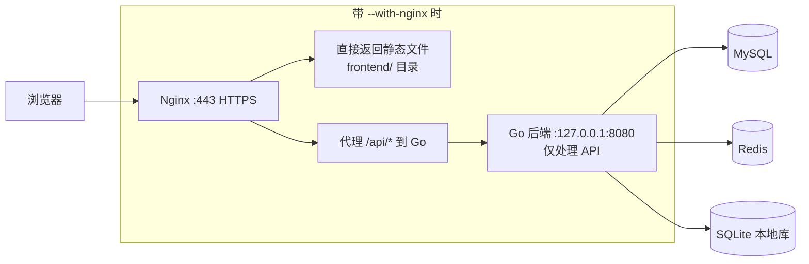
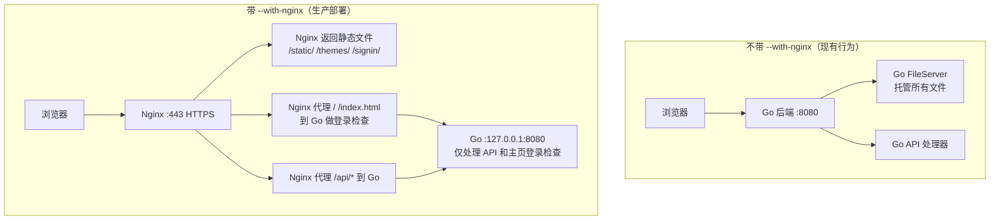

# Nginx 反向代理部署方案

## 1. 概述

当前项目 [`BrainForever`](../cmd/server/main.go:1) 是一个 Go + 纯前端（Alpine.js）的 AI 对话应用。后端使用自定义 HTTP 服务器（基于 Go 1.22+ `http.ServeMux`），默认监听 `[::]:8080`。所有前端资源由 Go 的 `http.FileServer` 从 [`./frontend`](../frontend/) 目录直接提供。

**目标**：在实际部署时，使用 Nginx 作为反向代理，并将**静态文件托管**交由 Nginx 处理，以充分发挥 Nginx 的静态文件服务性能（零拷贝、高效缓存、并发连接处理）。

**触发机制**：通过命令行参数 `--with-nginx` 控制。不带此参数时行为不变（Go 同时提供静态文件和 API）；带此参数时，Go 后端关闭静态文件服务，仅处理 API 请求。

---

## 2. 当前架构分析

### 2.1 路由分布

| 路由 | 类型 | 说明 |
|------|------|------|
| `/` → `frontend/index.html` | 静态文件 | 主页面，需登录检查（匿名→302跳转 `/signin/`） |
| `/signin/` → `frontend/signin/index.html` | 静态文件 | 登录页面 |
| `/static/*` | 静态文件 | CSS、JS、图片、第三方库 |
| `/themes/*` | 静态文件 | 主题 CSS 和背景 SVG |
| `/api/*` | API 动态路由 | 所有后端 API，需代理到 Go 后端 |
| `/api/themes/mainfes` | API（特殊） | 读取 `./frontend/themes/manifest.json` 并返回 JSON |

### 2.2 会话管理

- Cookie 名称：`brain_go_session`
- Cookie 属性：`Path=/`、`HttpOnly`、`SameSite=Lax`、`MaxAge=7天`
- 会话 ID 生成：UUID v4（格式 `s-xxxxxxxx-xxxx-4xxx-yxxx-xxxxxxxxxxxx`）
- 登录状态可持久化到 Redis，支持横向扩展

详见 [`internal/agent/on_chat.go:576-606`](../internal/agent/on_chat.go:576)

### 2.3 SSE 流式传输

- `GET /api/user/portrait` — SSE 长连接（用户画像流式生成）
- `POST /api/chat` — 内部使用 SSE 流式回复（通过 [`infra/httpx/sse/`](../infra/httpx/sse/) 实现）
- 后端 `WriteTimeout = 0`（禁用超时）
- SSE 是**服务器推送**（Server-Sent Events），非 WebSocket

### 2.4 前端引用的路径

所有前端资源引用均使用**绝对路径**：

- `/static/` — JS、CSS、图片、lib
- `/themes/` — 主题 CSS
- `/api/` — API 调用
- `/signin/` — 登录页面

这意味着 Nginx 配置无需重写路径，直接按路径前缀分发即可。

---

## 3. 部署架构



### 流量分发规则

| 请求路径 | Nginx 处理方式 | 说明 |
|----------|---------------|------|
| `/static/*` | 直接返回 | 静态资源，开启强缓存 |
| `/themes/*` | 直接返回 | 主题 CSS/BG，开启强缓存 |
| `/` | **代理到 Go 后端** | 主页面 HTML（因 Go 有登录检查逻辑） |
| `/signin/` | 直接返回 | 登录页 HTML（无需登录检查） |
| `/api/*` | 代理 → `127.0.0.1:8080` | 后端 API 服务 |

**关于 `/` 路由**：Go 后端在 [`initStaticFileServer()`](../cmd/server/routers.go:191) 中对 `/` 和 `/index.html` 有匿名 session 检查（未登录→302 跳转 `/signin/`）。即使启用 `--with-nginx`，`/` 仍需代理到 Go 后端处理此逻辑。但 Go 后端在收到 `/` 请求时可以**只返回 `index.html` 文件内容**而不使用 `http.FileServer`，因为其他静态文件已由 Nginx 处理。

---

## 4. Nginx 配置

### 4.1 完整 nginx.conf 配置

```nginx
upstream brain_forever_backend {
    # Go 后端服务
    # 单机部署使用 localhost；多实例可在此添加多个 server
    server 127.0.0.1:8080 max_fails=3 fail_timeout=10s;
    keepalive 64;
}

server {
    listen 80;
    listen [::]:80;
    server_name your-domain.com;
    # 强制跳转 HTTPS（生产环境）
    return 301 https://$host$request_uri;
}

server {
    listen 443 ssl http2;
    listen [::]:443 ssl http2;
    server_name your-domain.com;

    # ======== SSL 配置 ========
    ssl_certificate     /etc/nginx/ssl/your-domain.com.pem;
    ssl_certificate_key /etc/nginx/ssl/your-domain.com.key;
    ssl_protocols       TLSv1.2 TLSv1.3;
    ssl_ciphers         HIGH:!aNULL:!MD5;
    ssl_prefer_server_ciphers on;
    ssl_session_cache   shared:SSL:10m;
    ssl_session_timeout 10m;

    # ======== 安全头 ========
    add_header X-Frame-Options DENY;
    add_header X-Content-Type-Options nosniff;
    add_header X-XSS-Protection "1; mode=block";
    add_header Referrer-Policy strict-origin-when-cross-origin;

    # ======== 根目录 ========
    root /path/to/brain-forever/frontend;
    index index.html;

    # ======== 日志 ========
    access_log /var/log/nginx/brain_forever_access.log;
    error_log  /var/log/nginx/brain_forever_error.log;

    # ================================================================
    # 静态资源：JS / CSS / 图片 / 字体 / 第三方库
    # 使用强缓存（指纹在文件名中，可放心长缓存）
    # ================================================================
    location /static/ {
        expires 365d;
        add_header Cache-Control "public, immutable";
        add_header X-Content-Type-Options nosniff;
        access_log off;
    }

    # ================================================================
    # 主题文件
    # 主题 CSS / SVG 背景图，缓存 7 天
    # ================================================================
    location /themes/ {
        expires 7d;
        add_header Cache-Control "public";
        add_header X-Content-Type-Options nosniff;
        access_log off;
    }

    # ================================================================
    # 主页面 — 代理到 Go 后端（Go 负责登录检查）
    # Go 后端收到 / 请求后，返回 frontend/index.html 内容
    # ================================================================
    location = / {
        proxy_pass http://brain_forever_backend;
        proxy_http_version 1.1;
        proxy_set_header Host $host;
        proxy_set_header X-Real-IP $remote_addr;
        proxy_set_header X-Forwarded-For $proxy_add_x_forwarded_for;
        proxy_set_header X-Forwarded-Proto $scheme;
        proxy_set_header Connection "";

        add_header Cache-Control "no-cache, no-store, must-revalidate";
        add_header Pragma no-cache;
        expires 0;
    }

    location = /index.html {
        proxy_pass http://brain_forever_backend;
        proxy_http_version 1.1;
        proxy_set_header Host $host;
        proxy_set_header X-Real-IP $remote_addr;
        proxy_set_header X-Forwarded-For $proxy_add_x_forwarded_for;
        proxy_set_header X-Forwarded-Proto $scheme;
        proxy_set_header Connection "";

        add_header Cache-Control "no-cache, no-store, must-revalidate";
        add_header Pragma no-cache;
        expires 0;
    }

    # ================================================================
    # 登录页面 — Nginx 直接返回（无需登录检查）
    # ================================================================
    location /signin/ {
        add_header Cache-Control "no-cache, no-store, must-revalidate";
        add_header Pragma no-cache;
        expires 0;
        try_files /signin/index.html =404;
    }

    # ================================================================
    # API 反向代理
    # ================================================================
    location /api/ {
        proxy_pass http://brain_forever_backend;
        proxy_http_version 1.1;

        proxy_set_header Host $host;
        proxy_set_header X-Real-IP $remote_addr;
        proxy_set_header X-Forwarded-For $proxy_add_x_forwarded_for;
        proxy_set_header X-Forwarded-Proto $scheme;
        proxy_set_header Connection "";

        proxy_buffering on;
        proxy_buffer_size 4k;
        proxy_buffers 8 4k;

        proxy_connect_timeout 10s;
        proxy_read_timeout 300s;
        proxy_send_timeout 10s;

        client_max_body_size 50m;

        proxy_next_upstream error timeout invalid_header http_500 http_502 http_503;
    }

    # ================================================================
    # SSE 流式端点（需要禁用 proxy_buffering）
    # ================================================================
    location /api/chat {
        proxy_pass http://brain_forever_backend;
        proxy_http_version 1.1;

        proxy_set_header Host $host;
        proxy_set_header X-Real-IP $remote_addr;
        proxy_set_header X-Forwarded-For $proxy_add_x_forwarded_for;
        proxy_set_header X-Forwarded-Proto $scheme;
        proxy_set_header Connection "";

        # SSE 必须禁用缓冲
        proxy_buffering off;
        proxy_cache off;
        proxy_read_timeout 3600s;
        proxy_send_timeout 3600s;

        client_max_body_size 50m;
        proxy_next_upstream error timeout invalid_header http_500 http_502 http_503;
    }

    location /api/user/portrait {
        proxy_pass http://brain_forever_backend;
        proxy_http_version 1.1;

        proxy_set_header Host $host;
        proxy_set_header X-Real-IP $remote_addr;
        proxy_set_header X-Forwarded-For $proxy_add_x_forwarded_for;
        proxy_set_header X-Forwarded-Proto $scheme;
        proxy_set_header Connection "";

        proxy_buffering off;
        proxy_cache off;
        proxy_read_timeout 3600s;
        proxy_send_timeout 3600s;

        proxy_next_upstream error timeout invalid_header http_500 http_502 http_503;
    }

    # ================================================================
    # 安全：拒绝访问敏感文件
    # ================================================================
    location ~ /\. {
        deny all;
        access_log off;
        log_not_found off;
    }

    location ~ \.(env|toml|mod|sum)$ {
        deny all;
        access_log off;
        log_not_found off;
    }

    # ================================================================
    # 健康检查端点
    # ================================================================
    location = /api/health {
        proxy_pass http://brain_forever_backend;
        proxy_http_version 1.1;
        proxy_set_header Host $host;
        proxy_set_header Connection "";
        proxy_buffering off;
        access_log off;
    }

    # ================================================================
    # Gzip 压缩
    # ================================================================
    gzip on;
    gzip_types text/plain text/css application/javascript application/json image/svg+xml;
    gzip_min_length 1000;
    gzip_proxied any;
    gzip_vary on;
}
```

### 4.2 配置要点说明

| 配置项 | 原因 |
|--------|------|
| `proxy_http_version 1.1` | 后端使用 HTTP/1.1 keep-alive 提高性能 |
| `proxy_buffering off` on SSE 端点 | SSE 是实时流，Nginx 缓冲会延迟推送 |
| `proxy_read_timeout 3600s` on SSE | SSE 连接可能持续很久 |
| `proxy_set_header Connection ""` | 强制 HTTP/1.1 keep-alive |
| `client_max_body_size 50m` | 用户上传附件需要 |
| `/` 和 `/index.html` 代理到 Go | Go 有匿名 session → 302 跳转的登录检查逻辑 |
| `/signin/` 由 Nginx 直接返回 | 登录页无登录检查需求 |

---

## 5. Go 后端改造

### 5.1 改动概览

只需要修改 **2 个文件**：

| 文件 | 改动 |
|------|------|
| [`cmd/server/main.go`](../cmd/server/main.go) | 解析 `--with-nginx` 参数，控制是否跳过静态文件服务 |
| [`cmd/server/routers.go`](../cmd/server/routers.go) | 新增仅处理 `/` 和 `/index.html` 的轻量处理器（Nginx 模式下） |

### 5.2 [`cmd/server/main.go`](../cmd/server/main.go) 改动

在 `main()` 函数顶部增加命令行参数解析：

```go
// 在 package main 中添加 import "flag"

func main() {
    // ============================================================
    // 命令行参数解析（必须在配置加载之前）
    // ============================================================
    withNginx := flag.Bool("with-nginx", false, "启用 Nginx 反向代理模式：关闭静态文件服务")
    flag.Parse()
    // ... 现有配置加载代码 ...
```

然后在调用 `initStaticFileServer()` 处改为条件调用：

```go
// 原来
initStaticFileServer(srv, cfg.Frontend.Dir, cfg.Frontend.CacheDisable, chatHandler)

// 改为
if *withNginx {
    // Nginx 模式：只注册主页路由（带登录检查），不启动 FileServer
    // 其他静态文件（/static/, /themes/, /signin/）由 Nginx 处理
    initNginxModeStaticServer(srv, cfg.Frontend.Dir, chatHandler)
    theLogger.Info("Nginx mode enabled: static files served by Nginx")
} else {
    // 标准模式：Go 同时提供静态文件和 API
    initStaticFileServer(srv, cfg.Frontend.Dir, cfg.Frontend.CacheDisable, chatHandler)
}
```

### 5.3 [`cmd/server/routers.go`](../cmd/server/routers.go) 新增函数

```go
// initNginxModeStaticServer 在 Nginx 反向代理模式下注册静态文件路由。
// 此模式下：
//   - / 和 /index.html：由 Go 处理（保留匿名 session → /signin/ 的登录检查）
//   - 其他静态文件（/static/, /themes/, /signin/）由 Nginx 直接返回
func initNginxModeStaticServer(srv *httpx.Server, frontendDir string, chatHandler *agent.ChatAgent) {
    // 主页：读文件 + 登录检查
    srv.Handle("/", func(w http.ResponseWriter, r *http.Request) {
        path := r.URL.Path

        // 仅处理 / 和 /index.html
        if !isHomePage(path) {
            http.NotFound(w, r)
            return
        }

        setNoCacheHeaders(w)

        // 匿名 session → 跳转到登录页
        if chatHandler != nil && chatHandler.IsSessionAnonymous(w, r) {
            redirectSignin(w, r)
            return
        }

        serveFileOr404(w, r, frontendDir+"/index.html")
    })
}
```

### 5.4 为什么 `/signin/` 不由 Go 处理？

因为登录页不需要登录检查，Nginx 直接返回 `signin/index.html` 效率更高。如果未来登录页需要特殊逻辑，可随时改为代理到 Go。

### 5.5 主题 Manifest 路径

[`internal/theme/handler.go:10`](../internal/theme/handler.go:10) 中 `manifestPath = "./frontend/themes/manifest.json"` 是相对于**工作目录**的路径。Nginx 模式下 Go 后端仍通过 `/api/themes/mainfes` 提供此 JSON 接口，所以需要确保工作目录正确或 `cfg.Frontend.Dir` 路径正确。

---

## 6. 部署步骤

### 6.1 编译后端

```bash
cd /path/to/brain-forever
go build -o bin/server ./cmd/server
```

### 6.2 配置后端

```bash
# 创建配置目录
mkdir -p bin/settings

# 创建 server.toml
cat > bin/settings/server.toml << 'EOF'
[server]
addr = "127.0.0.1:8080"

[frontend]
dir = "/opt/brain-forever/frontend"
EOF

# 设置环境变量
export MYSQL_DSN_d2brain="user:password@tcp(127.0.0.1:3306)/brain_forever?charset=utf8mb4&parseTime=true"
export PROXY_ADDR="127.0.0.1:8080"
```

### 6.3 目录结构（生产环境）

```
/opt/brain-forever/
├── bin/
│   └── server              # Go 编译后的二进制文件
├── frontend/               # 前端静态文件（从项目复制）
│   ├── index.html
│   ├── signin/
│   ├── static/
│   └── themes/
├── localdb/                # SQLite 数据库目录
├── log/                    # 日志目录
├── lang/                   # i18n 语言文件
└── settings/
    └── server.toml         # 服务配置
```

### 6.4 启动后端（Nginx 模式）

```bash
cd /opt/brain-forever
./bin/server --with-nginx
```

### 6.5 systemd 服务配置

```ini
# /etc/systemd/system/brain-forever.service
[Unit]
Description=BrainForever AI Backend
After=network.target mysql.service redis.service

[Service]
Type=simple
User=brainforever
WorkingDirectory=/opt/brain-forever
ExecStart=/opt/brain-forever/bin/server --with-nginx
Restart=on-failure
RestartSec=5
Environment=MYSQL_DSN_d2brain=...
Environment=REDIS_ADDR=127.0.0.1:6379
Environment=REDIS_PASSWORD=...
LimitNOFILE=65536

[Install]
WantedBy=multi-user.target
```

### 6.6 配置 Nginx

```bash
sudo cp /path/to/nginx.conf /etc/nginx/sites-available/brain-forever
sudo ln -s /etc/nginx/sites-available/brain-forever /etc/nginx/sites-enabled/
sudo nginx -t
sudo systemctl reload nginx
```

---

## 7. 关键注意事项

### 7.1 登录检查逻辑的保留

这是最重要的注意事项。Go 后端在标准模式下对 `/` 有匿名 session 检查：

```go
// 匿名 session → 302 跳转 /signin/
if chatHandler.IsSessionAnonymous(w, r) {
    redirectSignin(w, r)
    return
}
```

即使 Nginx 模式下，**`/` 和 `/index.html` 仍然由 Go 处理**，以确保登录检查不丢失。其他静态文件（`/static/`、`/themes/`、`/signin/`）才由 Nginx 直接返回。

### 7.2 SSE 连接稳定性

- Nginx `proxy_read_timeout` 必须足够长（建议 3600s）
- SSE 端点需设置 `proxy_buffering off`
- Go 后端 `WriteTimeout = 0` 已禁用超时

### 7.3 日志和真实 IP

- Nginx 日志可记录客户端真实 IP
- Go 后端日志目前记录的是 Nginx 的内网 IP（`127.0.0.1`）
- 如需要在 Go 日志中记录真实 IP，可后续在中间件中读取 `X-Real-IP` 或 `X-Forwarded-For`

### 7.4 静态资源缓存策略

| 资源类型 | 缓存时间 | 策略 |
|----------|----------|------|
| HTML（`/`, `/index.html`） | 不缓存 | `no-cache, no-store, must-revalidate` |
| 登录页（`/signin/`） | 不缓存 | `no-cache, no-store, must-revalidate` |
| JS / CSS / 图片（`/static/`） | 365 天 | `public, immutable` |
| 主题文件（`/themes/`） | 7 天 | `public` |

### 7.5 非 Nginx 模式行为不变

**不传 `--with-nginx` 时，程序行为与当前完全一致**，无需任何迁移或兼容处理。

---

## 8. 实施任务清单

### 8.1 Go 后端改造（2 个文件）

- [ ] [`cmd/server/main.go`](../cmd/server/main.go)：
  - 添加 `flag` 包导入
  - 在 `main()` 开头添加 `--with-nginx` 命令行参数解析
  - 将 `initStaticFileServer()` 改为条件调用：有 `--with-nginx` 时调用新函数，否则保持原样
- [ ] [`cmd/server/routers.go`](../cmd/server/routers.go)：
  - 新增 `initNginxModeStaticServer()` 函数，只处理 `/` 和 `/index.html` 路由，保留登录检查
  - 其他请求返回 404

### 8.2 Nginx 配置

- [ ] 编写 Nginx 站点配置
- [ ] 配置 SSL 证书
- [ ] SSE 端点设置 `proxy_buffering off`
- [ ] 静态文件缓存策略
- [ ] 安全头和安全限制

### 8.3 验证测试

- [ ] **不带 `--with-nginx` 启动**：行为与现有完全一致，静态文件和 API 均由 Go 处理
- [ ] **带 `--with-nginx` 启动 + Nginx 配置**：
  - `/static/` 和 `/themes/` 由 Nginx 返回
  - `/signin/` 由 Nginx 返回
  - `/` 由 Go 返回（有登录检查）
  - `/api/*` 由 Go 处理
  - SSE 流式传输正常

---

## 9. 回滚方案

```bash
# 方案 A：停止 Nginx，不带 --with-nginx 启动 Go
systemctl stop nginx
# 修改 systemd service 去掉 --with-nginx
systemctl daemon-reload
systemctl restart brain-forever
# 通过 http://server-ip:8080 直接访问

# 方案 B：仅修改 Nginx 配置，将 / 和 /api/ 指向 Go
# 然后 reload Nginx 即可
```

---

## 10. 架构对比图


