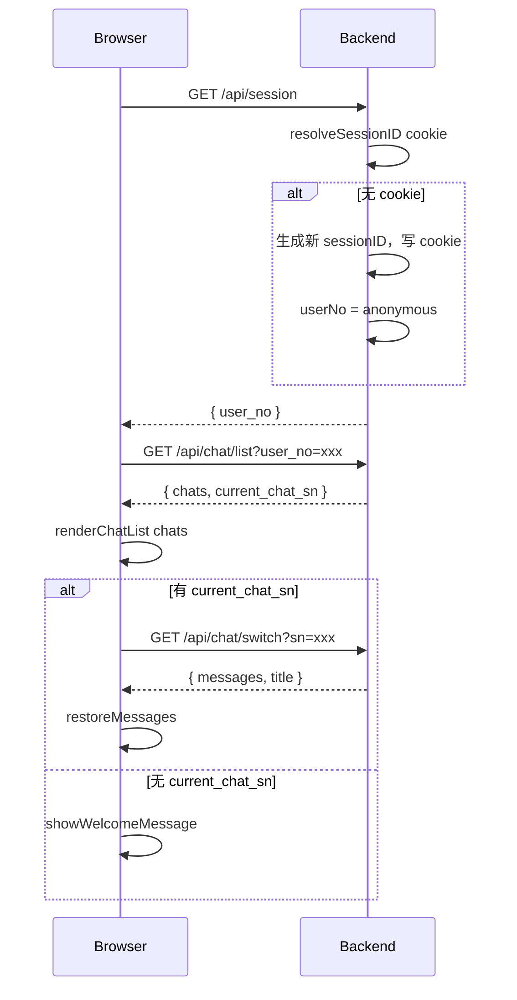

# 首次打开页面 — 初始化流程计划

## 1. 背景分析

当前页面初始化流程（[`chat.js:813-817`](frontend/static/chat.js:813)）：

```javascript
window.addEventListener('DOMContentLoaded', async () => {
    await fetchChatList();   // 获取对话列表
    await restoreChat();     // 恢复当前会话
});
```

当前后端有两个独立的 handler：
- [`OnRestoreSession`](internal/agent/on_session.go:18) — `GET /api/session`，返回当前 session 的消息历史、标题、chats 列表等
- [`OnNewSession`](internal/agent/on_session.go:132) — `POST /api/session/new`，重置当前 chat 为空白

**问题**：
1. `GET /api/session` 返回了太多业务信息（messages, chats, title 等），职责不单一
2. 前端初始化需要先调 `fetchChatList()` 再调 `restoreChat()`，两次网络请求
3. 没有显式的"创建 http-session"的流程

## 2. 需求拆解

用户需求："首次打开页面。从本地存储取用户 SN，然后创建 http-session，然后向后台取当前用户的 chats 列表。"

三个步骤：
1. **从本地存储取用户 SN** — 读取 `brainforever_user_no`
2. **创建 HTTP session** — 确保后端有一个有效的 HTTP session（cookie）
3. **取当前用户的 chats 列表** — 调用后端接口获取该用户的对话列表

## 3. 设计方案

### 3.1 核心思路：职责分离 + 精简

| 接口 | 职责 | 返回 |
|------|------|------|
| `GET /api/session` | HTTP session 层面：创建/获取 session，返回 user_no | `{ user_no }` |
| `GET /api/chat/list?user_no=xxx` | 业务层面：获取该用户的 chats 列表 | `{ chats, current_chat_sn }` |
| `GET /api/chat/switch?sn=xxx` | 业务层面：获取指定 chat 的消息历史 | `{ messages, title }` |

**关键设计决策**：
- `GET /api/session` **不带 `?user_no` 参数** — 只通过 cookie 识别 http-session-sn，后端 session 自己记住 user_no
- 前端不再从 localStorage 读 user_no 传给后端做 switchToUser
- 删除 `POST /api/session/new` — `startNewSession()` 改为纯前端操作

### 3.2 `GET /api/session` — 精简为纯 session 管理

```
GET /api/session
  → resolveSessionID(w, r)  // 从 cookie 读 sessionID，没有则新建并写 cookie
  → GetOrCreate(sessionID)
  → 返回 { user_no }
```

**返回格式**：
```json
{
  "user_no": "anonymous"  // 或 "test_user_001" 等
}
```

**不再返回**：`is_new`, `messages`, `title`, `title_state`, `chats`, `current_chat_sn`

### 3.3 删除 `POST /api/session/new`

`startNewSession()` 改为纯前端操作，不再调后端。

### 3.4 前端初始化流程

```
initPage():
  1. GET /api/session  →  { user_no }          // 创建/获取 HTTP session
  2. GET /api/chat/list?user_no=xxx  →  { chats, current_chat_sn }  // 取 chats
  3. renderChatList(chats)
  4. if current_chat_sn:
       GET /api/chat/switch?sn=xxx  →  { messages, title }
       restoreMessages(messages, title)
     else:
       showWelcomeMessage
```

### 3.5 后端修改

#### 3.5.1 重写 [`internal/agent/on_session.go`](internal/agent/on_session.go)

删除 `OnRestoreSession` 和 `OnNewSession`，合并为统一的 `OnSession()`：

```go
package agent

import (
    "encoding/json"
    "net/http"
)

// OnSession handles GET /api/session
// 创建或获取 HTTP session，返回 session 层面的信息（当前只有 user_no）。
// 只通过 cookie 识别 http-session-sn，不带 query 参数。
func (h *ChatAgent) OnSession(w http.ResponseWriter, r *http.Request) {
    if r.Method != http.MethodGet {
        http.Error(w, "method not allowed", http.StatusMethodNotAllowed)
        return
    }

    sessionID := h.resolveSessionID(w, r)
    session := h.sessionManager.GetOrCreate(sessionID)

    w.Header().Set("Content-Type", "application/json")
    json.NewEncoder(w).Encode(map[string]interface{}{
        "user_no": session.userNo,
    })
}
```

#### 3.5.2 修改 [`main.go`](main.go:128-138) — 更新路由

```go
// 精简后的 session handler（只处理 GET）
mux.Handle("/api/session", http.HandlerFunc(chatHandler.OnSession))

// 删除以下路由：
// mux.Handle("/api/session/new", ...)  ← 删除
```

### 3.6 前端修改

#### 3.6.1 新建 [`frontend/static/chat-init.js`](frontend/static/chat-init.js)

```javascript
import { renderChatList } from './chat-list.js';
import { switchChat } from './chat-api.js';
import { addMessage, showSources, showTokenUsage, showWelcomeMessage, updateHeaderTitle } from './chat-ui.js';
import { restoreReasoningArea } from './chat-reasoning.js';
import { updateTickNav } from './chat-ticknav.js';
import { sessionManager } from './chat-session-manager.js';

export async function initPage() {
    // Step 1: GET /api/session — 创建/获取 HTTP session
    const sessionResp = await fetch('/api/session');
    if (!sessionResp.ok) {
        console.warn('session init failed');
        return;
    }
    const sessionData = await sessionResp.json();
    const currentUserNo = sessionData.user_no || '';
    
    // Step 2: GET /api/chat/list — 取该用户的 chats 列表
    const chatListResp = await fetch('/api/chat/list?user_no=' + encodeURIComponent(currentUserNo));
    if (!chatListResp.ok) return;
    const chatListData = await chatListResp.json();
    
    // Step 3: 渲染对话列表
    if (chatListData.chats) {
        renderChatList(chatListData.chats, chatListData.current_chat_sn || null);
    }
    
    // 恢复登录按钮状态
    if (currentUserNo && currentUserNo !== 'anonymous') {
        const loginBtn = document.getElementById('loginBtn');
        if (loginBtn) {
            loginBtn.textContent = `用户: ${currentUserNo}`;
        }
    }
    
    // Step 4: 如果有当前 chat，恢复消息历史
    if (chatListData.current_chat_sn) {
        const chatData = await switchChat(chatListData.current_chat_sn);
        if (chatData) {
            restoreMessages(chatData.messages, chatData.title, chatData.title_state);
        }
    } else {
        showWelcomeMessage();
    }
}
```

#### 3.6.2 修改 [`chat.js`](frontend/static/chat.js:103-193) — `startNewSession()` 改为纯前端

```javascript
async function startNewSession() {
    if (sessionManager.isStreaming) return;

    var chatsStore = window.Alpine.store('chats');
    chatsStore.activeIndex = -1;
    chatsStore.blankItem = {
        sn: '', title: '', titleState: 0, isStreaming: false,
        userScrolledUp: false, messages: [], streamingMsg: null,
        groups: [], _groupSeq: 0,
    };
    resetTickState();

    const chatContainer = document.getElementById('chatContainer');
    if (chatContainer) {
        chatContainer.querySelectorAll('.message-group').forEach(el => el.remove());
    }

    const existingWelcome = document.querySelector('.welcome-message');
    if (existingWelcome) {
        const inputArea = existingWelcome.querySelector('.input-area');
        if (inputArea) {
            const mainBody = document.getElementById('mainBody');
            if (mainBody) {
                mainBody.parentNode.insertBefore(inputArea, mainBody.nextSibling);
            }
        }
        existingWelcome.remove();
    }

    const tickNav = document.getElementById('tickNav');
    if (tickNav) tickNav.innerHTML = '';

    const scrollContainer = document.getElementById('scrollContainer');
    if (scrollContainer) scrollContainer.classList.remove('welcome-state');

    clearAllStickyNotes();
    clearActiveChat();
    showWelcomeMessage();

    const msgInput = document.getElementById('messageInput');
    if (msgInput) msgInput.focus();
}
```

#### 3.6.3 修改 [`chat.js`](frontend/static/chat.js:813-817) — 初始化入口

```javascript
import { initPage } from './chat-init.js';

window.addEventListener('DOMContentLoaded', async () => {
    await initPage();
});
```

删除 `fetchChatList` 和 `restoreChat` 的 import。

#### 3.6.4 删除 [`chat-restore.js`](frontend/static/chat-restore.js)

整个文件删除。`fetchChatList()` 和 `restoreChat()` 的职责被 `initPage()` 替代。

#### 3.6.5 修改 [`chat-api.js`](frontend/static/chat-api.js:292-298)

`switchToUser()` 中引用 `fetchChatList` 和 `restoreChat` 的地方——由于是渐进式重构，这些引用暂时会导致编译错误（模块已删除）。可以暂时注释掉或保留空调用，保证编译通过即可。

## 4. 流程图



## 5. 执行步骤

| # | 步骤 | 文件 | 说明 |
|---|------|------|------|
| 1 | 重写 session handler | [`internal/agent/on_session.go`](internal/agent/on_session.go) | 只保留 GET，返回 `{ user_no }`，删除 `OnNewSession` |
| 2 | 更新路由 | [`main.go`](main.go:128-138) | 删除 `/api/session/new` 路由 |
| 3 | 新建前端模块 | [`frontend/static/chat-init.js`](frontend/static/chat-init.js) | 实现 `initPage()` + `restoreMessages()` |
| 4 | 修改 startNewSession | [`frontend/static/chat.js`](frontend/static/chat.js:103-193) | 改为纯前端操作，删除后端调用 |
| 5 | 修改初始化入口 | [`frontend/static/chat.js`](frontend/static/chat.js:813-817) | 调用 `initPage()`，删除旧 import |
| 6 | 修改 switchToUser | [`frontend/static/chat-api.js`](frontend/static/chat-api.js:292-298) | 注释掉或简化对已删除模块的引用 |
| 7 | 删除旧文件 | [`frontend/static/chat-restore.js`](frontend/static/chat-restore.js) | 整个文件删除 |

## 6. 注意事项

1. **渐进式重构**：只保障当前修改的功能逻辑正确，项目整体代码可通过编译。其他功能（如登录后的 switchToUser）暂时可能失败，后续阶段再修正
2. **`POST /api/session/new` 删除**：`startNewSession()` 改为纯前端操作
3. **`GET /api/session` 不带参数**：只通过 cookie 识别 session
4. **`localStorage` 中的 `brainforever_user_no`**：暂时保留，后续登录功能重构时再处理
