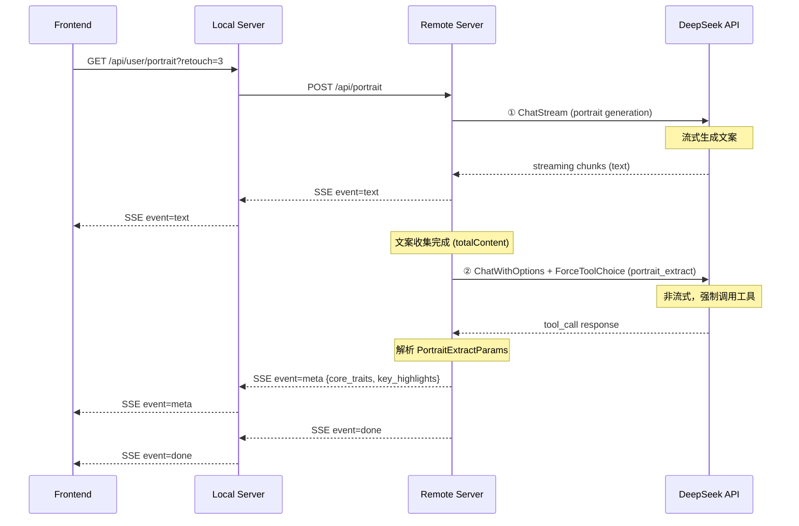

# 用户画像结构化数据提取方案设计

## 需求概述

在现有"用户画像"（User Portrait）文案生成的基础上，额外提取两类结构化数据：
1. **核心特质（Core Traits）** — 一组高度凝练的特质关键词（如"理性、真诚、独立"）
2. **重点摘要（Key Highlights）** — 从全文中抽取的关键描述要点

---

## 现有架构回顾

```
Frontend                          Local Server                   Remote Server
   │                                  │                               │
   │  GET /api/user/portrait?retouch=3 │                               │
   │ ───────────────────────────────►  │                               │
   │                                  │  POST /api/portrait (JSON)     │
   │                                  │ ──────────────────────────────►│
   │                                  │                               │
   │                                  │      SSE stream (text chunks) │
   │          SSE stream              │ ◄─────────────────────────────│
   │ ◄─────────────────────────────── │                               │
   │                                  │                               │
```

SSE 事件类型目前有 3 种：`text`、`error`、`done`

---

## 方案分析

### 方案A：单次 LLM 调用，文案 + 工具一次完成

**思路**：在现有的流式请求中，给 LLM 同时提供文案生成指令和 `portrait_extract` 工具，让 LLM 先生成完整文案，再调用工具返回结构化数据。

**可行性判断：可行，但改动较大**

#### 技术分析

DeepSeek API 在流式模式下，当 LLM 决定调用工具时：
- 先输出全部文本 content（流式 chunks）
- 最后一个 chunk 的 `finish_reason = "tool_calls"`，附带 `tool_calls` 信息
- 文本和 tool_calls 在流式 chunk 中是互斥的

因此理论上可以控制 LLM 先输出文案再调用工具，但有个关键问题：

现有 [`OnPortrait`](internal/remote/agent/on_portrait.go:152) 使用的是 `client.ChatStreamWithOptions()`，它返回原始 [`ChatCompletionChunkDecoder`](infra/llm/client.go:62)，**不聚合 tool_calls**。要支持工具调用，必须：

1. 在循环中收集各 chunk 的 `DeltaToolCalls`（类似 [`streamChatCompletion`](infra/llm/deepseek.go:369) 的做法）
2. 流结束后，检测 `finish_reason` 是否为 `"tool_calls"`
3. 若是，执行工具并发送结果到 SSE

#### 核心问题：顺序不可靠

虽然 DeepSeek 通常先输出文本再触发 tool_call，但 **prompt 工程无法 100% 保证** LLM 严格遵循顺序。如果 LLM 在文本输出中途就触发 tool_call，前端会收到不完整的文案 + 结构化数据，体验很差。

**权衡**：可以通过 `tool_choice: "none"` 强制 LLM 只输出文本，但那就无法在同一调用中触发工具了。

**结论**：方案A虽然可行，但可靠性不够高，且实现复杂度大。

---

### 方案B：前端分两步

**思路**：前端收到完整文案（`event: done`）后，再发起一次新的 API 请求，后端用非流式 LLM + 强制工具调用提取结构化数据。

```
Frontend                          Local Server                   Remote Server
   │                                  │                               │
   │ ① GET /api/user/portrait         │                               │
   │ ───────────────────────────────►  │  (流式生成文案)               │
   │ ◄──── SSE (text chunks...done)─── │                               │
   │                                  │                               │
   │ ② POST /api/portrait/extract     │                               │
   │    (body: 完整文案)               │                               │
   │ ───────────────────────────────►  │  ──► LLM (非流式+工具)        │
   │ ◄── JSON {core_traits, ...} ──── │                               │
```

**优点**：
- 实现简单、逻辑清晰
- 文案生成和结构化提取完全解耦
- 第二次调用可用 `ForceToolChoice`，100% 可靠触发工具

**缺点**：
- 前端多一次网络请求，增加往返延迟
- 用户感知到"分两步加载"，体验不够平滑
- 前端需要管理额外的状态和加载时序

---

### 方案C（推荐）：后端自动两步走，对外一次 SSE

**思路**：前端接口不变。后端在流式文案生成完毕后，**在同一 handler 内**自动发起第二次非流式 LLM 调用，将结果以新 SSE 事件类型发送。

```
Frontend                          Local Server                   Remote Server
   │                                  │                               │
   │  GET /api/user/portrait          │                               │
   │ ───────────────────────────────►  │                               │
   │                                  │  POST /api/portrait            │
   │                                  │ ──────────────────────────────►│
   │                                  │                               │
   │                                  │  Step 1: LLM 流式生成文案     │
   │   SSE: event=text, data="..."    │ ◄────── (流式 chunks) ────────│
   │ ◄─────────────────────────────── │                               │
   │                                  │                               │
   │                                  │  Step 2: LLM 非流式+工具提取  │
   │                                  │    (输入=完整文案)             │
   │                                  │ ────────► ForceToolChoice ────►│
   │                                  │ ◄──── JSON {traits,summary}── │
   │                                  │                               │
   │   SSE: event=meta, data={...}    │                               │
   │ ◄─────────────────────────────── │                               │
   │                                  │                               │
   │   SSE: event=done, data={}       │                               │
   │ ◄─────────────────────────────── │                               │
```

#### 为什么推荐方案C

| 维度 | 方案A | 方案B | 方案C |
|------|-------|-------|-------|
| 前端改动 | 需处理新 event 类型 | 需管理两次请求状态 | 只需处理新 event 类型 |
| 后端复杂度 | 高（流式+工具混合） | 低（新增独立 handler） | 中（扩展现有 handler） |
| 顺序可靠性 | 低（无法100%保证） | 高（完全解耦） | 高（两个独立调用） |
| 用户感知 | 一次加载 | 分两步加载 | 一次加载 |
| 网络往返 | 1次 | 2次 | 1次 |

**方案C 兼具了方案A的用户体验（一次加载）和方案B的实现可靠性（独立调用、强制工具）**。

#### 详细设计

##### 1. 新增 Tool 定义

在 [`internal/remote/agent/toolimp/`](internal/remote/agent/toolimp/) 下新增文件 `portrait_extract.go`：

```go
// toolimp/portrait_extract.go

const PortraitExtractToolName = "portrait_extract"

type PortraitExtractParams struct {
    CoreTraits    []string `json:"core_traits"`    // 核心特质关键词列表
    KeyHighlights []string `json:"key_highlights"` // 重点摘要列表
}

// PortraitExtractTool implements llm.ToolIMP
```

##### 2. 扩展 SSE 事件类型

新增 `meta` 事件：

```go
// 现有 SSE 事件
{"event":"text", "data":"..."}
{"event":"error", "data":"..."}

// 新增 event
{"event":"meta", "data":{
    "core_traits": ["理性", "真诚", "独立", ...],
    "key_highlights": [
        "你是一位在现实与理想之间寻求平衡的精密建筑师",
        "你擅长从复杂的信息中抽丝剥茧",
        ...
    ]
}}

// 最后仍是 done
{"event":"done", "data":{}}
```

##### 3. 修改 [`OnPortrait`](internal/remote/agent/on_portrait.go:55)

Step 1：缓冲完整文案（当前已做，`totalContent` 变量已存在，但需要导出）

Step 2：流结束后，如果 `totalContent` 不为空，发起第二次 LLM 调用：

```go
// Step 2: 提取结构化元数据
if totalContent != "" {
    meta := extractPortraitMeta(r.Context(), client, req.Lang, totalContent)
    if meta != nil {
        sendPortraitSSE(sw, "meta", meta)
    }
}

// Step 3: 发送 done
sendPortraitSSE(sw, "done", map[string]interface{}{})
```

`extractPortraitMeta` 函数：

```go
func extractPortraitMeta(ctx context.Context, client *llm.DeepSeekClient, lang, portraitText string) *PortraitMeta {
    // 1. 构建 system prompt（提示 LLM 从文案中提取核心特质和摘要）
    // 2. 构建 user message（传入完整文案）
    // 3. 添加 portrait_extract 工具定义
    // 4. 设置 ForceToolChoice
    // 5. 调用非流式 ChatWithOptions
    // 6. 解析工具调用结果
    // 7. 返回结构化数据
}
```

##### 4. 前端修改

在 [`_handleSSEEvent`](frontend/static/dialogs/portrait-dialog.js:389) 中增加 `meta` 事件处理：

```javascript
case 'meta':
    // data 包含 core_traits 和 key_highlights
    this.portraitMeta = data;
    // 可以渲染到 UI 中的结构化展示区域
    break;
```

##### 5. i18n 支持

在 [`lang/remote/zh-CN/tools/`](lang/remote/zh-CN/tools/) 和 [`lang/remote/en/tools/`](lang/remote/en/tools/) 下新增 `portrait_extract.toml`：

```toml
[portrait_extract]
description = "从用户个人画像文案中提取核心特质和重点摘要"
param_core_traits_desc = "核心特质关键词列表，如 ['理性', '真诚', '独立']"
param_key_highlights_desc = "重点摘要列表，从文案中抽取关键描述"
pending = "正在提取核心特质和摘要..."
```

---

## 推荐方案：方案C

### 实施步骤

1. **新建 tool 定义** — [`internal/remote/agent/toolimp/portrait_extract.go`](internal/remote/agent/toolimp/)
2. **新建 i18n 文件** — `lang/remote/{zh-CN,en}/tools/portrait_extract.toml`
3. **修改 [`OnPortrait`](internal/remote/agent/on_portrait.go)** — 增加 Step 2 提取逻辑
4. **新增 `portraitMeta` 接口** — 定义 `PortraitMeta` 结构体，及元数据提取函数
5. **修改前端 [`portrait-dialog.js`](frontend/static/dialogs/portrait-dialog.js)** — 处理 `meta` SSE 事件，展示结构化数据
6. **修改前端 CSS**（可选）— 在对话框中增加结构化数据展示区域

### 总览图


