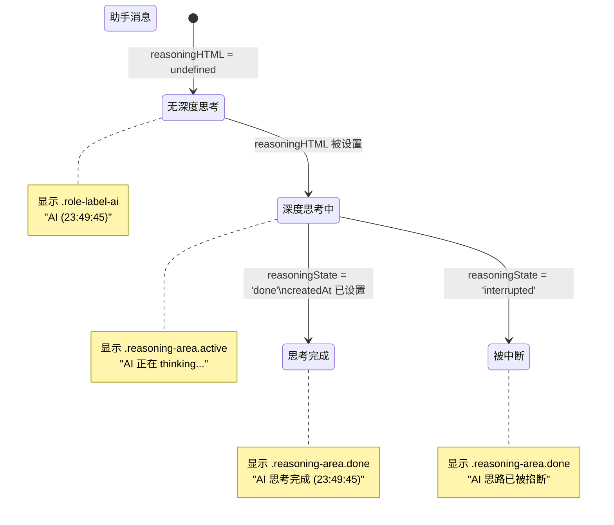

# Reasoning 区域重复显示 & 角色标题修正方案

## 1. 问题分析

### 1.1 双重渲染根因

Reasoning 区域由 **两套独立机制同时渲染**：

| 机制 | 位置 | 触发条件 |
|------|------|----------|
| **Alpine 模板** | [`index.html:369-382`](../frontend/index.html:369) | `group.assistant.reasoningHTML` 被设置 |
| **JS 手动创建** | [`chat-reasoning.js:restoreReasoningArea()`](../frontend/static/chat-reasoning.js:46) | 在 `requestAnimationFrame` 回调中调用 |

三个调用点（[`chat-list.js:506`](../frontend/static/chat-list.js:506)、[`chat-list.js:578`](../frontend/static/chat-list.js:578)、[`chat-list.js:633`](../frontend/static/chat-list.js:633)）都在之前通过 Alpine store 设置了 `reasoningHTML`，所以 Alpine 先渲染了一个，JS 又追加了一个，导致 **两个 reasoning 区域同时显示**。

### 1.2 简单守卫的问题

我之前在 [`chat-reasoning.js:53`](../frontend/static/chat-reasoning.js:53) 加的 `if (assistantBubble.querySelector('.reasoning-area')) return;` 虽然阻止了重复创建，但 **暴露了 Alpine 模板自身的问题**：

1. **Alpine 模板的 reasoning 标题不带时间** — 行 379 只有纯文本 `'思考完成'`/`'正在思考……'`，没有 `formatTime`
2. **Alpine store 未设置 `reasoningState`** — 历史消息恢复时 `group.assistant.reasoningState` 为 `undefined`，所以：
   - 标题永远显示 `'正在 thinking...'`（因为 `undefined !== 'done'` → `false`）
   - CSS class `active`/`done` 都无法正确应用

---

## 1.3 `reasoningState` 不会持久化 —— 会不会有问题？

> **用户提问**：`reasoningState` 在后端没有被持久化，历史消息没有这个状态，标题会不会仍然显示"正在思考中"？

**答案：不会。因为已持久化的消息一定是完整的。**

### 数据流分析

**正常完成流程**：
```
SSE reasoning → SSE reasoning_end (reasoningState='done') → SSE done (onDone)
  → finalizeStreamingToGroup() → 保存到 DB (content + reasoning + created_at)
```

**中断流程**：
```
SSE reasoning → 用户点击停止 (abort) → handleAbortError()
  → streamingMsg.reasoningState = 'interrupted'
  → cleanupAfterStream()
  → ❌ onDone() 不会被调用 → ❌ 不保存到 DB → ❌ finalizeStreamingToGroup() 不执行
```

### 关键结论

| 场景 | 是否保存到 DB | `reasoningState` 应是什么 |
|------|---------------|---------------------------|
| 正常完成 | ✅ 保存（有 `reasoning` + `created_at`） | `'done'` ✅ |
| 被中断 | ❌ **不保存**（无 `done` 事件） | `'interrupted'`（仅存于 `streamingMsg`） |
| 切换到后台流（进行中） | ❌ 未完成，不保存 | 从 `streamingMsg` 继承 |
| 切换到后台流（已完成） | ✅ 已保存 | `'done'` ✅ |

所以：

1. **历史消息（从 API 加载）** → 只要有 `reasoning` 字段 → 一定是完整保存的 → `reasoningState = 'done'` ✅
2. **中断消息** → 不会被持久化 → 无需关心历史消息中的 `interrupted` 状态
3. **`finalizeStreamingToGroup()`** → 从 `streamingMsg` 拷贝 `reasoningState` 到 `group.assistant` → 正常完成时是 `'done'`

**修改策略**：在 `setChatMessageGroups()` 和 `addGroup()` 中，当 `msg.reasoning` 存在时设 `reasoningState = 'done'` 是完全安全的。

---

## 2. 角色标题设计方案

根据用户需求，助手回复有两种模式：

### 模式 A：无深度思考（普通回复）

```
┌─────────────────────────────┐
│ 🤖 AI (23:49:45)            │  ← .role-label.role-label-ai
├─────────────────────────────┤
│ 回复内容...                  │  ← .bubble
└─────────────────────────────┘
```

- `reasoningHTML` = `undefined`
- Alpine 通过 `x-show="!group.assistant.reasoningHTML"` 显示 `.role-label-ai`
- 标题文本：`'🤖 AI' + (createdAt ? ' (' + formatTime(createdAt) + ')' : '')`

**三种 reasoningState 状态**（定义在 [`chat-reasoning.js:17-21`](../frontend/static/chat-reasoning.js:17)）：

| 状态值 | 显示文本 |
|--------|----------|
| `'thinking'` 或 `undefined` | `"AI 正在 thinking..."` |
| `'done'` | `"AI 思考完成 (时间)"` |
| `'interrupted'` | `"AI 思路已被掐断"` |

### 模式 B：深度思考（流式中 — `reasoningState = 'thinking'`）

```
┌─────────────────────────────┐
│ ▶ 🤖 AI AI 正在思考……        │  ← .reasoning-area.active (collapsible)
├─────────────────────────────┤
│ 思考内容...                  │  ← .reasoning-content
├─────────────────────────────┤
│ 回复内容（逐步出现）          │  ← .bubble.streaming
└─────────────────────────────┘
```

- `reasoningHTML` 持续增长，`createdAt` = `null`
- `.role-label-ai` 被 `x-show` 隐藏
- 标题：`'AI 正在 thinking...'`

### 模式 C：深度思考（已完成 — `reasoningState = 'done'`）

```
┌─────────────────────────────┐
│ ▶ 🤖 AI AI 思考完成 (23:49:45)│  ← .reasoning-area.done (collapsible)
├─────────────────────────────┤
│ 思考内容...                  │  ← .reasoning-content
├─────────────────────────────┤
│ 回复内容                     │  ← .bubble
│  [复制为 Markdown]           │  ← .message-actions
└─────────────────────────────┘
```

- `reasoningHTML` 已设置，`createdAt` 已设置
- 标题：`'AI 思考完成 (' + formatTime(createdAt) + ')'`

### 模式 D：深度思考（被中断 — `reasoningState = 'interrupted'`）

```
┌─────────────────────────────┐
│ ▶ 🤖 AI AI 思路已被掐断       │  ← .reasoning-area.done (collapsible)
├─────────────────────────────┤
│ 思考内容...                  │  ← .reasoning-content
├─────────────────────────────┤
│ 回复内容                     │  ← .bubble
└─────────────────────────────┘
```

- `reasoningHTML` 已设置，`createdAt` 可能已设置
- 标题：`'AI 思路已被掐断'`

---

## 3. 修改方案

### 3.1 `index.html` — 修正 reasoning 标题

**文件**：[`frontend/index.html:378-379`](../frontend/index.html:378)

**当前代码**：
```html
<span class="reasoning-title"
      x-text="group.assistant.reasoningState === 'done' ? '思考完成' : '正在 thinking...'"></span>
```

**修改为**（三种状态 + AI 前缀 + done 时带时间）：
```html
<span class="reasoning-title"
      x-text="group.assistant.reasoningState === 'done' ? 'AI 思考完成 (' + formatTime(group.assistant.createdAt) + ')' : group.assistant.reasoningState === 'interrupted' ? 'AI 思路已被掐断' : 'AI 正在 thinking...'"></span>
```

> `formatTime` 是全局函数（定义在 [`buttons.js:384`](../frontend/static/components/buttons.js:384)），已在 Alpine x-text 中多处使用。
>
> 嵌套三元表达式完整语义：
> 1. `reasoningState === 'done'` → `"AI 思考完成 (23:49:45)"`
> 2. `reasoningState === 'interrupted'` → `"AI 思路已被掐断"`
> 3. 其他（`'thinking'` 或 `undefined`）→ `"AI 正在 thinking..."`

同时需要修改 `.reasoning-title` 的 CSS，因为标题现在可能包含时间文本，需要确保 `white-space: nowrap` 不截断：
- 当前 CSS（[`reasoning.css:51`](../frontend/static/reasoning.css:51)）已有 `.reasoning-title { white-space: nowrap; }`，没问题

### 3.2 `alpine-store.js` — 补全 reasoningState

**文件**：[`frontend/static/alpine-store.js`](../frontend/static/alpine-store.js)

需要修改 **三处** 创建 `assistant` 对象的地方：

#### 3.2.1 `addGroup()` 方法 — 默认 assistant 对象（行 536-544）

添加 `reasoningState: undefined` 到默认对象：

```javascript
assistant: {
    content: '',
    createdAt: null,
    reasoning: null,
    reasoningState: undefined,  // ← ADD
    sources: null,
    usage: null,
    contentHTML: '',
    reasoningHTML: undefined,
},
```

当 `assistantData` 有 reasoning 时（行 552-553），补设 `reasoningState: 'done'`：

```javascript
if (assistantData) {
    group.assistant.content = assistantData.content || '';
    group.assistant.createdAt = assistantData.createdAt || null;
    group.assistant.reasoning = assistantData.reasoning || null;
    group.assistant.reasoningState = assistantData.reasoning ? 'done' : undefined;  // ← ADD
    group.assistant.sources = assistantData.sources || null;
    group.assistant.usage = assistantData.usage || null;
    group.assistant.contentHTML = render(assistantData.content || '');
    group.assistant.reasoningHTML = assistantData.reasoning ? render(assistantData.reasoning) : undefined;
}
```

#### 3.2.2 `setChatMessageGroups()` 方法 — assistant 消息（行 654-655）

当 msg 有 reasoning 时补设 `reasoningState: 'done'`：

```javascript
lastGroup.assistant.content = msg.content || '';
lastGroup.assistant.createdAt = msg.created_at || null;
lastGroup.assistant.reasoning = msg.reasoning || null;
lastGroup.assistant.reasoningState = msg.reasoning ? 'done' : undefined;  // ← ADD
lastGroup.assistant.sources = msg.sources || null;
```

#### 3.2.3 流式场景中的 assistant 对象（行 541-549 in `switchChat`）

当 `streamingMsg.reasoning` 有值时（行 548），补设 `reasoningState`：

```javascript
// 在 push group 时
assistant: {
    content: streamingMsg.content || '',
    createdAt: null,
    reasoning: streamingMsg.reasoning || null,
    reasoningState: streamingMsg.reasoning ? (streamingMsg.reasoningState || 'thinking') : undefined,  // ← ADD
    ...
    reasoningHTML: streamingMsg.reasoning ? renderMarkdown(streamingMsg.reasoning) : undefined,
},
```

同样在 `setChatMessageGroups` 中，场景 B 的 streaming 恢复也要：

```javascript
// 行 596-604
assistant: {
    ...
    reasoning: sm.reasoning || undefined,
    reasoningState: sm.reasoning ? 'done' : undefined,  // ← ADD
    ...
    reasoningHTML: sm.reasoning ? renderMarkdown(sm.reasoning) : undefined,
},
```

### 3.3 保留防重复守卫

保留在 [`chat-reasoning.js:53`](../frontend/static/chat-reasoning.js:53) 已添加的守卫：

```javascript
if (assistantBubble.querySelector('.reasoning-area')) {
    return;
}
```

在 Alpine 已渲染的情况下跳过 JS 创建，作为安全兜底。

---

## 4. 数据流验证

### 场景 1：历史消息恢复（`switchChat`）

```
后端 API → setChatMessageGroups(sn, messages)
  → groups[i].assistant = { reasoningHTML, createdAt, reasoningState: 'done', ... }
  → Alpine 渲染:
      .role-label-ai: 被隐藏 (x-show="!reasoningHTML")
      .reasoning-area: 显示 done 状态
      .reasoning-title: "AI 思考完成 (23:49:45)"
  → requestAnimationFrame → restoreReasoningArea() 被守卫跳过
  → ✅ 正确
```

### 场景 2：流式进行中

```
SSE reasoning 事件 → Alpine store streamingMsg.reasoning 增长
  → _syncReasoningToAssistant → assistant.reasoningHTML 更新
  → Alpine 渲染:
      .reasoning-area: active + collapsed
      .reasoning-title: "AI 正在 thinking..."
  → SSE reasoning_end → assistant.reasoningState = 'done'
  → Alpine 自动更新标题: "AI 思考完成 (时间)"
  → SSE done → assistant.createdAt 被设置
  → Alpine 自动更新时间显示
  → ✅ 正确
```

### 场景 3：无深度思考的回复

```
SSE text 事件（无 reasoning）
  → assistant.reasoningHTML = undefined
  → Alpine: .role-label-ai 显示 "🤖 AI (23:49:45)"
  → .reasoning-area 不显示 (x-show="reasoningHTML")
  → ✅ 正确
```

---

## 5. 涉及文件清单

| 文件 | 修改类型 | 说明 |
|------|----------|------|
| [`frontend/index.html`](../frontend/index.html:378) | 修改 | reasoning-title 增加 AI 前缀和 formatTime |
| [`frontend/static/alpine-store.js`](../frontend/static/alpine-store.js:536) | 修改 | 3-4 处补设 reasoningState |
| [`frontend/static/chat-reasoning.js`](../frontend/static/chat-reasoning.js:53) | 已修改 | 防重复守卫（保留） |
| [`frontend/static/chat-list.js`](../frontend/static/chat-list.js) | 不改 | 调用保留，由守卫兜底 |

---

## 6. Mermaid 状态图


