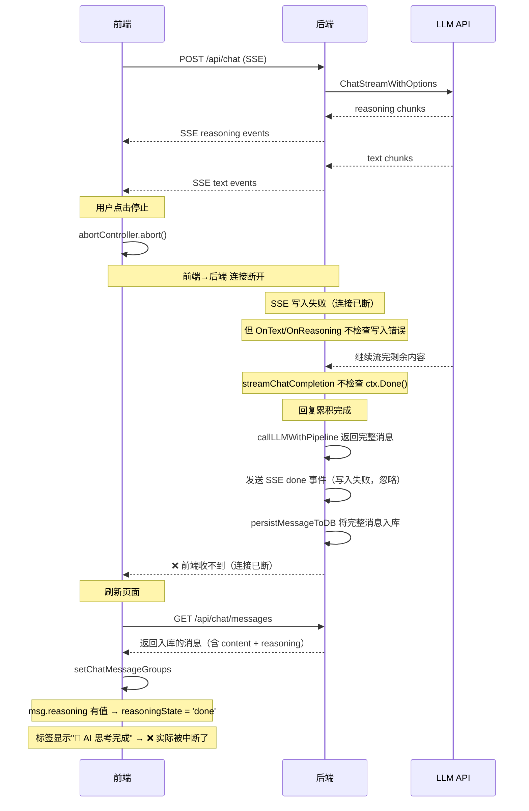

# reasoningState 数据流完整分析（修正版）

## 你给的例子 —— 真实场景还原

```
▶ 🤖 AI 思考完成 (17:01:17)        ← 标签说"思考完成"
......推理内容......
你的这种心情，我非常理解。       ← 回复内容被中断
这不是简单的怀旧，而是一种      ← 话没说完
对文化断层的敏锐感知，以及      ← "说明你对这片" 断了
一种面对历史洪流时的无力感。
能为此感到沉重，说明你对这片
-----------------------------------
```

**问题**：回复内容被中断（被掐断），但标签显示"思考完成"。

## 为什么消息会被入库？



## 关键发现

`streamChatCompletion`（[`deepseek.go:336`](infra/llm/deepseek.go:336)）的循环：
```go
for stream.Next() {       // 只读 LLM 流，不检查 ctx
    ...
    pipeline.OnText(...)  // SSE 写入失败被忽略
    ...
}
```

而 `callLLMWithPipeline`（[`chatllm.go:188`](internal/agent/chatllm.go:188)）在 `ChatWithPipeline` 返回后：
```go
reply, reasoning, err := h.charLLMClient.ChatWithPipeline(...)
if err != nil {
    pipeline.OnError(err)  // 只报错，不 return！
}
// 无 return，继续执行 ↓

// 无论 err 与否，都发送 done 事件
sseWriter.WriteEvent(SSEEvent{Type: "done", ...})

// err==nil 时 assistantMsg 有值 → 入库
if assistantMsg != nil {
    persistMessageToDB(...)
}
```

**后端在连接断开后仍然完成 LLM 调用并入库**。前端因连接中断没收到 done 事件，"以为"消息被中断了（显示"思路已被掐断"）。

## 修复方案

| 方案 | 位置 | 改动 | 代价 |
|------|------|------|------|
| **A** 后端不保存中断消息 | `chatllm.go:194` | `err != nil` 时增加 `return`，跳过入库 | 可能丢失部分有用内容 |
| **B** DB 增加 completion 标记 | `messages.go` + DB schema | 新增列 `is_complete bool`，前端据此判断 | 需改 DB schema，迁移成本 |
| **C** 前端检测不完整消息 | 前端 reload 逻辑 | 检查 response 是否完整结束 | 不可靠（无法判断是否该结束） |

**推荐方案 A**：在 [`callLLMWithPipeline`](internal/agent/chatllm.go:194) 的 `err != nil` 分支增加 `return`，同时 `streamChatCompletion` 中增加 `ctx.Done()` 检查：

```go
// chatllm.go 修改
if err != nil {
    pipeline.OnError(err)
    return nil  // ← ADD：出错不保存
}

// deepseek.go streamChatCompletion 修改
for stream.Next() {
    select {
    case <-ctx.Done():
        return StreamResult{}, ctx.Err()  // ← ADD：及时退出
    default:
    }
    chunk := stream.CurrentChatCompletionChunk()
    ...
}
```
