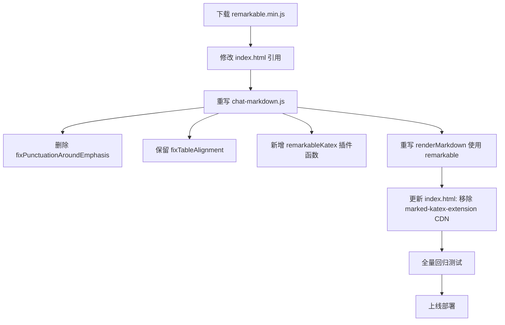

# remarkable 替换 marked 可行性调研报告

## 背景

当前前端使用 [`marked v15.0.12`](../frontend/static/lib/marked.min.js) 进行 Markdown → HTML 渲染。
由于 marked 在 Unicode 符号字符（如 `㎡`、emoji、`¥` 等）与强调标记（`**`、`*`）相邻时存在定界符分类 bug，
且过去已积累了大量特殊处理（`fixPunctuationAroundEmphasis`、`fixTableAlignment`），
因此调研使用 [`remarkable`](https://github.com/jonschlinkert/remarkable) 替换的可行性。

## 对比测试结果

在 14 个历史问题案例上的对比（均无特殊修复，裸库渲染）：

| 测试用例 | marked v15 | markdown-it | remarkable | showdown |
|----------|:--------:|:----------:|:----------:|:--------:|
| #1 ㎡+ZWS+左括号 | ❌ | ❌ | ✅ | ✅ |
| #2 ㎡+左括号(对照) | ✅ | ✅ | ✅ | ✅ |
| #3 左引号+** | ✅ | ✅ | ✅ | ✅ |
| #4 **+右引号 | ❌ | ❌ | ✅ | ✅ |
| #5 中文引号+** | ✅ | ✅ | ✅ | ✅ |
| #6 ）+** | ✅ | ✅ | ✅ | ✅ |
| #7 **+（ | ❌ | ❌ | ✅ | ✅ |
| #8 **+「 | ❌ | ❌ | ✅ | ✅ |
| #9 **+《 | ❌ | ❌ | ✅ | ✅ |
| #10 表格::---- | ❌ | ❌ | ❌ | ❌ |
| #11 表格正常 | ✅ | ✅ | ✅ | ✅ |
| #12 emoji后+** | ❌ | ❌ | ✅ | ✅ |
| #13 ¥100+ZWS | ❌ | ❌ | ✅ | ✅ |
| #14 中文冒号+** | ✅ | ✅ | ✅ | ✅ |
| **合计** | **6/14** | **6/14** | **13/14** | **13/14** |

**remarkable 与 showdown 并列第一**，唯一共同失败项是 `::----` 格式异常的表格（所有库都不支持）。

## remarkable 概况

| 项目 | 信息 |
|------|------|
| 版本 | 2.0.1 |
| 许可证 | MIT |
| 仓库 | https://github.com/jonschlinkert/remarkable |
| 包体积 | 较大（内嵌完整 HTML 实体映射表）|
| 环境 | Node.js ≥ 6.0，浏览器（UMD bundle 提供 `remarkable.min.js`） |
| 依赖 | `argparse` + `autolinker`（linkify 插件用到） |

## API 对比

### 当前 marked 用法

```javascript
// 注册扩展
marked.use(markedKatex());

// 渲染
marked.parse(text, { breaks: true, gfm: true });
```

### remarkable 对应 API

```javascript
import { Remarkable } from 'remarkable';

// 构造实例
const md = new Remarkable({
  html: false,
  breaks: true,       // 与 marked 一致，支持 \n 转 <br>
  langPrefix: 'language-',
  highlight: null,    // 语法高亮回调
});

// 注册插件
md.use(plugin);
md.use(plugin, opts);

// 渲染
md.render(text);
md.renderInline(text);

// .set() 动态修改选项
md.set({ breaks: false });
```

### 关键差异

| 能力 | marked | remarkable |
|------|--------|------------|
| 实例化 | 全局单例 `marked.parse()` | 实例化 `new Remarkable()` |
| 选项 | `marked.parse(text, opts)` | 构造函数传入，或 `.set()` |
| GFM 表格 | 默认开启 (`gfm: true`) | 默认开启 |
| 删除线 | 默认开启 (`gfm: true`) | 默认开启 (`~~`) |
| 行内 HTML | 默认关闭 | 默认关闭 (`html: false`) |
| 语法高亮 | 通过 `highlightCodeBlocks` 后期处理 | 通过 `highlight` 回调 |
| 数学公式 | `marked-katex-extension` | 需找 `remarkable-katex` 插件 |
| 自动链接 | 需 `gfm: true` | 需 `linkify` 插件 |
| 标点美化 | 无 | `typographer: true` |
| 表格修复 | `fixTableAlignment` | 同样需要（`::----` 问题都存在）|
| 强调定界符修复 | `fixPunctuationAroundEmphasis` | **不需要** |

## 语法高亮集成

**marked 当前方式：**
在 `highlightCodeBlocks` 中对渲染后的 HTML 用 DOM 操作查找 `<pre><code>` 并调用 highlight.js。

**remarkable 方式：**
通过 `highlight` 回调函数直接处理：

```javascript
const md = new Remarkable({
  highlight: function (str, lang) {
    if (lang && hljs.getLanguage(lang)) {
      try {
        return hljs.highlight(str, { language: lang }).value;
      } catch (_) {}
    }
    try {
      return hljs.highlightAuto(str).value;
    } catch (_) {}
    return ''; // 使用默认转义
  }
});
```

但当前项目在 highlight 之后还会添加复制按钮（`addCopyButton`），这个逻辑可以保留在后期 DOM 处理中不变。

## KaTeX 数学公式集成

**当前方式（marked）：**
[`marked-katex-extension`](https://www.npmjs.com/package/marked-katex-extension) 通过 `marked.use(markedKatex())` 注册为 marked 扩展。

**remarkable 方式：**
使用 remarkable 的插件机制（`.use()`）编写自定义 inline rule，直接调用全局 `katex` 对象渲染。

### 方案：自定义 inline rule 插件

remarkable 的 `md.inline.ruler` 支持 `.push()` / `.after()` / `.before()` 添加自定义规则。
参考内置的 `ins`（`++text++`）和 `mark`（`==text==`）规则实现模式。

**核心代码设计：**

```javascript
/**
 * remarkable KaTeX 插件
 * 支持：$E=mc^2$（行内公式）和 $$E=mc^2$$（块级公式）
 */
function remarkableKatex(md) {
  // --- 块级公式 $$...$$（利用 remarkable 的 inline ruler 处理）---
  // 由于 $$ 通常独占一行，在块级处理更合理，
  // 但为与 marked-katex-extension 行为保持一致，统一用 inline rule

  // 注册 inline rule：先匹配 $$（块级），再匹配 $（行内）
  md.inline.ruler.after('escape', 'katex_block', function katexBlock(state, silent) {
    var start = state.pos;
    var max = state.posMax;

    // 匹配 $$
    if (state.src.charCodeAt(start) !== 0x24 /* $ */) return false;
    if (start + 2 >= max) return false;
    if (state.src.charCodeAt(start + 1) !== 0x24 /* $ */) return false;

    // 查找结束 $$
    var end = start + 2;
    while (end < max - 1) {
      if (state.src.charCodeAt(end) === 0x24 /* $ */ &&
          state.src.charCodeAt(end + 1) === 0x24 /* $ */) {
        // 跳过转义 \$
        if (end > start + 2 && state.src.charCodeAt(end - 1) === 0x5C /* \ */) {
          end += 2;
          continue;
        }
        break;
      }
      end++;
    }

    if (end >= max - 1) return false; // 没有闭合 $$

    if (!silent) {
      var content = state.src.slice(start + 2, end);
      state.push({
        type: 'katex_block',
        content: content,
        block: true,
        level: state.level
      });
    }

    state.pos = end + 2;
    return true;
  });

  // 注册 inline rule：行内公式 $
  md.inline.ruler.after('katex_block', 'katex_inline', function katexInline(state, silent) {
    var start = state.pos;
    var max = state.posMax;

    // 匹配 $（但不能是 $$）
    if (state.src.charCodeAt(start) !== 0x24 /* $ */) return false;
    if (start + 1 >= max) return false;
    if (state.src.charCodeAt(start + 1) === 0x24 /* $ */) return false; // 跳过 $$

    // 前一个字符是 \ 说明是转义
    if (start > 0 && state.src.charCodeAt(start - 1) === 0x5C /* \ */) return false;

    // 查找结束 $（不能被空格开头或紧接数字... 简单实现）
    var end = start + 1;
    while (end < max) {
      if (state.src.charCodeAt(end) === 0x24 /* $ */) {
        // 跳过转义
        if (end > start + 1 && state.src.charCodeAt(end - 1) === 0x5C /* \ */) {
          end++;
          continue;
        }
        break;
      }
      end++;
    }

    if (end >= max) return false; // 没有闭合 $

    if (!silent) {
      var content = state.src.slice(start + 1, end);
      state.push({
        type: 'katex_inline',
        content: content,
        block: false,
        level: state.level
      });
    }

    state.pos = end + 1;
    return true;
  });

  // --- 注册 renderer rule ---
  md.renderer.rules['katex_block'] = function (tokens, idx, options, env, self) {
    try {
      return katex.renderToString(tokens[idx].content, {
        displayMode: true,
        throwOnError: false
      });
    } catch (e) {
      return '<div class="katex-error">' + self.utils.escapeHtml(tokens[idx].content) + '</div>';
    }
  };

  md.renderer.rules['katex_inline'] = function (tokens, idx, options, env, self) {
    try {
      return katex.renderToString(tokens[idx].content, {
        displayMode: false,
        throwOnError: false
      });
    } catch (e) {
      return '<span class="katex-error">' + self.utils.escapeHtml(tokens[idx].content) + '</span>';
    }
  };
}
```

### 使用方式

```javascript
import { Remarkable } from 'remarkable';
var md = new Remarkable({ html: true, breaks: true });
md.use(remarkableKatex);
```

### 现有资源

| 资源 | 说明 |
|------|------|
| [`katex.min.css`](../frontend/static/lib/styles/katex.min.css) | 已存在，不变 |
| [`katex.min.js`](https://cdn.jsdelivr.net/npm/katex@0.16.21/dist/katex.min.js) | 已通过 CDN 加载，全局 `katex` 可用 |
| 当前 `marked-katex-extension` | 替换为上述 `remarkableKatex` 插件 |

### 注意事项

1. **不支持 `\vert` 等冲突语法**：remarkable 默认不支持 `$...$` 语法，不会与强调标记冲突
2. **错误降级**：渲染失败时显示原始 LaTeX 内容 + `.katex-error` 样式
3. **与代码高亮不冲突**：代码块中的 `$` 由 `backticks` 规则优先匹配，不会进入 KaTeX 规则

## 需要保留的修复

根据之前的分析结果，用户明确要求**保留表格 `::----` 的修复**（#10 案例），因为所有库都不原生支持。

替换后仍需要的修复：
- [`fixTableAlignment`](../frontend/static/chat-markdown.js:64) — 所有库都需要

替换后**不再需要**的修复：
- [`fixPunctuationAroundEmphasis`](../frontend/static/chat-markdown.js:33) — remarkable 原生正确渲染所有标点/符号与强调标记的组合

## 替换工作量评估

### 需要修改的文件

| 文件 | 修改内容 |
|------|----------|
| [`frontend/index.html`](../frontend/index.html) | 替换 marked.min.js 的 `<script>` 引用为 remarkable.min.js |
| [`frontend/static/chat-markdown.js`](../frontend/static/chat-markdown.js) | 重写 `renderMarkdown` 函数：切换 marked API → remarkable API；删除 `fixPunctuationAroundEmphasis`；保留 `fixTableAlignment`；保留 `highlightCodeBlocks` |
| [`frontend/static/lib/`](../frontend/static/lib/) | 下载 remarkable.min.js 放入此目录 |

### 不需要修改的文件

| 文件 | 原因 |
|------|------|
| [`frontend/static/chat-copy.js`](../frontend/static/chat-copy.js) | 复制功能不依赖库 |
| [`frontend/static/highlight.min.js`](../frontend/static/lib/highlight.min.js) | 语法高亮不变 |
| [`frontend/static/lib/styles/katex.min.css`](../frontend/static/lib/styles/katex.min.css) | KaTeX 样式不变 |

### 风险点

1. **KaTeX 兼容性**：自定义 inline rule 需要测试与现有 LaTeX 公式的兼容性
2. **渲染结果差异**：替换后需要人工对比所有消息的渲染结果，确保没有回归
3. **remarkable 的 `breaks` 行为**：与 marked 的 `breaks: true` 行为需测试一致性
4. **库体积**：remarkable.min.js 内嵌 HTML 实体表，体积可能比 marked.min.js 大

## 结论与建议

**remarkable 替换 marked 是完全可行的**，理由：

1. ✅ bare 测试 13/14 通过，比 marked 的 6/14 好得多
2. ✅ 可以删除 `fixPunctuationAroundEmphasis`（约 20 行复杂正则逻辑）
3. ✅ API 差异不大，迁移成本可控
4. ✅ 插件机制灵活（`.use()`），可自行实现 KaTeX 集成，无需第三方依赖
5. ✅ KaTeX 集成不依赖第三方插件，直接调用全局 `katex` 对象

## 实施步骤



### 具体修改清单

| # | 文件 | 操作 |
|---|------|------|
| 1 | `frontend/static/lib/marked.min.js` | 删除 |
| 2 | `frontend/static/lib/remarkable.min.js` | 新增（从 npm 下载 UMD bundle） |
| 3 | `frontend/index.html` | 替换 `<script>` 引用 marked → remarkable |
| 4 | `frontend/index.html` | 移除 `marked-katex-extension` 的 CDN 引用 |
| 5 | `frontend/static/chat-markdown.js` | 删除 `fixPunctuationAroundEmphasis` 函数 |
| 6 | `frontend/static/chat-markdown.js` | 保留 `fixTableAlignment` 函数 |
| 7 | `frontend/static/chat-markdown.js` | 新增 `remarkableKatex` 插件函数 |
| 8 | `frontend/static/chat-markdown.js` | 重写 `renderMarkdown` 函数 |
| 9 | `frontend/static/chat-markdown.js` | 移除 `marked.use(markedKatex())` 的注册代码 |
