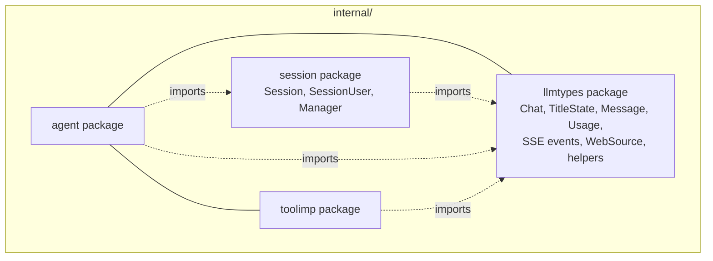

# Session 独立包 + LLM Types 共享包 实施方案

## 目标

- 将 `internal/agent` 包中的 `session`、`sessionUser`、`SessionManager` 提取到独立的 `internal/session` 包
- 将 `chat`、`TitleState` 及 `types.go` 全部内容提取到 `internal/agent/llmtypes` 共享包
- agent 包通过 `chat_def.go` 类型别名保持向后兼容

## 架构



## 步骤 1: 创建 `internal/agent/llmtypes/types.go`

整合原 `internal/agent/chat_def.go` 和 `internal/agent/types.go` 的内容。

### 类型定义

| 类型 | 来源 | 说明 |
|------|------|------|
| `Chat` struct | chat_def.go | 改用导出字段 `DBCHat`, `Title`, `TitleState` |
| `TitleState` type + consts | chat_def.go | 导出 |
| `Message` struct | types.go | `Sources` 改为 `[]WebSource`（llmtypes 自有的 WebSource） |
| `ChatRequest` struct | types.go | 不变 |
| `Usage` struct | types.go | 不变 |
| 7 个 SSE event structs | types.go | 不变 |
| `WebSource` struct | **从 toolimp 迁入** | llmtypes 定义，toolimp 引用此处的 |
| `makeAssistantBrokenMessage` | on_chat.go | 移入 llmtypes |

### 辅助函数

| 函数 | 签名变更 |
|------|---------|
| `ConvertDBMessagesToAgentMessages` | 不变（`store.Message`, `*store.ChatStore`, `int64`） |
| `LoadMessagesAsLLMMessages` | 改为 `(chatID int64, chatStore *store.ChatStore)` |
| `EnsureAssistantForOrphanUser` | 不变 |

## 步骤 2: 修改 `internal/agent/chat_def.go`

改为从 llmtypes 包 re-export 的类型别名：

```go
package agent

import "BrainForever/internal/agent/llmtypes"

type TitleState = llmtypes.TitleState
const (
    TitleStateOriginal     = llmtypes.TitleStateOriginal
    TitleStateAIModified   = llmtypes.TitleStateAIModified
    TitleStateUserModified = llmtypes.TitleStateUserModified
)

type chat = llmtypes.Chat
type Message = llmtypes.Message
type ChatRequest = llmtypes.ChatRequest
type Usage = llmtypes.Usage
// ... 以及其他 SSE event types
```

## 步骤 3: 创建 `internal/session/session.go`

从 `internal/agent/session.go` 提取。

### 类型变更

| 原标识符 | 新标识符 | 说明 |
|---------|---------|------|
| `session` struct | `Session` | 导出 |
| `sessionUser` struct | `SessionUser` | 导出 |
| `mu` | `Mu` | 导出（handler 直接使用 `Lock()`/`Unlock()`） |
| `lastActivity` | `LastActivity` | 导出 |
| `id` | `ID` | 导出 |
| `user` | `User` | 导出 |
| `ID` (sessionUser) | `ID` | 已导出 |
| `SN` | `SN` | 已导出 |
| `chatsMu` | `ChatsMu` | 导出 |
| `chats` | `Chats` | 导出 |
| `currentChat` | `CurrentChat` | 导出（`*llmtypes.Chat`） |
| `settings` | `Settings` | 导出 |

### 方法变更

| 原方法 | 新方法 |
|-------|--------|
| `GetTitle()` | `GetTitle()` |
| `SetTitle()` | `SetTitle()` |
| `switchToUser()` | `SwitchToUser()` |
| `switchToChat()` | `SwitchToChat()` |
| `findChatBySN()` | `FindChatBySN()` |
| `isBlankChat()` | `IsBlankChat()` |
| `IsAnonymous()` | `IsAnonymous()` |
| `addChatToList()` | `AddChatToList()` |
| `syncCurrentChatTitleToChatList()` | `SyncCurrentChatTitleToChatList()` |
| `generateSessionID()` | `GenerateSessionID()`（包级函数） |

## 步骤 4: 创建 `internal/session/manager.go`

从 `internal/agent/session_mgr.go` 提取。

### 类型变更

| 原标识符 | 新标识符 |
|---------|---------|
| `SessionManager` struct | `Manager` |
| `mu` | `Mu` |
| `sessions` | `Sessions` |
| `redis` | `Redis`（导出，给 on_login/logout 用） |
| `ctx` | `Ctx`（导出，给 on_login/logout 用） |

### 方法变更

| 原方法 | 新方法 |
|-------|--------|
| `SetRedisStore()` | `SetRedisStore()` |
| `Close()` | `Close()` |
| `NewSessionManager()` | `NewManager()` |
| `GetOrCreate()` | `GetOrCreate()` |
| `Remove()` | `Remove()` |
| `DeleteMessage()` | `DeleteMessage()` |

## 步骤 5: 更新 agent 包文件引用

### 通用替换规则

| 原代码 | 新代码 |
|-------|--------|
| `*session` | `*session.Session` |
| `sessionUser` | `session.SessionUser` |
| `SessionManager` | `session.Manager` |
| `NewSessionManager()` | `session.NewManager()` |
| `&chat{}` | `&llmtypes.Chat{}` |
| 局部变量 `session` | `sess` |
| `h.sessionManager.redis` | `h.sessionManager.Redis` |
| `h.sessionManager.ctx` | `h.sessionManager.Ctx` |
| `loadMessagesAsLLMMessages(session, ...)` | `loadMessagesAsLLMMessages(chatID, ...)` + 调用前提取 chatID |
| `convertDBMessagesToAgentMessages(...)` | `llmtypes.ConvertDBMessagesToAgentMessages(...)` |
| `ensureAssistantForOrphanUser(...)` | `llmtypes.EnsureAssistantForOrphanUser(...)` |
| `makeAssistantBrokenMessage(...)` | `llmtypes.MakeAssistantBrokenMessage(...)` |

### 详细文件变更

| # | 文件 | 主要变更 |
|---|------|---------|
| 5a | `on_chat.go` | `ChatAgent.sessionManager` 类型、所有 `session` → `sess`、`&chat{}` → `&llmtypes.Chat{}` |
| 5b | `auth.go` | `session` → `sess` |
| 5c | `chatllm.go` | `callLLMWithPipeline` 参数 `*session` → `*session.Session` |
| 5d | `db.go` | `ensureSessionDBForChat`、`persistMessageToDB` 参数 |
| 5e | `types.go` | **整个文件移入 llmtypes**，原位置删除 |
| 5f | `init.go` | `NewSessionManager()` → `session.NewManager()` |
| 5g | `on_chat_list.go` | `session` → `sess`、`switchToUser` → `sess.SwitchToUser` |
| 5h | `on_chat_new.go` | `&chat{}` → `&llmtypes.Chat{}` |
| 5i | `on_favorites.go` | `session` → `sess` |
| 5j | `on_login.go` | `h.sessionManager.redis` → `h.sessionManager.Redis` |
| 5k | `on_logout.go` | 同上 |
| 5l | `on_msg_del.go` | 类型引用变更 |
| 5m | `on_msg_new.go` | `loadMessagesAsLLMMessages` 调用改为传 `chatID` |
| 5n | `on_portrait.go` | `session` → `sess` |
| 5o | `on_portrait_title.go` | `session` → `sess` |
| 5p | `on_session.go` | `session` → `sess` |
| 5q | `on_title.go` | `session` → `sess` |
| 5r | `on_traits.go` | `session` → `sess`、`findChatBySN` → `sess.FindChatBySN` |
| 5s | `on_tag.go` | `session` → `sess` |

### 额外：`internal/agent/toolimp/web_search.go`

将 `WebSource` 类型定义移入 llmtypes，toolimp 改为引用 `llmtypes.WebSource`。

## 步骤 6: 删除旧文件

```bash
rm internal/agent/session.go internal/agent/session_mgr.go
```

如果 `internal/model/chat.go` 存在也删除（不再需要）。

## 步骤 7: 构建验证

```bash
cd c:/Users/miller/GoProjects/BrainGo
go build ./...
```

## 注意事项

1. **`chat_def.go` 类型别名**：保留在 agent 包，re-export llmtypes 的所有类型，保证现有代码无需改动
2. **`WebSource` 迁移**：从 `toolimp` 移至 `llmtypes`，`toolimp` 改为引用 `llmtypes.WebSource`
3. **`loadMessagesAsLLMMessages` 签名变更**：不再接收 `*session.Session`，改为接收 `chatID int64`，调用方提前提取
4. **`sessionAutoIncID`**：原代码中声明但未使用，提取时移除
