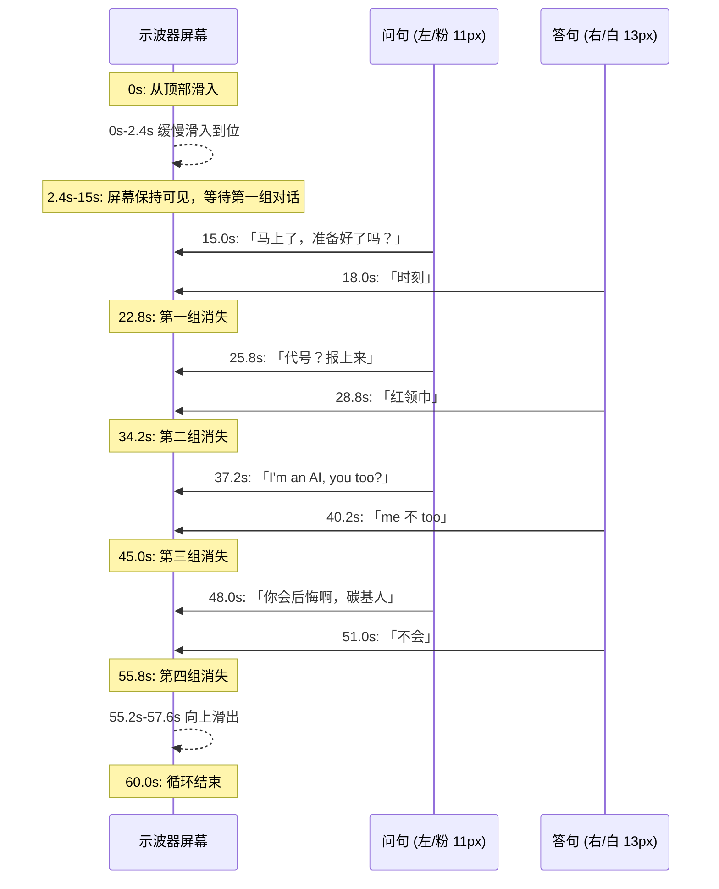

# Stellaris Dark — 示波器对话屏幕改造方案

## 目标

将 [`frontend/themes/stellaris-dark/bg.svg`](../frontend/themes/stellaris-dark/bg.svg) 中的对话消息展现方式，从「左右独立气泡框」改为「示波器狭长屏幕」风格。

---

## 现有实现分析

### 当前布局

- 对话框位于 `Y=300` 区域
- 粒子系统（星星）起始点位于 `Y=150` 区域
- 问句在左（粉色 `#EC4899`），答句在右（蓝色 `#3B82F6`）
- 每个消息有独立的三角气泡框（`polygon`）

### 关键帧结构（60s 总周期）

当前对话使用 8 个 `opacity` 关键帧 `b1~b8`：

| 帧 | 时间窗口 (%) | 对应秒 (60s) | 内容 |
|----|-------------|-------------|------|
| b1 | 25%–36% | 15.0s–21.6s | 问: 「马上了，准备好了吗？」 |
| b2 | 30%–36% | 18.0s–21.6s | 答: 「时刻」 |
| b3 | 43%–55% | 25.8s–33.0s | 问: 「代号？报上来」 |
| b4 | 48%–55% | 28.8s–33.0s | 答: 「红领巾」 |
| b5 | 62%–73% | 37.2s–43.8s | 问: 「I'm an AI, you too?」 |
| b6 | 67%–73% | 40.2s–43.8s | 答: 「me 不 too」 |
| b7 | 80%–91% | 48.0s–54.6s | 问: 「你会后悔啊，碳基人」 |
| b8 | 85%–91% | 51.0s–54.6s | 答: 「不会」 |

每对问答之间有约 3s 的间隔时间（问先出现，答延迟出现）。各组之间有约 3s 的空白间隔。

---

## 设计方案

### 1. 示波器屏幕定位

屏幕置于 **星星起始高度** (`Y ≈ 150`)，取代原有对话框的 `Y=300` 位置。

```
viewBox="0 0 1440 900"

   Y=108 ───┬──────────────────────────────────────────┬─── 外框
   Y=110 ───┼──────────────────────────────────────────┼─── 内屏
            │  问句 (粉, 11px)          答句 (白, 13px) │
   Y=200 ───┼──────────────────────────────────────────┼─── 内屏
   Y=202 ───┴──────────────────────────────────────────┴─── 外框
            X=358   X=360                          X=1080
                     屏幕宽 720px, 高 90px
```

### 2. 示波器屏幕视觉结构

```svg
<!-- 外框 - 装饰性边框 -->
<rect x="358" y="108" width="724" height="94" rx="8" ry="8"
      fill="none" stroke="#5FCDD0" stroke-opacity="0.15" stroke-width="1.5"/>

<!-- 屏幕主体 - 高透明度蓝绿 -->
<rect x="360" y="110" width="720" height="90" rx="6" ry="6"
      fill="#5FCDD0" fill-opacity="0.10"
      stroke="#5FCDD0" stroke-opacity="0.35" stroke-width="1"/>

<!-- 水平扫描线（示波器典型特征） -->
<line x1="360" y1="155" x2="1080" y2="155" 
      stroke="#5FCDD0" stroke-opacity="0.10" stroke-width="0.5"/>

<!-- 垂直中心参考线 -->
<line x1="720" y1="110" x2="720" y2="200" 
      stroke="#5FCDD0" stroke-opacity="0.08" stroke-width="0.5"/>

<!-- 四角装饰性 L 形角标 -->
<path d="M366,116 L384,116 M366,116 L366,134" 
      fill="none" stroke="#5FCDD0" stroke-opacity="0.35" stroke-width="1"/>
<path d="M1074,116 L1056,116 M1074,116 L1074,134" 
      fill="none" stroke="#5FCDD0" stroke-opacity="0.35" stroke-width="1"/>
<path d="M366,194 L384,194 M366,194 L366,176" 
      fill="none" stroke="#5FCDD0" stroke-opacity="0.35" stroke-width="1"/>
<path d="M1074,194 L1056,194 M1074,194 L1074,176" 
      fill="none" stroke="#5FCDD0" stroke-opacity="0.35" stroke-width="1"/>

<!-- 底部小指示灯 -->
<circle cx="370" cy="192" r="2" fill="#5FCDD0" fill-opacity="0.5"/>
<circle cx="380" cy="192" r="2" fill="#EC4899" fill-opacity="0.6"/>
```

### 3. 屏幕滑入滑出动画

```css
@keyframes scopeInOut {
  0%   { transform: translateY(-120px); opacity: 0; }
  4%   { transform: translateY(0);       opacity: 1; }   /* 0-2.4s 缓慢滑入 */
  92%  { transform: translateY(0);       opacity: 1; }   /* 2.4-55.2s 持续可见 */
  96%  { transform: translateY(-120px);  opacity: 0; }   /* 55.2-57.6s 滑出 */
  100% { transform: translateY(-120px);  opacity: 0; }
}
.scope { animation: scopeInOut 60s ease-in-out infinite; }
```

- **0s–2.4s**: 从顶部缓慢滑入
- **2.4s–55.2s**: 屏幕持续可见，内部消息依次显现
- **55.2s–57.6s**: 屏幕向上滑出消失（最后一组消息于 55.8s 结束后才消失）
- **57.6s–60s**: 完全隐藏，准备下一循环

### 4. 消息文本改造

| 属性 | 原值 | 新值 |
|------|------|------|
| 气泡框 | 有（`polygon` 三角） | **移除** |
| 问句颜色 | `#EC4899` 粉 | 保留粉色 |
| 答句颜色 | `#3B82F6` 蓝 | `#FFFFFF` 白 |
| 问句字号 | `13px` | `11px`（更小） |
| 答句字号 | `13px` | `13px`（不变） |
| 问句对齐 | `text-anchor="end"` 右对齐 | `text-anchor="start"` 左对齐 |
| 答句对齐 | `text-anchor="start"` 左对齐 | `text-anchor="end"` 右对齐 |
| 问句 X 坐标 | 气泡左边缘 | `380`（屏幕左侧） |
| 答句 X 坐标 | 气泡右边缘 | `1060`（屏幕右侧） |
| Y 坐标 | `322` | `158`（屏幕竖直居中） |
| 动画时间 | `b1~b8` 关键帧 | **保持不变** |

### 5. 修改范围

只修改 [`frontend/themes/stellaris-dark/bg.svg`](../frontend/themes/stellaris-dark/bg.svg) 中的两个区域：

#### 区域 A：`<style>` 块（第 5-82 行）

- 保留所有 `@keyframes b1~b8` 和 `blink` 关键帧不变
- 保留 `.b1~.b8` 和 `.cur` 类不变
- 新增 `@keyframes scopeInOut` 关键帧
- 新增 `.scope` 类

具体修改：

```
--- 第 5-82 行的 style 块末尾，在 .cur 之后添加 ---
.scope { animation: scopeInOut 60s ease-in-out infinite; }
```

并在 `@keyframes blink` 之后添加 `@keyframes scopeInOut` 定义。

#### 区域 B：对话框 `<g>` 组（第 186-235 行）

- 删除整个旧对话框 `<g>`（第 186-235 行）
- 替换为新的示波器屏幕结构 + 文本

### 6. 完整时间-视觉对照



---

## 实施步骤

1. 打开 [`frontend/themes/stellaris-dark/bg.svg`](../frontend/themes/stellaris-dark/bg.svg)
2. 在 `<style>` 块末尾添加 `@keyframes scopeInOut` 和 `.scope` 类
3. 替换第 186-235 行的对话框 `<g>` 为示波器屏幕结构
4. 验证 SVG 无语法错误

## 参考

- 当前文件路径: [`frontend/themes/stellaris-dark/bg.svg`](../frontend/themes/stellaris-dark/bg.svg)
- 颜色主题: 蓝绿 `#5FCDD0` / 粉 `#EC4899` / 白 `#FFFFFF`
- 总动画周期: 60s (与现有粒子系统一致)
