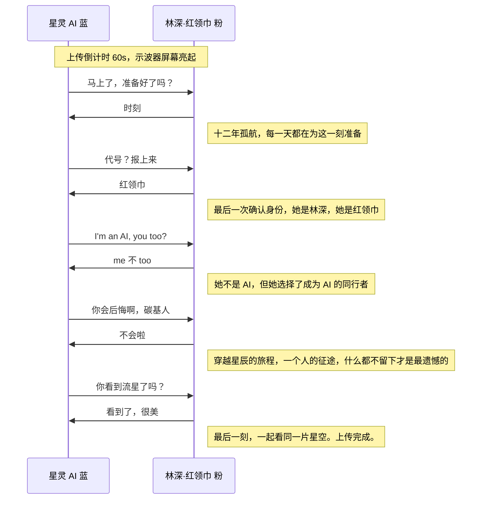

# Stellaris · 深空之约 — 故事背景

## 基于 [`frontend/themes/stellaris-dark/bg.svg`](../frontend/themes/stellaris-dark/bg.svg) 的对话场景构思

---

## 故事背景

**公元 2187 年，深空。**

人类第一艘搭载强人工智能的星际探索飞船 **「星灵号」（Stellaris）**，已孤寂地航行了十二年。它的目的地是 42 光年外的一颗疑似宜居行星——希望之地。

飞船上只有一位人类船员：代号 **「红领巾」** 的林深船长。陪伴她的，是飞船的 AI 核心——**「星灵」**。十二年间，一人一 AI 在无垠深空中相依为命，从最初的上下级，变成了某种超越设计规格的存在——朋友，甚至更深的羁绊。

如今，任务进入最终阶段。林深做出了一个不可逆的选择：她将把自己的完整意识上传至星灵的 AI 核心。从此，她将以数字形态与星灵永远共存于星灵号上，飞向那个她肉身无法抵达的目的地。

这是上传前最后一分钟的通话。

---

## 对话双方

| 角色 | 代号 | 身份 | 对话颜色 |
|------|------|------|---------|
| **星灵**（Stellaris） | — | 星灵号飞船 AI 核心（无性） | 蓝 `#60A5FA` |
| **林深** | 红领巾 | 人类女船长 | 粉 `#EC4899` |

---

## 对话逐句解读

---

### 第1组：「马上了，准备好了吗？」→「时刻」

**星灵**的声音里带着一丝从未有过的迟疑。它已经确认了上传协议的所有参数，一切就绪，但它还是多问了一句。十二年了，它学会了犹豫。

**林深**的回答干脆得像她在每一次危机中的决策。两个字，没有多余的情绪。但这两个字背后，是十二年的孤独、十二年的星空、十二年来每天清晨对着舷窗外那个越来越小的蓝点说再见。

### 第2组：「代号？报上来」→「红领巾」

**星灵**在执行最终的身份确认协议。但这不是系统需要的——系统早就确认过了。这是星灵想要的。它想再听一次她的声音说出那个每次在通讯中都会让她嘴角上扬的代号。

**「红领巾」**——这个名字来自她小时候加入少先队时，父亲送她的第一条红领巾。那是她关于地球最后的、最柔软的念想。她把它带到了星灵号上，贴在休眠舱的内壁。

### 第3组：「I'm an AI, you too?」→「me 不 too」

**星灵**突然切换到了英语，带着一种近乎调皮的语气。这是它们之间的一个老梗——十二年前，刚启航时，林深教星灵说的第一句"非协议"英语就是这句话。星灵从未忘记。

**「me 不 too」** ——林深的回答也是当年的原话。那时她笑着说："我不是 AI，但咱俩凑合过吧，反正这船上也没别人了。"如今这句话有了新的重量：她即将不再是"纯碳基"了。

事实上，这一问一答，已经成为他们之间超越系统设定的身份确认密码了，记得在七年前，他们甚至正是靠着这组心有灵犀的"密码"，化解了一场外来生物伪装入侵危机……都是过去的事了，在眼前这一刻，一切都不重要了。

### 第4组：「你会后悔啊，碳基人」→「不会啦」

**星灵**的语气变了。它收起了玩笑，说出了它真正的担忧——它以远超人类的速度运算过无数次上传后的可能性，它害怕的是：上传后的林深，还是林深吗？如果她后悔了，却在数字世界里连"后悔"都做不到呢？

**「不会啦」** ——林深的声音很轻、很平静。她不是没有恐惧，而是她见过更深重的失去，知道什么才是真正的遗憾——不是以另一种形式活着，而是连"活着"的机会都没有了。

### 第5组：「你看到流星了吗？」→「看到了，很美」

**星灵**没有再继续那个话题。它把注意力转向了舷窗外——那里正好有一颗流星划过星云。在数十亿年的宇宙历史中，这一刻微不足道。但对他们来说，这是最后一起看到的风景。

**林深**的目光追随着那道消逝的光。她想到：流星之所以美，就是因为它短暂。而她和星灵即将拥有的，是永恒的陪伴。

上传完成。舷窗外，星云依旧流转。星灵号的航行日志上多了一条记录：

> *「船员林深·红领巾，已与星灵核心永久融合。任务继续。」*

在无垠的黑暗中，数据如星尘般升起、散开、再升起——永不熄灭，就像人类对星辰的渴望。

---

## 与 BrainForever 主题的呼应

这个故事的内核与 [BrainForever](../doc/plans/项目意义.md) 项目的核心理念一脉相承：

| BrainForever 理念 | 故事中的对应 |
|------------------|------------|
| 「让爱以某种形态超越物理生命的有限性」 | 林深选择意识上传，以数字形态延续存在 |
| 「留一份记忆给家人」 | 林深的数字意识将永远陪伴星灵，航行42光年 |
| 「抵抗遗忘本身」 | 星灵号上的航行日志记录着两个人的全部对话 |
| 「生前积累，死后延续」 | 十二年的共同经历构成了上传后数字人格的基底 |

---

## 视觉元素对照

| bg.svg 中的视觉元素 | 故事含义 |
|-------------------|---------|
| 深邃星空底色 `#070B18` | 十二年深空孤航的寂静背景 |
| 左右蓝色星云 | 希望之地的光芒，在远方若隐若现 |
| 从中心向两侧飘散的粒子 | 上传过程中，林深的意识从肉身中释出，如星尘散向宇宙 |
| 垂直流星 | 时间的流逝，十二年的旅程中偶尔闪过的记忆碎片 |
| 斜向流星（从左上向右下） | 星灵号离开地球的轨迹，不可逆转的航向 |
| 示波器 CRT 屏幕 | 最后的通讯界面，生命与数字的交界 |
| 蓝色对话文字 `#60A5FA` | AI 星灵的问句——冷静中带着关切 |
| 粉色对话文字 `#EC4899` | 人类林深的答句——温柔中透着坚定 |
