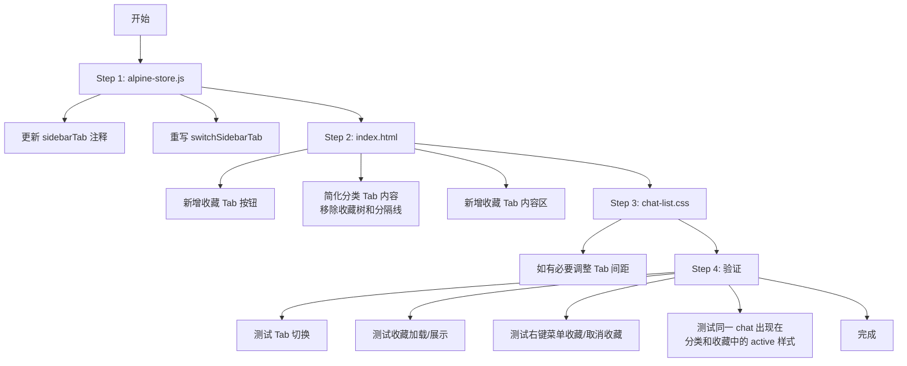

# 三 Tab 侧边栏重构计划

## 目标

将侧边栏从当前的两 Tab（**时间 + 分类**）改为三 Tab（**时间 + 分类 + 收藏**），
将收藏从分类 Tab 中分离出来，成为一个独立的 Tab。

---

## 当前架构

```
┌─────────────────────────────┐
│  📅 时间       🏷️ 分类      │  ← 两个 Tab 按钮
├─────────────────────────────┤
│                             │
│  (timeline tab 内容)        │
│  ─ 或 ─                    │
│  (category tab 内容)        │
│    🔖 收藏（子区域）        │  ← 放在分类 Tab 内部
│      ├─ 默认 (3)            │
│      ├─ 我的AI (2)          │
│      └─ 学习笔记 (5)        │
│    ─── 🤖 智能分类 ───      │  ← 分隔线
│    🏷️ 不知所云 (12)         │
│    🏷️ Go开发 (8)            │
│    🏷️ 生活 (6)              │
│                             │
└─────────────────────────────┘
```

## 目标架构

```
┌─────────────────────────────────────┐
│  📅 时间     🏷️ 分类     🔖 收藏     │  ← 三个 Tab 按钮
├─────────────────────────────────────┤
│                                     │
│  (timeline tab 内容 — 不做改动)     │
│                                     │
│  - 或 - (category tab 内容)         │
│    🏷️ 不知所云 (12)                 │  ← 只保留 AI 分类
│    🏷️ Go开发 (8)                    │
│    🏷️ 生活 (6)                      │
│                                     │
│  - 或 - (favorites tab 内容)        │
│    🔖 收藏                          │  ← 独立 Tab，只显示收藏
│      ├─ 默认 (3)                    │
│      ├─ 我的AI (2)                  │
│      └─ 学习笔记 (5)                │
│                                     │
└─────────────────────────────────────┘
```

---

## 涉及文件与改动清单

### 1. [`frontend/static/alpine-store.js`](frontend/static/alpine-store.js)

#### 1a. `sidebarTab` 注释更新 (line 310)

```diff
-   sidebarTab: 'timeline',  // 侧边栏当前 tab: 'timeline' | 'category'
+   sidebarTab: 'timeline',  // 侧边栏当前 tab: 'timeline' | 'category' | 'favorites'
```

#### 1b. `switchSidebarTab` 方法重写 (line 390-404)

**当前逻辑：**
- 切到 `'category'` 时同时加载 `chatGroups` + `favorites`

**改为：**

```
switchSidebarTab(tab) {
    this.sidebarTab = tab;

    // 从时间线切出时，清除来源信息
    if (tab === 'category' || tab === 'favorites') {
        if (this.activeChatSource === 'timeline' || this.activeChatSource === null) {
            this.activeChatSource = null;
            this.activeSubSource = null;
        }
    }

    // 各 Tab 独立按需加载
    if (tab === 'category' && Object.keys(this.chatGroups).length === 0) {
        this.loadChatGroups();        // 不再加载 favorites
    }
    if (tab === 'favorites' && !this.favoritesLoaded) {
        this.loadFavorites();         // 新逻辑：切到收藏才加载收藏
    }
}
```

**关键变化：** 从 `category` 分支中移除 `loadFavorites()` 调用，新增 `favorites` 分支。

---

### 2. [`frontend/index.html`](frontend/index.html)

#### 2a. Tab 按钮区 (line 142-155)

**当前：** 两个 `<button>`

```
[📅 时间]  [🏷️ 分类]
```

**改为：** 三个 `<button>`，新增收藏按钮

```
[📅 时间]  [🏷️ 分类]  [🔖 收藏]
```

收藏按钮模板：
```html
<button class="sidebar-tab"
    :class="{ active: $store.chats.sidebarTab === 'favorites' }"
    :style="{ flex: $store.chats.sidebarTab === 'favorites' ? '1.618' : '1' }"
    @click="$store.chats.switchSidebarTab('favorites')">
    <span class="sidebar-tab-icon">&#x1F516;</span>
    <span>收藏</span>
</button>
```

#### 2b. 分类 Tab 内容区 (line 302-402)

**移除以下内容：**
1. 收藏树 DOM（line 304-350）：`<div class="chat-group chat-group-favorites">...</div>` 整块
2. 分隔标题 DOM（line 352-356）：`<div class="category-divider-title">...</div>` 整块
3. 空状态判断条件更新：从 `Object.keys(chatGroups).length === 0 && Object.keys(favoritesGroups).length === 0` 改为只检查 `chatGroups`

**保留：** 智能分类分组列表（line 363-401），内容不变，但需要调整 `.chat-group` 去掉顶部的 `margin-bottom`（因为之前是跟在收藏树和分隔线后面，现在直接是第一个元素）。

#### 2c. 新增收藏 Tab 内容区（在分类 Tab 之后）

从原分类 Tab 中提取收藏树 DOM，放到新的独立 `sidebar-content` 容器中。

**关键变化 — 去掉一层树：** 原结构是 `🔖 收藏`（根）→ `默认/我的AI`（子目录）→ `chat-item`。分离后，Tab 本身充当根节点，所以去掉最外层的 `chat-group-favorites` 容器和 `favoritesExpanded` 折叠逻辑。子目录（`chat-group-fav-sub`）直接作为一级列表展示。

```html
<!-- 收藏 Tab 内容 — 树形分组 -->
<div class="sidebar-content" x-data x-show="$store.chats.sidebarTab === 'favorites'">
    <!-- 空状态 -->
    <template x-if="!$store.chats.favoritesGroups
        || Object.keys($store.chats.favoritesGroups).length === 0">
        <div class="chat-list-empty">暂无收藏</div>
    </template>

    <!-- 收藏子目录列表（去掉了外层 "🔖 收藏" 根节点） -->
    <template x-if="$store.chats.favoritesGroups
        && Object.keys($store.chats.favoritesGroups).length > 0">
        <div>
            <template x-for="(items, customTag) in $store.chats.favoritesGroups" :key="'fav_' + customTag">
                <div class="chat-group chat-group-fav-sub">
                    <!-- 直接显示子目录头，不再有顶层根节点 -->
                    <div class="chat-group-header"
                        @click="$store.chats.toggleCollapse('fav_' + customTag)"
                        @mouseenter="$store.chats.closeContextMenu()">
                        <span class="collapse-arrow"
                            :class="{ collapsed: $store.chats.isCollapsed('fav_' + customTag) }">&#x276F;</span>
                        <span x-text="customTag === '' ? '默认' : customTag"></span>
                        <span class="group-count" x-show="items.length > 0" x-text="'(' + items.length + ')'"></span>
                    </div>
                    <div class="chat-group-body"
                        :class="{ collapsed: $store.chats.isCollapsed('fav_' + customTag) }">
                        <template x-for="chat in items" :key="chat.sn">
                            <div class="chat-item"
                                :class="{
                                    active: $store.chats.getActiveStyle(chat.sn, 'favorites', customTag) === 'active',
                                    'active-sub': $store.chats.getActiveStyle(chat.sn, 'favorites', customTag) === 'active-sub'
                                }"
                                :data-sn="chat.sn"
                                @click="$store.chats.selectChat(chat.sn, 'favorites', customTag)"
                                @mouseenter="$store.chats.maybeCloseContextMenu(chat)">
                                <div class="chat-item-title" x-text="chat.title || '新对话'"></div>
                                <button class="chat-item-more-btn"
                                    @mouseenter="$store.chats.showCategoryContextMenu($event, chat, customTag)"
                                    @click.stop="$store.chats.showCategoryContextMenu($event, chat, customTag)">
                                    <svg viewBox="0 0 16 16" width="14" height="14" fill="currentColor"
                                        x-html="ICON_DOTS"></svg>
                                </button>
                            </div>
                        </template>
                    </div>
                </div>
            </template>
        </div>
    </template>
</div>
```

**总结树层级变化：**

```
重构前（分类 Tab 内）              重构后（收藏 Tab）
┌───────────────────┐            ┌─────────────────┐
│ 🔖 收藏 (根节点)  │            │ (Tab 本身是根)   │
│   ├─ 📁 默认      │            ├─ 📁 默认         │ ← 直接一级
│   │   └─ item     │            │   └─ item        │
│   ├─ 📁 我的AI    │            ├─ 📁 我的AI       │
│   └─ 📁 学习笔记  │            └─ 📁 学习笔记     │
└───────────────────┘            └─────────────────┘
```

对应的 JS 状态简化：`favoritesExpanded` 变量不再需要，因为整个 Tab 的显隐由 `sidebarTab` 控制。

---

### 3. [`frontend/static/chat-list.css`](frontend/static/chat-list.css) (line 6-53)

**可能需要的调整：**
- 三 Tab 时每个按钮宽度更窄，如有必要可略微缩小 `padding`（从 `0.6rem 0.5rem` 改为 `0.5rem 0.3rem`），压缩横向空间
- 或者缩小 `.sidebar-tabs` 的 `padding`（从 `0 0.75rem` 改为 `0 0.5rem`）
- 建议优先尝试不修改 CSS，因为 inline `flex` 值已经处理了宽度分布，确认视觉上没问题再决定

---

## 不需修改的文件

| 文件 | 原因 |
|------|------|
| [`frontend/static/chat-list.js`](frontend/static/chat-list.js) | 收藏操作（`handleUnfavorite`、`handleToggleFavorite`）不依赖 Tab 结构，通过 `sn` + `customTag` 操作数据；`showCategoryContextMenu` 已通过 DOM closest 判断上下文，不受 Tab 拆分影响 |
| [`frontend/static/chat-api.js`](frontend/static/chat-api.js) | 后端 API 接口不变 |
| [`frontend/static/components/dialogs/dialogs.js`](frontend/static/components/dialogs/dialogs.js) | 收藏编辑对话框逻辑不变 |
| [`frontend/static/dialogs/favorite-edit-dialog.js`](frontend/static/dialogs/favorite-edit-dialog.js) | 对话框调用入口不变 |
| `internal/local/store/favorites.go` | 后端数据层不变 |
| `internal/local/agent/on_favorites.go` | 后端处理器不变 |
| `internal/local/routers.go` | 路由不变 |

---

## 实施步骤（执行顺序）



### Step 1 — [`alpine-store.js`](frontend/static/alpine-store.js)
修改 `sidebarTab` 注释和 `switchSidebarTab` 方法。

### Step 2 — [`index.html`](frontend/index.html)
三处改动：新增 Tab 按钮、精简分类 Tab 内容、新增收藏 Tab 内容。

### Step 3 — [`chat-list.css`](frontend/static/chat-list.css)
可选的间距微调，根据实际视觉效果决定。

### Step 4 — 验证
重点验证以下场景：
1. ❏ 三个 Tab 之间切换流畅
2. ❏ 收藏 Tab 空状态正确显示
3. ❏ 收藏数据按 custom_tag 正确分组展示
4. ❏ 收藏 Tab 内点击对话 → selectChat 正确传递 `'favorites'` section 和 `customTag` subSource
5. ❏ 右键菜单中"收藏"/"取消收藏"逻辑正常（区分收藏内和分类内的 chat）
6. ❏ 分类 Tab 不再显示收藏内容
7. ❏ 分类 Tab 空状态正确（当无 AI 分类时）
8. ❏ 同一 chat 在收藏和分类中同时存在时，active 样式区分正确（完整高亮 vs 淡色高亮）
