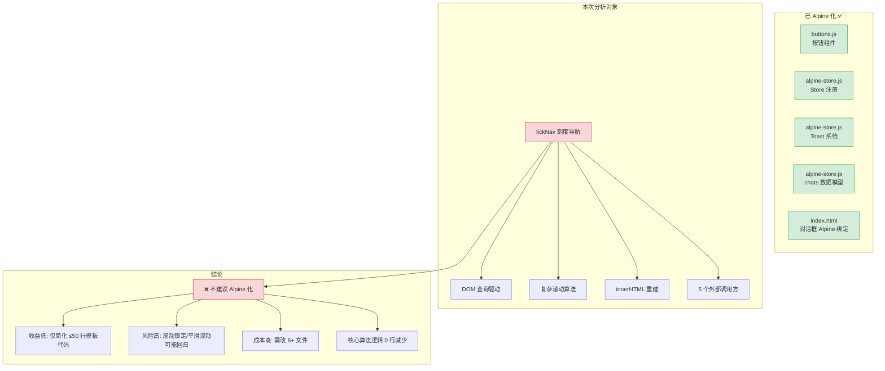

# tickNav（右侧刻度导航）Alpine 化分析报告

> 分析右侧刻度尺及面板是否需要像按钮、Toast、对话框那样迁移到 Alpine.js

---

## 一、tickNav 当前架构全景

### 1.1 技术栈

| 维度 | 内容 |
|------|------|
| JS 模块 | [`chat-ticknav.js`](frontend/static/chat-ticknav.js) — 369 行纯 ES Module |
| CSS | [`components/tick.css`](frontend/static/components/tick.css) — 318 行纯 CSS |
| HTML | 仅一个空容器 `<nav class="tick-nav" id="tickNav"></nav>` |
| 状态 | 5 个变量在 `chat-state.js` 的 `state` 对象中 |
| 调用方 | 5 个文件（chat-sse.js、chat-restore.js、chat-list.js、chat.js、msg-delete-dialog.js） |

### 1.2 数据流模式

```
用户滚动/点击 → DOM 事件 → updateTickNav()
                              ↓
                     查询 DOM (.message.user 元素)
                              ↓
                     innerHTML = '' + appendChild 重建
                              ↓
                     setActiveTick() 更新状态 + CSS 类
```

**关键特征**：数据源是 **DOM 本身**（`.message.user` 元素），而非 JS 数据模型。

### 1.3 核心功能模块

| 功能 | 实现方式 | 行数 |
|------|---------|------|
| DOM 重建渲染 | `innerHTML=''` + 循环 `createElement/appendChild` | ~80 行 |
| 滚动定位计算 | `getBoundingClientRect()` 视口交集计算 | ~50 行 |
| 平滑滚动锁定 | `tick-nav-locked` CSS 类 + `targetTickIndex` 协调 | ~30 行 |
| 事件绑定 | `addEventListener`（wheel/mouseleave/scroll） | ~80 行 |
| 节流/防抖 | 手动 throttle 150ms + debounce 300ms | ~30 行 |
| CSS 驱动交互 | hover 展开、dist 刻度线渐变、锁定态 | 全部 318 行 |

---

## 二、已完成 Alpine 化的组件对比

### 2.1 适合 Alpine 的组件特征 ✅

| 特征 | 按钮/Toast/对话框 | tickNav |
|------|------------------|---------|
| 有独立数据模型 | ✅ `$store.settings.deepThink` | ❌ 数据来自 DOM 查询 |
| 数据驱动渲染 | ✅ `x-for`/`x-if` 绑定 | ❌ `innerHTML=''` 暴力重建 |
| 状态变化简单 | ✅ true/false toggle | ❌ 复杂的整数索引+偏移联动 |
| 事件处理简单 | ✅ `@click` | ❌ wheel 需 `passive:false`、scroll 需节流 |
| 与 Alpine store 可同步 | ✅ 直接绑定 | ❌ `state.activeTickIndex` 被 5 个模块读写 |

### 2.2 已完成 Alpine 化的组件清单

```
buttons.js (已迁移):
├── iconBtn()      — themeToggle, aiTitleBtn, sidebarCloseBtn
├── textBtn()      — newChatBtn, loginBtn
├── toggleBtn()    — deepThinkBtn, webSearchBtn
├── sendBtn()      — sendBtn
├── attachBtn()    — attachBtn
├── deleteDialog() — 删除确认对话框
└── titleEditDialog() — 修改标题对话框

alpine-store.js (已注册):
├── $store.settings — deepThink, webSearch, sendMode, theme, isStreaming
├── $store.ui       — toasts
└── $store.chats    — items[], activeIndex, active
```

---

## 三、tickNav 不适合 Alpine 化的理由

### 理由 1：数据源是 DOM，违背 Alpine 的数据驱动范式

```
当前模式:
  DOM (.message.user) → 查询 → 重建 tickNav DOM
                                ↑
                           Alpine 在此无插足之地

Alpine 期望模式:
  JS 数据模型 → Alpine 响应式绑定 → 自动渲染 DOM
```

tickNav 的输入是「页面上已经存在的用户消息元素」，需要从这些元素中提取 `textContent` 来生成刻度标题。创建一个中间数据模型不仅要增加复杂度，还需要保证它与 DOM 的同步——这正是 Alpine 想要解决的问题的反面。

### 理由 2：核心复杂度在算法，不在模板绑定

tickNav 中最复杂的逻辑：

1. **视口交集计算**（`updateActiveTickOnScroll`，~50 行）：
   ```javascript
   const rect = userMessages[i].getBoundingClientRect();
   if (rect.bottom > containerTop) { targetIdx = i; break; }
   ```
   Alpine 对此无任何帮助。

2. **滚动锁定机制**（`tick-nav-locked` 类 + `targetTickIndex` 协调）：
   用户点击刻度 → 锁定面板保持展开 → 平滑滚动 → 检测目标消息进入视口 → 解锁
   这是一个**状态机**，Alpine 无法简化。

3. **节流 + 防抖**（throttle 150ms + debounce 300ms）：
   Alpine 的 `x-effect` 或 `$watch` 不支持节流/防抖控制。

这些逻辑占 tickNav 的 **60%+ 代码量**，Alpine 化后它们**一条都不会减少**。

### 理由 3：innerHTML 重建模式与 Alpine 不兼容

`updateTickNav()` 使用 `innerHTML = ''` 完全销毁并重建 DOM。如果在此容器上挂载了 Alpine `x-data` + `x-for`，`innerHTML` 操作会破坏 Alpine 的内部状态。

要改用 Alpine，需要改成：
```javascript
// 当前（每次重建整个数组）：
tickNav.innerHTML = '';
for (...) { tickNav.appendChild(tick); }

// 改为（推送到响应式数组）：
tickItems = []; // 清空数组
for (...) { tickItems.push({ index, title, ... }); }
```

但这又带来新问题：`x-for` 中的每个刻度需要复杂的计算（dist、序号显隐、首尾指示），这些计算在 Alpine 模板表达式中难以维护。

### 理由 4：高重构成本、低收益

| 评估维度 | 详情 |
|---------|------|
| 需修改文件数 | 6+ 个（chat-ticknav.js + 5 个调用方 + 可能的 alpine-store.js） |
| JS 代码量 | ~369 行，其中可简化的模板代码 < 50 行 |
| CSS 代码量 | ~318 行，0 行需要改 |
| 回归风险 | 高（滚动锁定、平滑滚动、刻度高亮、节流时序） |
| 可简化代码 | 仅 `createElement`/`appendChild` 部分（< 50 行） |
| 不可简化逻辑 | 视口计算、状态机、节流事件（~200+ 行） |

**结论**：花 80% 的力气改 6+ 个文件，只能简化 20% 的代码。

### 理由 5：原始分析报告已明确排除

在 [`alpinejs-analysis-report.md`](plans/alpinejs-analysis-report.md:194-196) 的 3.3 节：

> **刻度导航**（`chat-ticknav.js`）
> - 复杂的滚动位置计算 + DOM 重建逻辑，Alpine 无帮助

在 [`alpinejs-progressive-migration-plan.md`](plans/alpinejs-progressive-migration-plan.md:721-734) 的 Phase 5 候选清单中，tickNav 从未被列入过任何计划。

---

## 四、如果坚持"部分 Alpine 化"的可行性分析

以下是可能的折中方案及其风险：

### 方案 A：仅将状态迁移到 Alpine store

把 `state.activeTickIndex`、`state.tickScrollOffset`、`state.targetTickIndex`、`state.pendingHighlightIndex`、`state.MAX_VISIBLE_TICKS` 迁到 `Alpine.store('tickNav', {...})`。

**问题**：
- `state.activeTickIndex` 被以下模块直接读写：`chat-ticknav.js`、`chat-copy.js`、`msg-delete-dialog.js`、`chat.js`、`chat-api.js`、`chat-list.js`
- 需要全部改为 `Alpine.store('tickNav').activeTickIndex`
- 且 Alpine 未加载时需要降级路径
- 收益几乎为零：只是换了存储位置，逻辑不变

**评估**：❌ 不建议。纯增加复杂度，无实际收益。

### 方案 B：仅将刻度模板改为 Alpine x-for

保留所有 JS 逻辑，只在 HTML 中用 `<template x-for>` 替代 `createElement`。

**问题**：
- `updateTickNav()` 中 `innerHTML = ''` 与 Alpine x-for 冲突
- 需要彻底重写 `updateTickNav()` 为数据推送模式
- 每个刻度中的复杂条件渲染（dist 计算、序号跳格显示、首尾指示）在 Alpine 模板中难以表达
- 节流/防抖逻辑与 Alpine 响应式系统可能产生时序冲突

**评估**：❌ 不建议。相当于重写整个模块，受益远小于风险。

### 方案 C：保持现状，仅做少量代码清理

当前代码已足够清晰，可以考虑的微小改进：
- 将 tickNav 的 5 个状态变量从 `state` 对象提取到独立的 `tickNavState` 对象（纯 JS，非 Alpine），减少与 `state` 的耦合
- 保持现有的 DOM 操作模式不变

**评估**：✅ 可行，低风险，但不属于 Alpine 化。

---

## 五、最终结论



### 最终建议：**不 Alpine 化，保持现状**

| 决策 | 理由 |
|------|------|
| **不改** | tickNav 的核心复杂度在滚动算法/视口计算/锁定状态机，这些 Alpine 无法简化 |
| **不改** | 数据源是 DOM（`.message.user`），强行桥接到 Alpine 数据模型是本末倒置 |
| **不改** | 已有 5 个调用方 + 3 处通过 `state` 直接读写的模块，迁移成本高 |
| **不改** | 当前实现稳定、性能良好，无痛点需要 Alpine 解决 |

### 后续关注方向

如果未来将消息渲染改为 Alpine 数据驱动（`$store.chats.active.messages` 绑定到 `x-for`），那时 tickNav 的数据源自然变成 JS 数据模型，Alpine 化才变得有价值。但在那之前，tickNav 保持原生 JS + DOM 操作是最合理的选择。
